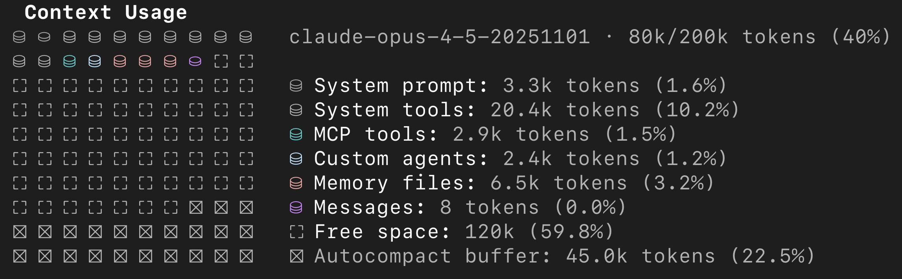
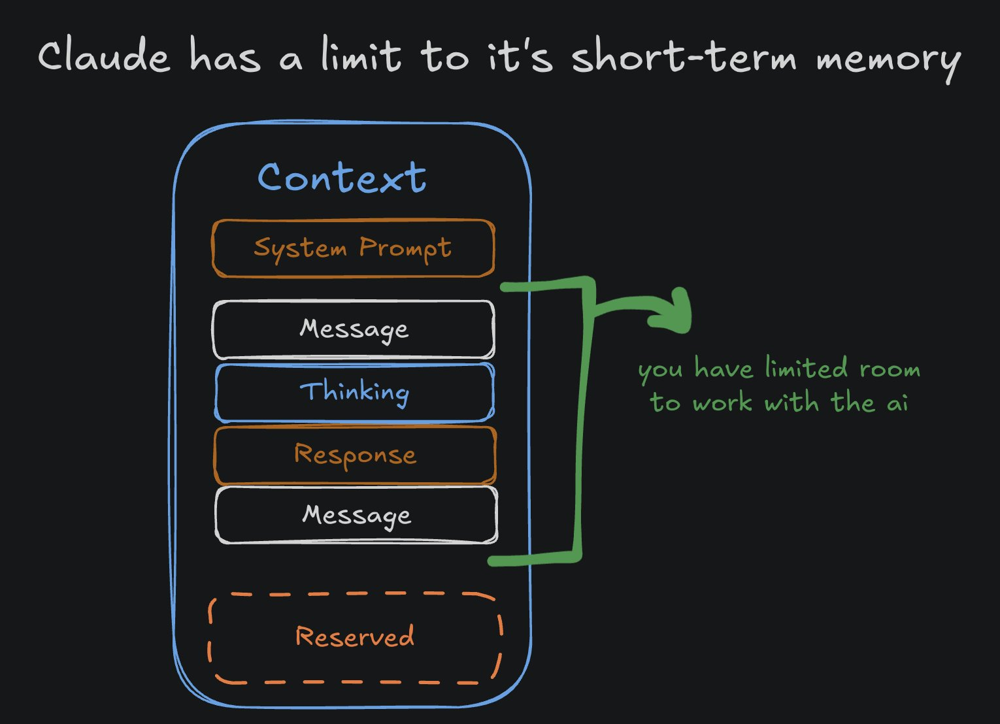
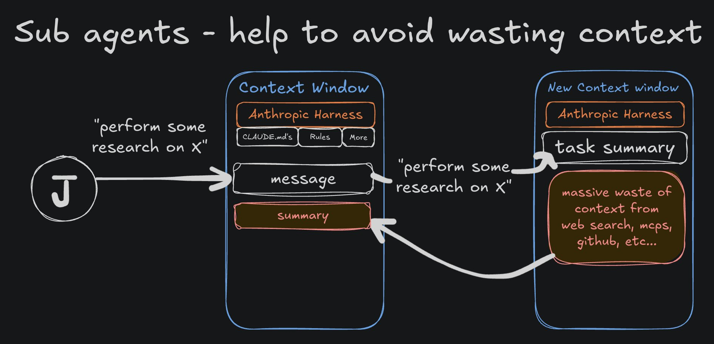
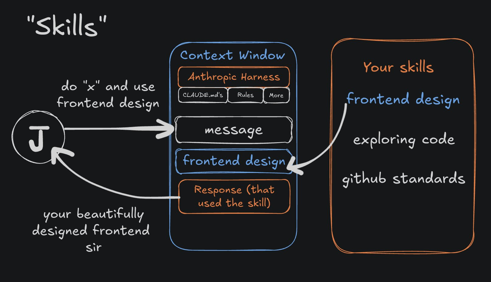

# a practical guide to context engineering

> Automatisch per `npm run ingest:x` erfasst. Quelle: [x.com/jarrodwatts/status/2008495347115630701](https://x.com/jarrodwatts/status/2008495347115630701)

## Artikel-Volltext

"ai slop" is no longer the fault of the model, but the fault of the user.
in black box systems like claude code, context is the single input we can control - so how do we optimize it?
what is context?
context refers to everything you provide an llm when you send it a message.
this includes the prompt itself, along with all of the surrounding information; system prompts, metadata, your previous messages, the llm's thinking, tool calls, and responses - everything.
llms have limited context windows - simply because it becomes harder for them to accurately keep track of things in the conversation as it gets bigger.
 
in claude code, our context window is only 200k tokens - this might sound like a lot, but actually fills up quite quickly. if we run /context, we can see why:
 
22.5% is reserved, and 10.2% is taken up by the system prompts. after things like mcp servers, subagents, and rules, you are not left with much.
we actually only 120k tokens to work with - not only that, the performance quality of the llm degrades the more context we have, regardless of if we are even close to the window limit.
so with this in mind, what should we be putting in our context that classifies it as the "optimal set of tokens" to maximize the outputs of the llm?
most of it is not that complicated
like most things, the 80/20 rule applies to vibe coding. i.e. you're already 80% of the way there if you've install claude code, and done the following basics:
/upgrade -> max plan (yes, you'll need it)
/model -> opus 4.5
/init -> create a file to help claude understand your project setup
from here, most of the generic advice you've likely already heard is correct.
start in plan mode (shift + tab)
ask claude to clarify ambiguity by asking you questions about the plan
execute the plan you've created & refined
creating subagents, custom commands, hooks, multi agent orchestration setups is a lot of fun, but... its really not as big of a deal as we make it seem.
knowing how to properly use the basics is more important.
how to actually use this workflow
treat each new conversation as an objective, and keep to the scope of that objective, for example, in each new thread, have a goal:
"i want to fix this bug i'm experiencing"
"i want to build this feature of the app"
for new projects, it's okay for your objective to be broader in scope - but this requires more planning and refining; because you are introducing more room for misinterpretation through ambiguity.
plan for longer, and then refine your plan for even longer - have claude ask you questions until it gets to the point of just asking questions for the hell of it.
ask it to review your plan multiple times - ask about the architecture, best practices, security risks, and production readiness, testing strategy - the goal is to provide detail wherever there is ambiguity.
when you should reset (and how)
generally, if things are going well, and you intend to continue working on tasks that are similar or at least relevant to what's already in the context window -continue!
if you're close to reaching the context window limit, run /compact, to make space for more - or let claude code automatically do it for you (that's what the 22.5% buffer is there for).
if you don't know how your context window is looking, i created a helpful claude code plugin that shows information on how full your context is for you:
https://x.com/jarrodwatts/status/2007579355762045121
but what about when things are *not* going well? the model didn't do what you wanted, and now you're stuck in a loop of "that's terrible, please fix" → slop → "dude that is even worse, wtf are you thinking?" → slop.
 
when this happens, you have a few options. what you should not do is continue in the thread and try recover - this is not worth doing, instead:
/rewind → go back to a point in the conversation where things were going well.
/new → just start a new thread. take your original prompt and refine it and try again. in your new prompt, specifically include what not to do by taking what went wrong originally and warning against it.
the complexity trap to avoid
if you're on 𝕏, you're likely already flooded with different flashy setups - mcp servers, subagents, skills.. you may have even bookmarked many things you "plan" to get around to reading.
we will cover these topics shortly, however, my first advice is to not over-optimistically complicate things - our goal, as anthropic puts it, is to "find the smallest possible set of high-signal tokens".
the more you flood it with stuff like data from mcp servers, the more you're just filling up your context window with low signal - and also burning your money in the process.
so let's go over some strategies of using the more complex features claude code and other ai tools have to offer.
using mcp servers for good context
mcp servers are basically just third-party tools that the llm can source useful context from - think docs, code from github, linear tickets, figma designs, etc.
they were originally giga hyped when they came out, but people quickly realized that a lot of them eat up your context like crazy and often weren't worth it.
personally, i'm currently running three that have proven very useful to me:
exa[.]ai -> web search for ai agents
context7 -> up to date docs for ai agents
grep[.]app -> github search for ai agents
i mostly use mcp servers to gather context on how to properly implement the code - things i could do myself by researching docs and finding relevant code snippets.
but, it turns out anthropic has a name for this - a "just in time" context strategy - where the agent uses tools to find information itself when required - and it is quite effective for agentic coding tools like claude code.
however, this approach still eats up context; so lets talk about using subagents to use them more efficiently - one of my favourite sleeper tips.
using subagents to save context
claude code can create subagents (other instances of claude code) as children of the main agent - you can see what subagents you have setup using /agents.
these subagents, like your main agent, have system prompts on when to trigger, how to behave, and what tools they can call - including tools from mcp servers.
what's important about subagents is that they:
have their own separate context window from your main agent
can use a different model (e.g. non-opus) than your main agent
this means we can spawn subagents that perform token-expensive operations (like research) and provide a summary to the main agent that consumes comparatively very few tokens; a concise, value-dense version.
 
my favourite workflow that implements this idea is a custom "librarian" subagent that runs sonnet (instead of opus) to scan open source repos and documentation and provide a condense summary back to my main agent.
i'll ask my main agent, "use librarian to research how to do x with y library, and then implement z" → the subagent will trigger, and use all the tools at it's disposal to find me high quality, accurate answers.
this strategy prevents your main context window from being polluted and saves you money using a cheaper model for an easier task.
i share the full details of this subagent here: 
https://x.com/jarrodwatts/status/2006231693435486563
using skills to pull in relevant context
skills are kinda the reverse of subagents, because instead of delegating tasks to a specialized agent with a separate context - you bring specialized skills into the current agent's context window.
for example, claude code includes a "frontend designer" skill that allows you to pull a rather long prompt into context that tells claude a set of dos & donts of designing frontends.
 
again, these workflows sound flashy - but are not that complicated. claude is simply bringing in a chunk of text into it's context when it thinks it should make use of a skill.
i also made a quick post on how to install this skill here:
https://x.com/jarrodwatts/status/2006880530860748845
takeaways
good vibe coding is about optimizing for value-dense context. any information you add or receive from the llm should concisely aim to aid the llm in being able to answer your next request.
if it is not doing that - you should not continue in the same context; this is  key to avoiding the frustrating slop traps you may often find yourself in.
the fancy commands you see on twitter - subagents, mcps, skills, etc. may make you feel like you're falling behind...
in reality, it's not as complicated as it sounds - try your best to help the llm with concise, quality information & give it tools to find relevant information itself; just as you would a colleague.
- jarrod

## Bilder

<!-- Reihenfolge wie von der API geliefert (Cover zuerst). Die Position im Artikeltext gibt die API nicht mit. -->

**Cover**

**photo**

**photo**

**photo**

**photo**

**photo**

## Post-Text

https://t.co/kYK1WYefiK

## Links

- [x.com/i/article/2001…](http://x.com/i/article/2001261223057485824)
