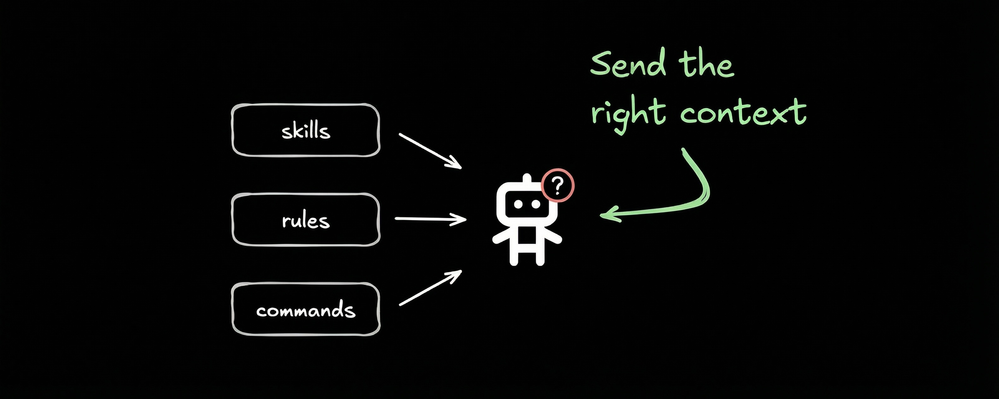
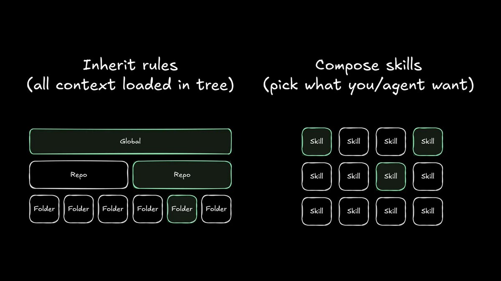
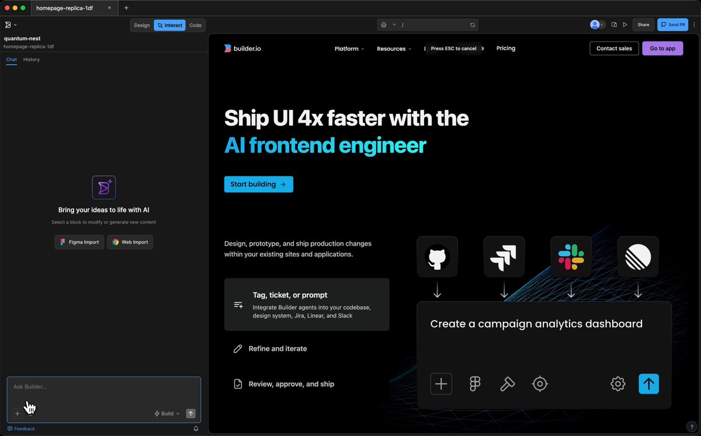
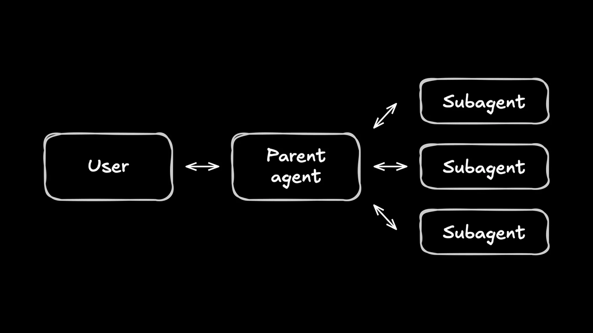
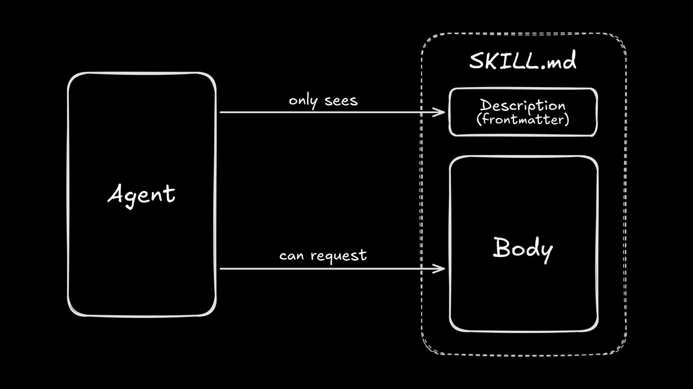
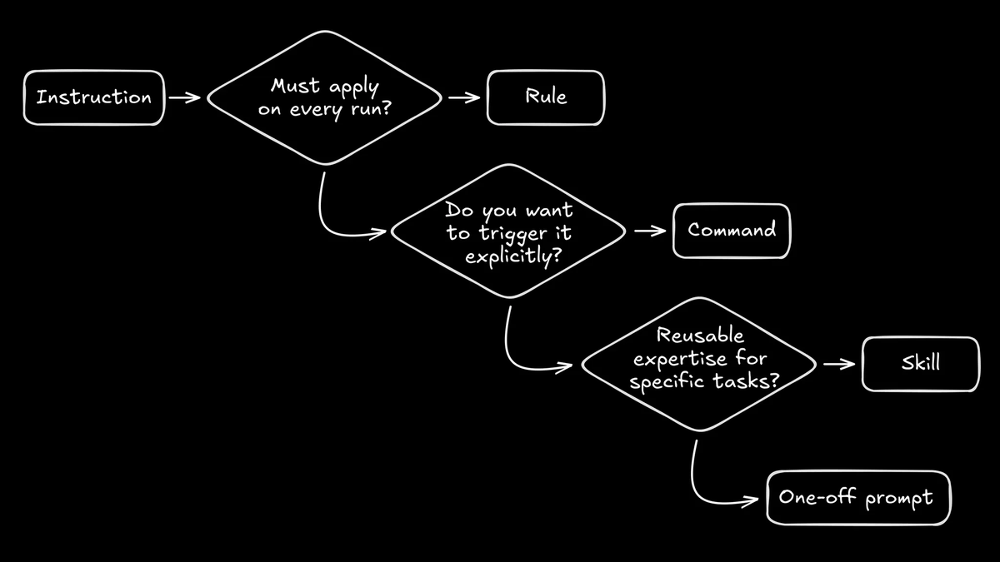

# Agent Skills vs. Rules vs. Commands vs. Subagents

> Automatisch per `npm run ingest:x` erfasst. Quelle: [x.com/tempoimmaterial/status/2014054104658526645](https://x.com/tempoimmaterial/status/2014054104658526645)

## Artikel-Volltext

If it feels like your AI coding tools are turning into a folder full of magical markdown files, you're not imagining it.
The labels vary by tool, but the confusion is consistent. And the newest markdown file that everyone's talking about is skills: context that an agent can discover and load when relevant.
Let's take a look at what they are, when to use them, and how to build out a useful (and manageable) library.
What agent skills (Claude skills) are
In Builder (and an increasing number of providers), skills use the Agent Skills standard. Think of it as a standardized shipping container for your instructions and resources.
Basically, a skill is just a folder that holds two things:
A definition markdown file with metadata and instructions
Optional extras (anything you want) like scripts, templates, or reference docs
Per repo, you locate skills in [.provider]/[skill-name]/SKILL.md.
So, in Builder, you'd put a fireworks skill in .builder/fireworks/SKILL.md. (You can also put them in .claude/ and Builder will find them.)
 
Here’s Builder’s full documentation on using skills.
The clever bit is progressive disclosure. If you come from a web development background, you might think of it as "lazy loading for context."
The agent doesn't read every single skill file at the start of a session. Instead, it scans the name and description metadata, loading the full content only when it determines that the skill is relevant to the task at hand.
This lets you keep deep expertise available without forcing it into every conversation and polluting the model's context.
 
This architecture means you need to write differently:
The description is for routing, not reading. It needs to be short, specific, and packed with the keywords your tasks will actually use. If you write a vague or poetic description, Claude will likely scroll right past it.
The body is a procedure, not a wiki. Focus on checklists and success criteria. If you have long reference docs, keep them in separate files (optionally in the skill folder) and link to them, so the agent can fetch them only if necessary.
How skills help agents
Large language models (LLMs) don't magically get smarter just because you feed them more text. In fact, more words often just make more noise.
Think of context as a strict budget. If you blow it all on generic instructions or tools you aren't using, you'll have less room left for what really matters. You need that space for your code, error logs, and your plan.
Skills are the antidote to this problem. If you've ever watched an agent hallucinate because a critical constraint was buried deep in a massive rules file, this is the fix.
They don't make the agent smarter. They just make information more focused and easier to retrieve.
Think of it this way: Nobody memorizes the whole internal wiki before starting a ticket. You skim, search, and pull up the specific doc you need for the problem in front of you. Agents are similar in the way they focus their attention.
The same idea is showing up elsewhere in the ecosystem, too. For example, Claude Code just launched Tool Search, which uses progressive disclosure for Model Context Protocol (MCP) servers in order to avoid filling agents' context with tool definitions that they may or may not need.
I'm personally hopeful about seeing more dynamic context management done for us as agentic tooling matures. The more tools can surface the right info to an agent, the less it has to go looking, and the less you pay in time, tokens, model size, and mistakes.
In the meantime, we need to do it somewhat manually.
The mental model for rules, commands, and skills
So, let's get into the deeper question: when do you actually want to use skills vs. commands vs. rules?
Here's how I think about it:
Rules are unchanging. They apply every single time, no exceptions.
Commands represent your explicit intent. You type /command because you want to take the wheel.
Skills are optional expertise. The agent pulls these off the shelf only when the specific task demands it.
Here's a quick decision tree to help you sort it out:
 
Skills vs. rules: Keep rules short on purpose
Skills don't replace rules. Rules are the non-negotiables. But having skills available should totally change how you write your rules.
Here is a great default split:
Rules: Repo requirements, safety constraints, naming conventions, and how to run tests.
Skills: Playbooks for specific workflows, tooling, or review conventions.
If you are stuck on where something belongs, use this litmus test: Would you want this instruction to apply even when you're not thinking about it?
Yes? Rule. No? Skill.
Here are some more concrete examples:
"Never commit .env files" is a rule.
"When you touch billing code, run these three integration tests" is a skill.
"The design system uses these token names" is a rule.
"When you write release notes, follow this format and checklist" is a skill.
A practical pattern is to combine rules and skills, making your repo rules mostly routing logic. For example:
"When you're changing UI components, load the ui-change skill."
"When you're debugging production errors, load the incident-triage skill."
This keeps the always-on prompt small, and it makes the agent way more adaptable.
Hierarchical rules
Many tools also allow for hierarchical rules, where the agent will "look up" from the directory it's in for other rules files.
So, you might write a set of repo-specific rules and a set of global rules that apply across every repo you work in.
The trick, as always, is keeping rules as small and focused as possible.
A terrible global rule would be, "In the my-generic-saas-clone repo, always use our brand colors, found in the app.css file." Now every agent in every repo has to know about the my-generic-saas-clone repo for no reason.
Some tools, like Cursor, let you have hierarchical rules per folder in a repo. This can be a powerful pattern, but it's tricky to manage over time. Skills, in my opinion, offer a nicer composable alternative to inherited rulesets.
 
A quick note on naming
Cursor popularized repo-specific AI rules early, and it supports rules that are always applied and rules that are applied intelligently based on a short description.
If you learned the rules concept through Cursor, you might now hear rules used for what other tools would call skills.
Skills vs. commands: Composable, but not the same
A command is deterministic. You call it, the tool injects the prompt, and the agent executes it.
A skill is a suggestion. The agent decides whether it needs that context and loads it when appropriate.
The strongest pattern I see is to combine them:
Keep your complex, long-lived instructions as skills.
Use commands as ergonomic shortcuts to trigger any combination of those skills.
For example:
A /release command: "Load the release skill, then follow the checklist."
A /refactor command: "Load the tanstack and panda-css skills and refactor this Next.js component into TanStack and Panda CSS. You can use the Context7 MCP server if you have documentation questions that aren't covered in the skills."
Your command list should be short and memorable, while your skills should keep your logic structured and reusable. After all, commands are for ergonomics, so you want them stable. Skills are for policy; they need to be reviewable.
When you update a skill, you change behavior without needing to memorize a new incantation. When you update a command, you're changing the incantation itself.
Command params
In many tools, commands can take as many arguments as you want, and the template can reference them positionally via $1, $2, and so on. Claude Code custom slash commands support the same pattern.
This lets you express intent without retyping the whole prompt. You can type something like:
 
The command stays short, the variable part stays explicit, and the skill still handles the hard parts: definitions, conventions, and exactly what "done" means.
Bonus: skills vs. agents
One last faceoff: when do you use a composable skill and when do you just switch out the whole agent?
Skills change what the agent knows. Agents change who is doing the work and what they can access.
Think of an agent as a completely separate worker profile. It operates with a different system prompt, different tool access, and often a different model configuration or temperature setting.
Reach for a skill when you want your current assistant to follow a better procedure. Reach for a separate agent when you need isolation or a dedicated specialist.
You might have:
A "plan" agent that has read-only access to tooling and a system prompt that encourages it to ask you clarifying questions and make a detailed implementation plan.
A "build" agent that uses a faster, cheaper model and is streamlined to implement plans.
A "review" agent that uses a slow, expensive model to review code diffs.
Subagents
There's also a newer pattern in the agent ecosystem: subagents. "Parent" agents (the ones you actually talk to in the chat) can call and run as many subagents as they want in parallel to get work done faster.
 
Most tools come bundled with "explore" subagents whose primary job is to be optimized to find relevant repo context as fast as possible (usually using bash tools like ripgrep under the hood).
When you tell an agent, "There's a file somewhere that handles our dark mode," it can roll its non-existent eyeballs at you and kick off 10 subagents that search for variations of "dark mode," "theme," "system," etc., until it finds the right files.
Some tools, like Claude Code and OpenCode, actually let you create your own subagents and @-mention them while chatting. I've personally found this to be a helpful pattern to (again) save context on the main agent by having it use, say, a specialized web research agent that knows how to use Exa, Context7, and... the internet.
Start by using skills instead of agents
All this said, getting into agents and subagents can get really finicky. It's going to save you a lot of time to start with a composable skill that your main agent can call whenever it needs.
Only upgrade to a separate agent if you run into:
Needing a whole other LLM for the task
Permissions scoping issues
Noticeable context pollution of the main agent
But for the most part, preserve your sanity and just use skills.
How to write a great skill
Skills have a nasty habit of going bad in the exact same way documentation does. You start with clean intent, and suddenly you have a wall of text that nobody, not even your AI agent, wants to read.
Here are a few ways to keep things under control:
Write a description that actually routes. If your agent can't find the skill based on your prompt, the code inside doesn't matter.
Keep the skill definition file minimal. Treat this file like a quick-start guide, not a data dump.
Link out to heavy artifacts. Use progressive disclosure. Put big templates and long reference docs in separate files so the context window stays clean.
Define "done" clearly. Skills are there to reduce ambiguity. Don't add more noise.
A minimal skill example: UI changes
 
A starter skill library worth having
If you're building an AI coding setup for real production work, you're gonna end up reinventing the same few wheels.
Save yourself some time and start with these basics:
Repo orientation: Where are the entrypoints, where do tests live, and what are the conventions?
UI changes: How do you handle design tokens and accessibility checks?
Debugging: How do you reproduce an issue and decide which logs matter?
Verification: What are the exact commands to run to prove a change works?
PR hygiene: How do you format commit messages and update the changelog?
Safety: What are the boundaries? (No deleting production databases, please.)
These don't need to be novels. The win isn't word count; it's that the agent stops guessing and starts following your standards.
A checklist for good skills
If you want a structure that stays small and useful, run your skills through this checklist.
Every skill needs to answer six specific questions:
Trigger (Description): When exactly should the agent load this?
Inputs: What info does it need from you or the repo before starting?
Steps: What is the procedure?
Checks: How do you prove it worked?
Stop conditions: When should it pause and ask for a human?
Recovery: What happens if a check fails?
Common failure modes (skill issues)
Everyone makes these mistakes. Here's how to spot them:
The Encyclopedia: If a skill reads like a wiki page, chop it up. Split it into smaller files and let the skill pull in only what it needs for the moment.
The Everything Bagel: If a skill applies to every single task, it is not a skill. It is a rule or a repo convention.
The Secret Handshake: If the agent never loads the skill, your description is likely too abstract. Rewrite it to match how you actually talk about tasks.
The Fragile Skill: If it breaks every time the repo changes, you've hard-coded too much. Move the specifics into referenced files and keep the skill logic procedural.
Go forth and skill
Skills aren't magic. They're just a strategy for packaging and loading instructions.
Use rules for your invariants and commands for explicit workflows. Save skills for that optional, specific expertise. And save agents/subagents for when you've already tried a skill, but it keeps breaking.
If you stick to that split, you'll ship better automation with less prompt sludge. Your agent will stop feeling like a brittle script and start acting like a real collaborator.

## Bilder

<!-- Reihenfolge wie von der API geliefert (Cover zuerst). Die Position im Artikeltext gibt die API nicht mit. -->

**Cover**

**photo** — Side-by-side diagram contrasting inherited rules from a global/repo/folder tree with composing selected skills from a skill set.

**video**

**photo** — Diagram of a parent agent communicating with the user and delegating work to multiple subagents.

**photo** — Diagram showing an agent that only sees a skill’s description (frontmatter) but can request the skill’s body.

**photo** — Flowchart for turning an instruction into a rule, command, skill, or one-off prompt based on when and how it should be applied.

## Post-Text

https://t.co/HZ0JwbQA2R

## Links

- [x.com/i/article/2014…](http://x.com/i/article/2014049853030965248)
