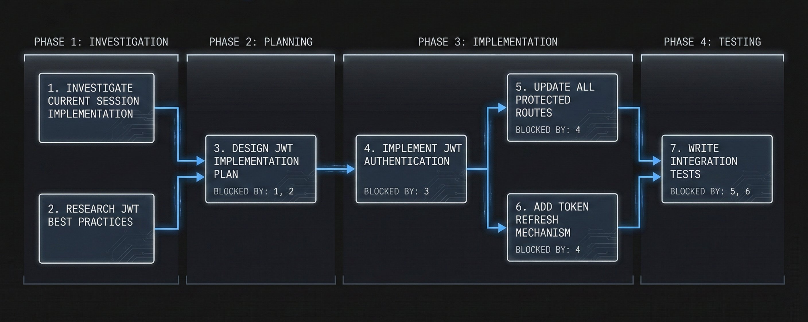
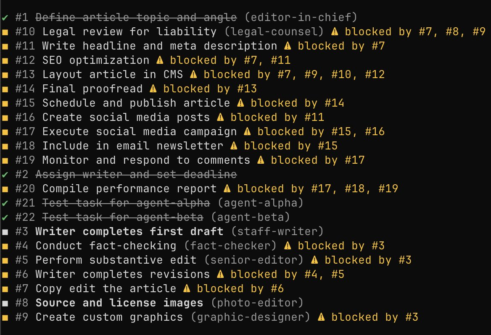
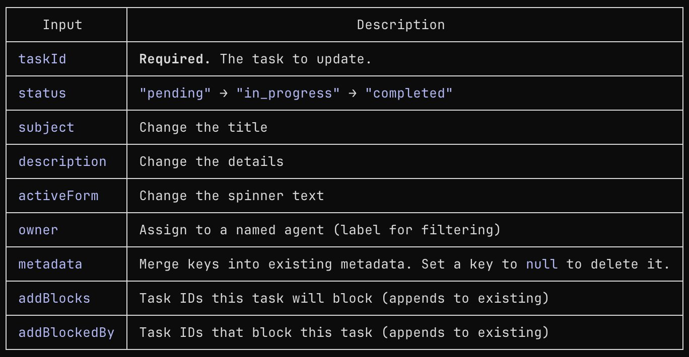
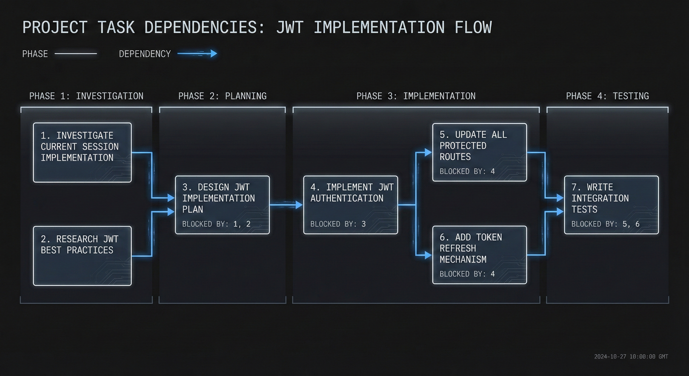
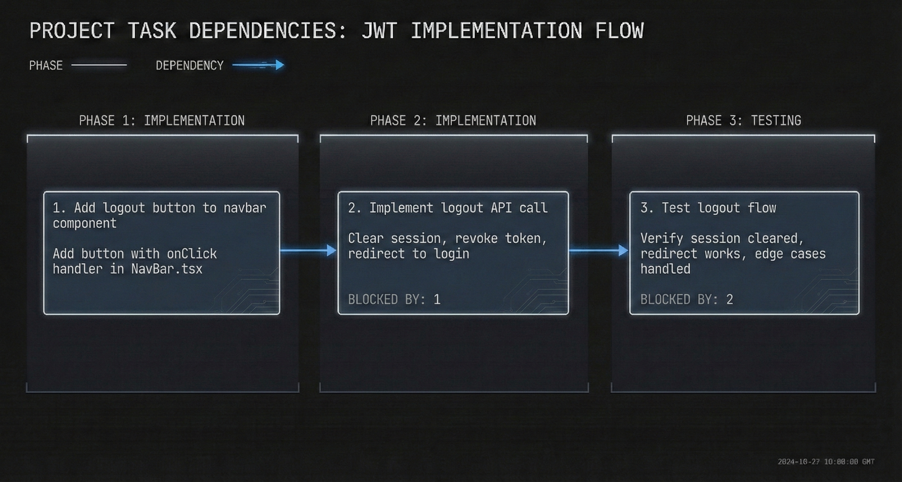
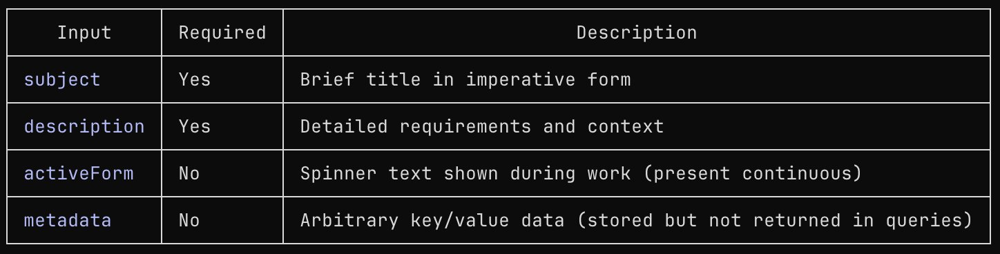
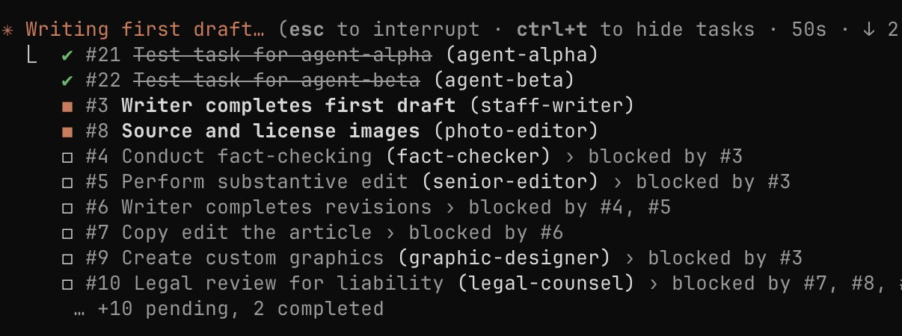
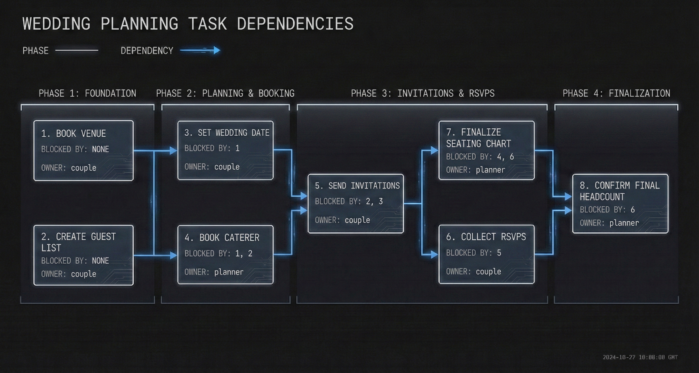

# Claude Code's New Task System: The Practical Guide and Explainer

> Automatisch per `npm run ingest:x` erfasst. Quelle: [x.com/nummanali/status/2014684862985175205](https://x.com/nummanali/status/2014684862985175205)

## Artikel-Volltext

From flat to-do lists to dependency-aware orchestration
You've Outgrown To-Do Lists
We've all been there. You're working on something substantial - a refactor across multiple files, a feature that needs investigation before implementation, a complex workflow with moving parts.
You type your request. Claude gets to work. And somewhere around step 4, things go sideways. It forgets step 2 was a prerequisite. It starts work that depends on something unfinished. Context gets lost.
Flat to-do lists don't cut it anymore.
Claude Code's Task Management System changes the game. It's not just a list - it's a dependency-aware orchestration layer that understands what blocks what, persists across sessions, and can delegate work to parallel agents.
 
What Makes This Different
1. Full Dependency Management
Tasks can block other tasks. Claude won't start work that depends on unfinished prerequisites
Task: #3 Create auth routes [blocked by #1, #2]
Task #3 literally cannot begin until #1 and #2 are done. No more "oops, I forgot to set up the database first."
2. Persistence That Actually Works
Within a session: Tasks survive context compaction. Even as the conversation gets summarized, your task state remains.
Across sessions: Set the environment variable CLAUDE_CODE_TASK_LIST_ID and your tasks persist between completely separate conversations.
3. Agent Assignment & Parallelism
Tasks are assigned to name agents. Multiple workers are spawned simultaneously. They all read from and write to the same task list without conflicts. All of this done without you needing to life a finger!
4. Visual Progress Tracking
See everything at a glance in your terminal:
Tasks (2 done, 2 in progress, 16 open) · ctrl+t to hide tasks
■ #3 Writer completes first draft (staff-writer)
■ #8 Source and license images (photo-editor)
□ #4 Conduct fact-checking (fact-checker) > blocked by #3
□ #5 Perform substantive edit (senior-editor) > blocked by #3
... +8 pending, 2 completed
 
 
The Four Core Tools
These are the new function calling tools that have been introduced to Claude to self manage the system
1. TaskCreate - Creates a new task with metadata
 
 
Tasks start with status pending and no owner. The metadata field is not actively used but stored for future features potentially.
2. TaskUpdate - Modify any aspect of an existing task
 
 
What's interesting here is that blocked tasks can only become unblocked by the related tasks being marked as completed.
Note: addBlocks and addBlockedBy append to the arrays - they don't replace them.
3. TaskGet - Retrieve full details of a specific task
 
Returns: subject, description, status, what it blocks, what blocks it.
4. TaskList - See everything at once
 
Returns all tasks with: ID, subject, status, owner, and blocked-by relationships.
 
How Dependencies Work
The real magic of this new system lies entirely with how well the simple, yet powerful, dependency management system works.
When dependencies are added using addBlockedBy: ["1", "2"] to task #3, it's saying:
"Task #3 cannot start until tasks #1 AND #2 are both completed."
The UI shows this clearly:
✓ #1 Define article topic and angle (editor-in-chief)
✓ #2 Assign writer and set deadline
■ #3 Writer completes first draft (staff-writer)
□ #4 Conduct fact-checking ⚠ blocked by #3
□ #5 Perform substantive edit ⚠ blocked by #3
□ #6 Writer completes revisions ⚠ blocked by #4, #5
 
When #3 completes, tasks #4 and #5 automatically become unblocked and available for work
This is the killer feature. You can't accidentally start work that depends on unfinished prerequisites.
Where Tasks Are Stored
Tasks are persisted as JSON files in your global Claude folder:
~/.claude/tasks/<list-id>/
└──1.json
└── 2.json
└── 3.json
...
└── 22.json
The <list-id> is either:
A session UUID (default) - tasks exist only for that session
A custom ID if you set CLAUDE_TASK_LIST_ID env - persists across sessions
The Stored JSON Schema
Each task is stored as a single JSON file:
 
Accessing Task Files
You can inspect, backup, or even manually edit these files:
View all task lists
> ls ~/.claude/tasks/
View a specific task list
> ls ~/.claude/tasks/my-project/
Read a specific task
> cat ~/.claude/tasks/my-project/1.json | jq
This opens up possibilities like:
Backup/restore task lists
Git tracking of task state
External tooling that reads/writes task files
Cross-project templates for common workflows
 
How about some Examples now?
Example 1: Simple - Adding a Login Button
"Add a logout button to the navbar"
 
 
Simple, linear, clear.
Example 2: Medium - Refactoring With Investigation
"Refactor the auth system to use JWT instead of sessions"
 
 
Key insight: Tasks #1 and #2 can run in parallel (no dependencies on each other), but #3 waits for both.
Example 3: Relatable - Planning a Wedding
Not everything is code. Here's how dependencies work for event planning
"Please help my plan my wedding Claude!"
 
 
You can't send invitations before you have a date and a guest list. You can't finalize seating until RSVPs are in. The system enforces this automatically.
Claude can figure out the hard job in the world and then make it easy and straightforward for you to understand!
 
Agent Assignment: How It Works
The owner field is a label for filtering, not automatic spawning. Claude uses it to organize which agent handles what.
Step 1: Claude creates and assigns tasks
 
Step 2: Claude spawns agents with instructions to find their work
 
Step 3: The agent discovers and completes its tasks
The spawned agent:
Calls TaskList to see all tasks
Filters for tasks where owner matches its name
Calls TaskUpdate to mark task in_progress
Does the work
Calls TaskUpdate to mark task completed
Parallel Agents
Claude can spawn multiple agents in a single message - they run simultaneously:
 
Three agents, running at once, all updating the same task list. No conflicts.
 
Model Selection for Agents
When Claude spawns sub-agents, it picks the right tool for the job. Each agent type has different capabilities - some can edit files, others are read-only, and some are laser-focused on specific tasks.
The Four Types
General Purpose - The all-rounder. Can read, write, edit, search, and run commands. Claude uses this for most implementation work.
Bash - The command runner. Only has access to the terminal. Fast and focused - Claude uses this for git operations, running tests, or executing build commands.
Explore - The codebase navigator. Can read and search, but can't modify anything. Claude uses this to quickly answer "where is X?" or "how does Y work?" questions. You'll see Claude specify thoroughness: "quick", "medium", or "very thorough".
Plan - The architect. Read-only like Explore, but focused on designing implementation strategies. Claude uses this before major work to think through the approach without making changes.
Why Different Types?
Speed and safety.
Need to run npm test? A Bash agent is faster than spinning up a full general-purpose agent.
Exploring unfamiliar code? An Explore agent can't accidentally break anything.
Planning a refactor? A Plan agent thinks it through before touching files.
Agent Model Specification
All agents called using the Task tool can have the model specified. This is very useful depending on the work you're doing. For example, generally the explore tool would use Haiku, but see you're in a complex codebase, you probably will want to specify to Claude to only use Opus agent - a lot of this can be codified using CLAUDE .md or Skills.
 
Rule of thumb:
haiku → Running commands, simple searches, straightforward tasks
sonnet → Moderate complexity, most implementation work
opus → Architecture decisions, nuanced problems, multi-step reasoning
 
Making Tasks Persistent
Within a Single Session (default)
Tasks automatically survive context compaction. As your conversation gets long and the context is summarized, your task state remains intact.
Across Sessions 
You can utilise the CLAUDE_CODE_TASK_LIST_ID to group all tasks under. This is not tied to the current directory you're in, it will be used to manage all tasks as long as it's specified. 

There are two ways to do this:
1 . Per terminal session
 
These will not be picked up on the next session
2. Project settings, update .claude/settings.json
 
Now tasks persist between completely separate conversations. Start a new session, and your task list is still there.
One downside to this approach is that Claude allows is given the full list, so you will need to archive or clean up task after each task set is complete, your tasks will be stored at:
~/.claude/tasks/<CLAUDE_CODE_TASK_LIST_ID>/
Future potential: Mirror to git, sync with external project management tools, track velocity over time. Advanced Task Management on Epic / Sub Epic level.
 
Quick Start for Beginners
1. Set up persistence (optional)
2. Ask Claude to do something complex: "I want to add user authentication with email/password and OAuth"
3. Claude creates the task graph - It breaks down the work, sets dependencies, shows you the plan.
4. Approve or adjust - Add more tasks, change dependencies, assign owners if you want parallel work.
5. Work through it - Claude (or its agents) works through tasks in dependency order, marking progress as it goes.
6. Check progress anytime
Press ctrl+t to toggle the task view, or ask "what's the task status?"
 
Best Practices
When to Use Tasks
Multi-step work (3+ steps)
Anything with dependencies
Work that might span sessions
Complex refactors or features
Delegating to multiple agents
When to Skip
Quick one-off questions
Simple single-file edits
Anything you'll finish in one shot
Tips
Let Claude break down the work. Say what you want, let it create the structure.
Dependencies are your friend. They prevent "I built Y but forgot X it depends on."
Use meaningful owner names. "backend-dev" is better than "agent1".
Check TaskList when stuck. It's your source of truth.
The activeForm matters. Good: "Running database migrations". Bad: "Doing stuff".
 
Wrapping Up
The task system transforms Claude from "smart assistant that sometimes loses track" into "orchestrator that manages complex work with structure."
You get:
Visibility into what's happening
Dependencies that enforce order
Persistence that survives sessions
Parallelism through agent delegation
Accountability through clear ownership
It's not magic. It's structure. And structure scales.
Now go build something complex!

## Bilder

<!-- Reihenfolge wie von der API geliefert (Cover zuerst). Die Position im Artikeltext gibt die API nicht mit. -->

**Cover**

**photo**

**photo**

**photo**

**photo**

**photo**

**photo**

**photo**

## Post-Text

https://t.co/cQgr5MrztI

## Links

- [x.com/i/article/2014…](http://x.com/i/article/2014647141281464321)
