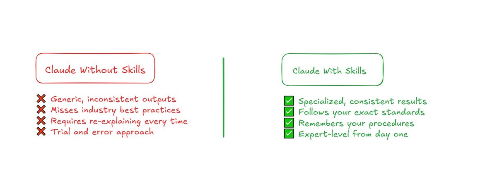
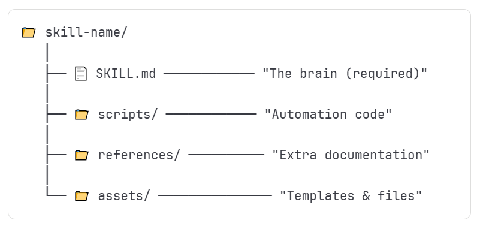
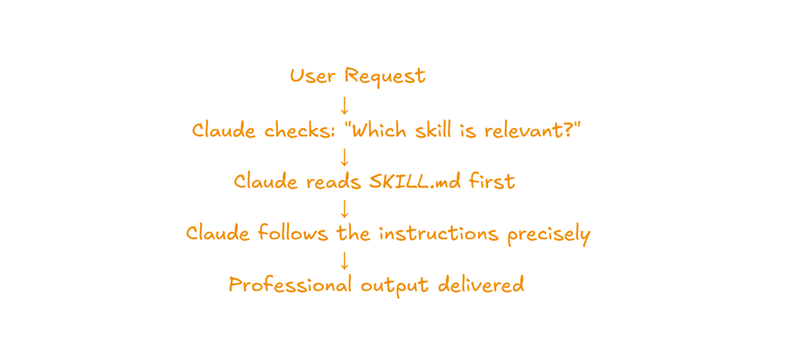

# Claude Skills Explained: Der komplette Guide

> Sekundärquelle: aus vibedeck übernommene deutsche Aufarbeitung (`src/content/knowledge/claude-skills-complete-guide.md`). Primärquelle: https://x.com/Meer_AIIT/status/2017984668205756551


Vor ein paar Tagen habe ich einen Artikel über MCP veröffentlicht, und die Resonanz war überraschend groß. Deshalb gehe ich heute auf ein Thema ein, nach dem ständig gefragt wird: **Claude Skills**.

Dies ist keine recycelte Erklärung. Ich habe Wochen damit verbracht, Skills zu bauen, Dinge kaputt zu machen und herauszufinden, was funktioniert. Dieser Breakdown basiert auf praktischer Erfahrung.

Am Ende dieses Artikels wirst du nicht nur verstehen, was Skills sind, sondern bereit sein, noch heute deinen ersten Skill zu bauen.

## Was sind Claude Skills wirklich?

Skills sind Instruktionspakete, die Claude spezialisiertes Wissen geben, das er von Haus aus nicht hat.

Claude weiß viel, aber er kennt nicht die Brand-Guidelines deines Unternehmens, die Formatierung deiner Finanzberichte oder die Compliance-Workflows deiner Branche. Skills füllen diese Lücken. Sie bieten vier Arten von Wissen:

1.  **Schritt-für-Schritt Workflows**: Sagen Claude genau, wie ein Prozess in welcher Reihenfolge abgeschlossen werden muss.
2.  **Domain Expertise**: Gibt Claude die Regeln und Standards für dein spezifisches Feld (z.B. Dokumentation im Gesundheitswesen).
3.  **Tool Integrationen**: Lehrt Claude, wie man mit spezifischen Dateiformaten richtig arbeitet (z.B. Excel mit funktionierenden Formeln).
4.  **Wiederverwendbare Ressourcen**: Skripte, Templates und Referenzdokumente, aus denen Claude bei Bedarf schöpfen kann.

> **Analogie:** Stell dir vor, du stellst jemanden unglaublich Klugen ein, gibst ihm aber null Onboarding. Er würde es irgendwann herausfinden, aber Fehler machen. Skills sind die Onboarding-Unterlagen, die Claude helfen, vom ersten Tag an wie ein trainierter Spezialist zu arbeiten.

**Wichtig:** Skills sind keine ausgefallenen Prompts oder Custom Instructions. Es sind strukturierte Pakete, die über Konversationen hinweg bestehen bleiben.

## Warum das für deine Arbeit wichtig ist



Drei Probleme plagen fast jeden regelmäßigen Claude-Nutzer:

1.  **Das Konsistenz-Problem**: Unterschiedliche Antworten auf die gleiche Frage an verschiedenen Tagen. Skills fixieren konsistente Outputs.
2.  **Das Qualitäts-Problem**: Claude verpasst oft spezifische Nuancen oder Best Practices deiner Branche. Skills lehren ihn das.
3.  **Das Effizienz-Problem**: Zeitverschwendung durch ständiges Wiederholen von Kontext. Skills erinnern sich für dich.

Erstelle einen Skill einmal, nutze ihn für immer. Teile ihn mit deinem Team, und jeder erhält die gleiche Qualität.

## Die Anatomie eines Skills

Jeder Skill lebt in einem Ordner mit einer spezifischen Struktur.



### 1. Die `SKILL.md` Datei
Dies ist die einzige **erforderliche** Datei. Sie besteht aus zwei Teilen:

**Frontmatter (YAML):**
```yaml
name: my-skill-name
description: "Creates financial reports with proper formatting and formula validation. Use when user asks for financial analysis, budget reports, or spreadsheet creation."
```
Das `description` Feld ist entscheidend. Es sagt Claude, *wann* dieser Skill aktiviert werden soll.

**Body:**
Enthält Regeln, Beispiele für guten Output, Workflows und Anti-Patterns.

### 2. Der `scripts` Ordner
Enthält Python- oder Bash-Code, den Claude ausführen kann. Nutze Skripte für Aufgaben, die immer exakt gleich ablaufen müssen (z.B. Validierung von Excel-Formeln).

### 3. Der `references` Ordner
Zusätzliche Dokumentation (API-Docs, Datenbankschemata, Style Guides). Das hält die `SKILL.md` schlank. Claude zieht sich diese Infos nur bei Bedarf.

### 4. Der `assets` Ordner
Dateien für den Output (Templates, Logos, Fonts). Dinge, die Claude *benutzt*, statt sie zu lesen.

## Skills, die du sofort nutzen kannst

Anthropic hat bereits einige professionelle Skills eingebaut:

*   **DOCX Skill**: Erstellt und editiert Word-Dokumente mit funktionierenden Änderungen nachverfolgen (Tracked Changes).
*   **XLSX Skill**: Baut Spreadsheets mit validierten Formeln und professioneller Formatierung.
*   **PDF Skill**: Liest, mergt, splittet PDFs und extrahiert Tabellen.
*   **PPTX Skill**: Erstellt Präsentationen, die designt aussehen.
*   **Frontend Design Skill**: Baut Web-Interfaces, die nicht nach "Standard-AI" aussehen.

## Wie Skills im Hintergrund funktionieren



Skills nutzen ein System namens **Progressive Disclosure** (schrittweise Enthüllung), um Speicher zu sparen:

1.  **Level 1**: Nur Name und Beschreibung sind immer verfügbar (~100 Token).
2.  **Level 2**: Die volle `SKILL.md` wird nur geladen, wenn der Skill triggert.
3.  **Level 3**: Skripte, Referenzen und Assets laden nur, wenn Claude sie tatsächlich braucht.

Das hält dein Kontext-Fenster effizient.

## Deinen ersten Skill bauen: Schritt-für-Schritt

### Schritt 1: Wähle dein Problem
Was erklärst du Claude immer wieder? Welches Wissen fehlt ihm?
Schreibe 5-10 spezifische Anfragen auf, die dazu passen (deine Testfälle).

### Schritt 2: Ordner erstellen
Erstelle einen Ordner in Kebab-Case (z.B. `meeting-notes-processor`). Starte nur mit der `SKILL.md`.

### Schritt 3: Frontmatter schreiben
Definiere `name` und eine präzise `description` am Anfang der Datei.

### Schritt 4: Body schreiben
Beginne mit den wichtigsten Regeln. Füge Beispiele hinzu (Input -> Expected Output).

### Schritt 5: Support-Dateien (Optional)
Füge Skripte, Referenzen oder Assets in die entsprechenden Unterordner hinzu.

### Schritt 6: Packen
Ein `.skill` File ist im Grunde nur ein ZIP-Archiv.

### Schritt 7: Testen und Iterieren
Lade es hoch, teste es mit deinen Use Cases, und verbessere es.

## Best Practices

*   **Instruktionen**: Sei prägnant. Zeige Beispiele statt langer Erklärungen. Wichtiges zuerst.
*   **Beschreibungen**: Inkludiere, *was* der Skill tut und *wann* er triggern soll.
*   **Freiheit**: Gib bei Finanz-Tasks strikte Regeln, bei kreativen Tasks mehr Spielraum.
*   **Organisation**: Halte `SKILL.md` unter 500 Zeilen. Nutze Referenzen für Details.

## Häufige Fehler

*   **Inhalt**: Dinge erklären, die Claude schon weiß. Vage Beschreibungen.
*   **Struktur**: Falsche Ordner, kaputtes YAML, Junk-Files (.DS_Store).
*   **Trigger**: Trigger-Anweisungen in den Body statt in die Description schreiben.
*   **Testen**: Skripte nicht vorher testen. Nur mit generischen Prompts testen.

## Ideen für deinen ersten Skill

1.  **Viral Content Creator**: Hook-Formeln, Thread-Templates, plattformspezifische Regeln.
2.  **Meeting Notes Processor**: Zusammenfassungs-Templates, Action-Item Extraktion.
3.  **Code Review Assistant**: Checklisten für Sicherheit/Performance, Feedback-Formate.

## Weiterführende Techniken

*   **Skills kombinieren**: Brand Guidelines Skill + DOCX Skill.
*   **Advanced Scripting**: Externe APIs aufrufen, Outputs validieren.
*   **Team Sharing**: Skills als `.skill` verteilen für einheitliche Standards.

## Verbindungen
- [[Agent Skills]]
- [[SKILL.md]]
- [[Progressive Disclosure]]
- [[Domain Expertise]]
- [[Claude Code]]
- [[Automation]]
- [[Context Management]]
- [[Workflow Automation]]
- [[Tool Integration]]
