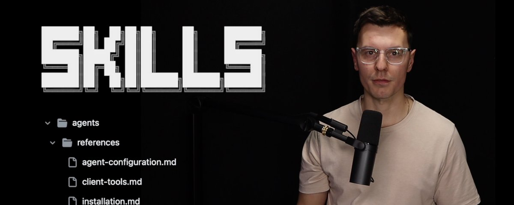
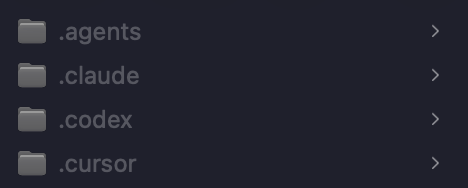
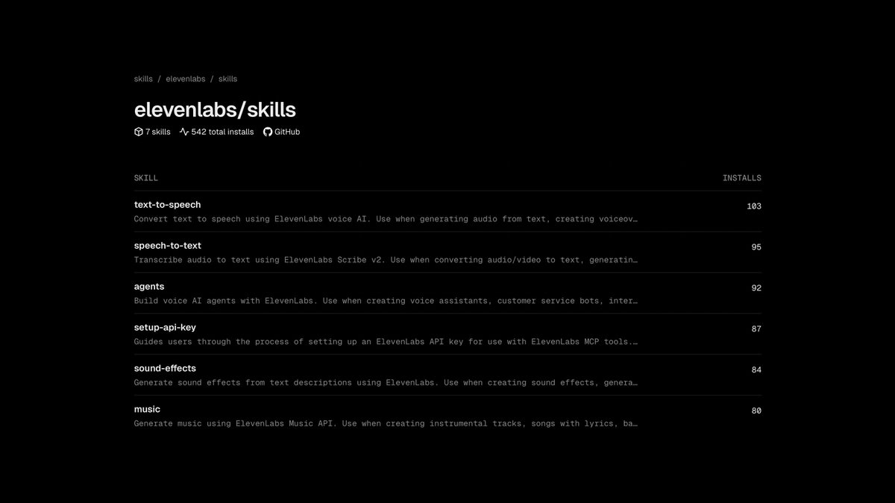

# Deep Dive: Agent Skills verstehen und bauen

> Sekundärquelle: aus vibedeck übernommene deutsche Aufarbeitung (`src/content/knowledge/agent-skills-deep-dive.md`). Primärquelle: https://x.com/tadaspetra/status/2019204136982532407



Agent Skills sind strukturierte Ordner, die Kontext (meistens Markdown-Dateien) zu einem bestimmten Thema enthalten. Ihr Ziel ist es, die Wahrscheinlichkeit zu erhöhen, dass ein Coding Agent (wie Claude Code oder Cursor) eine verwandte Aufgabe erfolgreich löst.

## Wo leben Skills?

Diese Dateien befinden sich in versteckten Ordnern, die je nach Agent variieren:

*   `.claude/skills/` für **Claude Code**
*   `.cursor/skills/` für **Cursor**
*   `.opencode/skills/` für **Open Code**



> **Empfehlung:** Nutze das Tool `skills.sh` von Vercel. Es speichert alle Skills zentral in einem `.agents/skills/` Ordner und verlinkt sie per Symlink in die projektspezifischen Verzeichnisse. Viele Tools unterstützen den `.agents/` Ordner mittlerweile nativ.

## Struktur eines Skills

Jeder Skill-Ordner muss zwingend eine Datei namens `SKILL.md` im Root enthalten. Diese Datei benötigt im Frontmatter mindestens einen `name` und eine `description`.

Zusätzlich können folgende Unterordner genutzt werden:

1.  `scripts/`: Ausführbarer Code, den der Agent nutzen kann.
2.  `references/`: Weitere Markdown-Dateien als zusätzliche Dokumentation.
3.  `assets/`: Statische Ressourcen für den Agenten.

## Progressive Disclosure

Der Grund, warum Skills so effizient sind, liegt im Kontext-Management. Beim Start lädt der AI Agent nur `name` und `description` in den Kontext. Das LLM weiß also, welche Skills verfügbar sind, ohne wertvolle Tokens zu verschwenden.

Erst wenn eine Anfrage gestellt wird, die zu einem Skill passt, lädt das LLM die `SKILL.md`. Nur wenn es dann entscheidet, dass noch mehr Informationen nötig sind, werden gezielt Inhalte aus `scripts/`, `references/` oder `assets/` nachgeladen.

## Anwendung in der Praxis

Theoretisch sollte das LLM die Skills automatisch finden und nutzen. Falls Du sichergehen willst, dass ein bestimmter Skill verwendet wird, kannst Du ihn explizit im Prompt erwähnen:

> "Nutze den text-to-speech Skill, um eine Audiodatei aus dem Text im Eingabefeld zu erstellen."

Skills können pro Projekt (im `.claude/` Ordner des Projekts) oder pro User (im Root-Verzeichnis des Nutzers) installiert werden.

## Eigene Skills entwickeln

Skills sind primär Markdown-Dateien. Es gibt jedoch Konventionen (siehe [agentskills.io](https://agentskills.io/specification)), die man beachten sollte:

*   Die `SKILL.md` sollte unter 500 Zeilen lang sein, um den Kontext kompakt zu halten.
*   Das Ziel ist es, dem LLM zu erklären, *wie* eine Aufgabe gelöst wird und welche Optionen verfügbar sind.
*   Nutze den meta-skill `skill-creator` von Anthropic, um bessere Skill-Beschreibungen zu schreiben.

## Launch & Discovery

Um Skills zu veröffentlichen, reicht es, die Dateien zu teilen. Um sie auffindbar zu machen, solltest Du ein öffentliches GitHub-Repository erstellen.



Die Seite `skills.sh` durchsucht GitHub automatisch nach `SKILL.md` Dateien und fügt sie dem Verzeichnis hinzu. Du kannst jeden Skill direkt über das Terminal installieren:

```bash
npx skills add <owner/repo>
```
Dieser Befehl startet einen Installer, der die Skills an den richtigen Orten verlinkt.

## Verbindungen
- [[Agent Skills]]
- [[Progressive Disclosure]]
- [[Claude Code]]
- [[Cursor]]
- [[SKILL.md]]
- [[skills.sh]]
- [[Context Management]]
- [[AI Agents]]
