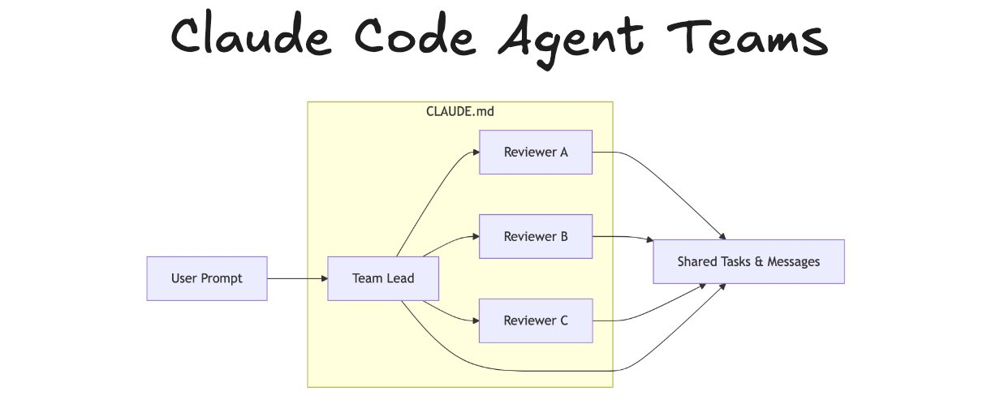
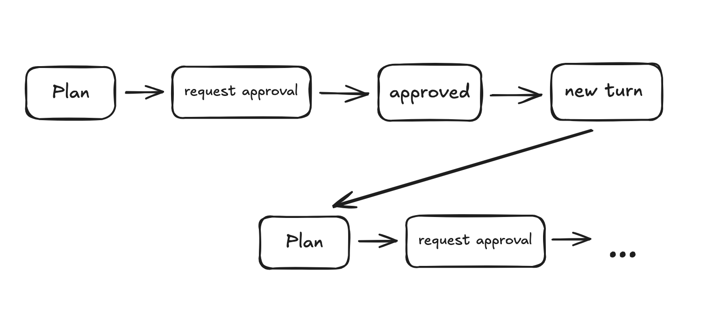
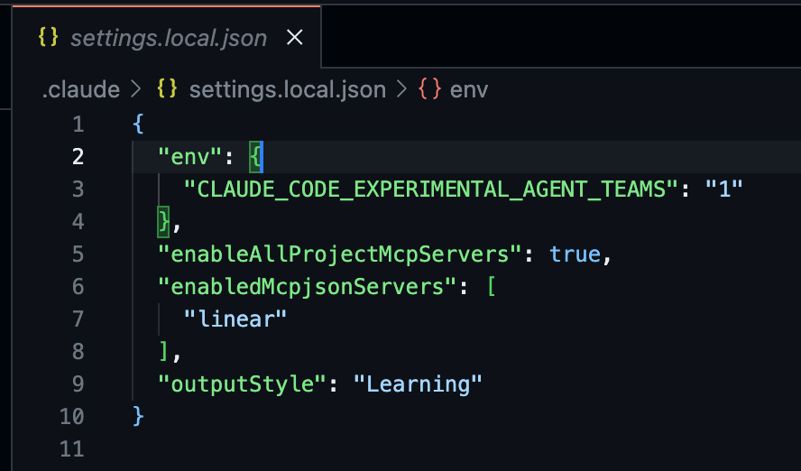
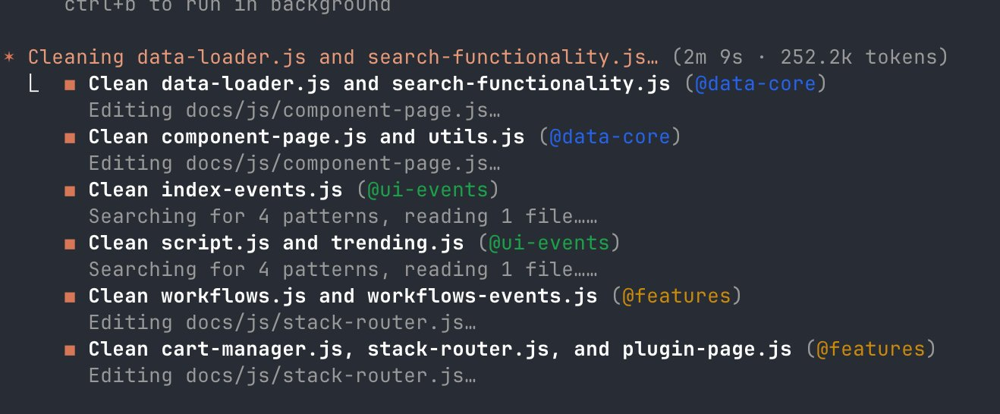
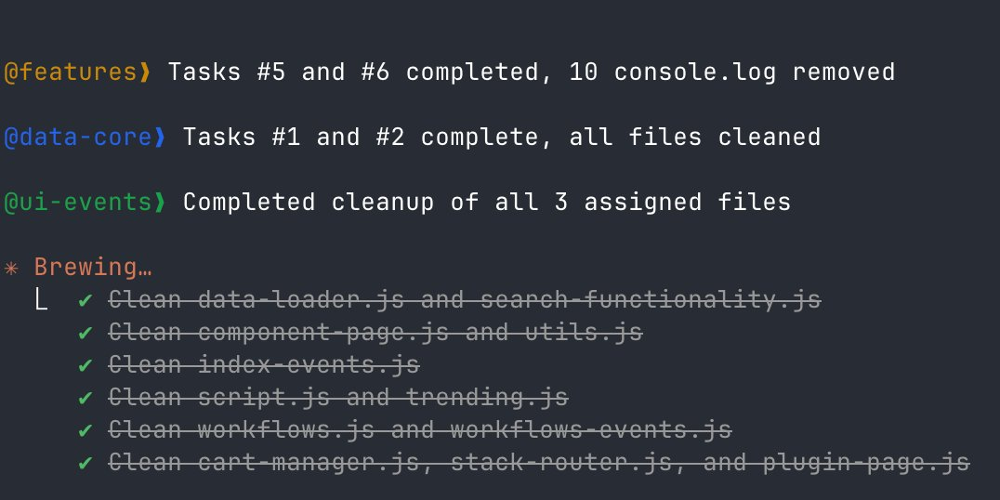
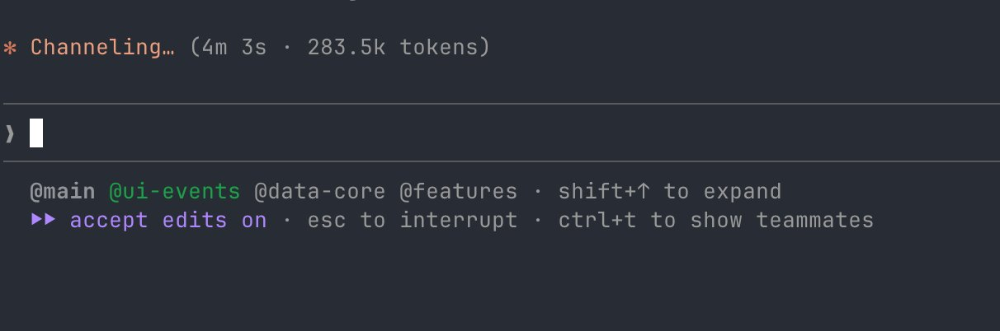

# Agent Teams in Claude Code

> Automatisch per `npm run ingest:x` erfasst. Quelle: [x.com/dani_avila7/status/2020170608290549906](https://x.com/dani_avila7/status/2020170608290549906)

## Artikel-Volltext

I've been running Claude Code's Agent Teams for real work. It's experimental, but already useful if you understand how agents coordinate and how file edits are controlled.
These are the patterns that helped me improve throughput and avoid edit collisions.
Install:
Just add "CLAUDE_CODE_EXPERIMENTAL_AGENT_TEAMS": "1" to your settings.json
 
That's it, no extra dependencies.
How to use them
1. Describe the task and ask for a team
You don't configure teams manually. Just describe what you need: 
I need to remove all debug console.log statements from docs/js/. Create an agent team, split by file ownership so nobody edits the same file.
Claude creates the team, splits the work into tasks, spawns teammates, and coordinates everything.
2. Watch teammates appear in the statusline
 
3. Watch them work in parallel
Each teammate reads files, makes edits, and reports progress. In the console you can see all three working simultaneously on different files:
 
4. Tasks complete one by one
The shared task list tracks everything. You can check progress anytime:
 

How Agent Teams really behave
A few things become obvious quickly:
Each teammate runs in its own context window
There’s no shared conversation history
All teammates automatically load CLAUDE.md
Communication happens via messages + a shared task list
So coordination doesn’t come from conversation, it comes from structure. That’s where CLAUDE.md matters.
The 3 rules
1- Describe your module boundaries so the lead can split work
When you ask for an agent team, Claude Code reads your CLAUDE.md to decide how to divide files across teammates. The clearer your module  boundaries, the smarter the split.
In CLAUDE.md (shared project context):
 
In my test, I told Claude Code: "there are console.log across files in docs/js/, create a team and split by file ownership." Claude Code read the project structure, assigned explicit file lists to each teammate, and produced zero conflicts across 9 files. It made that split because it understood which files were independent.
2. Keep project context short and operational
Every teammate loads your CLAUDE.md on startup, but none of them inherit the lead's conversation. If your CLAUDE.md is vague, each teammate wastes tokens re-exploring the codebase independently.
 
In our team, no teammate asked the lead what the project was about or where files lived. 
They all got that from CLAUDE.md. Three teammates loading context simultaneously means three times the token cost if that context requires exploration instead of a quick read.
3. Define what "verified" means for your project
Claude Code includes verification steps in each task when it knows what passing looks like. 
If your CLAUDE.md lists how to check that things work, teammates use those signals to confirm their own work
 
In our cleanup, teammates self-verified using grep because the task was about removing console.log 

Claude Code chose the right check for the task. But having project-wide gates in CLAUDE.md gives the lead a vocabulary for "done" that it can adapt per task automatically.
In practice, each teammate self-reported exactly what they did:
 
No lead intervention was needed. Clear rules in, clear reports out.
Extra: a note on plan mode
One thing I learned by using it in teams, plan mode is evaluated on every turn, not just once.
 
In practice, this makes it great for:
design-only roles
initial task shaping
For execution, spawning a new teammate in default mode keeps work flowing. An agent’s mode stays fixed for its entire lifetime.
Takeaway
Agent Teams work best when:
agents own clear surfaces
communication is structured, not conversational
CLAUDE.md is treated as shared runtime context
It’s experimental, but once you align with how teams actually execute and communicate, it starts to feel less like “multiple agents” and more like a coordinated system running in parallel.

## Bilder

<!-- Reihenfolge wie von der API geliefert (Cover zuerst). Die Position im Artikeltext gibt die API nicht mit. -->

**Cover**

**photo**

**photo**

**photo**

**photo**

**photo**

## Post-Text

https://t.co/O0g4NGzCiM

## Links

- [x.com/i/article/2019…](http://x.com/i/article/2019161376665567234)
