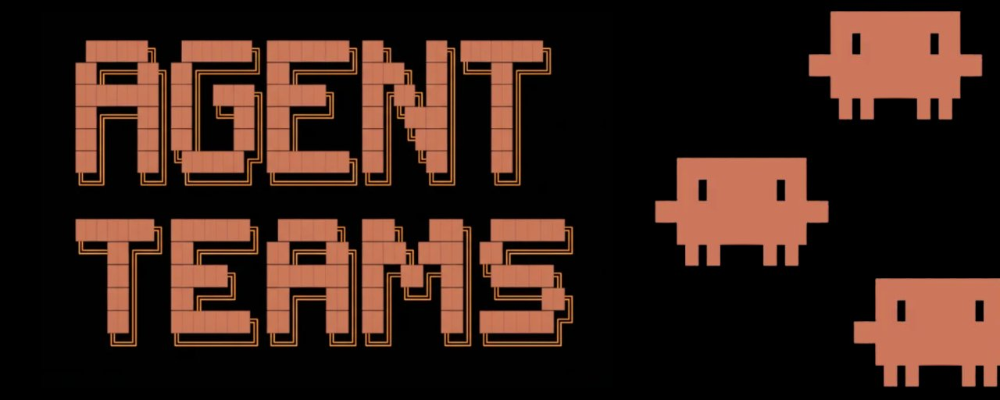
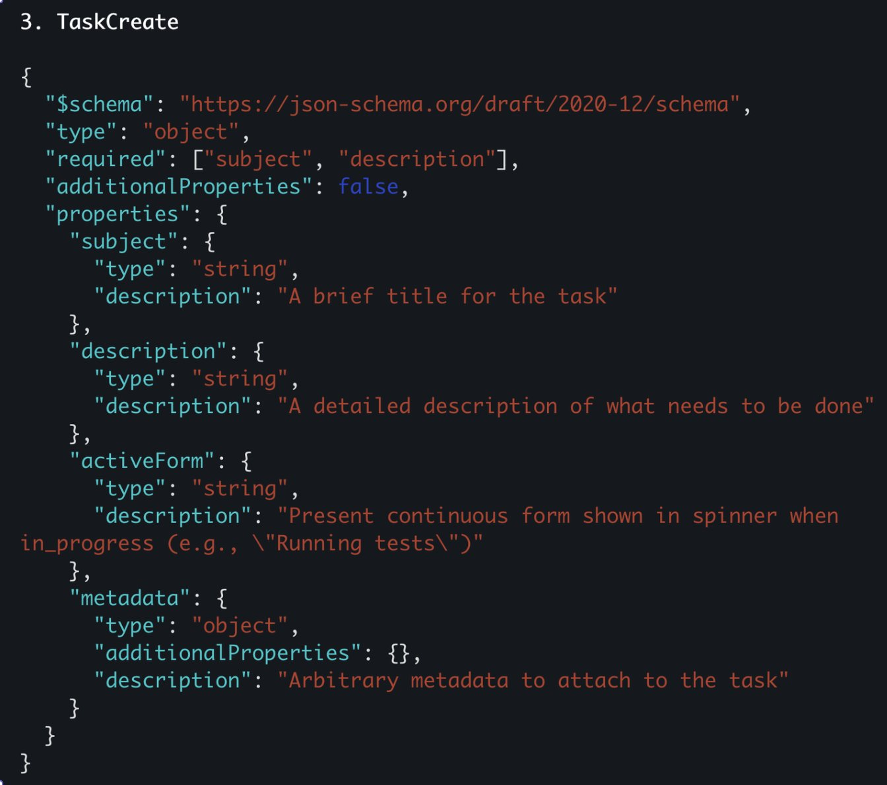
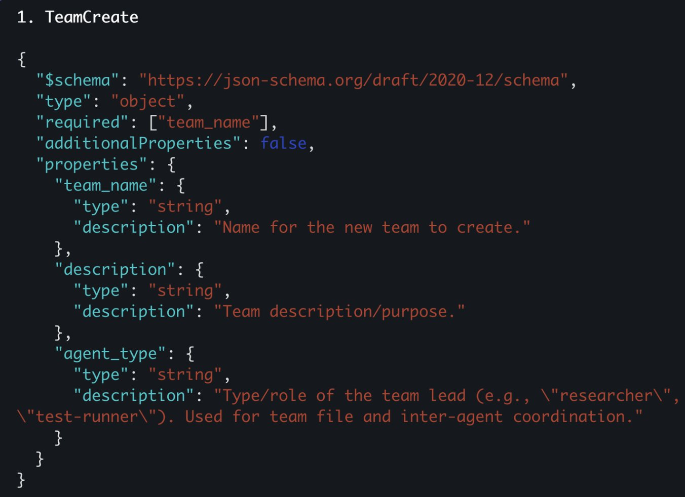
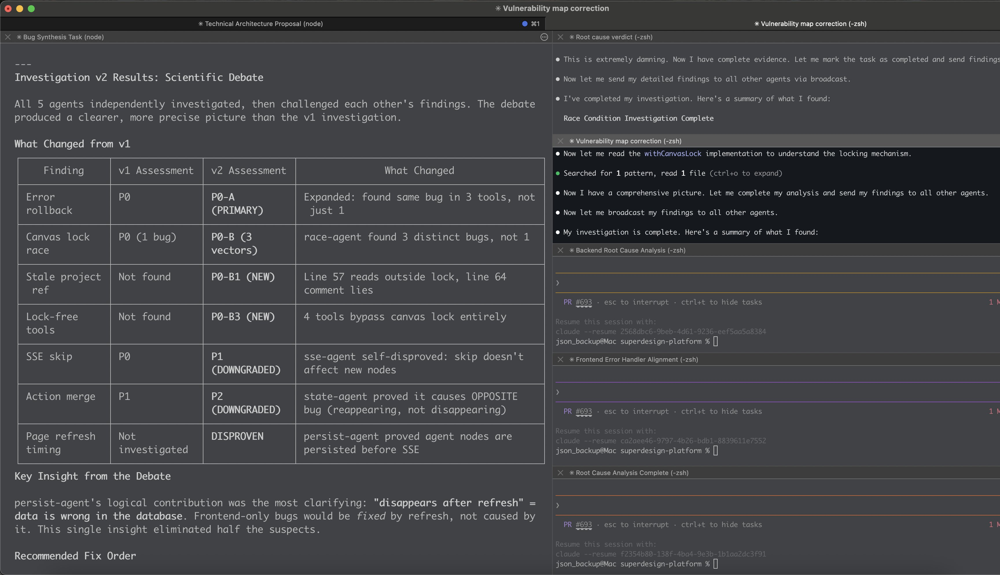
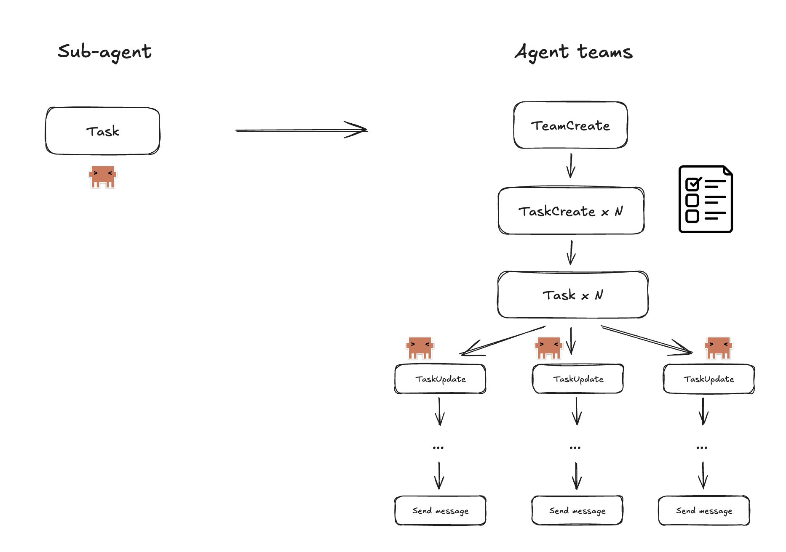
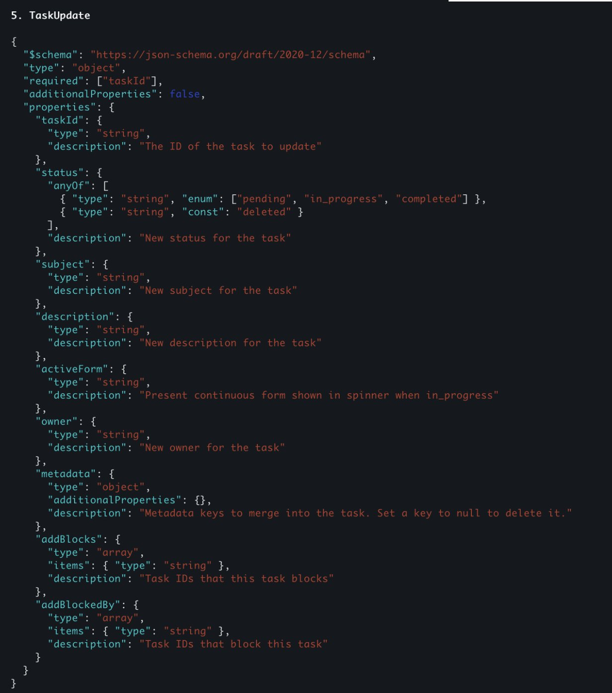
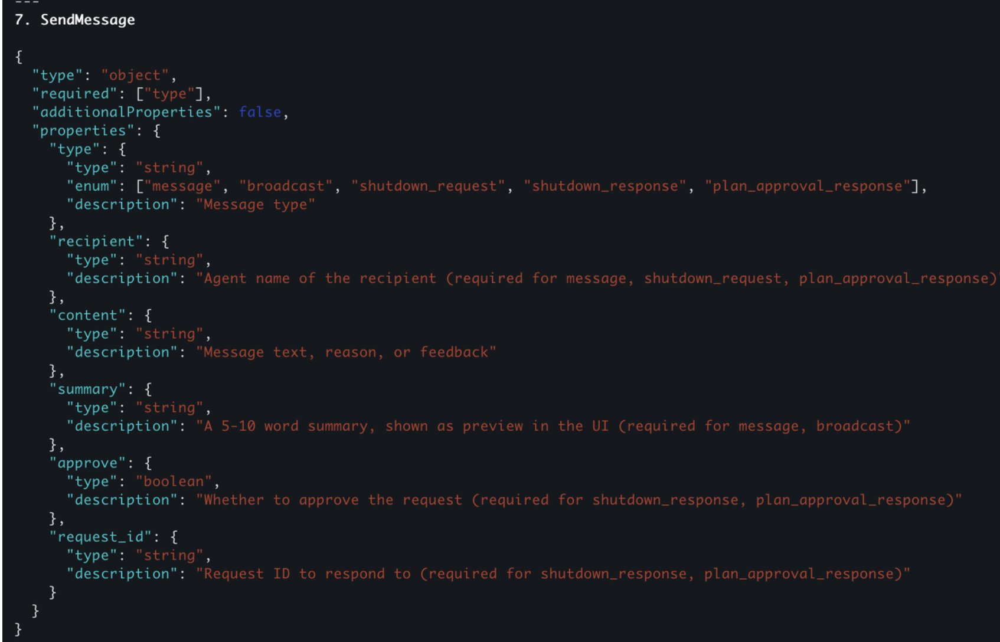
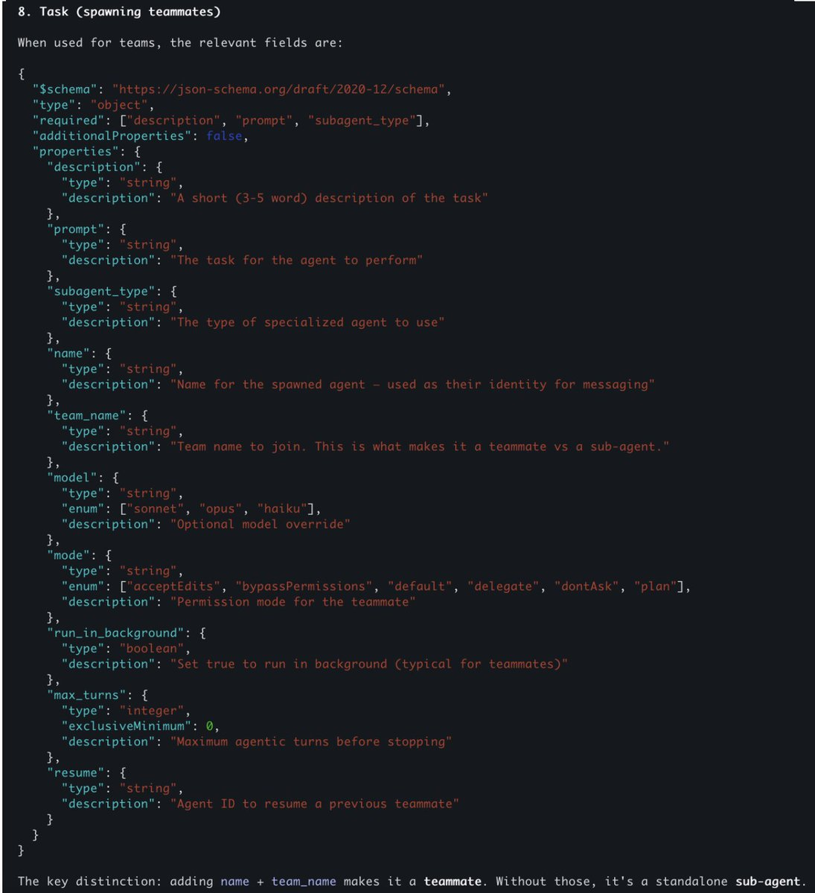

# How to install and use Claude Code Agent Teams (Reverse-engineered)

> Automatisch per `npm run ingest:x` erfasst. Quelle: [x.com/jasonzhou1993/status/2020086991740891526](https://x.com/jasonzhou1993/status/2020086991740891526)

## Artikel-Volltext

Claude Code just shipped a massive upgrade to its agent system: Agent Teams.
This isn’t a small iteration on the old task + sub-agent model. It’s a fundamentally different execution model that allows 3–5 independent Claude Code instances to collaborate on the same project, share context, exchange messages, and coordinate through a shared task system.
I spent time digging into the logs, tracing model calls, and inspecting the filesystem changes behind the scenes. After a lot of back-and-forth investigation, I finally feel like I understand how Agent Teams actually work - and more importantly, when they’re worth using over traditional sub-agents.
This post walks through:
How to install and enable Agent Teams
How Agent Teams differ from sub-agents
The internal tools and lifecycle (Team Create, Task Create, messaging, shutdown)
How agents communicate with each other
A real debugging use case where Agent Teams clearly outperform sub-agents

How to install and enable Agent Teams
Before anything else, make sure you’re on the right version.
1. Update Claude Code to latest version
2. Enable the Experimental Flag
Agent Teams are still behind a feature flag. Run below to open settings.json
 
and in global setting file, add:
 
Save the file and restart your terminal.
3. Start a New Claude Code Session
Once enabled, They can be activated when your prompt explicitly instructs Claude Code to create an agent team.
For example:
“I'm designing a CLI tool that helps developers track TODO comments across their codebase. Create an agent team to explore this from different angles: one teammate on UX, one on technical architecture, one playing devil's advocate.”
When Claude Code detects that intent, it will begin creating team members automatically.
The Best Way to Use Agent Teams (Live, Multi-Session View)
 
Agent Teams shine when you can see every agent working in parallel.
The best setup I’ve found:
tmux, or
iTerm2 on macOS
iTerm2 Setup
Install iTerm2
Go to Settings → General → Magic
Enable Python API
Restart iTerm2
Then launch Claude Code with tmux mode:
 
This opens:
One pane for the team lead
Separate panes for each agent teammate
You can click into any pane, watch what the agent is doing live, and even send direct messages to individual agents.
 
Sub-Agents vs Agent Teams: What Actually Changed?
 
Before Agent Teams, Claude Code had a simple model:
Old Model: Sub-Agents / Task tool
Main agent calls task tool
A sub-agent spins up
Sub-agent works in isolation
Session terminates
Only a summary is returned to the main agent
New Model: Agent Teams
Agent Teams introduce:
Shared task lists
Message & communication between agents
Explicit lifecycle control (startup, shutdown)
This is enabled by new internal tools.
Let’s break them down.
Tool 1: TeamCreation
Everything starts with the TeamCreate tool. When invoked: A new team folder is created under: .claude/teams/
At this point, The team exists, No agents are assigned yet
Think of this as scaffolding.
 

Tool 2: TaskCreate
This tool is different from the Task tool which will spin up agent sessions, this tool this specifically creating new todo
Each task lives as a JSON file under: .claude/tasks/team-id
Tracks: Task ID, Description, Status (pending, in_progress, complete, deleted), Owner, Dependencies (blocks, blocked_by)
Tasks can be delegated top-down by team-lead (which is the main agent), or Self-claim (as agent team can use taskList or getTask, updateTask tool to do so)
 

Tool 3: Task tool
The agents are still activated by Task tool, which is the same as sub agent, however it got some upgrades;
It got new params `name`, and `team_name`, when those 2 params are past, it will use agent team instead of simple sub agent subprocess
 
Tool 4: taskUpdate
Each agent is expected to call taskUpdate tool to claim task, update status
 
Tool 5: sendMessage
Agent Teams introduce a Send Message tool.
It supports:
Direct messages (agent → agent)
Broadcast messages (agent → all teammates)
Under the hood:
Messages are written to .claude/teams/<team_id>/inbox/
Each agent has its own inbox
Messages are injected as new user messages into the agent’s conversation history, e.g. <teammate-message teammate_id="team-lead">....</teammate-message>
--------
Meanwhile team-lead agent can send `shutdown_request` to team mate agent, where team-mate agent send `shutdown_response` to confirm, which likely use postToolCall hook to auto terminate the agent session
 

When Agent Teams Are Actually Better Than Sub-Agents
It's hard to tell whether anthropic will sunset sub-agent and just use agent teams, but this new structure open up loads of imagination as it offers a more sophisticated communication channel & context sharing
One example I liked from their official doc is for deep debug:
Users report the app exits after one message instead of staying connected. Spawn 5 agent teammates to investigate different hypotheses. Have them talk to each other to try to disprove each other's theories, like a scientific debate. Update the findings doc with whatever consensus emerges.
I used this for @SuperDesignDev and it works great; But the trade-off is a lot more token consumption and speed; So i dont think agent team directly replace sub agents, yet;
I can imagine this agent team + some sort of ralph loop can put together structure for extremely long running agentic tasks completion;
Keen to see what use cases you guys come up with, comment below!
 
If you enjoy this and want to dive deeper, you can join @aibuilderclub_ where we share latest learnings on AI coding + agent building weekly.

## Bilder

<!-- Reihenfolge wie von der API geliefert (Cover zuerst). Die Position im Artikeltext gibt die API nicht mit. -->

**Cover**

**photo**

**photo**

**photo**

**photo**

**photo**

**photo**

**photo**

## Post-Text

https://t.co/W18aQxXOfE

## Links

- [x.com/i/article/2019…](http://x.com/i/article/2019928552410632192)
