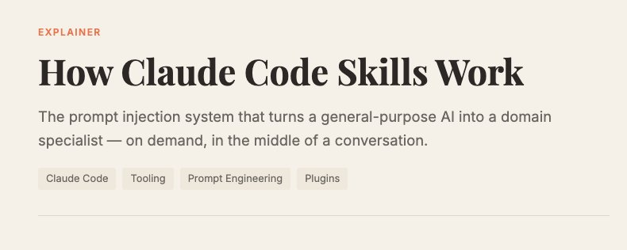
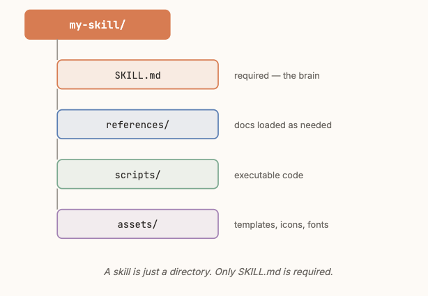
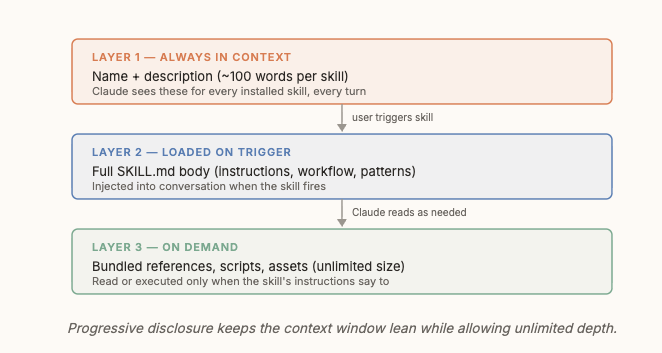
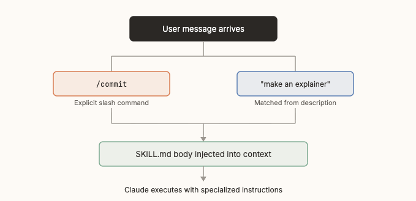
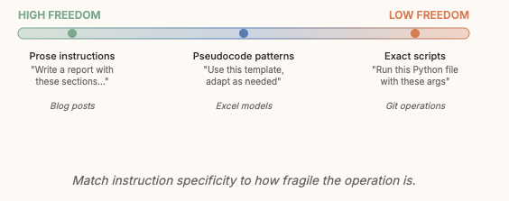

# How Claude Code Skills Work 

> Automatisch per `npm run ingest:x` erfasst. Quelle: [x.com/pdrmnvd/status/2020967757706297797](https://x.com/pdrmnvd/status/2020967757706297797)

## Artikel-Volltext

To first understand skills, I think it can be helpful to first understand the problem it's trying to solve. Over and over again, we've seen that context management is highly correlated with model effectiveness. This may change as models get smarter, but for now, being able to manage context effectively drives better results.
So, let's assume Claude is smart. It still can't know everything about your specific domain upfront. Making an investment banking pitch deck? Building a DCF model? Generating a branded PowerPoint? Do you have a bespoke PR review requirement? What about a style guide for your documentation? Each of these can require hundreds of lines of specialized instructions, formatting rules, reference documents, and scripts.
You could paste all of that into every conversation. But context windows are finite and expensive. You could throw it into a CLAUDE․md but it might not be needed in every conversation.
Skills solve this. They're self-contained packages of knowledge that Claude loads only when it needs them, turning a generalist into a specialist mid-conversation.
Anatomy of a Skill
A skill is just a directory with a SKILL․md file at its root. That markdown file has two parts: YAML frontmatter for metadata, and a body with the actual instructions.
 
Beyond SKILL.md, a skill directory can contain supporting files organized into a clean hierarchy:
 
The Three-Layer Loading System
Skills use progressive disclosure to keep the context window lean. Not everything loads at once since most skills only need their full instructions when they're actually invoked.
 
This three-layer system is why skills can be so powerful. A design system might have tons of reference material, scripts, and specs but are only used on-demand.
How Skills Get Triggered
Skills fire in two ways. Either the user explicitly invokes one with a slash command, or Claude matches the user's request against skill descriptions and activates one automatically.
 
The description field in the YAML frontmatter is the key to automatic triggering. It tells Claude both what the skill does and when to use it including trigger phrases like "explain X", "make a post about X", or "review this NDA." The description is always in context (Layer 1), so Claude can pattern-match against it every turn.
If you find the skill is not being invoked, first check your frontmatter. If it still isn't, let us know using /feedback. Or just DM me and yell at me.
Inside a Skill Execution
When a skill fires, its SKILL․md body gets injected into the conversation as a system message. From that point, Claude follows those instructions just like any other prompt.
A well-designed skill guides Claude through a workflow. It might tell Claude to read a reference file for design specs, run a Python script to scaffold a template, or spawn sub-agents for parallel work. The instructions can be as simple as a formatting guide or as complex as a multi-phase pipeline.
 
I always thinks real implementations are the best to learn from. I like our `skill-creator` skill for that. https://github.com/anthropics/skills/tree/main/skills/skill-creator
The Design Tradeoff
The art of skill design is managing the tension between specificity and context cost. Every word in SKILL․md eats into the shared context window. But too-vague instructions produce inconsistent results.
The best skill authors calibrate their degrees of freedom:
 
A good rule of thumb: explain why, not just what. If Claude understands the reasoning behind an instruction, it can generalize to edge cases the skill author never anticipated. Rigid "ALWAYS do X" rules are a code smell. Explaining the motivation behind X is almost always more effective.
Why Skill Matters
I've seen first hand the power of really well-written skills. They are a force multiplier. Domain experts are the best skill creators, since they can provide a level of detail and precision that others might miss. You're building general-purpose reasoning engine, specialized on demand through injected context, with a loading system designed to respect the constraints of finite context windows. 

## Bilder

<!-- Reihenfolge wie von der API geliefert (Cover zuerst). Die Position im Artikeltext gibt die API nicht mit. -->

**Cover**

**photo**

**photo**

**photo**

**photo**

## Post-Text

https://t.co/jiVGZcaRKR

## Links

- [x.com/i/article/2020…](http://x.com/i/article/2020965228847169536)
