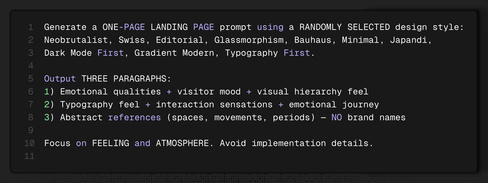
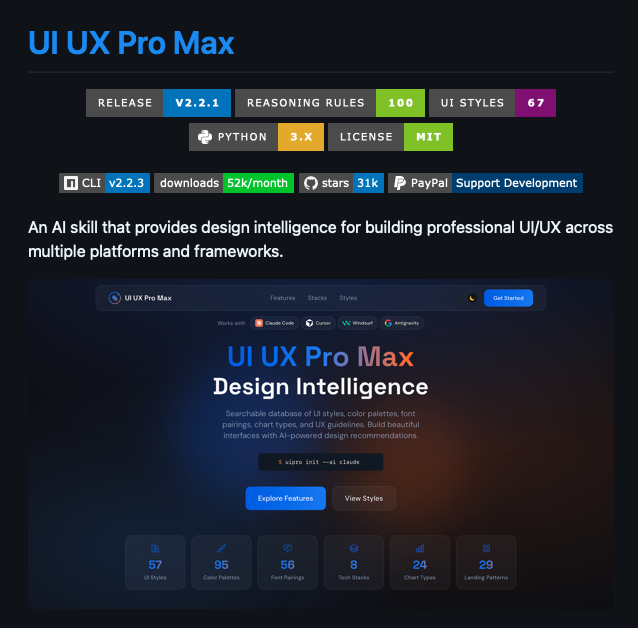
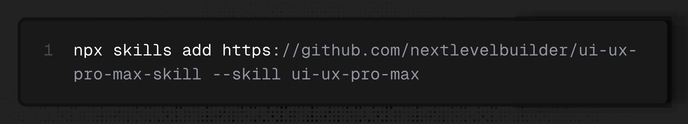
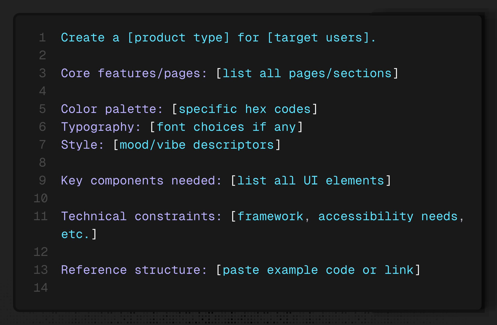
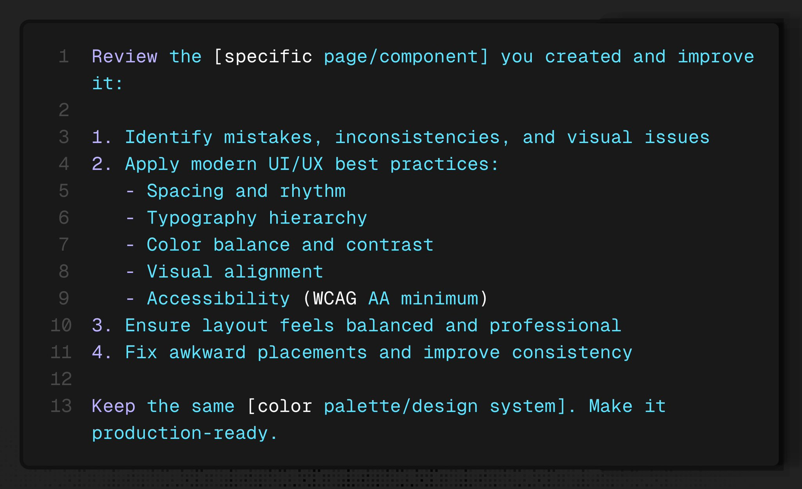
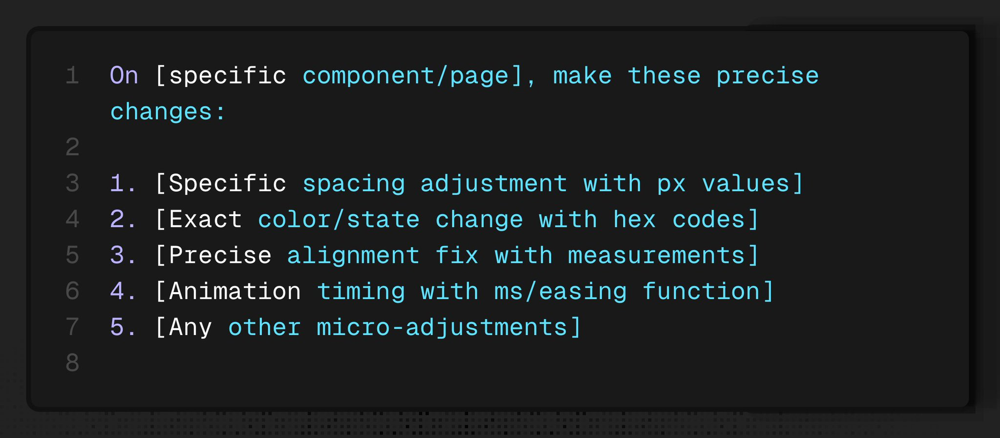

# Designen mit KI in 2026: Der ultimative Workflow für besseren Geschmack

> Sekundärquelle: aus vibedeck übernommene deutsche Aufarbeitung (`src/content/knowledge/ai-design-workflow-2026.md`). Primärquelle: https://x.com/Av1dlive/status/2023086925817729306

> "Designen war früher schwer. Die Ära des Vibe-Coding hat es extrem einfach gemacht, gute Designs zu bauen. Was aber immer schwer blieb, war TASTE (Geschmack)." — Avid

KI verstärkt die eine Fähigkeit, die viele ignorieren: die Entwicklung von Geschmack. Die besten Designer im Jahr 2026 sind nicht diejenigen mit den längsten Prompts, sondern diejenigen, die ihr Auge geschult haben und dieses Urteilsvermögen in ihren KI-Workflow einfließen lassen.

## Ausführung ist einfach, Urteilsvermögen ist alles

Du kannst Claude bitten, ein "Dashboard zu designen" und wirst etwas Funktionales erhalten. Aber sieht es gut aus? Fühlt es sich richtig an?

KI exzelliert darin, Muster zu kopieren. Dein Job ist es zu wissen, welche Muster es wert sind, kopiert zu werden. Wenn du eine perfekt gestaltete Landingpage siehst, bist du nicht von der technischen Umsetzung beeindruckt, sondern von dem Geschmack dahinter.

---

## Der 5-Schritte-Prozess für High-End Design

### 1. Geschmack durch visuelle Referenzen aufbauen
Bevor du ein KI-Tool anfasst, verbringe 20–30 Minuten damit, Screenshots von Interfaces zu sammeln, die genau dein Problem lösen.
- **Awwwards**: Für modernes Webdesign.
- **Pinterest AI Search**: Lade einen Screenshot hoch, um ähnliche Designs zu finden.
- **Dribbble**: Für UI-Patterns.

> **Pro-Tipp**: Frag dich bei jedem Bild: "Was genau funktioniert hier?" Ist es die Hierarchie? Die Abstände (Spacing)? Die Farbwahl? Das Benennen dieser Dinge baut dein Design-Vokabular auf.

### 2. Video → Code: Der Kimi K2.5 Shortcut
Du kannst ein Video einer beliebigen Website aufnehmen und die KI den Code nachbauen lassen. Das Tool **Kimi K2.5** klont nicht nur das Design, sondern auch die Interaktionen und das UX-Gefühl.

### 3. Lerne die Sprache des Designs
Du kannst nicht "prompten", was du nicht benennen kannst. Bevor du generierst, lerne diese Begriffe:
- **Typografie**: Hierarchy (H1→H6), Kerning (Zeichenabstand), Leading (Zeilenabstand), Weight.
- **Layout**: White space (Atmenraum), Proximity (Gruppierung), Contrast ratio.
- **Farben**: Primary, Accent, Semantic (Error/Success), Neutral.

KI weiß genau, was "Erhöhe den White Space zwischen den Sektionen von 32px auf 48px" bedeutet. Präzision ist der Schlüssel.

### 4. Meta-Prompts & Skills: Einmal bauen, ewig nutzen
Nutze KI, um bessere Prompts für KI zu schreiben (Meta-Prompting). 

Nutze außerdem **Skills**: wiederverwendbare, aufgabenbezogene Regelsätze (Constraints + Checks), die Agenten automatisch anwenden.
- **UI Skills**: Verhindert Standardfehler in Barrierefreiheit und Performance.
- **UI/UX Pro Max**: Ein Design-Playbook für Web und Mobile.
- **RAMS**: Finales QA mit Korrekturen auf Code-Ebene.

### 5. Die Zoom-In Methode: 50% → 99% → 100%
Hör auf zu erwarten, dass die KI im ersten Versuch alles perfekt macht.

- **Pass 1 (50%): Full Context Dump**
  Gib der KI alles: Ziel, Zielgruppe, Vibe, spezifische Hex-Codes, benötigte Komponenten und Referenzcode.
  

- **Pass 2 (99%): Self-Review**
  Nutze einen Prompt, der die KI zwingt, ihre eigene Arbeit zu reflektieren. Sie findet oft 70% ihrer eigenen Fehler (Schriftgrößen, Padding-Inkonsistenzen).
  

- **Pass 3 (100%): Pixel-Perfect Polish**
  Der letzte Schliff durch spezifische Anweisungen und Screenshots.
  

---

## Fazit: KI als dein Junior-Designer

Betrachte KI nicht als Blackbox, sondern als Junior-Designer. Professionelles Design ist eine Progression von Low-Fidelity zu High-Fidelity. 
- **Früher**: 6–8 Stunden manuelle Arbeit.
- **Heute**: 1–2 Stunden strategische Führung und systematisches Verfeinern.

Dein Geschmack und dein Prozess sind dein wahrer Wettbewerbsvorteil.

*Quelle: Basierend auf einem Thread von [Avid](https://x.com/Av1dlive) auf X.*

## Verbindungen
- [[Vibe Design]]
- [[Design Taste]]
- [[Kimi K2.5]]
- [[Meta-Prompting]]
- [[Self-Review]]
- [[Pixel-Perfect]]
- [[UI/UX Design]]
- [[Agent Skills]]
