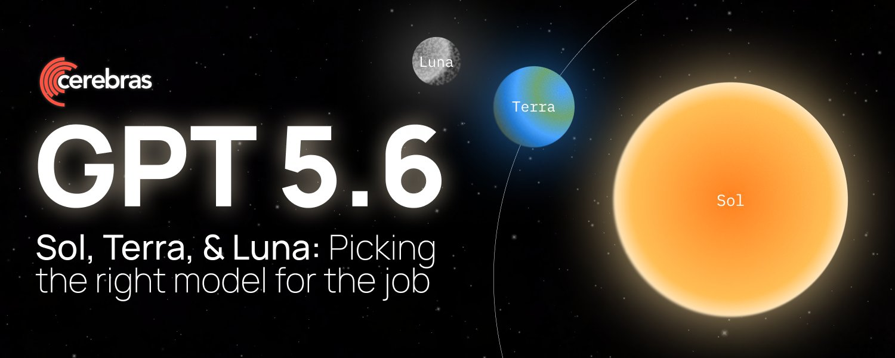

# Getting the most out of GPT-5.6: Sol, Terra, and Luna

> Automatisch per `npm run ingest:x` erfasst. Quelle: [x.com/cerebras/status/2081828128952095022](https://x.com/cerebras/status/2081828128952095022)

## Artikel-Volltext

Authors: @0xSero & Zhenwei Gao (@zhennydez)
 
Your Codex subscription now comes with 3 main models, Sol, Terra, and Luna, each independently trained and served, with reasoning dials. Together, they let you choose a balance of speed, cost, and intelligence for each task.
Price Comparison at a Glance (OpenAI developer pricing July 21 2026)
On price, Terra costs 1/2 as much as Sol, while Luna costs one-fifth as much, across both short- and long-context usage.
 
This pricing tracks pretty closely with intelligence and speed. In practice, each model is best suited to a different kind of work:
Sol is the smartest of the bunch. It’s best suited for long running tasks, complicated technical challenges, and personal assistance. That added capability comes with higher latency and cost, but Sol excels at coordinating subagents and tackling large projects across extended workflows.
Terra sits comfortably in the middle, providing most of the intelligence at half the price of Sol. It’s also moderately faster. Paired with Sol, Terra can be a strong subagent: Sol can weigh the options and set the direction, then hand off implementation to the faster, cheaper Terra.
Luna is the fastest and most affordable of the three, while still outperforming most models on the market, at just one-fifth the price of Sol. For most everyday AI tasks, Luna is more than capable, delivering reliable performance at an incredibly low cost. As of July 17, 2026, it ranks 16/576 of all models on Artificial Intelligence’ model intelligence index.
 
Picking the Best Model for the Task
How do you decide which model should handle a request and how much reasoning it should apply? That choice must be made before any tokens are generated.
Start with Luna, Then Escalate.
A simple way to approach any task is to choose the model that offers the best balance of speed and intelligence at the price you are willing to pay. Within the GPT-5.6 family:
1. GPT-5.6-Sol: Highest intelligence floor and ceiling
2. GPT-5.6-Luna: Highest speed floor and ceiling
A good default is to start most tasks with Luna, then move up to Terra or Sol when progress stalls, such as when agents get stuck, fixes stop landing, or the model begins losing the thread. If you are willing to pay more for both speed and intelligence, you can run Sol on Cerebras at 750 tokens per second, which is up to 10x faster speed advantage than regular mode of Sol.
 
Test-time Compute / Reasoning
Another way to tailor how the model handles a task is by adjusting its reasoning level. In Codex, you can choose from five options: “Light,” “Medium,” “High,” “Extra High,” and “Ultra”.
By using more computer processing time to increase the accuracy of the output, the model will produce tokens arguing with and questioning itself before giving the user an answer.
Light: Amazing to get basic tasks completely quickly, finding files, cloning and configuring a repo, organizing your downloads, and more. This is the reasoning level you should choose for basically anything where the model knows what it needs to do and where the likelihood of failing is low.
Medium: A good everyday default for tasks that require some interpretation, planning, or debugging, but not deep exploration. This could include summarizing across files, implementing a small feature, or troubleshooting a familiar issue.
High and Extra-High: Best for difficult STEM and coding tasks, such as complex debugging, architecture decisions, large refactors, or problems with several plausible approaches. Most routine assistant tasks do not need this much, if any, reasoning.
Ultra: Use the highest reasoning mode if you really know what you want and have detailed constraints, especially on work that spans multiple independent systems. For example, building interfaces and APIs to connect 2 APIs in a very specific way.
We typically reserve Ultra mode for our biggest research questions and novel challenges. Ultra mode has a tendency to drain your usage limits very quickly, but you can rest assured the model has used the full reasoning budget available to explore, verify, and refine its answer.
In Artificial Analysis’ testing from July 17, each step up in GPT-5.6 Sol’s reasoning level increased the average cost per task by roughly 50%. The charts below show how additional reasoning affects both intelligence and cost.
 
Take Advantage of Cache Reads.
Cached input is 90% cheaper than fresh input. Codex tasks that repeatedly process the same codebase or context benefit enormously.
Each of the GPT-5.6 models has a cache TTL of ~30 minutes. That means maintaining a single session you work in will be better than starting a new session for each task.
Codex’s compaction has also gotten good enough that you can run a single session to hundreds of millions of tokens without even experiencing any issues.
If you keep the session hot, you’ll have much cheaper prompt processing. You can set Codex automations scheduled every 20 minutes to keep your cache alive and use those automations to drive long running processes.
 
Using Multi-Agent Workflows Effectively.
Different models are trained on different data and optimized for different goals, meaning each will be slightly better or worse at certain things.
The Advisor workflow, gives one agent a narrow job: read the full session, keep track of the goal and constraints, and step in whenever the worker starts drifting. This helps automatically steer the worker and improve reliability across longer tasks.
Local Codex also lets you bring other providers to the app. This means you can experiment with lower-cost, open-weight models like Kimi K2.7 Code, or models with different strengths, such as GLM-5.2 for long-horizon reasoning and coding, while staying inside the familiar Codex experience.
You can then use these external models for bounded subagent work, helping reduce costs or take advantage of the different strengths of each model.
One important nuance: this is done through Codex configuration and custom agent files, rather than a simple in-app model picker. Codex supports local providers such as Ollama and LM Studio, along with custom Responses-compatible providers.
 
Conclusion
Subscription usage limits are pretty generous, but as AI agents become more useful to more people, many are pushing the limits way beyond what one subscription can offer.
And even if you have the money to burn, not every “frontier” model sits at the frontier of all use cases. Often a small model can completely wipe the floor with a consortium of the world’s best models on a few benchmarks.
Speed is an important toggle, during the day when you’re interacting with your agents, high tok/s can dramatically improve your experience. During off hours, a /goal with a slow, extra reasoning model can make a world’s difference.
And lastly, keep an eye on Artificial Analysis, it’s full of high quality model speed benchmarks and intelligence indexes.
 
Thank you to Sarah Chieng (@MilksandMatcha), Joyce Er, and Hai-Ching for your review and input, and Halley Change (@halleychangg) for designing the graphics featured in this blog.

## Bilder

<!-- Reihenfolge wie von der API geliefert (Cover zuerst). Die Position im Artikeltext gibt die API nicht mit. -->

**Cover**

**photo**

**photo**

**photo**

**photo**

**photo**

**photo**

## Post-Text

https://t.co/6nhAiMMlIy

## Links

- [x.com/i/article/2081…](http://x.com/i/article/2081811071745310720)

## Thread

### 1/2

https://t.co/6nhAiMMlIy

### 2/2

Read more here: https://t.co/Z54MZERF0N.
