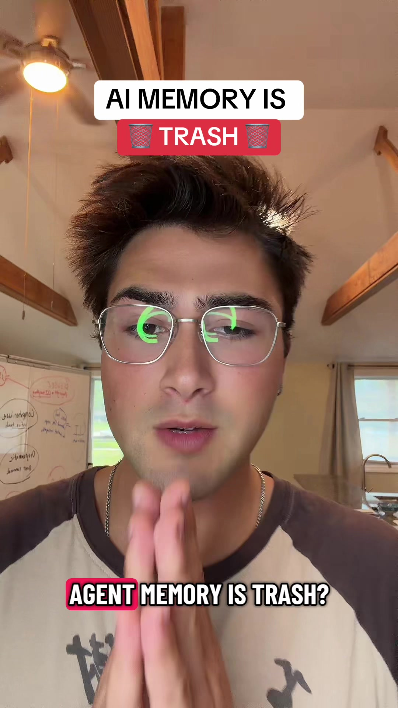

# AI memory is trash, here’s some solutions.

> Automatisch per `npm run ingest:tiktok` erfasst. Quelle: [tiktok.com/@agentic.james/video/7674000398218284302](https://www.tiktok.com/@agentic.james/video/7674000398218284302)

## Caption

AI memory is trash, here’s some solutions.

#aiagents #aimemory #claudecode #codex #ai

## Transkript

> ⚠️ Automatische Spracherkennung von TikTok. Eigennamen und Zahlwörter sind regelmäßig falsch erkannt — vor der Übernahme als Zitat gegen das Video prüfen.

So A I. Agent memory is trash? Here are all the different memory methods that I've come across, their different use cases, and how they work. Number one is just files and folders with some sort of knowledge graph. Number one is just storing important memories and outputs in files and folders combined with some sort of knowledge graph tool. This will cover the majority of basic use cases. Especially when you're using agents in an interactive manner. Like you're going back and forth with the agent and have the time to wait for your agent to search through that knowledge graph to find what it needs. For this, most people use something like Obsidian. With a wiki knowledge graph, you could use something like the Graphify open source repo that basically helps your agent build a knowledge graph around a large set of folders and files. Now things get more complicated when you want your agent to actually remember specific turns of a conversation that you've had with it. It's much harder to do this well with just files, folders, and a knowledge graph because there's so much text and information in all of those chats you've had with your agent. A really cool solution to this that the Hermes agent actually uses is it takes all of the transcript files that you've ever had with your agent. So the full chat transcripts, and it indexes them into a vector database so your agent can use a semantic search Tool to actually search for the specific chats that you had back and forth with your agent so you can actually remember specific messages that you and it have sent. Another problem is if you want your agent to be able to remember things that people spoke about in audio files or actual frames and context from a video file. Really cool solution to this is the Google Gemini Embeddings 2 model, which is a multimodal embeddings model that can ingest basically any type of file, so a video file, image, audio and text and store them all in the same vector database. So your agent can search based on meaning through videos, audio files and text files to retrieve relevant information. If you wanna plug in for that one, I actually built one. It's in my community link in bio. Lastly is a timing problem. Sometimes you don't wanna wait for your agent to retrieve memories you wanted to boot with those relevant memories already in its context window. For this you actually wanna set up programmatic hooks in your agent harness so that whenever it boots up, it actually takes a summary of relevant memories from whatever knowledge base that you have. It summarises them and injects them into the context window automatically. The same goes for chat turn. So when your agent takes a chat turn, it actually injects relevant context before it even responds to you. There's a million other types of ways to implement agent Memory. It really just depends on what the use case for that agent is, which one or which combination of those memory mechanisms that you want to use. For more sauce, link in bio.
