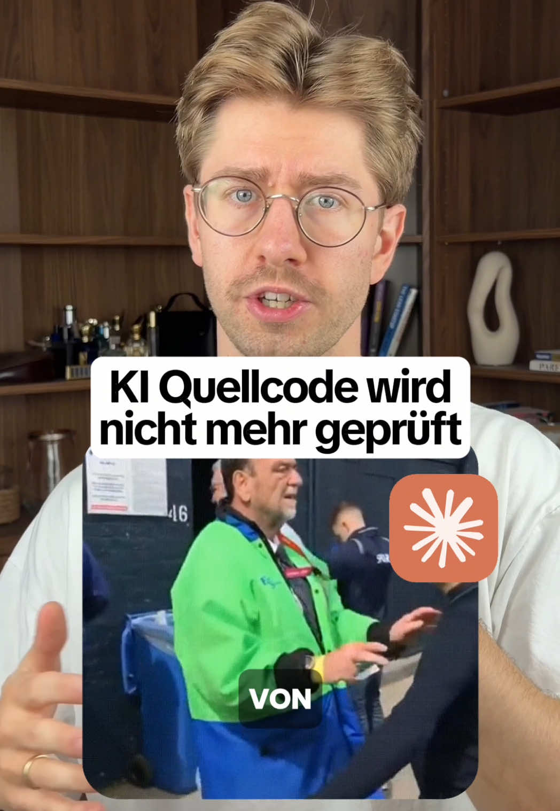

# Über achtzig Prozent des Codes von Claude Code und Codex sieht kein Mensch mehr an.

> Automatisch per `npm run ingest:tiktok` erfasst. Quelle: [tiktok.com/@floknowsai/video/7673935893886979360](https://www.tiktok.com/@floknowsai/video/7673935893886979360)

## Caption

Über achtzig Prozent des Codes von Claude Code und Codex sieht kein Mensch mehr an. Geprüft wird er von einem Agenten. Die Universität Toruń hat über 932.000 Pull Requests ausgewertet: 61,38 Prozent der KI-generierten hatten keine dokumentierte Review, von den geprüften wurden 58,77 Prozent nur von Agenten angesehen und 10,14 Prozent nur von Menschen. Hochgerechnet hat bei rund 84 Prozent kein Mensch draufgeschaut. Ein Agent meldet Fehler seltener, wenn sie im selben Gesprächsverlauf entstanden sind. Übergibst du die Prüfung frisch und mit deiner ursprünglichen Aufgabe, steigt die Endkorrektheit von 71,6 auf 89,7 Prozent. Das prüfende Modell muss dabei mindestens gleich stark sein. Zu den Tests: Nicht jede Änderung braucht einen Test, sondern jedes geänderte Verhalten. Ein Refactoring muss unter den unveränderten Tests grün bleiben. Passt ein Agent die Tests an, damit sie grün werden, ist das der Moment zum Hinsehen. Die Einstellung heißt "Require status checks to pass before merging", zu finden unter Settings, Rules, Rulesets.

#ki #vibecoding #claudecode #codex #codereview

## Transkript

> ⚠️ TikTok stellt für dieses Video kein Transkript bereit. Der Actor liefert Transkripte nur, wenn TikTok selbst Untertitel erzeugt hat.
