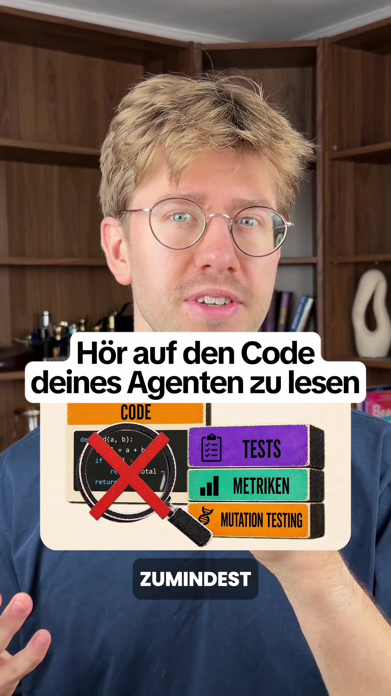

# Hör auf, den Code deines KI-Agenten zu lesen.

> Automatisch per `npm run ingest:tiktok` erfasst. Quelle: [tiktok.com/@floknowsai/video/7675431688024984865](https://www.tiktok.com/@floknowsai/video/7675431688024984865)

## Caption

Hör auf, den Code deines KI-Agenten zu lesen. Das sagt der Autor von Clean Code. Nicht weil er den Code für fehlerfrei hält, sondern weil er seinem Testing vertraut. Beim Mutation Testing schreibt ein Programm absichtlich Fehler in deinen Code und schaut, ob deine Tests anspringen. Die Tests, die dein Agent selbst geschrieben hat, finden über die Hälfte davon nicht. Der Grund ist einfach: derselbe Agent schreibt den Code und die Tests dazu. Ein grüner Test beweist also nicht, dass deine Software funktioniert. Er beweist nur, dass niemand widersprochen hat.

#ki #vibecoding #softwareengineering #claudecode #testing

## Transkript

> ⚠️ Automatische Spracherkennung von TikTok. Eigennamen und Zahlwörter sind regelmäßig falsch erkannt — vor der Übernahme als Zitat gegen das Video prüfen.

> ⚠️ **Rückübersetzung, nicht der Originalton.** TikTok hat statt der Originalspur eine maschinell nach *en* übersetzte Fassung geliefert (Caption ist *de*). Für Zitate die Caption nutzen oder mit `--refetch` einen neuen Abruf versuchen.

stop reading the code of your AI agents at least that's what the man who wrote clean code says Robert C Martin also has the Agent Manifesto co-wrote and in July he declared why he no longer reads through his agents' code not because he considers it error-free he relies instead on his testing so unitest quality metrics and mutation testing hi I am Florian with me you learn how to use AI correctly in software engineering follows me so gladly if you are interested in the topic and the most exciting thing is mutation testing 1 Program thereby writes intentionally errors in your code and then checks OB your tests jump on it everything still remains green so your test says nothing on and it is precisely this that the tests fail that your agent writes for you you will not find more than half of the errors and the reason for this is relatively simple because the agent writes the code and the tests at the same time with me therefore 1 2. agent gets the same task to check the quality of implementation the code quality itself Bugs and in and again but actually also mutation testing is simply to ensure that your tests still fulfill the task I can trust my agent also really only about this way of working because 1 2. agent with new context is not biased and that is exactly why I know how to get quality into my software without reading the code Software engineering is going exactly right now in this direction and I think that in 5 years hardly anyone will code themselves will write and also the ability OB you still at all understand what happens in the code is probably irrelevant so who has never written a line of code but knows how he crap and checks is probably faster in the end as the best developer without this mode of operation but write me your opinion in the comments
