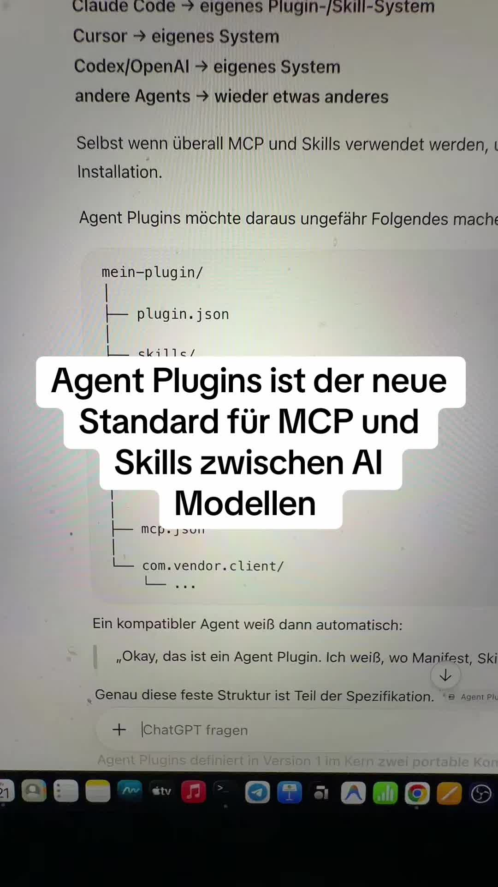

# Agent Plug ins das ist der neue Standard mit dem die großen AI companies jetzt …

> Automatisch per `npm run ingest:tiktok` erfasst. Quelle: [tiktok.com/@promptgefluester/video/7676607306452176160](https://www.tiktok.com/@promptgefluester/video/7676607306452176160)

## Caption

#agentplugins #mcp #skill #standard

## Transkript

> ⚠️ Automatische Spracherkennung von TikTok. Eigennamen und Zahlwörter sind regelmäßig falsch erkannt — vor der Übernahme als Zitat gegen das Video prüfen.

Agent Plug ins das ist der neue Standard mit dem die großen

AI companies jetzt zusammenarbeiten wollen und zwar bislang war es halt so dass die Portierung von zum Beispiel Skills

oder mcp's von zum Beispiel Codex of Claude und andere KI Modelle schwierig waren weil die nicht einheitlich waren aber jetzt hat man sozusagen diese Struktur konzipiert

dann hauptordner eine Plug in Jason in denen die spezifikation

drinne ist dann kommt die Skills Struktur

äh mit unter Skills und natürlich den MCP Jason

und wie gesagt dann wahrscheinlich noch die ganze Struktur mit den ganzen ähm Skripten wie pythonskripten die dann vielleicht logiken oder deterministische ragex Befehle durchlaufen

genau das ist der neue Standard ähm Agent Plug ins ähm macht total Sinn des zu vereinheitlichen und ähm da werd ich natürlich auch so so schnell wie möglich Mein codegard dahingehend auch updaten

lasst gern n ähm Follow da und einen Daumen hoch und wenn ihr Lust habt mehr übers Thema KI Programmierung zu erfahren in meiner Bio gibt's ne kostenlose Community da könnt ihr euch anmelden und mit anderen Leuten die auch mit KI programmieren diskutieren wir haben ne Community mit Sprachnachrichten mit interaktiven Chats

und der Möglichkeit mit Mir zu sprechen einfach direkt anmelden let's go
