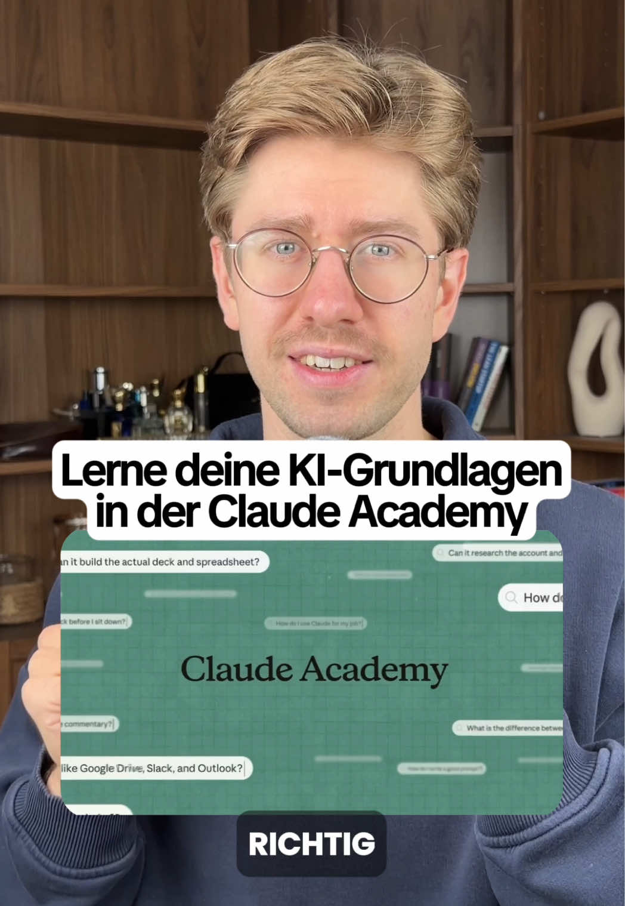

# Anthropic hat die Claude Academy veröffentlicht.

> Automatisch per `npm run ingest:tiktok` erfasst. Quelle: [tiktok.com/@floknowsai/video/7676841192276888864](https://www.tiktok.com/@floknowsai/video/7676841192276888864)

## Caption

Anthropic hat die Claude Academy veröffentlicht. Kurse, Tutorials und Anwendungsfälle zu allen Claude-Produkten, kostenlos unter academy.claude.com. Du brauchst nur dein Claude-Konto. Du wählst dein Produkt oder deine Rolle und bekommst direkt die passenden Inhalte. Ein Teil davon liegt inzwischen sogar direkt in Claude. academy.claude.com

#ki #claude #claudecode #education #academy

## Transkript

> ⚠️ Automatische Spracherkennung von TikTok. Eigennamen und Zahlwörter sind regelmäßig falsch erkannt — vor der Übernahme als Zitat gegen das Video prüfen.

1 Tropic hat die Cloud Academy veröffentlicht und ich muss ehrlich sagen das ist eine richtig geile Grundlage für alle die mit KI durchstarten wollen ich meine ich kriege täglich Nachrichten und Kommentare OB ich beispielsweise noch mal die Grundlagen zu Cloud Code erklären kann aber das könnt ihr zukünftig euch selber beibringen in der Academy hi ich bin Florian bei Mir lernt so alles zum Thema künstliche Intelligenz folgt Mir also gern wenn euch das Thema interessiert sortiert ist das ganze erstmal nach Produkten also clot CO Work clot Code cloten sleck und clot Platform das wo du dich weiterbilden möchtest kannst du dann einfach auswählen und dann werden dir direkt die Kurse angezeigt die dazu gehören da lernst du dann beispielsweise dass im automodus noch mal 1 2. KI Modell hinter dem eigentlichen Modell sitzt und da noch mal die Ausführung prüft dass deine subagents deine Skills gar nicht miterben solange sie der Koordinator ihn nicht explizitieren mitgibt oder das clot fremden Code deutlich schärfer bewertet als den eigenen den er selbst geschrieben hat dazu kommen dann natürlich noch die ganzen Grundlagen hinsichtlich konektoren Hooks und so weiter es sind dort einfach auch noch mal die Kleinigkeiten die dir 1 bisschen Klarheit in der Nutzung der clot Produkte geben können und teilweise findest du die Videos der Academy direkt in clotchen selbst beispielsweise findest du in den Projekten von Chloe jetzt 1 Video davon wie und vor allem wofür du Projekte einsetzt die Academy ist inzwischen auch als eigener Reiter in deinem profilmenü wenn du dort raufklickst kannst natürlich auch nach einzelnen Inhalten suchen oder nach deiner expliziten geht ne Rolle und kannst dort entsprechend dann Videos ansehen auch die fertigen Proms kannst du dort einfach ausprobieren wenn du draufklickst öffnen sie sich als Entwurf der größte Teil ist aber tatsächlich für Einsteiger gemacht von über 300 Inhalten sind ganze 2 als fortgeschritten markiert und für den Rest bin dann ebend ich da also folgt Mir gern wenn du das nicht verpassen möchtest
