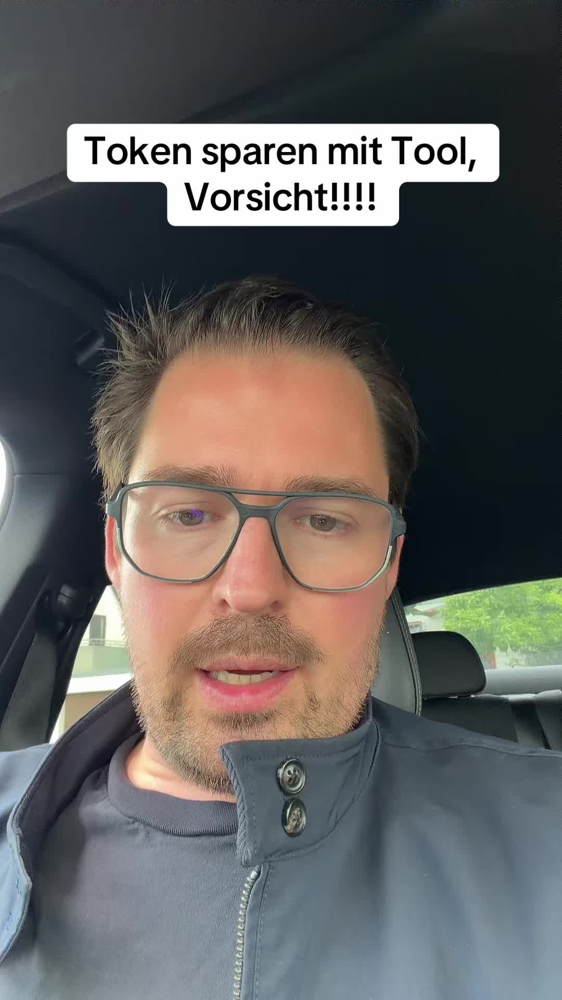

# TikTok von @promptgefluester

> Automatisch per `npm run ingest:tiktok` erfasst. Quelle: [tiktok.com/@promptgefluester/video/7676818527080271136](https://www.tiktok.com/@promptgefluester/video/7676818527080271136)

## Caption

#token #claude #sparen #tokenmaxing

## Transkript

> ⚠️ TikTok stellt für dieses Video kein Transkript bereit. Der Actor liefert Transkripte nur, wenn TikTok selbst Untertitel erzeugt hat.
