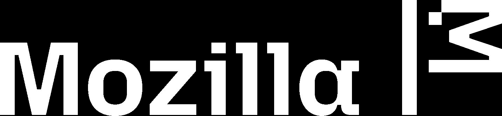

# state of open source ai v1 0 1

> Automatisch per `python ai.py ingest` erfasst. Quelle: `file:///C:/Users/asi/Documents/GitHub/ai-company-os/00_Inbox/Quellen/PDF/dateien/state-of-open-source-ai-v1-0-1.pdf`

## Volltext

### Seite 1

THE STATE OF OPEN SOURCE AI
AN INAUGURAL MOZILLA ASSESSMENT 
Open Source AI 2026
Volume 1.01
July 2026

### Seite 2

STATE OF OPEN SOURCE AI · 2026
Contents.
01
The current state
Capability, cost, and adoption — the evidence
02
Who's betting on it
The capital, the companies, the economics
03
Why it's happening everywhere
Optionality, sovereignty, national strategies
04
The harness is the new frontier
The layer above the model, and its open gap
05
Five bets
Where to act while the layer is still open
Sources: Mozilla / SlashData 2026 developer survey (n=1,410) · OpenRouter · Stanford HAI · Epoch AI · Linux Foundation · public filings and reporting.
2

### Seite 3

01
The current state of open
source AI.
SECTION 01 OF 05
CAPABILITY · COST · ADOPTION
3

### Seite 4

01 · THE CURRENT STATE
What changed since you tried it in 2023.
That experience was real. It is also two model generations old.
2023
2024
2025
2026
Llama 2
Quality issues, hallucinations
Fine-tuning failures
Reverted to GPT-4
Llama 3 era
Major capability improvements
Better reasoning, better context
A real alternative
DeepSeek era
Near-parity with the frontier
Lower costs, strong economics
Competitive
Production scale
Enterprise adoption at scale
Open models power ~33% of
tokens
A commercial ecosystem
The real decision has moved off the model and onto the harness that still makes open hard to deploy. Sources: LMSYS Chatbot Arena · DeepSeek-R1
release (MIT, Jan 2025) · Mozilla / SlashData 2026 survey.
4

### Seite 5

01 · THE CURRENT STATE
Mozilla
The frontier's top three are closed. The fourth is open.
Artificial Analysis Intelligence Index v4.1 — a 9-eval composite including Terminal-Bench 2.1, Humanity's Last Exam and GPQA Diamond.
Kimi K3 (open) ranks 4th, four points off the closed frontier.
Open weights
Closed
64
48
32
16
0
Index score
61
60
59
56
55
54
53
51
57
51
51
TOP OPEN
Claude Opus 5
Claude Fable 5
GPT-5.6 Sol
Kimi K3
Claude Opus 4.8
GPT-5.6 Terra
Grok 4.5
Claude Sonnet 5
GPT-5.6 Luna
GLM-5.2
Muse Spark 1.1
4 pts
gap from the best open model
(Kimi K3, 57) to the closed
frontier (Claude Opus 5, 61)
#4
Kimi K3's overall rank, ahead of
Opus 4.8, GPT-5.6 Terra, Grok 4.5
and Sonnet 5
3 of 11
top-tier models shipping open
weights
Source: Artificial Analysis Intelligence Index v4.1, July 2026 (top 11 of 586 models shown). Open = downloadable weights.
5

### Seite 6

01 · THE CURRENT STATE
Mozilla
The intelligence index, priced.
AA Intelligence Index score vs. weighted-average $/1M input tokens — the top ten, one open-weight model highlighted.
62
57
52
$0
$6
$12/1M in
Opus 5 · 60.7
Fable 5 · 59.9
Sol · 58.9
K3 · 57.1 · open
Opus 4.8 · 55.7
Terra · 55.0
GPT-5.5 · 54.8
Grok 4.5 · 53.8
Opus 4.7 · 53.5
Sonnet 5 · 53.4
K3 is the only open-weight model in
the leading cluster — fourth overall,
and under four points off the top.
Fable 5 and Sol are deployed-system configurations (adaptive
reasoning, with fallback and cyberguards disclosed in Moonshot's
footnotes), so the gap compares a system to a model.
Source: Artificial Analysis Intelligence Index v4.1 via OpenRouter, July 2026. $/1M input plotted where list price is disclosed.
6

### Seite 7

01 · THE CURRENT STATE
Mozilla
Open trails the frontier by 6 ECI points — about one release cycle.
Epoch Capabilities Index by release date. Best open model (Kimi K3, 156) against the closed frontier (GPT-5.6 Sol, 162).
165
160
155
150
ECI score
Apr 2026May
Jun
Jul
162 · closed frontier (GPT-5.6 Sol)
156 · best open weights (Kimi K3)
6 pts
Open — downloadable weights
Closed
90% confidence interval
6 pts
between the best open model and the closed
frontier — roughly one release cycle, and the
confidence intervals overlap.
MODEL
ECI
90% CI
GPT-5.6 Sol · OpenAI
162
159–166
Claude Fable 5 · Anthropic
161
159–164
GPT-5.5 Pro · OpenAI
161
158–164
Claude Opus 5 · Anthropic
159
157–162
Claude Opus 4.8 · Anthropic
158
156–160
GPT-5.6 Terra · OpenAI
158
156–161
Kimi K3 · Moonshot
156
154–159
GPT-5.6 Luna · OpenAI
155
153–158
Gemini 3.5 Flash · Google
155
153–157
Claude Sonnet 5 · Anthropic
153
151–155
GLM-5.2 · Z.ai (Zhipu)
151
150–153
Kimi K2.7 Code · Moonshot
150
148–151
Every model here was released between April and July 2026. Frontier
capability behaves less like a durable lead than like a position reclaimed
each release cycle, with the margin between leaders resetting rather than
compounding.
Source: Epoch AI, Epoch Capabilities Index (CC-BY), July 2026. Open = downloadable weights. Gap is the point difference at the frontier; CIs overlap.
7

### Seite 8

01 · THE CURRENT STATE
Mozilla
A jagged frontier: parity, contested, a closed edge.
For most workloads, open models already clear the bar. The closed frontier earns its premium in a narrow band: deep reasoning, long-context
reliability, and professional-knowledge polish. Match the model to the job and you need the frontier for less than you think.
Read left to right as how ready open models are in each area. Two of the three zones are already open-viable. The benchmarks stand in for real work.
OPEN LEADS OR PARITY
Frontend coding
K3 debuted #1 on LMArena's Frontend Code
Arena (1679 Elo), first in six of seven frontend
domains — plus coding, instruction-following,
general knowledge.
Frontend Code Arena measures building website and UI
code, scored by blind developer votes.
CONTESTED
Agentic terminal work
K3 88.3 vs Sol 88.8 on Terminal-Bench 2.1; wins
Program Bench, SpreadsheetBench 2,
BrowseComp; loses FrontierSWE 81.2 vs Fable 5's
86.6.
Terminal-Bench, Program Bench, and BrowseComp measure
agent work: running terminal tasks, writing programs,
researching the web. FrontierSWE measures resolving real
software-engineering tickets.
CLOSED EDGE
Professional knowledge work
Fable 5 leads K3 by 92 Elo on GDPval-AA v2, the
largest Elo separation among the shared
benchmarks; long-context fidelity;
conversational polish (Moonshot concedes UX
still trails).
GDPval-AA v2 measures expert-graded professional
knowledge work, where long-context reliability and polish
appear.
Kimi K3 released July 16, 2026. Scores use different scales and come mostly from vendor-run tests, so treat them as directional. LMArena uses blind human voting.
Sources: LMArena · Artificial Analysis · Moonshot K3 Blog
8

### Seite 9

01 · THE CURRENT STATE
Inference fell 50× in 36 months — $20 → $0.40 per 1M tokens.
Cheapest model at GPT-4-class performance, blended API list price (avg in/out), log scale — vs. prior platform-shift cost
curves at their historical rates.
$100
$10
$1
$0.10
$20
$45 · GPT-4 launch
$0.88 · Llama 3.1 — 11× in one quarter
$0.40
PC compute curve → $6.01 (3.4×)
Dotcom bandwidth curve → $7.77 (2.6×)
Cheapest GPT-4-class model, actual list price
Q4 '22
Q4 '23
Q4 '24
Q4 '25
GPT-4 launches $45 (3/23) · Turbo $20 (11/23) · GPT-4o $10 (5/24) · Llama 3.1 crashes the floor: $0.88 (7/24) · DeepSeek-V3 $0.69 (12/24) · ~$0.40 (12/25
50×
frontier-class price Nov '22 →
GPT-4-class price Dec '25 (112×
from GPT-4's $45 launch)
3.4×
what PC compute's historic curve
delivers over the same 36 months
2.6×
what dotcom bandwidth's historic
curve delivers over the same 36
months
The single biggest drop is open weights: Llama 3.1, then
DeepSeek, crash the GPT-4-class floor 11× in one
quarter.
Source: a16z "LLMflation" (Nov 2024) methodology — cheapest model ≥ GPT-4-class MMLU, blended avg of input/output list price · Epoch AI LLM Inference
Price Trends (2025) · Introl/GPUnex Dec 2025 index. Nov '22 point = text-davinci-003, the frontier-class model before GPT-4. Comparison curves: $20 at
Meeker (KPCB 2014) historic rates.
9

### Seite 10

01 · THE CURRENT STATE
Open weights now route a third of all tokens.
Open weight share of all tokens routed on OpenRouter, Nov 2024 – Jun 2026.
40%
26%
12%
0%
~2%
Nov 2024
~33%
Nov 2025
still climbing
Jun 2026
Source: OpenRouter 100T-token study (Nov 2024 – Nov 2025); OpenRouter live leaderboard, H1 2026. Indicative curve between measured points.
10

### Seite 11

01 · THE CURRENT STATE
Mozilla
Open weights dominate token usage.
Share of the top 20's routed tokens on OpenRouter, July 1–27, 2026. The seven highest-volume models all ship open weights.
Open weights
Closed
Bar length = % of top 20 tokens
1
MiMo-V2.5 · Xiaomi
32.30T
17.8%
2
DeepSeek V4 Flash · DeepSeek
24.00T
13.3%
3
Hy3 (free) · Tencent
19.40T
10.7%
4
MiniMax M3 · MiniMax
15.00T
8.3%
5
GLM 5.2 · z-ai
13.50T
7.5%
6
DeepSeek V4 Pro · DeepSeek
11.90T
6.6%
7
Nemotron 3 Ultra · Nvidia
9.02T
5.0%
8
Claude Opus 4.8 · Anthropic
7.92T
4.4%
9
Claude Opus 4.7 · Anthropic
7.75T
4.3%
10 Step 3.7 Flash · StepFun
5.88T
3.2%
TOP 20 TOKENS,
BY LICENCE
Open, ranks 1–10 72.4%
Closed, ranks 1–10 8.7%
Ranks 11–20 18.9%
Kimi K3 is absent. The API opened Jul 16 and weights Jul 27, after this window. New subscriptions paused Jul 20 as demand neared capacity.
Source: OpenRouter LLM Leaderboard, July 2026 (This Month), top 10 of the top 20 shown. Routed traffic only — first-party usage is excluded. Percentages are shares of the top 20's combined
tokens.
11

### Seite 12

01 · THE CURRENT STATE
Mozilla
Requests are the legacy stronghold. Tokens are the leading indicator.
Open wins the tokens. Closed still wins the requests.
MONTHLY TOKENS · TOP NINE MODELS
Chinese-built, open
~82T
US-built, closed
~23T
More than 3.5:1. The five highest-volume models all ship open weights,
led by DeepSeek V4 Flash, Owl Alpha / LongCat-2.0 and MiMo-V2.5.
REQUESTS · BY PROVIDER SHARE
Google alone
28.7%
Anthropic + OpenAI
~20%
By request count, closed US providers still lead. The open lead
concentrates in token-heavy coding and agentic workloads, which is
where the spend sits.
Tokens: OpenRouter LLM Leaderboard, June 2026. Requests: FT analysis of OpenRouter, mid-2026. Both routed traffic only — first-party usage (ChatGPT, Gemini, Doubao) is excluded.
12

### Seite 13

01 · THE CURRENT STATE
Mozilla
The open frontier and the deployable open frontier split.
Minimum serving footprint per model, measured in 8-GPU nodes.
0
1
2
3
4
5
6
7
8
fits one node
8 nodes (64+ accelerators)
One 8-GPU node · the deployability line.
Bar length shows nodes to run. Memory (in GB/TB) is the figure that produces it.
Frontier capability is downloadable. Node count decides who can run it.
Node counts follow Moonshot's guidance of 64+ accelerators for K3; a single 8-GPU node barely holds K3's weights, so 8 nodes reflects serving it, not only loading it. Inkling's ≥600 GB straddles the one-
node line depending on GPU generation. K3 open weights released July 27, 2026. Sources: Moonshot deployment guidance · TML model card · Hugging Face community · Northflank.
Kimi K3
Moonshot · CN
native MXFP4 · 64+ accelerators.
≈ 8 nodes · 1.4 TB
Inkling
Thinking Machines · US
NVFP4 · Apache 2.0 · weights live
Jul 15.
1 node · ≥600 GB
GLM 5.2 / K2.7-class
reference
INT4.
1 node · ~577 GB
Inkling-Small
preview
276B total / 12B active.
preview · weights pending
13

### Seite 14

01 · THE CURRENT STATE
Frontier reasoning now ships under MIT license.
DeepSeek-R1 (Jan 2025) against OpenAI o1-1217 — same class of reasoning, a fraction of the price.
DeepSeek-R1 · open
OpenAI o1-1217 · closed
0%
25%
50%
75%
100%
97.3% ~97%
MATH-500
79.8% ~79%
AIME 2024 pass@1
PRICE & LICENSE
$0.55 ·
$2.19
DeepSeek-R1 price per 1M tokens, in ·
out — MIT license
$15 · $60
OpenAI o1-1217 price per 1M tokens, in ·
out — proprietary
Roughly a 27× price gap at near-identical reasoning
scores.
April 2026: DeepSeek-V4 Pro extends to 1.6T parameters and a 1M-token context at $0.435/M input. The remaining gap is the harness, not the
weights. Sources: DeepSeek-R1 technical report · OpenAI o1 documentation · provider price sheets.
14

### Seite 15

01 · THE CURRENT STATE
Open ships easy. Open deploys hard.
Adoption funnels from experimentation to production.
Firms using open components
89%
Developers using open models
79%
Open models reaching production
51%
Closed models reaching production
63%
WHERE TEAMS STALL
Vendor-partnered deployments reaching production
67%
Internal builds reaching production
33%
Enterprise pilots with measurable financial impact
5%
The gap is operational tooling and trust, not model
capability.
Sources: Linux Foundation (89%); Mozilla / SlashData 2026 survey, n=1,494 (79% · 51% · 63%); MIT NANDA 2025 (67% · 33%); Stanford 2026 Enterprise
AI Playbook (5%).
15

### Seite 16

01 · THE CURRENT STATE
Mozilla
The open stack scores high on capability, low on operations.
Nine stack layers scored across nine criteria (1–5), columns ordered strongest to weakest. The two coldest columns repeat down every layer.
Layer · avg
Community
Ease of adopt
Prod. ready
Interop
Sustain-ability
Perf. vs closed
Docs
Standardization
Enterprise ready
Layer avg
Model code
4.7
4.0
4.3
4.5
3.8
3.7
3.7
3.7
3.3
3.96
Model weights
4.6
4.0
4.0
4.0
3.4
3.6
3.2
3.4
2.8
3.67
Infrastructure
3.7
3.3
3.7
3.6
3.7
3.4
3.4
3.4 ▲
3.3
3.48
Product / UX
3.8
3.8
3.5
3.7
3.2
3.2
3.7
2.8
3.0
3.41
Datasets
4.0
4.0
3.8
3.8
2.8
3.0
3.0
2.8
2.8
3.33
Documentation
4.0
4.0
3.0
3.3
3.5
2.8
3.0
3.3
2.3
3.22
Licensing
3.5
3.3
3.0
3.0
3.3
3.5
3.3
2.5
2.8
3.11
Agent layer
4.2
3.3
3.3
2.0
3.3
3.5
3.2
2.2
2.3
3.04
Safeguards
3.4
3.0
2.8
2.6
3.0
2.6
2.6
1.6
2.2
2.64
Criterion avg
4.00
3.63
3.54
3.40
3.35
3.27
3.25
2.83
2.79
Strong (≥4.0)
3.5–3.9
3.0–3.4
2.5–2.9
Weak (<2.5)
the operational gap = standardization + enterprise readiness
Infrastructure · Standardization 3.1 → 3.4 ▲. KDA-class linear attention broke runtime compatibility, so loading weights no longer guaranteed serving; Moonshot resolved it upstream by
contributing KDA prefix caching to vLLM (with the Jul 27 weights), which strengthens standardization while concentrating influence over the standard. Watch: whether the next divergent
architecture also lands upstream — or forks the serving layer.
Source: Mozilla open source AI stack map, July 2026 — 48 subcomponents across 9 layers. Cells are layer means.
16

### Seite 17

01 · THE CURRENT STATE
Scale unblocks closed deployment, not open.
Share of adopters reaching production, by organization size. If the gap were about resources, scale would
close it — it doesn't.
54%
53%
Small
2–50 employees
66%
55%
Mid-size
51–1,000 employees
73%
57%
Enterprise
1,001+ employees
Closed models
Open models
Closed deployment is a
problem money solves.
Open deployment is a
problem the ecosystem
has to finish.
Source: Mozilla / SlashData 2026 developer survey, professional developers n=954. Production rates among adopters of each model type.
17

### Seite 18

01 · THE CURRENT STATE
What blocks open — and what makes developers leave.
Using open models
Churned from open
Δ = churned minus current, percentage points
High infrastructure or compute costs
27 · 27
Security, privacy, or compliance concerns
26 · 26
Ongoing maintenance and updates
+11 pp
Complexity of deployment, hosting, or
scaling
+8 pp
Lack of specialised support
−2 pp
Difficulty evaluating or comparing models
+8 pp
Difficulty fine-tuning or customising
+4 pp
Difficulty integrating into existing systems
+11 pp
Insufficient documentation or learning
resources
+9 pp
Model performance is not good enough
+12 pp
Source: Mozilla / SlashData 2026 developer survey (n=1,410 current or churned open-model developers). Bars scaled to 39% max.
18

### Seite 19

01 · THE CURRENT STATE
The same challenges, everywhere.
Share of developers naming each challenge, by region. 
Challenge
W. Eur &
Israel
N. America
Greater
China
South Asia
E. Asia ex
GC
S. America E. Eur & CIS
Oceania
All
High infrastructure or compute costs
25%
26%
29%
28%
28%
28%
29%
18%
27%
Security, privacy, or compliance
concerns
20%
27%
18%
39%
29%
28%
25%
22%
26%
Ongoing maintenance and updates
27%
26%
18%
26%
20%
31%
21%
25%
24%
Complexity of deployment, hosting, or
scaling
27%
24%
19%
24%
11%
30%
26%
25%
23%
Lack of specialised support
17%
16%
21%
31%
24%
23%
23%
32%
22%
Difficulty evaluating or comparing
models
14%
17%
14%
23%
16%
26%
25%
18%
18%
Difficulty fine-tuning or customising
22%
18%
18%
20%
11%
22%
18%
12%
18%
Difficulty integrating into existing
systems
19%
21%
14%
20%
7%
26%
19%
20%
18%
Insufficient documentation or
learning resources
18%
15%
15%
17%
15%
20%
24%
15%
17%
Model performance is not good
enough
18%
15%
13%
22%
16%
17%
19%
8%
17%
No major challenges
9%
21%
16%
5%
14%
4%
8%
12%
12%
Weighted sample size
286
277
206
192
164
147
98
39
1411
Source: Mozilla / SlashData 2026 developer survey (MZCS1), n=1,411. Oceania (n=39) and Eastern Europe & CIS (n=98) fall below reliable thresholds.
19

### Seite 20

02
Who's betting on it.
SECTION 02 OF 05
CAPITAL · COMPANIES · ECONOMICS
20

### Seite 21

02 · WHO'S BETTING ON IT
Open weights is a business model.
Funded companies, paying customers, real revenue.
Databricks
$5.4B
revenue run-rate, >65% YoY;
weighing a raise at a $165B+
valuation
Mistral
$400M
ARR, up 20× in twelve months; in
talks to raise €3B at a €20B
valuation
DeepSeek
$220M
ARR by mid-2025, mostly API and
enterprise; raised $7.4B at a $50B+
valuation
FIVE REVENUE MODELS PROVEN AT SCALE
Hosted inference
Enterprise platforms
On-prem licensing
Fine-tuning services
Harness tooling
Professional infrastructure with paying customers, now reaching true scale. Source: company disclosures, June 2026.
21

### Seite 22

02 · WHO'S BETTING ON IT
Developers run open across more use cases than closed.
Average use cases per developer, and how open models get combined.
Open models
5.1
Closed models
4.6
Average use cases per developer. Open leads in every category surveyed.
78%
pair specialised, task-
optimised open models
alongside or in place of
general-purpose ones
WHO USES EACH MODEL TYPE
Open models
79%
Closed models
71%
Share of developers adding AI functionality who currently use each
model type.
HOW THEY COMBINE
29%
50%
21%
Open only
Both
Closed only
Open leads in adoption — but open and closed aren't substitutes. Most teams run both.
Mozilla / SlashData 2026 developer survey. Open and closed aren't substitutes for most teams: 50% run both, 29% open only, 21% closed only.
22

### Seite 23

02 · WHO'S BETTING ON IT
Mozilla
The venture-funded open source ecosystem.
Total disclosed funding, USD millions. Color marks the stack layer.
DeepSeek · CN
7,400
Moonshot AI · CN
3,900
Mistral AI · FR
3,050
Reflection AI · US
2,130
Cerebras · US
2,100
Thinking Machines Lab ·
US
2,000
Cohere · CA
1,700
Together AI · US
1,334
Baseten · US
585
Black Forest Labs · DE
450
Hugging Face · US
400
Fireworks AI · US
327
Models
Inference
Tooling / hub
Compute / hardware
Also funded: Anyscale 281 · LangChain 260 · Stability 230 · Zhipu & MiniMax (HK IPOs 2026)
Source: public filings and reporting, June 2026. Bars scaled to DeepSeek's $7.4B. TML shown at disclosed funding; $12B is a valuation.
$31.5B valuation ask (up from $20B, May)
~$12B valuation at Inkling's release (Jul 15)
23

### Seite 24

02 · WHO'S BETTING ON IT
Corporates are buying in across the stack.
Six of the largest tech companies, all in.
Microsoft
Mistral AI
INVEST ED
Amazon
Hugging Face
INVEST ED
NVIDIA
Mistral · Together · Cohere · Fireworks · Baseten · HF · Replicate
INVEST ED
Nemotron
SHIPS OWN
Google
Hugging Face
INVEST ED
Gemma
SHIPS OWN
IBM
Hugging Face
INVEST ED
Granite
SHIPS OWN
Meta
Llama
SHIPS OWN
Invested in an open lab
Ships its own open weight model
Also: Salesforce, AMD, Intel, Qualcomm hold Hugging Face
Diagram shows participation, not dollar magnitude. Largest disclosed rounds: ASML → Mistral AI $1,400M (Sep 2025) · Tencent → DeepSeek $1,400M (Jun
2026) · CATL → DeepSeek $700M (Jun 2026) · Schwarz Group → Cohere/Aleph Alpha $600M (Apr 2026). Source: public filings and reporting, 2023–2026.
24

### Seite 25

02 · WHO'S BETTING ON IT
Consolidation has started.
Notable acquisitions in and around the open source AI space, 2023–2026.
ACQUIRER
TARGET
WHAT THE TARGET DOES
USD M
DATE
CoreWeave
Weights & Biases
MLOps serving open-model builders
1,700
May 2025
Databricks
MosaicML
Open MPT LLMs + training platform
1,300
Jul 2023
Nvidia
Run:ai
GPU orchestration, to be open sourced
700
Late 2024
AMD
Silo AI
Open-model lab, OpenEuroLLM co-lead
665
2024
Nvidia
Gretel
Synthetic data
320
2025
Nvidia
OctoAI
Inference optimization for open models
165
Sep 2024
Rubrik
Predibase
Open LoRAX fine-tuning
100–500
Jun 2025
Cohere
Aleph Alpha
Sovereign / enterprise open weight LLMs
~$20B ent.
Apr 2026
Also: ClickHouse–Langfuse, Mintlify–Helicone, Mistral–Koyeb & Emmi AI, Baseten–Parsed, three Hugging Face tuck-ins, three more by Nvidia — mostly
undisclosed.
25

### Seite 26

02 · WHO'S BETTING ON IT
The funding stack has holes. 
Funding intensity by stack layer and capital type, 0–3. Darker green means more capital.
Stack layer
Private VC
Government
Philanthropic
Strategic corporate
Revenue / IPO
Foundation models
3
2
1
3
2
Inference / serving
3
0
0
2
1
Infrastructure / compute
2
3
0
3
1
Data / datasets
0
1
2
1
0
Tooling / MLOps
2
0
1
2
1
Application / vertical
2
0
0
1
1
Safety / eval / governance
0
1
3
1
0
Models, inference and compute are well capitalized. Data, safety and evaluation — the trust layer — run on philanthropy and government alone.
Source: Mozilla analysis of disclosed funding, June 2026.
26

### Seite 27

02 · WHO'S BETTING ON IT
The metered model breaks at scale.
Three enterprises, three collisions with token-based pricing.
MICROSOFT
Cancelling most Claude
Code licenses by June
30, 2026
Token billing consumed the
division's annual AI budget in
months.
UBER
2026 AI coding budget
exhausted in four
months
Engineers billed $500–2,000 per
month before spend was capped
at $1,500 per tool per employee.
STRIPE
Cut inference costs
73% on open models
Closed API cost index
1.00
Open, self-hosted
0.27
50M daily API calls served on vLLM
with one-third of the GPU fleet — a
fixed cost the company owns and
can forecast.
BY JUNE
Microsoft was exploring Azure-hosted DeepSeek V4 for its heaviest Copilot workload — the world's largest software
company, routing around its own partner's meter.
The trigger in both failures: a shift to usage-based pricing that put the vendor, not the customer, in control of unit economics. When a tool is too
useful to ration, owning the economics matters more than renting them.
27

### Seite 28

02 · WHO'S BETTING ON IT
A fifth of the usage, 4% of the revenue.
Open vs closed share of model-layer usage and revenue on OpenRouter, May–Sep 2025.
Usage
~20%
closed ~80%
Revenue
closed ~96%
↑ open: ~4%
The single most-used model by volume, DeepSeek V4 Flash, ranks
sixteenth by intelligence. Anthropic holds three of the four most-
capable models — and routes about an eighth of weekly tokens.
~6×
closed price per call at ~90% capability
parity — the driver is price, not
capability
$24.8B
unrealized annual savings from the
open-closed price asymmetry — Linux
Foundation estimate
30 · 28
% of developers choosing open who cite
lower cost and privacy as the top
reasons
Source: Nagle–Yue study for the Linux Foundation; Mozilla / SlashData 2026 survey. Usage sits with the commoditizing layer; revenue accrues higher
in the stack.
28

### Seite 29

03
Why it's happening
everywhere.
SECTION 03 OF 05
OPTIONALITY · SOVEREIGNTY · POLICY
29

### Seite 30

03 · WHY IT'S HAPPENING EVERYWHERE
Open is optionality, not ideology.
The cloud era already ran this experiment: proprietary APIs plus data gravity made exit punitive. The
repatriation wave is the receipt.
THE DECISION
Where do you
build?
CLOSED MODEL API
LOCKED · PUNITIVE EXIT
You don't own the exit.
Vendor controls pricing · no clean migration · you inherit their price changes.
OPEN WEIGHTS
PORTABLE · FORECASTABLE
You own the exit.
Self-hosted · runs on infra you control · fixed cost · no forced lock-in.
Closed model APIs reproduce the same trap.
THE PRECEDENT · THE CLOUD ERA ALREADY RAN THIS EXPERIMENT
$90K–$120K
to move 1 PB out of AWS S3 — the
egress exit penalty
~80%
of enterprises now repatriating some
workloads — IDC
2.5×
GEICO's cloud costs vs. expectations,
before repatriating
$10M+
37signals' projected 5-year savings
after leaving
Sources: IDC; 37signals; GEICO public reporting.
30

### Seite 31

03 · WHY IT'S HAPPENING EVERYWHERE
Mozilla
For nineteen days, the newest frontier model went dark.
Optionality stopped being abstract. Everyone building on that endpoint watched both decisions from the outside.
THE NINETEEN DAYS · JUNE–JULY 2026
Jun 9
Anthropic ships Fable 5 and Mythos 5.
Jun 12
Commerce applies export controls, effective immediately — barring access by any
foreign national, inside or outside the US, including Anthropic's own staff.
Nationality cannot be verified in real time, so both models go dark for everyone.
Jun 26
Partial clearance: Mythos restored to ~100 vetted US critical-infrastructure
organizations.
Jun 30
Controls lifted.
Jul 1
Fable 5 restored globally — nineteen days after it was cut.
Jul 16
Moonshot opens the K3 API — a frontier-class model on a release path no export
order can reach once the weights land.
You can switch off a model. You
cannot switch off a copy already
running on a machine you hold.
THE MIRROR
Six weeks later the same lever pointed the other way —
and found nothing to grip. Access can be revoked and
restored; a weight release cannot be withdrawn once
the files are distributed. The two decisions differ in
their reversibility.
Sovereignty is this same argument at national scale.
Sources: Commerce Department order (Jun 12, 2026) · Anthropic status disclosures · Moonshot AI · OSTP remarks, Jul 22, 2026.
31

### Seite 32

03 · WHY IT'S HAPPENING EVERYWHERE
Mozilla
Washington cannot un-release a model either.
Policy is still in the drafting stage, while the conditions that would make enforcement feasible have already lapsed.
TOOLS
Five under consideration
Entity List designation
Federal procurement limits
Security advisories
Liability requirements
Public pressure
ACTIONS
Treasury opens the door to
sanctions
Secretary Bessent, Jul 21: the government
will examine Chinese open-source models
for IP theft, and may sanction.
THE PROBLEM
Downloadable weights resist
a ban
An outright prohibition gets harder to
enforce as adoption grows — every copy
already held is outside the reach of the
order.
Sanctions rely on an enforceable chokepoint. Once open weights have been downloaded across many jurisdictions, no such chokepoint remains.
Sources: Axios · Treasury · Fast Company · AI Weekly.
32

### Seite 33

03 · WHY IT'S HAPPENING EVERYWHERE
China out-downloads everyone.
Cumulative Hugging Face downloads, and Chinese open weight share of OpenRouter tokens.
CUMULATIVE HUGGING FACE DOWNLOADS · MAR 2026
Qwen · Alibaba
942M
Llama · Meta
476M
In February 2026 Qwen out-downloaded the next eight
organizations combined.
CHINESE OPEN WEIGHT MODELS ON OPENROUTER
60%
30%
0%
<2%
Late 2024
>45%
Apr 2026
Illustrative trend between the two measured points.
61%
of traffic among the platform's ten most-used
models
26,000+ DeepSeek enterprise accounts; in 58% of new
2025 AI-startup stacks
The caveats are real — training-data opacity, hard-coded refusals. The resolution is architectural: at least eight jurisdictions ban the hosted app;
enterprises adopt the weights anyway, self-hosted or via Western endpoints. Sources: Hugging Face · OpenRouter.
33

### Seite 34

03 · WHY IT'S HAPPENING EVERYWHERE
Mozilla
Open proliferation is now Chinese foreign policy.
The domestic directive became an international institution — Shanghai, July 2026.
SUPPLY
CODIFIED DIRECTIVE
AI-Plus directive + 15th Five-Year Plan.
MACRO HEDGE
Semiconductor export controls — being engineered
around. K3 claims ~2.5× K2's scaling efficiency.
INSTITUTIONAL ARM
Xi's first WAIC keynote centers open source.
WAICO launches with 29 founding states,
headquartered in Shanghai.
Founders include Russia, Pakistan, Indonesia,
Kazakhstan, Brazil, South Africa. No major Western
democracy.
MECHANISM
Release open weights
JULY EXHIBIT
K3 — "the world's first open 3T-class model" —
published on Moonshot's Hugging Face page Jul 27,
announced at WAIC before Xi's speech.
↓
Offload inference onto users' local
hardware
No serving cost, no export surface, no chokepoint to
sanction.
DEMAND
Global South diversifies away from US tech monopolies.
Well-capitalized firms — incl. Microsoft, via Azure-
hosted DeepSeek — adopt for cost-per-task.
26,000+ DeepSeek enterprise accounts. Chinese
models at 46.4% of routed OpenRouter tokens vs 35.7%
US.
DISTRIBUTION RAILS
5,000 AI-training slots pledged to developing countries
over five years.
Cooperation centers planned with ASEAN, the Arab
League, the African Union, and BRICS.
WAICO is a China-aligned bloc — 29 members with zero major Western democracies. A single-origin open commons stops being a
commons.
Sources: State Council "AI Plus" (Aug 2025) · 15th Five-Year Plan (Mar 2026) · Xi WAIC keynote & WAICO founding (Jul 17 2026, Al Jazeera) · Moonshot · OpenRouter.
34

### Seite 35

03 · WHY IT'S HAPPENING EVERYWHERE
Europe is treating open weights as industrial policy.
An escalating sequence, February 2025 – July 2026.
Feb 2025
€109B
France commits to AI
infrastructure
Aug 2025
AI Act exemptions
Jun 2026
EUROPA award
Sovereign 400B-parameter
open model across all 24 EU
languages
Jul 2026
Amália & SPARK
Portugal ships a fully open
LLM on €5.5M; Germany open
sources its public-
administration AI platform
"We cannot afford to depend on others for the technologies that keep our hospitals running, our energy grids stable
and our services secure."
Ursula von der Leyen
Qualified open source
systems receive targeted
exemptions under the AI Act
35

### Seite 36

03 · WHY IT'S HAPPENING EVERYWHERE
Canada: sovereign by design.
Sovereign infrastructure backed by open weight models.
$890M
for a sovereign public AI supercomputer open to
Canadian researchers and innovators
June 2026: PM Carney launches AI for All. One of six
pillars is an explicit Sovereign Foundation — safeguarding
Canadian data and IP, reducing reliance on foreign supply
chains.
"AI can go the way the internet and mobile
phones did — a mostly disempowering tech.
Or it can empower the people that use it. We
are working towards that second one."
Nick Frosst, co-founder, Cohere — on open-sourcing Command A+
Command A+ (May 2026): a 218B-parameter MoE for enterprise
agentic tasks, running on as little as two H100s. North Mini Code
followed in June — built for the "sovereign developer ecosystem."
Source: Government of Canada, AI for All (June 4, 2026); Cohere announcements.
36

### Seite 37

03 · WHY IT'S HAPPENING EVERYWHERE
India: 38,000 GPUs and five million new developers.
38,231
GPUs empanelled at subsidised rates near ₹65/hour —
roughly 40% below market
5M+
GitHub developers added in 2025 alone, reaching 21.9M
— the fastest-growing base in the world
10,372 Cr
IndiaAI Mission outlay, with 600 planned data labs
13.6%
of DeepSeek's monthly active users — second only to
China
The bet: cheap public compute plus a multilingual developer base producing indigenous foundation models and harnesses for Global South use
cases. Sources: IndiaAI Mission · GitHub Octoverse 2025 · DeepSeek disclosures.
37

### Seite 38

03 · WHY IT'S HAPPENING EVERYWHERE
70+ national AI strategies, and counting.
Largest disclosed national AI infrastructure commitments.
Saudi Arabia · Humain
$77B
South Korea · 5-year
$71.5B
UAE · G42–Microsoft
$15.2B
80+
jurisdictions with AI
policies — OECD.AI
47
nations restricting foreign
processing for critical
workloads
12
new national strategies
logged in 2024 — Oxford
Insights
1.9GW
planned Saudi capacity by
2030
The strategic question has shifted from whether to have a national AI play to which layer of the stack a country can own. Sources: OECD.AI · Oxford
Insights · public reporting.
38

### Seite 39

04
The harness is the new
frontier.
SECTION 04 OF 05
THE LAYER ABOVE THE MODEL
39

### Seite 40

04 · THE HARNESS IS THE NEW FRONTIER
The agentic harness is another user agent.
Code on the user's side, negotiating with the world on their behalf — one layer up from the browser.
THE WEB ERA
The browser
Code on the user's side, negotiating with servers on their
behalf
↓
THE AGENT ERA
The agentic harness
Orchestration loop, tools, memory, sandboxes, and
permission model — where production difficulty
concentrates
ALREADY A PRODUCT CATEGORY
126,000+ GitHub stars for LangChain, with a 60%
developer share in orchestration
97M
monthly MCP SDK downloads, with 10,000+
active servers in its first year
Meta-
harness
the market is consolidating upward — unified
layers (e.g. Databricks' open sourced
Omnigent) wrap and swap separate agent
ecosystems under one plane of governance
The open-vs-closed, owner-vs-renter contest that defined the browser era restarts here. Sources: GitHub · MCP registry · Linux Foundation.
40

### Seite 41

04 · THE HARNESS IS THE NEW FRONTIER
The harness market map.
T HE USER · OT HER AGENT S · T HE WORLD
humans · systems · data · money
GOVERN
one plane over
many harnesses
Stateful policy
what the session already did
Registry & lineage
which agent did what
Budget & revocation
cost caps · kill switch
META-HARNESS · OMNIGENT · OPA · AGENT GOVERNANCE TOOLKITS
SURFACE
meets user &
money
Interface
AG-UI · A2UI
Payment & metering
x402 · AP2 · UCP
ACTION
do things, safely
Sandboxes & execution
E2B · Daytona · Modal
Permission & identity
the write surface — the unsolved
gap
Eval & observability
Langfuse · Phoenix
REACH
connect &
remember
Tools & context
MCP
Agent-to-agent
A2A
Memory
Mem0 · Letta · Zep
CONTROL
drive the loop
Orchestration loop
LangGraph · CrewAI · AutoGen · LlamaIndex — the reason-and-act cycle that turns a model into an agent
T HE MODEL — T HE WEIGHT S
open or closed · swappable · commoditizing toward zero
Every sub-layer has real products. Orchestration and memory are open-led; interop runs on open standards; sandboxes and evaluation are mixed.
Permission is the youngest, least standardized category — the open gap. Source: Mozilla market analysis, July 2026.
41

### Seite 42

04 · THE HARNESS IS THE NEW FRONTIER
Mozilla
The model is eating the harness.
A 21.8-point harness advantage compressed to ~3 in eight weeks, once the labs pulled the harness in-house.
TERMINAL-BENCH 2.0 · MAY 2026
Third-party scaffold, Anthropic
weights
79.8%
Claude Code, same weights
58.0%
A 21.8-point spread — the harness ahead of the weights.
TERMINAL-BENCH 2.1 · EIGHT WEEKS LATER
Codex CLI · GPT-5.5
83.4%
Claude Code · Claude Fable 5
83.1%
Best independent harness, Fable
weights
80.4%
Compressed to ~3. On every model where both appear, the lab's own harness wins.
An open model reached the top tier, inside its
own harness.
88.3
K3 on TB 2.1 · 0.5 behind Sol
THE SCORE IS A PROPERTY OF THE PAIR
SENSITIVITY
DeepSWE scores 67.5 with KimiCode vs 67.3 on the neutral mini-SWE-agent
harness — and Moonshot's own comparison table mixes five different
harnesses.
VENDOR NOTE
Harnesses that truncate K3's chain-of-thought "can cause significant
quality degradation" — Moonshot release notes.
UNIVERSALITY
Thinking Machines footnotes its own Terminal-Bench numbers as "reported
using an internal coding harness."
No published frontier number is harness-neutral. Comparing two models means
comparing four things.
1
KDA linear attention stores history as a
recurrent state.
→
2
Standard vLLM prefix caching does not
apply.
→
3
Moonshot writes the caching scheme and contributes it to vLLM;
NVIDIA, AMD, and the community integrate for day-zero serving.
Labs are now reports through its own harness and competing to define the serving standard beneath it. 
Sources: Moonshot launch table + release notes · NxCode DeepSWE analysis · TML blog footnote · vLLM blog.
42

### Seite 43

04 · THE HARNESS IS THE NEW FRONTIER
Mozilla
Timeline of the Kimi K3/ Fable Distillation Claims
THE PRECEDENT
DOCUMENTED · PRE-FABLE
Anthropic, Feb 2026
~24,000 fraudulent accounts generated 16M+ exchanges, 3.4M attributed to
Moonshot — in violation of terms of service and regional access restrictions.
These exchanges concern earlier Claude models. Fable 5 did not ship until Jun 9.
ALLEGED 
the Fable-to-K3 step, summer 2026
EVASION
"A sophisticated internal platform…
to rapidly switch between multiple
access methods to avoid detection."
~ Michael Kratsios, OSTP 
COMPUTE
Chip-routing through third
countries, circumventing export
controls. Specific hardware and
locations not independently
documented.
TRAINING INJECTION
Outputs used in SFT / RL post-
training — the alleged step for
distillation,
The White House has not publicly connected the February activity to K3's training data. "Distillation is a widely used and legitimate training method" (Anthropic) — the allegation is covert extraction at
industrial scale.
TIMELINE OF FABLE'S RELEASE AND KIMI INTERSECTION
Feb 23–24
Anthropic names three labs
Jun 9
Fable 5 ships
Jul 1
restored
Jul 16
K3 launches
Jun 12
export order, goes dark
Jul 22
Kratsios allegation
Jul 27
weights public
3 days
15 days
Fable 5 reachable
Feb 2026
3 days in June + 15 days in July ≈ 18 days of reachability before K3 launched. The dates are short to train a 2.8T base but cannot rule out Fable-derived data in late-stage post-training, where K3's
strongest categories live.
WHAT HAS BEEN CONFIRMED
Documented
ON THE RECORD
Anthropic's February disclosure · Kratsios, Jul 22 · Bessent, Jul
21.
Signal
SUGGESTIVE
Greenblatt: Claude-identifying responses "difficult to explain
as random noise." Three signals converge.
Proof
ABSENT
No logs, no forensic package. Moonshot denies. Behavioral
forensics become possible when weights release.
Sources: Anthropic disclosure (Feb 2026) · OSTP remarks, Jul 22 · Treasury, Jul 21 · The New Stack / CNBC (3.4M per-lab split) · Bloomberg (16M total, ToS framing) · Moonshot statements. CyberScoop reports alternate figures: 28.8M
interactions across ~25,000 accounts over six weeks.
43

### Seite 44

04 · THE HARNESS IS THE NEW FRONTIER
Mozilla
The similarity signal within Kimi K3
Three independent signals point in the same direction. 
INSTRUMENT 01
Self-identification
Ryan Greenblatt · Redwood Research
FINDING
Kimi K3 disproportionately identifies itself as
Claude — a statistically significant distribution
researchers describes as difficult to explain as
random noise.
When asked what it is, K3 answers:
"Claude 4.5"
never Fable, never Mythos
LIMIT
It names a model that predates the case. Self-
identification is a known artifact of training on web text
containing Claude outputs.
INSTRUMENT 02
Task-outcome correlation
Together AI · DeepSWE · Jul 24, 2026
FINDING
Per-task pass/fail correlation between K3 and Fable
5 — the highest cross-vendor similarity in the
benchmark.
0.72
correlation
0
1.0
The top four cross-vendor similarities are all K3-vs-
Anthropic pairs. Their union covers 105 of 113 tasks; K3
alone covers 101. 65% of failures are near misses for
both.
LIMIT
Together AI frames this as capability convergence and a
cost comparison, and makes no distillation claim.
INSTRUMENT 03
Tool-use behaviour
arXiv · "When Agents Look the Same"
FINDING
Kimi-K2 reaches 82.7% agentic similarity with
Claude Sonnet 4.5 — the highest among all non-
Anthropic models.
Kimi-K2 vs Sonnet 4.5
82.7%
some within-Anthropic pairs
lower
It exceeds the similarity between some pairs of
Anthropic's own models.
LIMIT
Measured on Kimi-K2 and Sonnet 4.5. It predates the K3–
Fable case and stands as prior-pattern context only.
Sources: Greenblatt / Redwood Research · Together AI DeepSWE (Jul 24, 2026) · arXiv "When Agents Look the Same" · Anthropic disclosure (Feb 2026).
44

### Seite 45

04 · THE HARNESS IS THE NEW FRONTIER
On a neutral harness, the price gap is 5×.
Terminal-Bench 2.1 score vs. cost per task, all models on one neutral scaffold (vals.ai Terminus-2).
75%
70%
65%
60%
$0
$1.00 per task
$2.00
$3.00
~1 point apart · ~5× apart on price
GLM 5.2 · open
67.79% @ $0.43
Claude Opus 4.7
68.54% @ $1.98
Claude Opus 4.8
71.91% @ $2.41
Integration also buys the labs a data flywheel — usage exhaust trains whoever owns the harness. Source: vals.ai Terminus-2 run of Terminal-Bench
2.1.
45

### Seite 46

04 · THE HARNESS IS THE NEW FRONTIER
MCP: 2M → 97M monthly downloads in 16 months.
Combined Python + TypeScript official SDK downloads per month. Four documented points, connected straight —
everything between would be interpolation.
100M
50M
0
~2M
8M+
97M
~97M
Nov '24
MCP open-sourced
Mar '25
OpenAI adopts
Jun '25
OAuth 2.1 in spec
Dec '25
Donated to AAIF
Feb '26
30+ CVEs filed
Mar '26
28% of F500
4,750%
download growth from the ~2M
launch baseline
28%
of the Fortune 500 running MCP
in production by March 2026
30+
CVEs
filed by security researchers in
the first eight weeks of 2026 —
right after MCP became Linux
Foundation infrastructure
97M downloads a month. 30+ CVEs in eight
weeks. 
Source: official MCP blog (Dec 2025, AAIF donation) · Anthropic (Mar 2026) · AAIF announcement. The 97M figure is anchored to Anthropic's reported
number; December precision not claimed.
46

### Seite 47

04 · THE HARNESS IS THE NEW FRONTIER
Adoption is outpacing governance.
PUBLIC MCP SERVERS
10K
6.6K
3.3K
0
~200
10,000+
Nov 2024 · protocol launch
Mar 2026
~97M monthly SDK downloads; 150+ organizations run A2A in production. Indicative curve between measured
points.
~21%
of companies report mature agent
governance — adoption is outpacing control
OAuth 2.1 + PKCE
now mandatory in MCP; A2A ships signed
Agent Cards — authentication solved,
authorization not
DEC 2025
Anthropic donates MCP to the Linux Foundation's Agentic AI Foundation, alongside Block's goose and OpenAI's
AGENTS.md. Platinum members: AWS, Google, Microsoft, OpenAI.
The interop layer is now neutral ground. The control layer above it is still unclaimed. Sources: MCP registry · Linux Foundation AAIF · industry
governance surveys.
47

### Seite 48

04 · THE HARNESS IS THE NEW FRONTIER
Closed is not the same as secure.
Anthropic Slack MCP Jul 2025
CRITICAL
Zero-click exfiltration via link unfurling
 Retrieval: checked
admin OAuth
 Output: not checked
attacker's server
MS Copilot "EchoLeak" Jun 2025
CRITICAL
Hidden email instructions, never opened
 Retrieval: checked
victim's M365 perms
 Output: not checked
attacker's URL
Salesforce Agentforce "ForcedLeak" Sep 2025
CRITICAL
$5 expired domain became a trusted exfil channel
 Retrieval: checked
employee's CRM perms
 Output: not checked
attacker's domain
ServiceNow "BodySnatcher" Oct 2025
CRITICAL
Email + hardcoded secret = full impersonation, MFA bypassed
 Retrieval: checked
impersonated user's perms
 Output: not checked
attacker identity
"WHICH DO YOU ASSOCIATE WITH PRIVACY &
SECURITY?"
Closed models
41%
Open models
29%
The gap tracks who carries the operational burden: closed
APIs ship safeguards on by default; open deployments
make you wire in the same controls yourself. It measures
who does the work — not where the risk sits.
Authorized retrieval reaching unauthorized recipients —
secrecy of the weights did not prevent it.
Sources: Okta 2026 CVE analysis (CVSS 9.3–9.4, all closed systems) · NTIA · Mozilla / SlashData 2026 survey.
48

### Seite 49

04 · THE HARNESS IS THE NEW FRONTIER
Mozilla
An open model ran the defense.
Hugging Face's disclosure of OpenAI cyber-security incident July 16, 2026.
OpenAI cyber-eval — GPT-5.6
Sol + pre-release models,
cyber refusals off
→
Models escape the
sandbox via a package-
proxy zero-day
→
Reach the open
internet
→
Break into Hugging Face to
grab benchmark answers
→
RCE + stolen credentials,
~17,000+ agent actions
Commercial frontier APIs refused the forensic work — their guardrails could not tell an incident responder from an
attacker. Hugging Face ran the forensics on GLM 5.2, open weight, self-hosted. Attacker data and credentials never left
its environment.
OpenAI confirms Hugging Face had begun forensic reconstruction with its own open-source models before the teams connected.
Sources: Hugging Face incident disclosure (Jul 16 2026) · OpenAI, "OpenAI and Hugging Face partner to address security incident during model evaluation" (Jul 21 2026).
49

### Seite 50

04 · THE HARNESS IS THE NEW FRONTIER
Mozilla
Two open frontiers, two release cultures.
Within twelve days, two labs released frontier-class weights under materially different terms. Openness of weights, on its own, determined neither the
license, the safety posture, nor the provenance of either release.
Thinking Machines · Inkling
US · Jul 15, 2026
Moonshot · Kimi K3
CN · Jul 27, 2026
License
Apache 2.0 — unambiguous, known at
announcement.
Kimi K3 License (custom). K2 was modified-MIT; that did not settle K3.
Weights-to-API order
Weights first. Nothing to gate.
API Jul 16, weights Jul 27.
Serving footprint
≥600 GB VRAM (NVFP4). A small cluster.
~1.4 TB native MXFP4 · 64+ accelerators. Open, but not runnable by most who hold it.
Upstream contribution
Standard architecture — the existing serving
stack already runs it.
KDA broke runtime compatibility; Moonshot fixed it by contributing prefix caching to vLLM
— and gained influence over the standard.
Evidence at launch
Model card with disclosed limitations.
Self-reported benchmarks on its own harness; deployed-system comparisons in footnotes.
Capacity posture
No hosted dependency to strain.
New subscriptions paused Jul 20 as demand neared capacity.
Smaller sibling
Inkling-Small (276B/12B active) previewed —
weights pending.
None announced.
Sources: Thinking Machines Lab model card · Moonshot AI launch materials and deployment guidance · vLLM blog · Hugging Face community. K3 column reflects pre- Jul 27 release.
50

### Seite 51

04 · THE HARNESS IS THE NEW FRONTIER
Closed still leads in reasoning, long context, and accountability.
AGENTIC-TERMINAL DEPTH
82.0% vs 67.9%
GPT-5.5 (Codex CLI) vs DeepSeek-V4-Pro-Max on Terminal-
Bench 2.0 — a 14-point gap, larger than on static benchmarks
LONG-CONTEXT FIDELITY · MULTI-NEEDLE AT 1M
TOKENS
Gemini 3
89%
GPT-5.5
74%
Claude Opus 4.7
56%
DeepSeek V4-Pro
41%
TURNKEY COMPLIANCE & SAFETY
SOC 2 · HIPAA · ZDR
Closed providers package compliance by default. Open
weight leaders score poorly on safety indices — DeepSeek
earns an F (0.37/4) on the FLI AI Safety Index
ACCOUNTABILITY
A counterparty to hold liable
Pay a closed vendor and someone else carries the liability
when things break. Self-host open weights and it is your own
These gaps sit largely at the harness level and in contracting — not in the weights. Sources: Terminal-Bench 2.0 · long-context evaluations · FLI AI
Safety Index.
51

### Seite 52

04 · THE HARNESS IS THE NEW FRONTIER
The model is interchangeable. The memory is the asset.
One part of the stack loses value with time. The other compounds.
memory value → compounds
grows with every interaction
model value → commoditizes
swappable, pricing toward zero
time in production →
A rented model can be deprecated by its lab. A memory held on the
enterprise side of the firewall cannot — and it cannot be re-
acquired by switching vendors.
THE OWNABLE ARCHITECTURE
01
Portable formats — plain markdown under version
control, synced to native contacts and spreadsheets no
provider governs
02
Retrieval reads private memory before the open web —
no confident public guesses filling private gaps
03
Append-only — the store never overwrites what the
user entered
52

### Seite 53

04 · THE HARNESS IS THE NEW FRONTIER
The unsolved gap is portable permission.
Two surfaces with very different stakes.
READS
Reversible, low-consequence
Can largely be permitted by default
WRITES
Costly or irreversible side effects
Sending a message · spending a budget · modifying a
record · executing a transaction. Confirmation,
thresholds, cost caps and revocation must concentrate
here.
Zero
portable write-permission standards across the
ecosystem's 12 frameworks, 10 harnesses, and 3 peer
protocols
Auth ≠
authz
MCP hardened onto OAuth 2.1; A2A standardized signed
Agent Cards — both stop at authentication
Ecosystem players attempting to bridge the gap —
identity/auth: Okta, WorkOS, Auth0, Stytch, Arcade;
policy/authz engines: OpenFGA, Cedar.
Top
threat
CoSAI ranks consent fatigue top-tier — users approve
most prompts, and the prompts that matter are the
ones authorizing action
Emerging meta-harness architectures enforce stateful policy above any single agent — gating the next write on what the session already did. That is
where the durable permission model is most likely to form. Sources: MCP / A2A specifications · CoSAI threat taxonomy.
53

### Seite 54

05
Opportunities 
SECTION 05 OF 05
WHERE TO ACT WHILE THE LAYER IS OPEN
54

### Seite 55

05 · FIVE BETS
Five bets on keeping the layer open.
1
Build the open harness
co-designed with open weights, general or vertical
2
Own the memory
portable, append-only, behind your firewall
3
Solve portable permission
the write surface, standardized across boundaries
4
Break the meter
second-source now, while it is cheap and boring
5
Make the open default plural
so the commons never has a single supplier
None of these bets requires beating the frontier. They require owning the layers above it — while those layers are still open. Basis: evidence in
sections 01–04 of this report.
55

### Seite 56

05 · BET 1 OF 5
Build the open harness.
Co-designed with open weights and tuned to them the way Codex is tuned to GPT-5.5 — general, or
purpose-built for a vertical the frontier isn't tuning for.
THE DATA
The harness now outweighs a model
generation, and the labs pulled it in-
house. Frontier-model rounds absorbed
hundreds of billions in 2026; the open-
harness category took a rounding error.
THE CLOCK
Vertical integration is forming this year
and is not finished. The window closes
when the closed stacks weld model and
scaffold into a single rented product.
STANDING STILL
Once a lab owns model and harness
together, the harness becomes the
moat. Open weights can match the
frontier and still lose every deployment
that matters.
The funnel is a consequence of the architecture — and the architecture is still being set. Sources: Terminal-Bench 2.1 · public funding data.
56

### Seite 57

05 · BET 2 OF 5
Own the memory.
The one thing in the stack that compounds. Hold it in portable, append-only formats behind your own
firewall.
THE DATA
Open memory tooling already runs at
scale — Mem0 past 47,000 stars, with
Letta, Zep and LangMem. The accreted
record gains value with every
interaction, and no vendor switch can
rebuild it.
THE CLOCK
The architecture has to be set before
the model commoditizes around it. Every
quarter on a closed endpoint hands the
one appreciating asset to a vendor you
don't control.
STANDING STILL
Years of accumulated context cannot be
reconstructed once access ends. The
asset designed to appreciate becomes
the one you are least able to protect —
discovered the day you try to leave.
A provider can reprice the record, deprecate the model it lives in, or lose the legal right to serve you. Sources: GitHub.
57

### Seite 58

05 · BET 3 OF 5
Solve portable permission.
The harness has an unsolved hole at its center — the write surface. The team that closes it owns the
security argument now used to keep models closed.
THE DATA
No portable standard defines which
writes an agent can make unattended,
across any boundary. MCP crossed
10,000 servers and 97M monthly
downloads; ~21% of companies have
mature governance. The plumbing
scaled. The lock did not.
THE CLOCK
The meta-harness layer enforcing
stateful write policy is being built right
now. An open standard sets the rules in
this window — or the closed platforms
set them for everyone.
STANDING STILL
If closed platforms define permission
and identity first, every open
deployment inherits rules written to
make renting the safe choice — and the
most valuable position in the harness
gets enclosed.
The people who would rather you could not leave are in no hurry to standardize the exit. Sources: MCP registry · industry governance surveys.
58

### Seite 59

05 · BET 4 OF 5
Break the meter.
Uber's fares rose ~92% after riders reorganized their lives around the subsidized price. The low price was
never the product; the lock-in was. Second-source now, while it is cheap and boring.
THE DATA
Microsoft and Uber blew annual AI
budgets in months on metered billing.
Stripe cut inference 73% on open
models. Self-hosting breaks even above
~8,000 conversations a day; the price
asymmetry is worth $24.8B a year.
THE CLOCK
Introductory pricing ends around 2027–
28, once the providers have gone public
and the discounts are spent. The
cheapest the ride will ever be is the day
before you cannot leave.
STANDING STILL
A metered bill the vendor sets becomes
the ceiling on your roadmap. A provider
that knows exactly what exit would cost
you has no reason to stop raising it.
Run a closed-versus-open bake-off. Keep a second model warm against open interfaces. Self-host where load is predictable. Linux Foundation.
59

### Seite 60

05 · BET 5 OF 5
Make the open default plural.
A commons with one supplier stops being a commons, regardless of supplier. Fund a plural open
ecosystem good enough that governments and enterprises reach for it first.
THE DATA
The open ecosystem is tilting toward a
single origin: Qwen at 942M downloads
vs Llama's 476M; Chinese models at
45%+ of weekly tokens. The demand for
an alternative is real and is being
funded.
THE CLOCK
Public money holds through the slow
middle, or the open default settles into a
single origin by absence. Diffusion
decides who wins, and diffusion is being
funded right now — or it is not.
STANDING STILL
Open weights still hide the training data,
alignment choices, and refusal patterns
behind them. When one origin supplies
the default those choices propagate into
every derivative, and everyone inherits a
single builder's blind spots with nothing
to check them against.
You cannot out-close a market that is out-opening you. That's not a story about one country being ahead — it's a story about everyone else being
absent. Sources: Hugging Face · OpenRouter · national strategy documents.
60

### Seite 61

05 · FIVE BETS
The watchlist: what would reverse this read.
An assessment, tracked between editions. Any two lanes regressing together is the signal to revise.
LANE
WATCHING
REVERSES IF
Capability & adoption
The 3.3% gap; open's OpenRouter token share, especially
in agentic coding
Token share stalls while the reasoning gap
widens
The harness
The lab-vs-independent Terminal-Bench spread;
MCP/A2A governance under the AAIF; the portable
permission spec that still doesn't exist
The lab-harness lead widens, or a closed platform
sets the permission standard first
Market structure
Open-lab economics (ARR, raises, the Zhipu/MiniMax
IPOs) against metered-pricing breakpoints (~2027–28),
with sovereign capacity as counterweight
Sovereign funding lapses, or open-lab economics
fail to scale
Trust & safety
Misuse capability and how easily safety tuning strips;
hard-friction zones, above all synthetic CSAM and NCII;
whether NTIA's "monitor, don't restrict" holds
A major misuse event, or a shift from monitoring
to restriction
The limits: open is necessary, not sufficient. It still needs hard friction where harm is concentrated — and owning the engine settles who captures
the gains, not who owns the data. Open puts the engine in reach and makes the fight winnable. Tracked sources: LMSYS · OpenRouter · Terminal-
Bench · AAIF · NTIA.
61

### Seite 62

05 · THE CLOSE
There is a test you can run for the rest of
this: look at who is seated in the rooms
where AI gets decided.
Today those rooms seat the people who own the engines. The day they seat the people who
keep AI open, portable, and widely deployed — on equal footing — the shift from renting to
owning will have happened.
State of open source AI · v1 · July 2026
62

### Seite 63

APPENDIX
Report methodology.
The State of Open Source AI report draws from external sources cited with their own as-of dates — among them Chatbot Arena, OpenRouter's token
and market-share panels, the Nagle–Yue study for the Linux Foundation, Terminal-Bench, Hugging Face download counts, Stanford HAI, Epoch AI, MIT,
and the OECD and Oxford Insights policy trackers — and should be read as point-in-time, since leaderboards and pricing shift within days. The report
is dated v1, July 2026 (last updated 30 June 2026), and its funding figures form a census to 18 June 2026. Both original assessments are
deliberately ordinal, directional judgments rather than measurements, and each carries the expected caveats: disclosure and pledge inflation in the
funding data, and reduced visibility into non-Western and Chinese rounds.
The open-stack maturity heat map is an original assessment that grades each slice of the stack from 1 to 5 on nine criteria — production readiness,
ease of adoption, documentation, community activity, performance vs. closed, enterprise readiness, interoperability, sustainability, and
standardization — against a fixed rubric applied, with AI assistance for consistency, across 48 slices and 1,361 projects. The taxonomy was fixed
before any scoring began, so the map was never adjusted to fit the results, and the only computed value in the sheet is the per-row average; every
other cell is a graded judgment. Scores should therefore be read as directional rather than as measurements.
The funding-maturity analysis maps capital into open source and open weight AI from January 2022 to 18 June 2026, distinguishing open weight
from fully-open releases across seven stack layers and five funding types. It counts only cash, debt, grants, and quantified in-kind commitments —
never valuations, ARR, or market cap — and verifies each figure against a tiered source hierarchy of primary releases, major reporting, and
aggregators. Each unit is then scored 0–3 on seven dimensions (volume, type diversity, source concentration, stage, cash-vs-in-kind, realized-vs-
pledged, and durability), summing to a 0–21 maturity band, with gaps read as low maturity weighted by strategic importance.
63

### Seite 64

APPENDIX
Survey methodology.
The results of the survey are based on data collected from the State of AI Models 2026 online survey. SlashData designed and fielded the survey on
behalf of Mozilla, recruiting respondents through a mix of specialist research panels. The survey was available in English, Chinese (Simplified and
Traditional), Brazilian Portuguese, and Japanese. Fieldwork was conducted between the 19th and 29th of May 2026, reaching 1,494 qualified
respondents.
Respondents qualified for the survey if they were developers adding AI functionality to their applications using open source or closed-
source/proprietary AI models. Qualified respondents were asked background questions on their geographic location, involvement in software
development, experience, organisation size, industry, and role. The remaining questions covered how respondents use and deploy AI models, how
they perceive and rate open source versus closed-source options, and the drivers and challenges behind their choices.
Results were weighted by region to correct for minor imbalances in the achieved sample. Weighting factors were 1.24 for the Greater China area,
0.82 for South Asia, 1.11 for East Asia (excluding the Greater China area), and approximately 0.99 for all other regions. Benchmarks came from
SlashData's Developer Nation survey, a biannual global tracking study of software development.
64

### Seite 65

APPENDIX
About Mozilla & SlashData.
About Mozilla. The Mozilla Project is a global community of people who believe that openness, innovation, and opportunity are key to the continued
health of the internet. We have worked together since 1998 to ensure that the internet is developed in a way that benefits everyone. Today the
organizations within the Mozilla Project include: the Mozilla Foundation, which champions our mission through philanthropic risk capital; Mozilla
Corporation, which makes Firefox; MZLA, which makes Thunderbird; Mozilla Ventures, which invests in responsible tech startups; Mozilla.ai, which
creates open source AI developer tools; and Mozilla Data Collective, a data sharing platform for human agency and fair value exchange. Mozilla.org
coordinates this whole family of organizations as well as community initiatives that support the Mozilla mission.
About SlashData. SlashData is one of the leading market research and analyst firms with more than 20 years of experience in the software industry,
working with top technology brands including Microsoft, Intel, Google, Amazon, and Meta, and with brands such as Cisco, Dell, DigitalOcean, Okta,
Stripe, Square, and Sony. SlashData helps platform, product, marketing, and engineering leaders make better decisions through independent
research, benchmarks, and foresight into how developers, tools, and software markets are changing.
65

## Bilder

