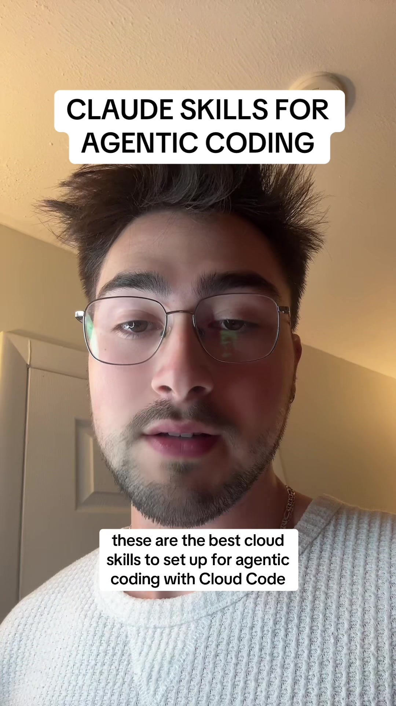

# Best Claude skills for agentic coding!

## Caption

Best Claude skills for agentic coding! A brand copywriting skill, a custom skills making skill, and a debugging skill.

## Transkript

these are the best cloud skills to set up for agentic coding with Cloud Code save for later when you're building your skills number one is a brand styling and copywriting skill since skills are essentially just a good way to dynamically load documents into context as your agent is coding it's really great to inject your exact branding and styling documents whenever the agent is coding something that has to do with your brand colours typography or copyrighting style this way Cloud Code will dynamically load your brand copyrighting voice and your style guide whenever it's writing relevant U I component number two is my favourite and it's the custom skill generating skill this skill will be loaded whenever Claude recognises a repeatable pattern in your coding style while you're going back and forth with it in the chat this way Claude will recognise patterns in its own development or in its interactions with you in the chat and it will abstract those out to their own skills for more efficient development in the future No.3 is a debugging skill this skill will firstly contain how to run all of your unit tests in your project to run the testing suite it will also include a debug document that can keep track of all of your bugs in lastly it will include all the s O P s of how to treat back end versus front end bugs and all the tools it has available to do so
