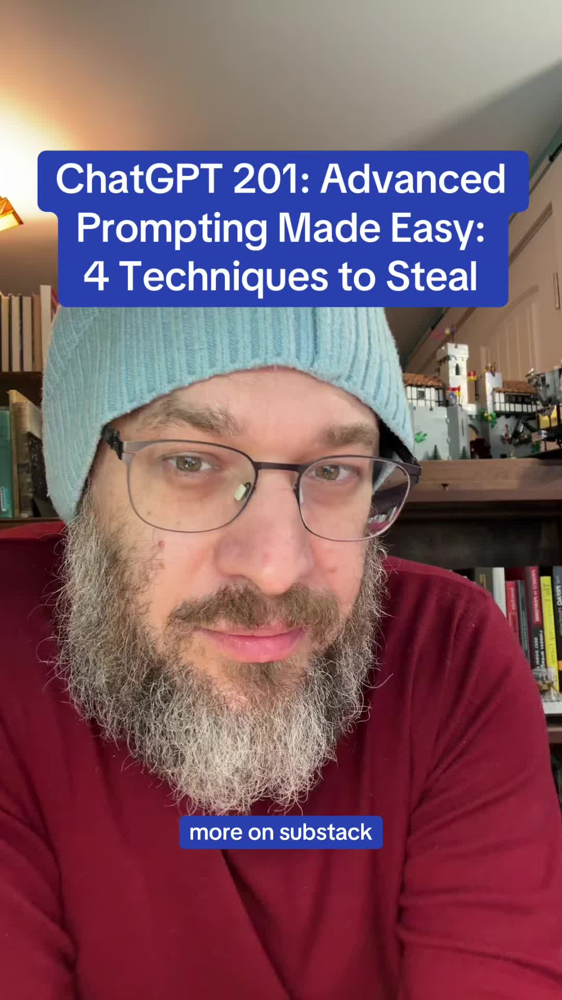

# Here’s how I teach master prompting

## Transkript

What goes on inside the mind of a master A I. Prompter? I wanna give you four different mental models or shifts that you can make. These operate above the level of the prompt, and so they help you think differently and that helps you prompt differently.

Number one, think about self correction systems. So a self correction system is a way of prompting that pushes the A I. To correct its own work. A classic example is chain of verification,

where inside the prompt, you actually ask that the L L M. Check its work for specific things that you care about during the execution of the prompt before it comes back and provides you with a result. Now, there's other ways to do this too. There's adversarial prompting techniques, etc. But this is a simple example to give you the idea that you essentially, you want to make sure that you are asking the A I. Where it's relevant to validate and self correct.

Another one that's really critical that master prompters have in their heads is meta prompting. I've talked about meta prompting a little bit. There's a bunch of different ways to do this too. But the core idea is that you ask the A I. To help you with the prompting. So if you are trying to do a task, for example, you can very simply take the defined finish point of that task. Uh, let's say it's a worksheet, right? You can upload the Worksheet and say this is what done looks like. These are the inputs that I have. Write a prompt that connects the two and it will do that. It will write the prompt for you. You can even define what kinds of things are important to you that the prompt should mention. Maybe you wanna define consistency of tone or clarity or whatever it is. But you can get the L M. To prompt for you, and that's something that advanced promptors know how to do.

The third thing that I would wanna call out is reasoning scaffolding. This is something that I think has fallen out of favour a little bit because people misunderstand what reasoning models can do.

Reasoning models are really, really good at doing their own reasoning, but they still need perspective and guidance from you. And that's what master prompters bring to the table. And so if you are trying to prompt and you give the model a sequence of blanks to fill in in a reasoning chain, you can harness all of that power for reasoning

and you can still get exactly what you want in sequence. Now, that's not the only way to do it. There's other techniques as well. But I find that that kind of forced sequencing is really helpful for, as an example, debugging. Right. If you wanna understand where the bug is in a particular piece of software, if you wanna understand the root cause of an issue that You face or an incident,

anything that requires a chain of logical thinking. If you define the labels in sequence for that chain of logical thinking, you are effectively taking advantage of the A I's inclination to be helpful, and it will work through that logical sequence. And so it's a way of managing that reasoning without doing something silly with a thinking model, like saying, you know, I want you to reason because they do. Right? Like, thinking models just do that, and that's not actually super helpful.

The fourth thing I wanna call out is perspective engineering. It's another technique that master prompters call sort of use on a regular basis.

A perspective engineer shifts the point of view of the model in ways that are useful to the prompter. One example of this is, let's say you're trying to game out an interview that you're having for a job.

You can actually game out an entire loop interview with multiple characters interviewing you. And you can give them each goals. You can give them conflicting goals, aligned goals. You can give them a a background. You can basically write a character study and then tell the A I. To play each of those characters as you get interviewed. That's not the only way or reason to use it. But having the ability to invoke multiple perspectives from A I. Is something that master prompters know how to do when needed.

If you are interested in learning more,

I've put together a full guide on this. It's called CHAT G P T. 2:01, and it's on the sub stack. It has copy paste prompts and templates and all of that. Uh, but more than anything,

take away the idea that there are mental model shifts you can make, like the ones I've described, that are very simple, seemingly, but that unlock a tremendous amount of power. These. These prompts, if properly engineered, if you take into account these principles,

they can take the exact same model and 10 x your output. And it's very rare for us to have tools that are that sensitive to your inputs. But A I. Is. And that's why it's important to talk about stuff like this. So this is your mini preview to CHAT G P T. 2:01. I hope it's been fun.
