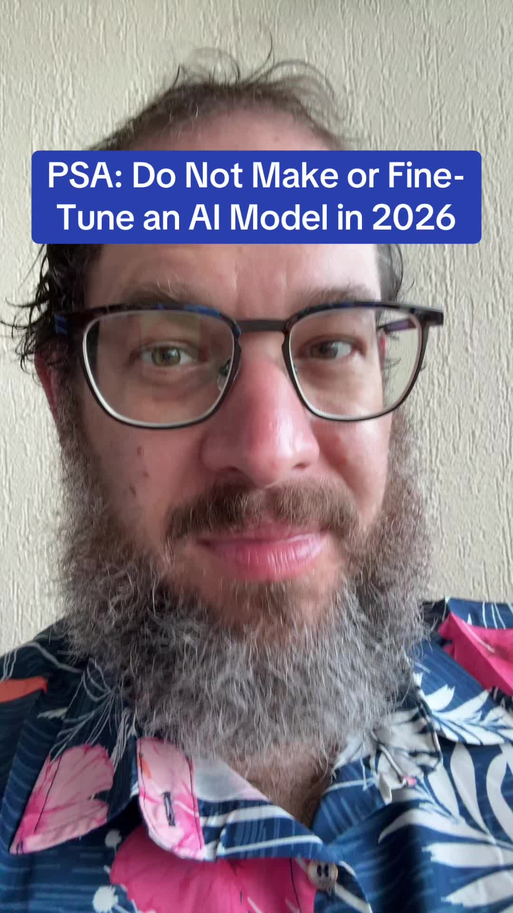

# Seriously not worth it now

## Transkript

The lesson of 2026 is do not waste time fine tuning a model. Do not waste time building your own model. Whatever you think you need to fine tune an A I. Model for, you can get just as easily with an agentic harness that works. If you are wasting a dozen weeks or eight weeks, or 10 weeks fine tuning a model, you are gonna miss an entire generation of model development, and your poor little fine tuned model will be left stranded on the shore of A I. Progress. It just does not pay people. And yet. And yet I continue to have people sometimes just crawling into my inbox saying, I really need to fine tune this. Can you give me your perspective on fine tuning? No, please don't fine tune. Do not. Do not expect to need to change the model. The model is smart enough to do whatever you want it to do if you give it proper instructions, proper constraints, proper guide rails Guide rails, proper evaluations.

Basically a good agentic harness that points it in the direction you want it to go. There is no other substitute. Fine tuning is dead. Please don't bring it up. And I. I say that because a surprising number of people, sometimes with no other technical skills, want to find tune. And I understand the desire, because you want the model to do what you want, that. That's fine. There are lots of ways to get the Model to do what you want. Fine tuning is like the last resort. And because the pace of model development is accelerating, it is getting more and more the last resort.

We have seen already tens of millions of dollars, probably hundreds of millions of dollars go to waste on fine tuning in the last year across the corporate world as a whole.

don't waste your time. Just don't do it. So that, I guess that's my P S A. For you. There are things to not do in 2026, now that A I. Models are moving faster, and one of them is do not fine tune your model.
