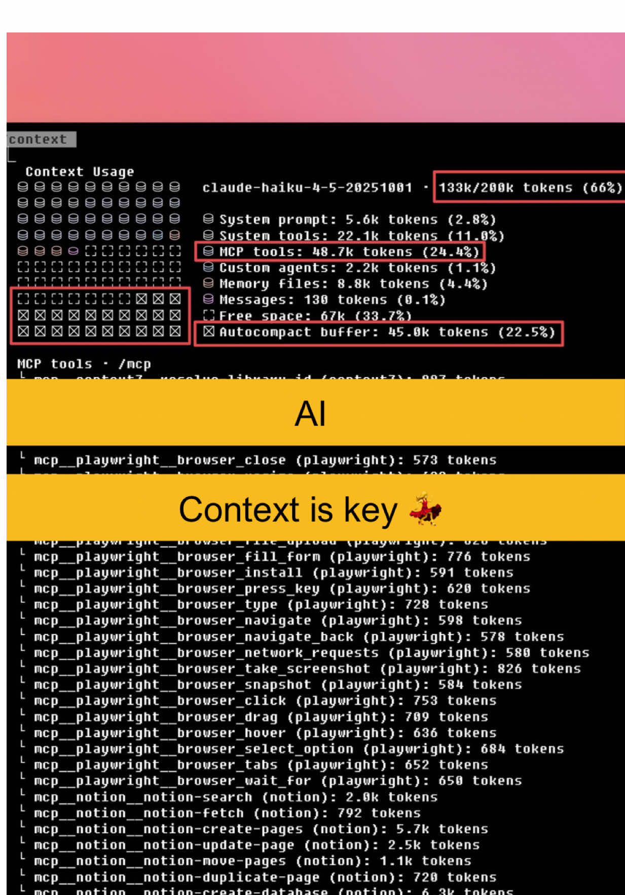

# It's not easy but it is simple 👾 Kontext-Nutzung in Claude Code entscheidet …

## Caption

It's not easy but it is simple 👾 Kontext-Nutzung in Claude Code entscheidet oft darüber ob dein Agent wirklich produktiv ist oder nur Halluzinationen produziert, Best Practice ist deshalb Kontext klein aber präzise zu halten also nur Dateien, Snippets und Ziele einzuspeisen die für den aktuellen Task relevant sind, große Repos lieber iterativ erschließen statt alles auf einmal, klare Task-Prompts mit Erwartung Output Format und Randbedingungen sparen Token und Fehlversuche, außerdem Kontext regelmäßig „resetten“ wenn sich Ziel oder Codebasis stark ändert damit alte Annahmen nicht weiterwirken, und Logs oder temporäre Debug-Artefakte nie dauerhaft im Kontext lassen weil sie Signal-zu-Rauschen Verhältnis massiv verschlechtern.

## Transkript

es gibt eine Sache die checken erstaunlich wenig Leute bei der Verwendung von Cloud Code und anderen KI gestützen programmiertools.

und das ist die generelle Gleichung. je länger der Kontext ist, desto schlechter ist die

Performance des Models, dass du bekommst.

und das ist tatsächlich keine kleine Auswirkung, sondern wie ihr an dem Grafen hier oben seht geht es rapide bergab je länger der Kontext ist.

das bedeutet für dich in der Praxis, wenn du zu viele mcps geladen hast,

dann hat jeder dieser mcps mehrere Tools die er verwendet kann. all diese Tools haben eine Beschreibung von sagen wir mal 500 Tokens und das liegt alles am Anfang in deinem Kontext.

du hast also wenn du zu viele mcps hast, die du nich jede Session brauchst, einfach schon mal sehr viel deines kontextes verschwendet.

wenn du automatisieren möchtest und möchtest, dass der Agent mehrere Aufgaben hintereinander ausführt, dann benutzt du nicht eine Session in die du ne riesige Liste an Aufgaben mit reingibst, sondern du schreibst dir nen kleines Bash Script mit ner Loop und sagst dem Agent er soll in der Liste mit Aufgaben immer abhaken welche Liste er erledigt hat. dann eine neue Session mit nem neuen Kontext starten.

und das letzte is eigentlich das aller aller Wichtigste

arbeite in Phasen. es gibt ne Research Phase, da legst du fest wie und was implementiert werden sollte und dann nimmst du n neuen Kontext in der implementierungsphase und setzt das ganze eben mit frischem Kontext um.

Fragen gerne. in die Kommentare, hoffe das hilft.
