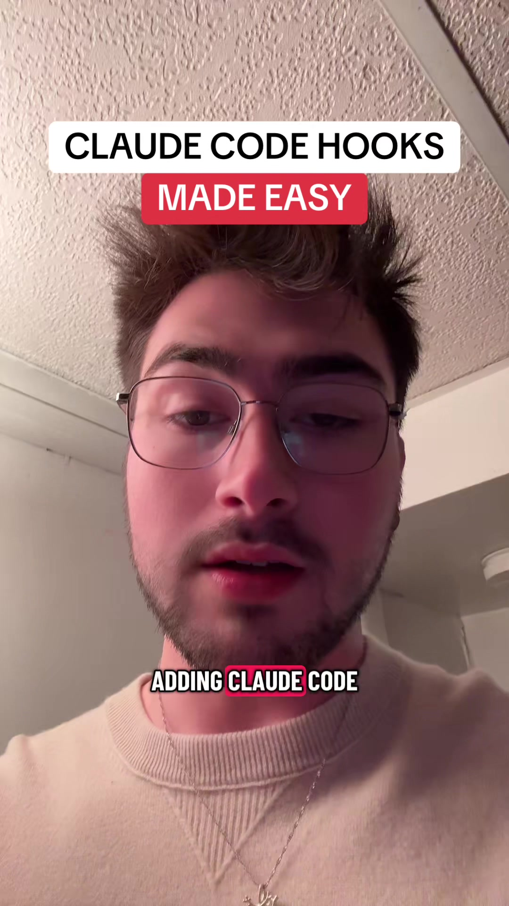

# Use the hookify plugin to spin up Claude code hooks easily on the fly!

## Transkript

If you're still adding Claude code hooks manually to the settings.json file, you're missing out on a much easier way to spin up hooks on the fly. Save this video for later and follow for more codec tips. So if you don't know, Claude code hooks are essentially a way to trigger a script based on a certain event that happens when Claude code is working. So maybe it's a pre tool use hook that gets triggered right before Claude code triggers a tool use? Or a pre compact hook that gets triggered before claude code compacts its context window. In my opinion, hooks are a very useful feature and are very under utilised in most people's workflows. And part of this is because sometimes it's hard to understand how hooks work and it's hard to implement them correctly. To help out with spinning up hooks on the fly to work with whatever workflow or project that you're working in at any given time, you can add the hookify plugin from the plugin marketplace. It basically gives Claude Code a set of skills and knowledge to allow it to configure hooks in a more accurate way that work on the first time you configured it, rather than having to iterate and test the hook to make sure it works correctly over and over. If you're interested in learning more about how Claude Code works, or how power users of Claude Code are really getting the most out of the tool I Host a school community that is friendly for beginners and advanced users that can teach you pretty much anything that you wanna know about Claude Code. And we would love to see you there. The link is in my bio.
