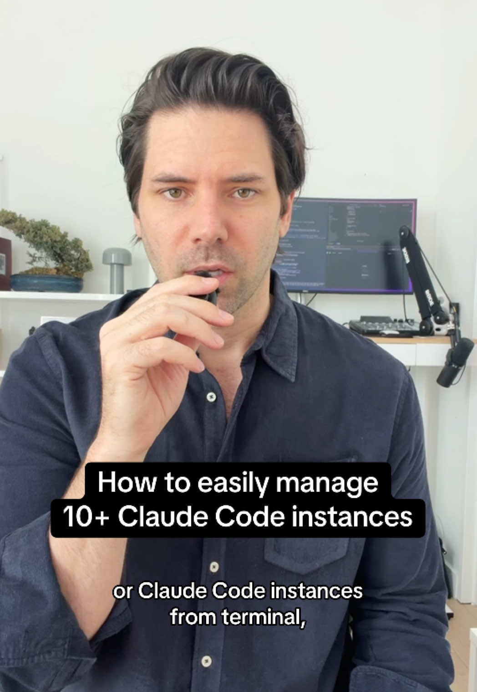

# Never use Terminal again…

## Transkript

If you're trying to orchestrate multiple Codex or Claude Code instances from terminal, you're wasting a ton of time. I'm gonna show you the tool I switched to and why I'll never go back. I'm Pete. I own a software development agency in New York City. We work with startups and Fortune 500 companies to bring their products to market. So like a month ago someone left a comment asking how I manage all my agents running at once. As you can see from the screenshot, I was pumped because I've been building something myself to solve this problem. I was calling it Mission Control. It's a bird's eye view of all my terminals across all my projects. Their question felt like validation and I was about to actually build it out. But then I did a quick search and found like a dozen tools better than what I had. Some of those tools include tmux, cmux, conductor, zellij. There's really so many now, but I decided to go with cmux and here's why. First, it's a completely separate native Mac app built on ghostty. It's fast, it's lightweight, and it was designed from the ground up for AI coding agents. Second, the sidebar gives you a birds eye view of everything. All of your workspaces are stacked on the left with vertical tabs. Each tab shows the Git branch, the working directory, listening ports, and the last notification text. So at a glance you know exactly what's happening across every agent. Third the notification system. If you saw my video a few months ago, I built custom hooks to get notifications working with claude code. It's a decent solution, but it kind of felt like duct tape. cmux has all that built in, so when an agent finishes or needs your input, the pane gets a blue ring, the tab lights up, and you get a Mac OS desktop notification. Also, Command Shift U jumps you straight to the most recent unread notification, which is really useful. I'm posting a full rundown on Substack tonight at *8 PM Eastern* breaking down exactly how I use cmux. The article's free, there's a link in my bio.
