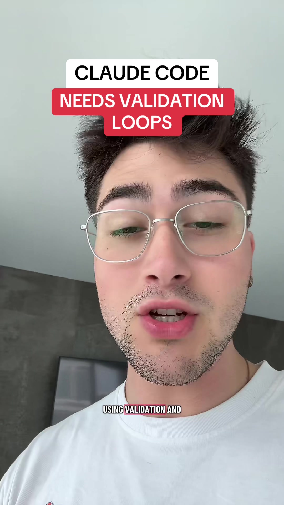

# If you’re using coding agents, you need to be using validation and testing …

## Caption

If you’re using coding agents, you need to be using validation and testing loops to allow them to iterate until they’ve actually achieved the goal you set them out to do. .

## Transkript

If you're not using validation and testing loops with A I. Agents, your outputs could be so much better. The reason for this is that L L m's, when you give them a prompt, will often think for a while, come up with a solution to your problem, spit out that solution, and assume that the work is done. The best way for you to automate the process of giving your agent the ability to check its own work and iterate until it actually achieves the goal that you wanted to achieve is validation and testing loops. Do this correctly. For any task that you set your agent out to do, there has to be a deterministic, quantifiable output. This allows your agent to engage in a validation and testing loop so that when it actually tries to solve a problem that you give to it, it can run a deterministic test to see an output to see did I actually achieve what my prompter asked me to do? Or do I still need to continually iterate and validate until it's complete? This works for coding task, but it works for any task that you can assign a quantitative deterministic output to. Now instead of going back and forth, re prompting and re prompting, whenever your agent output something that's not quite satisfactory, you just give the initial prompt and the validation criteria and your agent can loop on that until it's satisfied you. If you wanna learn more about The techniques to use to get these agents to autonomously complete work, that is actually what you have asked it for. I host a full autonomous development framework in my school community, as well as a full code code fundamentals video course. The link is in my bio if you're interested. And we would love to see you there.
