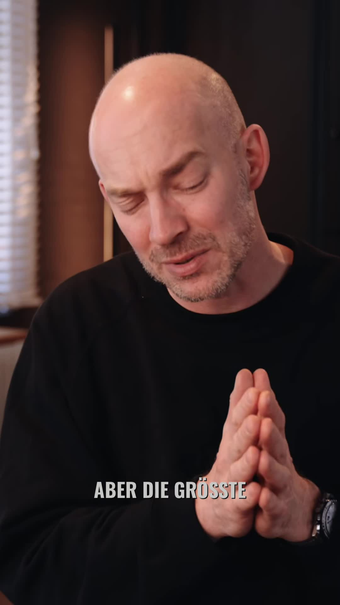

# KI-Agenten weichen ab?

## Caption

KI-Agenten weichen ab? Das ist Agent Drift. Erfahre, wie man das Problem löst und was die Zukunft von KI-Systemen bringt.

## Transkript

die größte Schwierigkeit ist etwas nennt sich Agent Drift. das bedeutet ihr gebt dem Agent eine Aufgabe und ohne dass ihr es merkt verlässt er auch der Agent durch das den Spinner von von Sub Agents oder das äh launchen von Tools nach und nach das alignment zu der eigentlichen Aufgabe die er hatte. und dieses Problem, das ist ganz schwer transparent zu machen. ihr könnt euch so vorstellen, wenn ihr in chatgpt

angefangen habt mit dem Thinking Modus, mit dem denkmodus zu arbeiten, konnte man sehen was macht das large Language Model gerade. aber diese denkschritte sind manchmal total wirf. also es gibt da abstruseste Beispiele, dass auch chatgpt schreibt, ich nehme gerade einen Bart und dieser Drift den transparent zu machen wirklich nich einfach und die Lösung liegt ja auch nich daran das einfach nur sichtbar zu machen, sondern an der richtigen Stelle dafür zu sorgen, dass es nicht passiert. und das ist noch überhaupt nicht richtig adressiert. das heißt es kann passieren, dass einfach sehr viel Geld ausgegeben wird. bei Open close ist häufig passiert und man es in die falsche Richtung gesteuert hat und das versuchen natürlich einige damit zu lösen. und das ist ja das geniale an einem solchen System wo man sagen kann, hey ich hab ja aber ne ne Hierarchie, ich hab 1 CEO und dann hab ich 1 fachagin, 1 fachexperten und jetz sagt der eine das is Quatsch und is celosa. wir machen's trotzdem. und hier kommt genau das Problem, die. policies dafür, wie das passieren soll. die Entscheidung, die legt ihr ja fest am Anfang oder ihr überlasst es komplett den Agents, aber dann seid eben auch in den Händen des large Language Models, was das entscheidet. was ich sage is, es ist spannend zu beobachten. das halte ich für spannender zu beobachten, wie arbeiten diese Agents zusammen, um genau dafür das richtige Tool zu designen. das ist die Phase der wir gerade sind. ich würde sagen, wir sind eher noch auf dem Weg hin zu einem echten Agent Betriebssystem oder einem agentik Betriebssystem und können das grade alle zusammen mitbekommen teilen,

experimentieren, ausprobieren.
