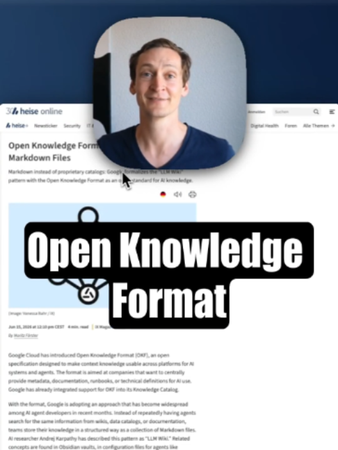

# Google liefert mit dem Open Knowledge Format eine (neue) Antwort, wie wir …

## Caption

Google liefert mit dem Open Knowledge Format eine (neue) Antwort, wie wir Wissen am besten für die KI strukturieren. Eine Art Kombination aus HTML und Markdown und damit ähnlich zum Obsidian-Ansatz, und auch wie Skills aktuell aufgebaut sind.

## Transkript

nach dieser neuen Logik sollten Firmen ihr wissen intern strukturieren um optimal mit ner KI zusammenzuarbeiten zumindest wenns nach äh Google geht sie haben hier das Open Knowledge Format veröffentlicht und wir haben in den letzten Monaten viel sag ich mal diskutiert äh is jetz markdown das richtige is jetz HTML das richtige und Google kommt jetz hier mit diesem Open Knowledge Format was quasi ne Kombination Aus beidem is würd ich jetzt mal so beschreiben und zwar hat sie so HTML Charakter es gibt also oberordner Unterordner Dateien die da drin liegen die dann untereinander sich verlinken können wie referenzieren können wie so n Wikipedia kann man sagen

sehr stark irgendwie von HTML ähm angelehnt

aber auch es gibt hier dieses ganz simple markdown Format in dem dann die Dateien geschrieben sind mit so nem äh Dokument im Kopf ja mit den Basics wo ne KI dann hier nur noch drauf springen muss sozusagen was befindet sich in der Datei ohne jetzt alles direkt lesen zu müssen ja und diese Kombination und wir Kennen das hier schon Aus den Skill Dateien zum Beispiel von klot ähm ist genau nach derselben Logik aufgebaut man hat hier n oberordner man hat hier markdown Files die sich gegeneinander dann auch referenzieren können und wir kennen's auch zum Beispiel von obsidien

Tool wo man dann Mark down falls ähm äh Ableben kann und eben auch verlinken kann die haben das quasi selbst gebaut auf Basis von Mark down Dateien und Google sagt jetzt ja mit diesem neuen offenen Standard ähm bringen wir diese beiden Welten Mark down HTML ähm gut zusammen um möglichst für den Menschen nen Format zu haben was er leicht verstehen kann leicht bearbeiten kann aber eben auch für ne KI super einfach zu lesen uns bearbeiten is und von daher glaub ich is es spannend äh da mal n Blick drauf zu werfen auf das Open Knowledge Format
