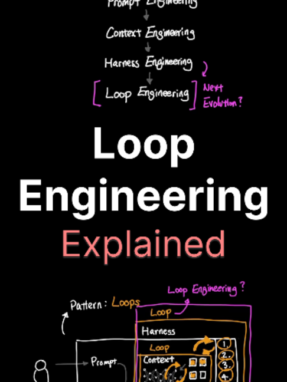

# loop engineering explained in 7 min and simplified.

## Caption

loop engineering explained in 7 min and simplified. here's how the progression of loops started to occur: - prompt engineering - context engineering (recursive tool calls) - harness engineering (task loops managing context) - loop engineering (back to square one -> prompt) how useful loop engineering really is, is yet to be proven and probably niche to certain use cases, but i could see how AI native apps could actually benefit big time from looping philosophy.

## Transkript

well here we are again with yet another term called loop engineering and it wasn't even that long ago we had harness engineering so is this just a marketing hype or is there actually something substantial behind loop engineering let's walk down from prompt engineering all the way to loop engineering to see why we needed each step of the way we we all know by now what prompt engineering is let's say I start with the prompt you are a helpful customer service rep please be nice to my customers this is prompt engineering because you are prompting the agent by implicitly telling the agent what to do and we can then ask AI any question and the agent will impersonate a customer service rep based on the prompt that we just generated that makes sense and super simple so why do we need context engineering turns out this prompt that we just created lives inside of the agent's context window and we still have a lot of room left in our context to do something more useful so what if we gave the agent autonomy to invoke tools to start filling up its own context based on what the prompt actually needs this was the beginning of context engineering where the agent could now access files to load and make changes or even use MCP to start interacting with databases and external applications to load its own context cool context engineering makes sense so then why do we need harness engineering well there's actually no inherent flaw to context engineering but rather it has limitations context engineering is not really good at tasks that take longer than five to 10 minutes long and here's why tasks that take long tend to require more context and what the agent can handle and while it could keep summarizing its own context as it approached the limit it was extremely leaky where important details started to get lost in each step of the summarization so essentially we needed a system outside of context engineering to better manage internally its own context from outside in and this very external system is what we call harness engineering harness engineering manages the context from the outside and helps the agent run time to work on tasks that help break down the user's requirement into a more stable execution let's look at a few examples to make sure that we understand this more concretely and we'll use ChatGPT and code since it's something that we all have hands on experience in asking Cha Cha p t the question how many cheeseburgers can I fit between the earth and the moon this is solely using prompt engineering because it doesn't need anything external to answer a very simple question it can just reason through what it already knows to answer my question now asking Cha Cha p t what is the latest discovery that NASA made this now has to use context engineering because it has to search the web and gather relevant information from NASA to help answer my question so context engineering helps bringing information from the web autonomously now when I ask code can you clone the entire NASA website this is all done by harness engineering because the NASA website as you can imagine is really complex and simply relying on context engineering on tasks like this will start to choke midway through so harness engineering provides an external mechanism to help manage the context and the runtime for the agent to work through a long list of tasks now you might have noticed a pattern that emerges from this and that pattern is the concept of loops for context engineering there's a loop where the agent it cursorily calls tool after tool autonomously until it thinks that it has enough context to answer your question and for harness engineering there's also a loop where the agent has a list of tasks outside of the context window keep iterating task after task until the entire operation is finished so what we find is that we are essentially stacking loop on top of another loop now we get to loop engineering which is yet another loop in itself I know is there even an end to this so loop engineering stacks another loop outside of harness engineering layer to guide the harness externally but why why do we even need yet another scaffolding again at the heart of loop engineering loop engineering targets the human interaction actually prompting the agent to do something everything that we have seen so far involves a human asking the agent questions like how many cheeseburgers can I fit between earth and the moon what is the latest news on NASA or even clone the NASA's website these are prompts that require me to actually prompt the agent but what if we built a scaffolding outside of this so that the agent can also prompt itself on what it thinks it needs to do that is the heart and the spirit of what Loop Engineering tries to target and if all of this sounds hokey pokey to you you're probably not alone there's a lot of people saying loop engineering is just a buzzword and that's trying to encourage people to just burn more tokens and create more AI slop and so far we have really yet to see loop engineering in action that really makes a huge difference but it could be the next evolution in our engineering philosophy as agents expand their scopes in what it can help us with and it does raise a really interesting debate and discussion around all of this so what exactly is loop engineering and how does all of it work Adi Osmani wrote a blog describing loop engineering with six components but we don't want to read all of this so instead of boring you with details I'm going to give you a potential use case of loop engineering that help you wrap your head around what loop engineering could look like let's say I built a website that keeps track of the World Cup scores and when I ask Codex to build me a World Cup website Codex will use prompt context and harness engineering to build this beautifully written website now there's one problem here and that problem is that the World Cup games are happening every single day and that means in order to maintain the website that I just created through Codex I have to keep prompting the agent to frequently update the site and also work on bug fixes that people might find on the website but what if I just created a scheduled task inside of Codex to check every hour for updates as new information becomes available and what if I do the same for bug fixes where the agent just checks autonomously for bugs that are reported by users and fix them what you're seeing here is that we are beginning to create this loop outside of harness engineering where it's self guided rather than human guided to maintain my website and because I have skills and plugins already installed on my Codex environment the agent can access an existing knowledge base to keep building and improving its knowledge along the way and the agent can also use subagents to verify its own work and also the ability to work on multiple fixes at the same time by using what's called work tree to prevent runtime contamination along the way all of these that I just mentioned are essential ingredients to what makes loop engineering what it is and that is the six components that Addi Osmani wrote in his blog automation worktree skills plugins and connectors subagents and state are components of loop engineering and while this World Cup website that I just created is just an example of what loop engineering could look like the true potential of what loop engineering could really be is still somewhat theoretical and one thing to keep in mind is that loop engineering doesn't necessarily mean that all the engineering philosophy underneath is less important or even less needed than before it's just agents growing in scope and building on top of each other loop stacked on another loop to help us get more complex work done
