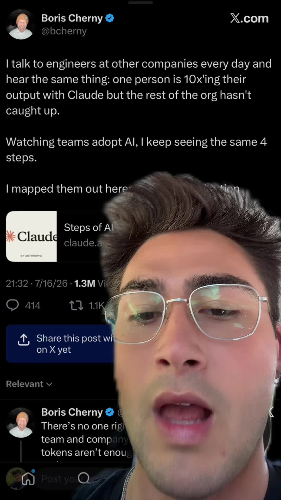

# The creator of Claude code released a guide to the 4 levels of AI coding adoption.

## Caption

The creator of Claude code released a guide to the 4 levels of AI coding adoption. You should all study it!

## Transkript

Creator of Claude Code dropped a guide to the four steps of A I adoption that you should all study. Level 1 is basically A I pair programming where you're prompting Claude to make small changes in one session and then manually reviewing those changes yourself. It's a level 2. You need to be using it in auto mode so most permissions are automatically accepted. You need to have Claude automatically doing verification, end to end testing, linting and things like that. This allows you to get to level 2 where you're running multiple sessions in parallel at the same time on different work trees. Most people that I see doing a genetic coding right now think that this is peak. Now that you have multiple agents running in parallel that are all following a certain set of skills like automatic security review and code review to make that loop more seamless. You have the beginning of an automated coding loop that then in Level 3 you actually optimise and context engineer. Get to level 3, you actually need an additional loop outside the coding loop itself to optimise the coding loop and think what context could I have provided at the beginning of this coding loop to make it even more autonomous and have more seamless outputs? Level 3 is really the process of you iterating on the mechanism of your automated coding loop to eventually gain enough trust in it to graduate to level 4. Before is where You now trust your coding loops so much that you actually trust Claude to kick off automated coding sessions of other Claude agents on its own, so you can run hundreds or thousands of agents in parallel instead of reviewing individual commits, reviewing entire features. No matter where you are on this journey, the fact that you're watching this video right now probably means you're on the right path if you want to expedite that path. This stuff is pretty much all that we talk about in my school community. The link is in my bio, and I'd love to learn agender coding with you.
