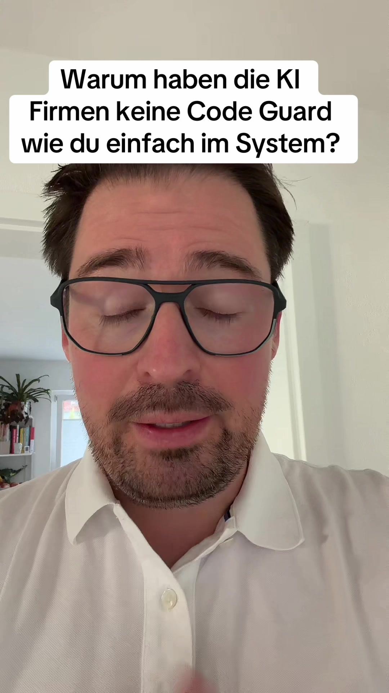

# ich hab ne unbequeme Wahrheit und zwar ich wurde gefragt wieso eigentlich die …

## Transkript

ich hab ne unbequeme Wahrheit und zwar ich wurde gefragt wieso eigentlich die KI Firmen nich ihre Code Cloud Code und Codex Systeme eigentlich das so n Code Guard wie ich jetzt gebaut hab warum die sowas nich einbauen als professionelles System dass das KI programmieren sauber macht ähm Fehler findet

und ähm sich selbst korrigiert

ich glaube dass die das absichtlich nich machen weil technisch könnten sie es wenn ich das in mehreren Wochen äh live Projekten programmieren könnte die haben das auch bei sich hundertprozentig drin

aber ich glaube die machen das absichtlich nich und zwar weil die Illusion eines super programmierenden Systems damit aufgehoben wäre

weil Mein Code Guard korrigiert fast bei jeder Ausgabe ey eislop korrigiert Fehler vereinfach den Code ähm

fix Probleme die das die das is L L M erzeugt also wir haben quasi ständig Korrekturen und vorm diploment läuft noch mal Testing durch und da findet er auch noch mal was das heißt die Wahrheit ist selbst die neuesten Modelle wie Fabel Five

ähm machen Probleme die die KI Modelle nicht lösen und ähm die die Illusion die man erschafft ist wenn der Entwickler sich gegen viel Geld das zahlt er nämlich ja selber so n System baut hat das Gefühl von Produktivität und äh man lässt ihm die Illusion dass er die Kontrolle behält die Wahrheit ist die L L M's schaffen keine Kontrolle die entkoppeln einen von der Kontrolle und egal wie gut die Gates sind man muss extrem nacharbeiten und Mein äh Quality Gate hat extrem viele deterministische

statische Code analysesysteme die ständig Fehler finden

und äh wir korrigieren eigentlich immer immer zu wir sind immer am korrigieren den Code

äh das heißt nicht dass wir deshalb unproduktiver werden mehrere 100.000 Zahlen Code und riesige Business logiken bauen wir in wenigen Tagen ähm aber die Illusion dass es alles von alleine geht und dass die Kais das super machen die ist einfach falsch äh besonders die Illusion ist da es ist nur ne Illusion die Wahrheit ist man muss extrem gegensteuern wenn die KI Modelle das machen würden dann wär's nämlich so wie bei Mir ich Mach ne kleine Änderung und dann dauert es ne halbe Stunde bis es durch Mein deploment durchgeht und durchhört Mein äh Mein Quality Geld

und äh dann is es halt nich mehr so cool äh Vibe Coding is halt geil wenn man was eingibt und 10 Sekunden später kommt was raus bei Mir geb ich was 1 und erst ne Stunde halbe Stunde Stunde später seh ich die nach Allen validierungen die Ergebnisse der Code ist da dann sauber die äh Bugs sind alle draußen der Air eislop ist draußen aber äh das ganze Ding war halt nicht schnell cool und smooth wie man's gern hat ähm und ich glaube es würde den 99 Prozent den Leuten keinen Spaß machen ich Mach das hauptberuflich

deshalb ist Mir das egal OB das ne Stunde dauert Hauptsache die Qualität passt ich arbeite immer mit den größten Modellen für die richtige Aufgabe

Fable Five für die Planung Opus 5 jetzt für die Umsetzung ähm und am Ende des Tages hab ich trotzdem noch Probleme damit die codequalität auf nem hohen Niveau zu halten und sobald ihr mal ne Anwendung baut die mehr als irgendwie 10.000 20.000 seinen Code hat die ne Komplexe businesslogik hat ähm wo ihr auch businesslogik ähm

dokumentieren müsst ihr braucht Gates die vorher ähm die businesslogik noch mal validieren die nachher noch mal prüfen sogenannte Impact Analysen ähm und dann guckt OB überhaupt die

businesslogik aufrechterhalten bleibt ähm ähm

also quasi auch businesslogik Drifts wo man sieht okay da passt die Logik sich jetzt an äh das muss weiter dokumentiert werden die Dokumentation muss fortgeschrieben werden bestehende testsysteme unitests und ähm andere systemtests werden

also businesslogiktests werden auch angepasst das dauert Stunden um Stunden also wir wir bauen wenn wir mal nen Update in der Maske machen braucht es 1/2 Stunden und wie gesagt diese Illusion die die L L M's machen von ich geb da ne Änderung 1 und dann ist die Änderung sofort da die Illusion die verkaufen die im Augenblick ähm ob's jetzt 1 Tropic oder Open AI ist egal ähm und die Illusion ist einfach falsch und ihr das das merkt jeder der professionell damit arbeitet ähm die Leute die halt hobbyprojekte machen die merken's halt erst wenn's dann ihre Plattform oder ihr Projekt knallt deshalb genauso wenig wirklich echte KI Systeme an Markt also Software die von KI gebaut wurde also kleine Tools ja kleine Games okay aber so richtig professionelle Software ähm da arbeiten Teams äh heute mit sehr sehr komplexen Quality Gates

so wie ich das jetzt auch 1 gebaut hab über den letzten Monate und ähm da ist die Entwicklung einfach viel viel langsamer und schwieriger und ähm da macht's auch nicht so viel Spaß muss man einfach sagen das so meine Erkenntnis und schreibt Mir mal wie ihr das so seht
