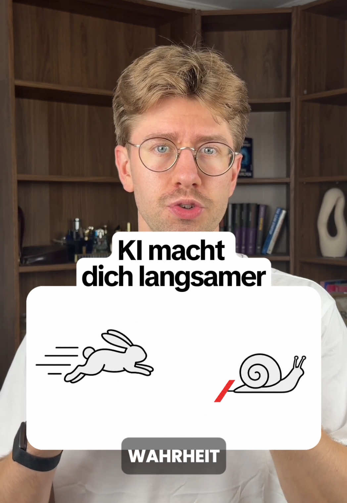

# KI gibt dir das Gefühl, dass du so schnell wie noch nie arbeitest.

## Caption

KI gibt dir das Gefühl, dass du so schnell wie noch nie arbeitest. In Wahrheit bist du häufig langsamer, ohne dass du es merkst. Zwölf der sechzehn Entwickler wurden langsamer. Vorher erwarteten sie 24 Prozent Beschleunigung, hinterher fühlten sie noch 20 Prozent, gemessen waren es 19 Prozent mehr Zeit. Was messbar wirkt, ist Treffsicherheit. Die richtige Information hebt die Erfolgsrate von 26 auf 34 Prozent, die falsche senkt sie auf 22 Prozent, also unter den Wert ohne jeden Kontext. Die drei Stellen. Regeln in `CLAUDE.md`, Skills in `.claude/skills/<name>/SKILL.md`, ein Wissenssystem Quellen. arxiv.org/abs/2507.09089 und arxiv.org/abs/2602.08316

## Transkript

> ⚠️ **Rückübersetzung, nicht der Originalton.** TikTok hat statt der Originalspur eine maschinell nach *en* übersetzte Fassung geliefert (Caption ist *de*). Für Zitate die Caption nutzen oder mit `--refetch` einen neuen Abruf versuchen.

AI gives you the feeling that you can work faster than ever before but in reality you are often slower without you noticing I program with clot code for example because I think that it goes faster and better but if I now like my coding Agent not quite specify how he has to behave then I get results in the end with whom I am simply not satisfied then I correct step by step and exactly that costs time the institute tenant has it at 16 experienced developers in their own project remeasured and that they sometimes lose time despite kain use none of them has noticed I am Florian with me you learn everything about artificial intelligence follows me so gladly if you are interested in the topic before logically the developers thought the AI saves them time in truth but they have taken 19 percent longer and have nevertheless felt faster afterwards and at the slowest they were even calculated in the projects they knew best the 5 years project knowledge are usually only in their head and with the agent simply too few of them arrive 1 Agent naturally understands the connections but only if he has the right information most of the time he has them but can not control them you can but in 3 places 1tens rules this is the briefing what Claude needs so that he knows exactly how it should behave in your project so for example that he performs a test after each change 2tens Skills these are additional skills that he usually does not have so for example how he has to formulate your mail 3rd 1 knowledge system or also connectors that's where your project knowledge then lies in one place where the agent can look up when he no longer knows something but don't always rely on everything to matter of a long session for example, your rules can be lost in the mass and n Tropic recommends in the meantime namely even superfluous Descriptions Delete from the rule files for your productivity with But AI is your own responsibility there is no general solution because every project is different so you have to make sure for your agents your Working environment fully set up and also maintain them again and again and remember especially 1 with AI you become more productive right there where you know your way around best
