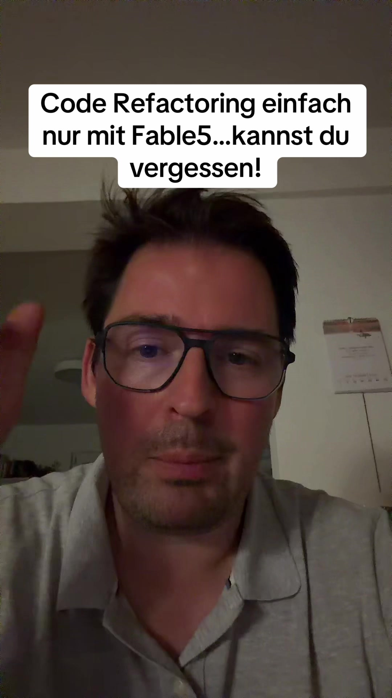

# wenn ihr versucht euer Software Projekt mit Fable Five oder O plus 5 einfach …

## Transkript

wenn ihr versucht euer Software Projekt mit Fable Five oder O plus 5 einfach nur zu refactern das heißt ihr habt jetzt irgend n Tool das habt ihr vor n paar Monaten mal mit AI hingesloppt und ihr versucht es zu refactern vergesst's einfach vergessts ihr könnt nicht Fable Five sagen oder O plus 5 refactor mindcode und dann kommt dabei was raus was funktioniert es wird wahrscheinlich

alles kaputt machen

is leider so da müsst ihr Anders angehen ihr müsst euch überlegen mit welchen Tools kann ich arbeiten um überhaupt tetermistisch klar nachzuvollziehen was falsches und richtig is

müsst Regeln aufstellen und ihr gesagt könntet zwar sagen wieder ich sagt der KI sie soll Skills bauen aber es hilft euch nich ihr müsst euch überlegen was sind überhaupt Dinge an denen sich die KI orientieren kann was sind Dinge die dann konkret immer falsch laufen

und da haben wir ganz ganz viele Themen die ihr in der im Alltag wenn ihr sehr viel Erfahrung habt einfach mitnehmt mittlerweile ihr braucht staatische codeanalyse ihr braucht Regeln nach denen die KI prüfen kann was richtig und was falsch is

und die KI prüft es nich im Sinne von dass sie das jedes mal Abgleich sondern sie kann Tools nutzen die Code euren Code abgleichen und dann zum Beispiel Sachen finden ja ähnliche funktionsnamen ja im Code der verweist ist also kaputte Funktionen

ähm datenbankabfragen die unvollständig sind ähm Datenbank äh logiken die vielleicht irgendwelche Tabellen

ansprechen die gar nicht mehr da sind oder die Anders heißen ähm variablen die einfach angelegt wurden und nicht genutzt werden das lässt sich alles mit statische Code Analysen äh fixen und wenn das mal fertig und ihr so den 10 Prozent eures Codes gelöscht habt weil er gar nie funktioniert hat oder auch nie wirklich da war um irgendwas sinnvolles zu tun sondern einfach nur irgendwie sich selbst referenziert habt

erst dann kann die KI wirklich logisch durch den Code durchsteigen weil sie dann auch in der Lage is

Funktionen und Abhängigkeiten richtig zu erkennen ähm kann ich also nur empfehlen äh erstmal statische Code Analyse drüber laufen lassen

ganz klares Framework und dann mit den sprechenden Skills gucken was sind die wichtigsten Regeln was für Prinzipien soll Mein Code haben ja grad was Klassen angeht vererbungen funktionsaufrufe was soll da genau wie geregelt sein und hierfür gibt's auch ähm best practices wie Code aufgebaut sein muss lasst gern eure KI Modelle erst mal 1 Plan entwerfen was is n guter Code ähm grad Model View Control

habt ihr n Framework habt ihr kein Framework

oder macht das Sinn vielleicht euer Modell von euer Projekt von vorne rein neu aufzusetzen mit dem wissen was ich hier zum Beispiel in diesem Kanal lernt also folgt Mir gern mehr für mehr Informationen zum Thema

Softwareentwicklung mit KI
