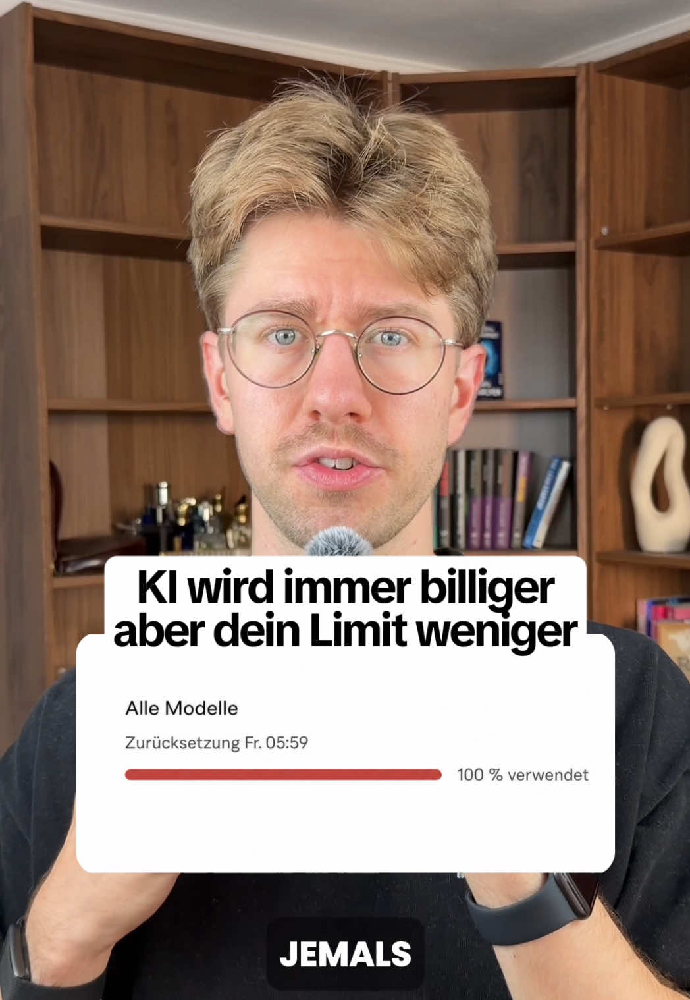

# Die Preise für KI fallen wirklich, und trotzdem ist dein Limit genauso schnell weg wie vorher.

## Caption

Die Preise für KI fallen wirklich, und trotzdem ist dein Limit genauso schnell weg wie vorher. Der Preis für das jeweils stärkste Modell bleibt dabei stehen. Anthropics Opus-Stufe kostet über fünf Generationen unverändert 5 und 25 Dollar je Million Token, GPT-5.2 kostet heute noch genau die 1,75 und 14 Dollar von seinem Releasetag. Billiger wird ein festgehaltenes Können. GPT-5.6 Luna kostet seit Ende Juli 0,20 und 1,20 Dollar und löst im gleichen Codex-Harness 75,7 Prozent der Terminal-Bench-Aufgaben, wo GPT-5.2 auf 62,9 Prozent kam. Sparen würde also, wer beim nächsten Modell freiwillig das kleinere nimmt. Das macht keiner. Dazu steigt der Verbrauch aus fünf Richtungen. Die Kontextfenster halten inzwischen eine Million Token, dadurch läuft eine Sitzung viel länger und zieht laut Kostendokumentation bei jeder Frage Verbrauch für den kompletten Verlauf. Die Chain of Thought wird als Ausgabe abgerechnet, und Ausgabe kostet bei Sonnet 15 statt 3 Dollar. Der Tokenizer ab Claude 4.7 macht rund dreißig Prozent mehr Token aus demselben Text. Subagents starten jeder mit eigenem System-Prompt und denselben Connectoren. Und Agenten laufen inzwischen ein bis zwei Tage am Stück. In welcher Einheit dein Limit zählt, sagt Anthropic für Pro und Max nirgends. Vier Fragen vor jedem Start. Brauche ich diese Denkstufe? Muss dieser Connector dauerhaft im Kontext liegen? Reicht der Hauptagent? Führe ich die Sitzung weiter oder starte ich neu? Quellen sind code.claude.com/docs/en/costs, support.claude.com/en/articles/11647753, platform.claude.com/docs/en/about-claude/models/overview und tbench.ai

## Transkript

> ⚠️ **Rückübersetzung, nicht der Originalton.** TikTok hat statt der Originalspur eine maschinell nach *en* übersetzte Fassung geliefert (Caption ist *de*). Für Zitate die Caption nutzen oder mit `--refetch` einen neuen Abruf versuchen.

AI is becoming cheaper and cheaper but the limit is still gone faster than ever before and cheaper it really gets openmei has the price for gpt 5 point 6 Luna down 80 percent last week Luna is the smallest model in the new series and yet it is measured against the benchmax at the same level as gpt 5 point 2 the best model From December and costs the best model from back then today with the same intelligence round only 1 10. But you notice relatively little about it. because your limit counts Token so the building blocks into the AI disassembles your text and for the same task of back then you need significantly more of it today hi I am Florian with me you learn everything about artificial intelligence follows me so gladly if you are interested in the topic what drives the tokens up the most is the length of your session the latest AI models now have 1 context windows from a 1,000,000 token and the longer your session runs the more progress is sent with each prom and in addition comes thinking the higher you create the longer the chain of thought so the chain of denkschritten before the answer because it is settled in output tokens because output Tokens sometimes cost up to five times the input tokens the 3rd point is the tokenizer who cuts your text accordingly into tokens Brian Tropic he makes since opus 4 point 7 From the same text 30 percent more tokens and each subagent holds the context of your main agent free but starts with systemprompt and All MCP connectors with already approximately 50,000 tokens around your usage limit after this video again a little lower to hold best ask yourself the following 4 questions 1tens you must Agent now really think so much or is a smaller level of thought sufficient 2nd this connector must really be permanently in context 3rd is perhaps also sufficient for this task and 4th the classic maybe I should start a new session you would save effectively probably only when you release the next model take the smaller but no one does that because we always want to have the best intelligence and that is precisely why AI models are becoming increasingly affordable but your Usage Limit empty faster and faster
