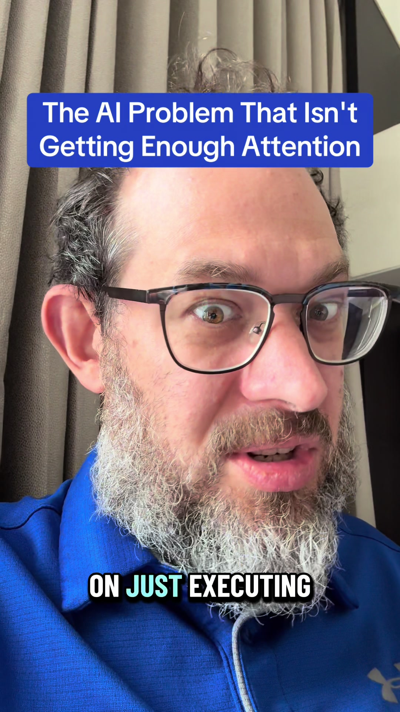

# Decision exhaustion is real. Discuss.

## Transkript

I don't see people discussing this, but AI is inducing a kind of exhaustion that's new. And no, I don't mean like general AI exhaustion. Tired of hearing about AI. I know that's there too. I mean decision exhaustion. I mean that when AI is good at taking care of all of the little details in the work that you're doing, the only thing left is for you to do the hard decisions, for you to do the trade offs, for you to do the difficult thinking. And if you're doing that, you can't really cram that into the same 40 hour a week mindset as you did when you were doing all of the work. And so we find at least a. A lot of folks I know in AI are finding that there's a new kind of rest and rhythm that we have to have where you have to be willing to give yourself breaks to reset so that your brain can be sharp enough to make the hard decisions. And yes, sometimes that looks like, you know, going out and touching grass, taking some extra sleep, whatever it is,

and is actually very practical, because otherwise you're not gonna be able to make the kind of high quality decisions you need to make there. There are no sort of mental rest periods while you're focused on just executing work anymore. If you're using AI, all the decisions that come back to you are kinda consequential. You have To think them through, you have to be thoughtful. You have to actually debate the trade offs.

There's no light and easy decisions. And so I think this implies a new kind of work and rest rhythm. I don't think we figured it out. I would be curious for your thoughts. Have you experienced this? If you have, what. What do you think the right solution is? Uh, do you think that we need to figure out how to rest more? Uh, yeah. Let me know in the comments. Cheers.
