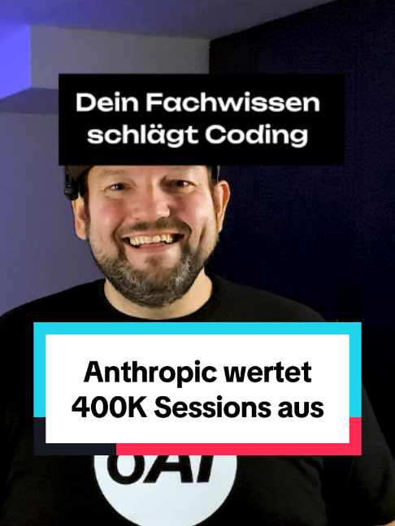

# Du brauchst keinen Entwickler, um mit KI etwas zu bauen.

## Caption

Du brauchst keinen Entwickler, um mit KI etwas zu bauen. Anthropic hat 400.000 Sessions mit Claude Code ausgewertet und dabei kam heraus, dass Software-Entwickler auf 30 Prozent voll erfolgreiche Sessions kommen und alle anderen Berufe auf 29 Prozent. Was den Unterschied macht ist dein Fachwissen. Bei Leuten mit Erfahrung in ihrem Bereich erledigt die KI pro Anweisung rund zwölf Arbeitsschritte, bei Anfängern sind es fünf. Wenn bei dir jemand seit fünfzehn Jahren die Angebote schreibt, dann ist genau der dein bester KI-Anwender. In unseren Workshops sehe ich das jedes Mal. Die besten Ergebnisse kommen von den Leuten, die den Vorgang seit Jahren im Kopf haben. Die Studie findest du unter https://www.anthropic.com/research/claude-code-expertise Traust du dir das ohne Entwickler zu?
