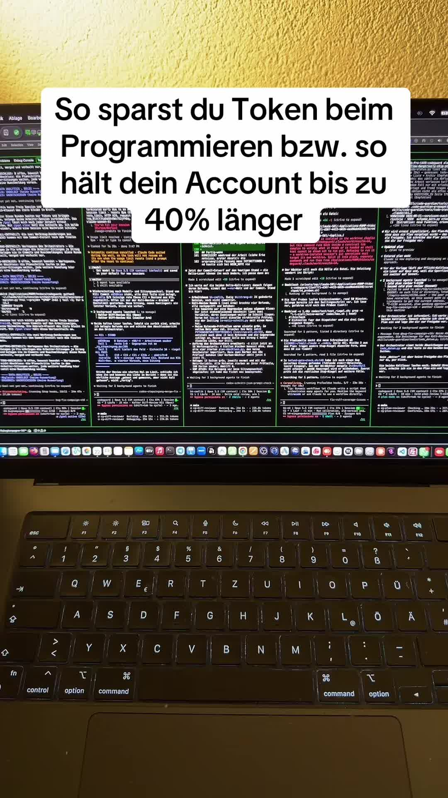

# ich arbeite mit multiorgastation und das hat was mit meinem tokenlimit zu tun.

## Transkript

ich arbeite mit multiorgastation und das hat was mit meinem tokenlimit zu tun. in diesem Video sage ich dir wie du Token sparst.

eines der häufigsten Fragen unter meinen Videos is wie man am besten seine Token spart, weil die Pläne so schnell aufgebraucht sind.

also beginnen wir mit der 1. aller wichtigsten Sache. schreibt gern mit und du kannst das Video ja immer wieder angucken. der 1. Punkt ist das Thema orchestration. orchestrierung heißt, dass du in verschiedenen Terminals an einer Aufgabe arbeitest. dass du sagst der eine, das eine Terminal ist der orchestrator, der der arbeitet mit dem höchsten Modell. zum Beispiel bis vor kurzem Fable

und da jetzt ist es Opus 5 Punkt 5 mit dem du super orchestrieren kannst und die Programmierung selber hat dann Opus gemacht. also jetzt kannst du orchestrieren aber auch programmieren mit Opus. aber wenn du morgen

ganz neues Modell rauskommt Fable 5 oder so ähm Fabel 6, dann würde es der orchestrator würde mit höchstem Modell arbeiten und die Programmierung würde dann eben das zweitgut beste Modell machen. zum Beispiel opus5 Punkt 5. textdarstellung wäre orchestriert immer mit so nett wer so nett kann gute Texte schreiben und ähm kostet nicht so viel.

der nächste Punkt ist das Thema Sessions, wenn äh Kontext. wenn du das Thema Kontext Aus dem Blick verlierst, kostet es dich richtig viel Geld, wenn du eine Session schon sehr sehr Lange programmieren hast und der ist bei 80 Prozent und du bist fertig mit der Aufgabe. Mach clear und Fang die nächste Aufgabe an.

die neue Aufgabe einzulesen kostet weniger als die 80 Prozent mitzuschleppen. diese 80 Prozent mitzuschleppen kostet dich bei jeder Eingabe Unmengen Token. deshalb sorgt dafür, dass dann deine Session bei einer neuen Aufgabe geklärt is oder zumindest mit compact Slash compact komprimiert.

dann kommen wir zu dem Punkt. ist n bisschen Eigenwerbung aber es ist halt so ähm ich hab nen eigenen codecard entwickelt und der codecard sorgt für sogenannte staatliche codeanalyse Fehler muss nicht das LLM finden sondern findet 1 Tool das kein Geld kostet.

Code Card installiert dir die lokalen ähm statischen Code Analysen und die analysieren Bang Code sofort OB da Fehler drin sind und sagen es dem L. M das L. L. M kann dann direkt eingreifen die Sache korrigieren und fertig.

was ist teuer? teuer sind die Backing Rounds also wenn ihr Fehler macht. die Software wird gebaut ihr testets durch. oh irgendwas tut nich ihr müsst denen jetzt die Info geben was tut nich ihr müsst immer wieder ran, immer wieder ran, immer wieder ran. so n Diba Club kann oft ne Stunde dauern und ihr findet den Fehler nich korrigiert irgendwas macht n neuen Fehler rein. diese debagging Loops kosten richtig viel Geld.

1 weiterer Punkt ist, ihr könnt in eure Cloud Me reinschreiben, dass er sich kurz und prägnant ähm verhalten soll.

damit ist ne klare Anweisung da. das L. L. M gibt weniger Informationen raus. hierbei ist immer wichtig zu beachten,

kurze und. knappe Aussagen führen oft natürlich zum schlucken von Informationen, die fürs L. L. M. vielleicht wichtig sind. das könnte natürlich an die Code Qualität gehen, da muss man mal aufpassen.

1 weiterer Trick ist, wenn du weißt, dass eine ganz spezifische Datei betroffen ist, also zum Beispiel die

Move Punkt J s für die für JavaScript und du weißt, dass da 1 Fehler drin is, zieh die Datei direkt Aus deinem Aus deinem Visual Studio rein in die Konsole und sag hier ist der Fehler drin. fixe den und den Fehler. wenn du diese Mühe machst, muss er nicht die Datei suchen und spart auf jeden Fall Tool, News und Tokens.

1 weiterer wichtiger Punkt ist das Thema plane Mode nicht einfach los bauen. nutz hier Superpowers oder eben Code Guardian. lass dir vor einer Umsetzung alles sehr sehr genau planen.

und ganz wichtig 1 Review deines Plans kannst du auch mit Sonett machen. das heißt du kannst einen Plan erstellen mit Opos 5

und dann kannst du 1 Review machen mit Sonett. ich lass Mir Cold Guardian sogar 1 Obst 5 Punkt 5 Review machen und 1 Sonett Review. das heißt das Review wird noch mal geprüft, warum erfindet sogar immer dann noch 12 Fehler. und wenn ihr in der Planung schon Fehler habt,

überlegt euch mal wie teuer das nachher in der umbesetzung wird.

dann 1 wichtiger Punkt, der auch extrem wichtig ist fürs Thema debagging und tokenverschwendung, achtet drauf, dass eure systemarchitektur, eure Software so gebaut ist. dass er Login aktiviert hat. das heißt alles was gemacht wird wird gelockt, protokolliert und Locks Debugs müssen aktiviert sein. das heißt der debug Mode muss bei euch in der lokalen entwicklungsumgebung aktiviert sein. beim diebach Mode werden Fehler direkt in den lokfall geschrieben oder ausgegeben und es LLM sieht den Fehler direkt. das heißt wenn ihr Fehler habt schreibt nicht da tut was nicht, sondern gibt ihm exakt den Fehler den ihr seht.

solche Kleinigkeiten sind es die am Ende richtig viel Geld sparen, wenn es LLM nicht erst suchen muss, vielleicht ne Fehlinterpretation hat und dann an der falschen Stelle korrigiert.

und natürlich jetzt Final eines der Hebel ist das Thema evert wenn du Slash Erfurt eingibst. bei Cloud Code ist das Thema evert Level halt wichtig.

viele arbeiten nur mit m high oder X high oder Max äh für viele Aufgaben reicht auch komplett low.

nur bei Programmierung empfehl ich auf jeden Fall X high da würd ich auf die bestmöglichen Position gehen. ultracoat kann man machen wenn man viele viele Prozesse laufen haben will,

aber X high ist für mich n gutes Level.

Max ist etwas das ich zum Beispiel nur für den orchestrator nutzen würde. damit kann man auf jeden Fall 1 bestmögliches Ergebnis erzielen. an der orchestrator bewertet ja die Eingaben und Ausgaben und der setzt Prioritäten.

es kostet nicht so viel Token wie zum Beispiel die Programmierung von 5.000 Zeilen Code die jedes mal über Max Everett laufen. hier ist einer der größten. Hebel für deine Token Limits.
