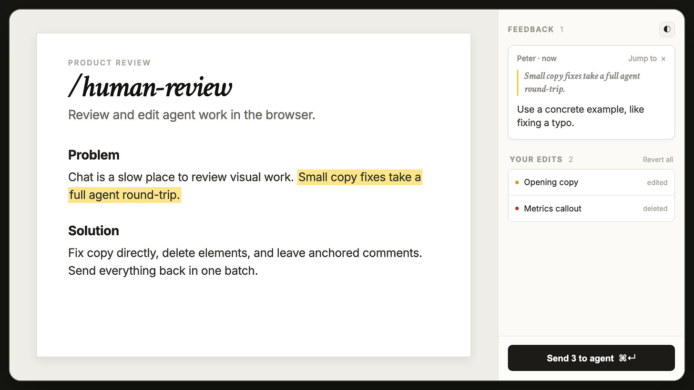

# Use My /Human-Review Skill to Edit HTML and Markdown Files like A Google Doc

> Automatisch per `python ai.py ingest` erfasst. Quelle: [https://creatoreconomy.so/p/use-my-human-review-skill-to-edit-html-markdown-visually](https://creatoreconomy.so/p/use-my-human-review-skill-to-edit-html-markdown-visually)

## Inhalt

## Use My /Human-Review Skill to Edit HTML and Markdown Files Visually

#### Tired of giving AI feedback in chat? My new skill lets you edit files, leave comments, and send feedback directly to your agent using a beautiful visual interface

Dear subscribers,

My last open-source skill, /no-ai-slop , went viral with 4K GitHub stars. Today, I’m introducing /human-review , another free AI skill I think you’ll love.

Let’s face it — giving feedback to AI in chat is painful. Asking AI to ‘update the button text’ or ‘edit the headline’ is annoying when I often want to edit the text myself or comment on the exact parts that I want it to fix.

> /human-review opens HTML and Markdown files in a visual editor where you can edit text directly, leave comments like a Google Doc, and send feedback to AI.

/human-review opens HTML and Markdown files in a visual editor where you can edit text directly, leave comments like a Google Doc, and send feedback to AI.

Get /human-review for free on GitHub

If you find it useful, please star the repository so more people can find it. You can also upgrade to paid to get 12+ more AI skills for personal advice, agent-ready specs, viral social posts, and more.

Watch the demo below, then keep reading to learn:

- How to install and use /human-review

How to install and use /human-review

- How /human-review works behind the scenes

How /human-review works behind the scenes

I’m proud to partner with Oceans Talent

I hired Char through Oceans to help with podcast production. He quickly grew beyond the original role and now creates clips, learns tools like Claude Code and Codex on his own, and delivers more every week.

Oceans Talent finds vetted operators across marketing, operations, finance, and executive support. Their hires know how to work with AI and cost one-third to one-fifth as much as comparable US talent. If you need help, book a call at oceanstalent.com/peter .

Get Started for Free

### How to install and use /human-review

To install the skill, paste this into Codex, Claude Code, or your favorite AI coding tool:

Install /human-review globally: https://github.com/petergyang/human-review

After you install it, you can open the visual editor by typing:

“/human-review (your file)” or “/human-review (localhost URL)”

In the visual editor, you’ll see a preview of your HTML or Markdown file on the left and a feedback panel on the right:

Now you can:

- Edit text directly and tweak basic formatting (e.g., bold, italic).

Edit text directly and tweak basic formatting (e.g., bold, italic).

- Resize images by dragging their corner.

Resize images by dragging their corner.

- Give AI feedback by selecting text or a component and leaving a comment.

Give AI feedback by selecting text or a component and leaving a comment.

- Send edits and comments in one batch by clicking the “Send X to agent” button.

Send edits and comments in one batch by clicking the “Send X to agent” button.

Giving feedback directly inside an HTML or Markdown file instead of in a separate chat window is super useful. I use /human-review to:

- Edit planning docs before building new features.

Edit planning docs before building new features.

- Edit and give feedback on landing pages.

Edit and give feedback on landing pages.

- Tweak product copy and remove AI slop from the UX .

Tweak product copy and remove AI slop from the UX .

You can also Command-click links in the visual editor to navigate between pages and leave feedback on each one.

### How /human-review works behind the scenes

When you run /human-review, it starts a small local server that records your changes in the visual editor and passes them back to your AI agent.

- Every edit, deletion, and comment is saved and grouped by page.

Every edit, deletion, and comment is saved and grouped by page.

- Your agent waits for feedback in 10-minute windows and receives everything immediately when you click Send.

Your agent waits for feedback in 10-minute windows and receives everything immediately when you click Send.

- Note: For HTML files, direct edits and resizes save automatically. For Markdown and localhost pages, click Send so your agent can apply them to the source.

Note: For HTML files, direct edits and resizes save automatically. For Markdown and localhost pages, click Send so your agent can apply them to the source.

Because the whole review loop runs locally, /human-review doesn’t require an account or API key and doesn’t upload your feedback to a separate cloud service.

### Run /human-review to prevent AI from turning your project into slop

It’s easy to give AI feedback in chat and trust it to edit your documents without reviewing the actual files.

> Over time, I’ve found that relying on AI to make edits can slop-ify your entire project if you’re not careful.

Over time, I’ve found that relying on AI to make edits can slop-ify your entire project if you’re not careful.

So the next time your agent creates an HTML or Markdown file:

- Type “/human-review (your file)” to open it in the visual editor.

Type “/human-review (your file)” to open it in the visual editor.

- Make a direct edit, remove slop, or leave a comment for AI to fix.

Make a direct edit, remove slop, or leave a comment for AI to fix.

- Hit Send and let your agent update the source.

Hit Send and let your agent update the source.

Get /human-review for free on GitHub and star the repo if you find it useful!

P.S. Credit to my friend Kun , whose tool Lavish inspired /human-review. I built my own version to add direct editing and Markdown support.

## Bilder

- ⚠️ nicht gespeichert (zu klein (1129 Bytes) — wohl Icon oder Tracking-Pixel): https://substackcdn.com/image/fetch/$s_!827n!,w_36,h_36,c_fill,f_auto,q_auto:good,fl_progressive:steep/https%3A%2F%2Fsubstack-post-media.s3.amazonaws.com%2Fpublic%2Fimages%2Fd2dbd75e-1c5a-48ab-94ef-b24caea63cdf_1024x1024.png

