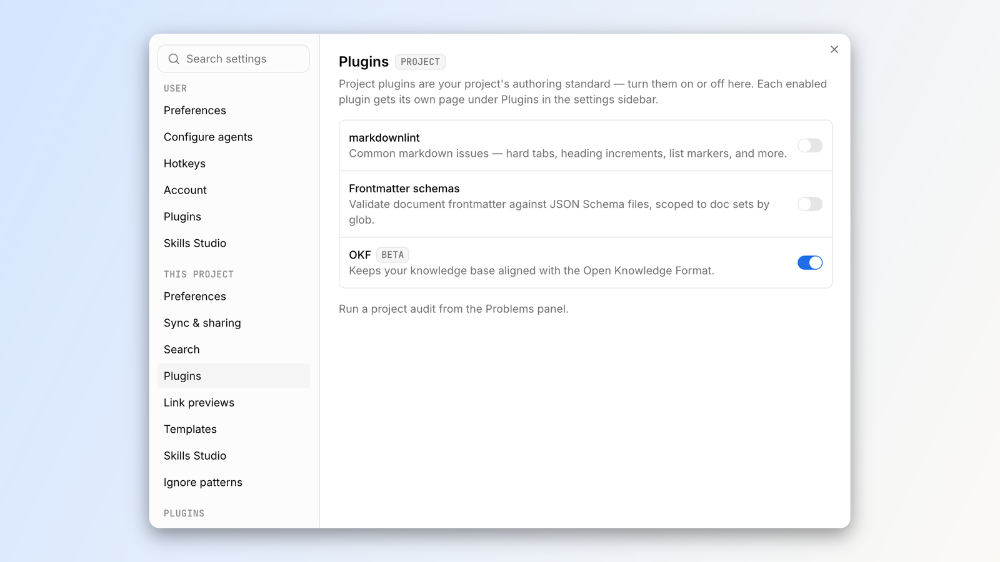

# Open Knowledge Format plugin for LLM wikis · OpenKnowledge

> Automatisch per `python ai.py ingest` erfasst. Quelle: [https://openknowledge.ai/blog/open-knowledge-format-okf-plugin-linter](https://openknowledge.ai/blog/open-knowledge-format-okf-plugin-linter)

## Inhalt

Launch Week · Feature Launches

## Open Knowledge Format plugin for LLM wikis

Serafin Garcia · Aug 21, 2026 · 9 min read

The Open Knowledge Format (OKF) is an open specification released by Google to help make knowledge bases portable, interoperable, and agent-friendly.

Today, we are introducing the OKF plugin for the OpenKnowledge app, which applies default linting rules, skills, and automations to help you and your agents create, port, and maintain an OKF-conformant LLM wiki automatically.

To see the format in practice, explore the Odyssey OKF wiki , our example knowledge base that follows the format.

### What is the Open Knowledge Format?

OKF was introduced in June 2026 by Google. It has three core goals:

- Trust - Consumers want to know who made or validated a change to knowledge and when, with properly traceable sources and provenance.

- Portability - The knowledge should be readable and editable with any editor or client, which is why the content is still just markdown and YAML.

- Human & Agent Consumption - Agents need to know how to consume a knowledge base. They shouldn't need to learn all the quirks of each and every one.

OKF is not a linter, editor, execution engine, or a registry for document types.

Instead, it is a specification for how to format and organize your knowledge base.

Our new plugin helps you conform to that specification automatically.

### The OKF plugin

We built the OKF plugin to translate the specification into a linter and auditor on the format's guidelines.

It leverages our content rules system to apply OKF-specific rules and report violations within the markdown editor and Problems panel.

#### The rules engine

OpenKnowledge turns every validation result into the same diagnostic shape:

- The rule that produced it

- Its severity

- Its location in the document

As you edit, OpenKnowledge runs the active document rules against the current markdown. A project audit runs those linters across the knowledge base and adds whole-project checks such as broken links and .mdx portability.

That shared output drives the inline markers and Problems panel you see in the app.

#### For agents

When an agent is working on a file, our MCP tools give hints and warnings as agents write, so they can automatically recognize and fix any issues as they work.

Warnings don't block an agent (or you) from writing. Instead, they ride along on the MCP tool response, so they are immediately visible to the agent.

Example response:

```
Written successfully (replace).⚠ Content rule okf/frontmatter-required (warning, line 1): Frontmatter property "type" is required⚠ Content rule okf/no-wiki-links (warning, line 12): Wiki-link [[Retrieval]] won't resolve for an external Open Knowledge Format consumer — it renders as literal text and its graph edge is lost.
```

These warnings "steer" the agent to be aware and make the best choice on how to resolve issues, without blocking their writes or requiring any more tool calls than normal.

Agents can also run the dedicated lint and audit MCP commands to identify and fix any issues with the entire project at any time, which is how they can run migrations of existing knowledge bases.

#### The CLI

lint and audit are also available as CLI commands, which is useful for adding CI/CD or deterministic gates to your workflow.

The CLI keeps the scopes explicit:

- ok lint runs document rules headlessly

- ok audit adds link and whole-project checks against a running server

### The OKF rules

The OKF plugin currently supports the OKF v0.2 format , with rules regarding frontmatter, reserved files, and portability.

#### Frontmatter

Frontmatter is best described as "properties for markdown documents" . These properties are shaped as a short YAML doc bounded by dividers at the top of any given markdown file. We support six different frontmatter rulesets from the format's spec: required, recommended, provenance, computation, and two for index files. Each of these rulesets generates a JSON schema in the .ok/okf subdirectory when toggled on.

For all files, there is only one requirement that needs to be satisfied for it to be considered conformant:

```
type: some-string  # some non-empty string
```

All documents must carry a type. It can be as simple as document or spec , but it must exist.

The format does, however, recommend a set of optional fields for more details:

```
title: Some title                # recommended, optionaldescription: "Some description"  # declaring one only pins its shapetags: [tag1, tag2]               # a LIST, not a comma-separated stringresource: https://...            # recommended, optionalanything_else: fine              # unknown keys must not be rejected
```

#### Provenance, trust, and lifecycle frontmatter

The spec includes a recommended schema that aims to answer:

- Where did this come from?

- How much should you trust this?

- Is this still current?

```
sources:  - resource: https://github.com/.../okf/SPEC.md    id: okf-spec    title: Open Knowledge Format specification, v0.2    last_modified: 2026-07-25generated: { by: human:serafin, at: 2026-07-31T12:00:00Z }verified:  - { by: human:serafin, at: 2026-07-31T12:00:00Z }status: draftstale_after: 2026-12-31
```

#### Attested Computation

One document type that is prescribed by OKF is the Attested Computation . These documents declare a deterministic computation that backs a claim: what runs it, what parameters it takes, and what evidence a run has to return.

Both halves of that live in the bundle, conventionally under a references/ subdirectory: the instructions the runner follows, and the code the attester uses to check a run. What never lands in the bundle is the output. A run's receipt and the attester's verdict are runtime artifacts, which is what separates attestation from the verified field above, since that one is recorded.

```
type: Attested Computationruntime: bashparameters:  - { name: bundle_root, type: string, required: true }executor:  resource: references/skills/some_execution.md  receipt: [command, exit_code, result]attester:  resource: references/attesters/execute_thing.py
```

The final two schemas are for the index file, which deserves its own explanation.

#### Index files

The index.md file is reserved for navigation, at every hierarchy in the knowledge base. It carries no frontmatter, with the exception of the root index file containing the version ( okf_version: "0.2" ). It has the expected shape of a flat list of links, organized by groupings.

```
# Example index
## An example section
* [An example link](./foo-bar.md) - Some example description* [Another example link](./baz-qux.md) - Some example description
## Another example section
* [An example link](./foo-bar.md) - Some example description
```

The OKF plugin provides multiple levels of support for this. You can toggle the frontmatter schema requirements: no frontmatter on index files, and optionally okf_version in root.

You can additionally use the body linter, which looks for this specific shape.

Finally, you can have the OKF plugin manage your index files. When turned on, an index file is generated at every hierarchy where there is markdown. These index files contain all the documents at that folder's level, grouped by type and listed by title.

The subfolders are listed in their own section, with links to their index files. These files are git-synced, and to avoid merge conflicts, a merge rule is added to a repository's .gitattributes file. When toggling this feature off, the .gitattributes change is removed, but the index files will remain.

#### Log files

The log.md file is also reserved at every hierarchy for reporting changes as they occur in the repository.

```
# Example log
## 2026-07-31
Example details from change
## 2026-07-30
Example details from change
## 2026-07-29
Example details from change
```

The OKF plugin ships with a body linter to ensure that dates are formed in the proper ISO format in headings. Log updates are expected to be written by the user and agent, and our included skill (see below) helps drive that.

#### Portability

OKF has a couple of recommendations that ensure portability.

- Only standard links are recognized

- OKF is markdown-centered

We include two toggleable rules to help you be aware of these.

- No wiki links: while OpenKnowledge supports wiki links, OKF does not.

- No .mdx : while OpenKnowledge supports .mdx files, OKF does not explicitly say it does.

### Ensuring your agent knows what to do

While the agent already receives feedback on its changes via the content rules system, the plugin includes a recommended skill called okf-knowledge-base .

This skill helps inform your agent of both the OKF spec and how it can proactively ensure conformance and use the plugin. It contains:

- A distillation of the spec, along with links to the official documentation

- How to proactively use each of the schemas

- How to take advantage of the index.md and log.md files to navigate the bundle

- How to use the plugin

When used in combination with the rest of the plugin, the agent easily writes more than a conformant knowledge base. It writes an ideal OKF one.

### Migrating an existing knowledge base

OKF is designed to be additive, with rules you can adopt progressively. That means you can enable the plugin on an existing collection of markdown files with YAML frontmatter and migrate in place.

Once enabled, the plugin surfaces conformance issues as warnings in the Problems panel. You can address them on your schedule or turn off rules that don't fit your knowledge base.

In the app, the validation rules themselves never block a save or rewrite your content, so you or an agent can work through the findings incrementally.

ok lint covers document rules and exits non-zero on warnings, so add it to CI only when you are ready to use those findings as a gate. The .mdx portability rule and link checks remain in server-backed ok audit .

### Getting started

If you're new to OpenKnowledge, download the app to get started (available for Mac, Windows, and Linux).

For a new knowledge base, you can start with the OKF starter pack , which now ships with the plugin on.

For an existing knowledge base, you just flip on the plugin in the Plugins settings.

You can then enable index.md generation, install the skill, and tune the rules to your liking.

Once on, the linting rules will take effect and the Problems panel will surface anywhere the knowledge base isn't conformant.

Use the Fix all with AI button to have an agent do the fixing and take care of the rest.

About the author

Serafin Garcia

Software Engineer

Serafin has a degree in Computer Science & Engineering at MIT and was previously a Software Engineer at Microsoft developing computer use model applications.

### Stay in the loop

## Bilder

- ⚠️ nicht gespeichert (zu klein (1416 Bytes) — wohl Icon oder Tracking-Pixel): https://openknowledge.ai/vc-ap-c5a1c4/_next/image?url=%2Fmarketing-assets%2Fimages%2Fteam%2Fserafin_garcia.jpg&w=64&q=75&dpl=dpl_2YX6GVY26eAZ3gPbeRzvNJ8LLfRf



- ⚠️ nicht gespeichert (zu klein (3598 Bytes) — wohl Icon oder Tracking-Pixel): https://openknowledge.ai/vc-ap-c5a1c4/_next/image?url=%2Fmarketing-assets%2Fimages%2Fteam%2Fserafin_garcia.jpg&w=128&q=75&dpl=dpl_2YX6GVY26eAZ3gPbeRzvNJ8LLfRf
