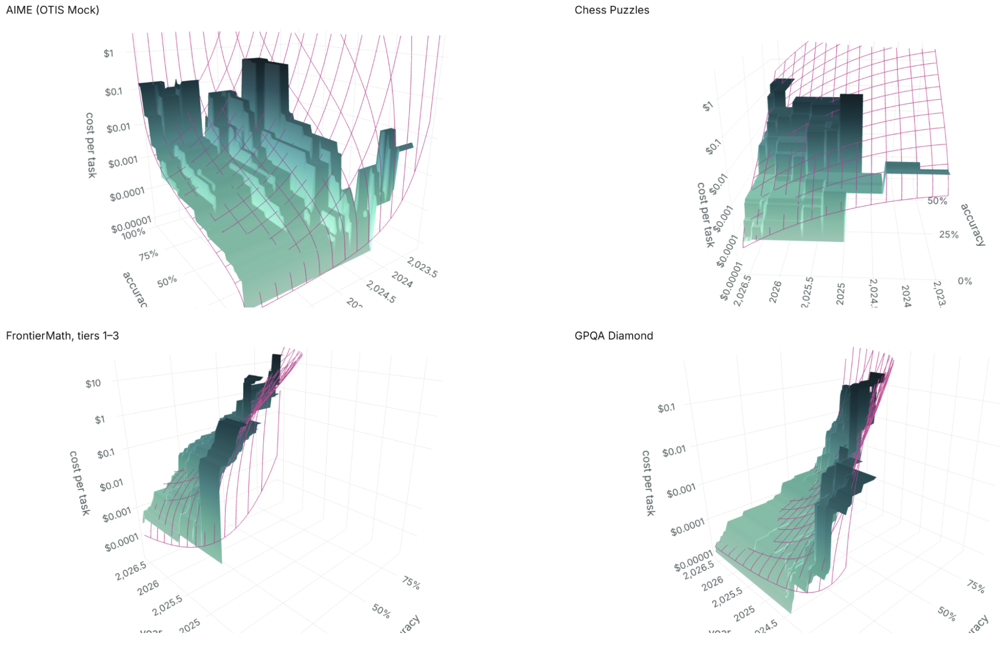

# The plunging price of thought

> Automatisch per `python ai.py ingest` erfasst. Quelle: [https://epoch.ai/publications/the-plunging-price-of-thought](https://epoch.ai/publications/the-plunging-price-of-thought)

## Inhalt

## The plunging price of thought

Over the past three years, the cost of a given level of AI performance has fallen about 47% per quarter, faster than for any other transformative technology in history.

### Key takeaways

- AI has gotten cheaper more quickly than any other transformative technology in history.
The cost of achieving a given level of AI performance has fallen about 47% per quarter since 2023, or 13× per year.
That price drop is four times faster than DNA sequencing, six times faster than compute, 18 times faster than lithium batteries, and (in the century up to 1973) 54 times faster than electricity.

- Coarser evidence suggests that the price of thought has been falling at least this fast since the dawn of commercial LLM inference in November 2021, when OpenAI fully released GPT-3.

- The speed of price drop varies by domain: slower on game-based puzzles, at 39–43% per quarter, faster on math problems, at 50–52% per quarter.

- The cost of a given level of performance often falls fastest right after that level is first achieved, that is, when it is state of the art (SOTA).
We see this pattern on three of our five main benchmarks of AI capability.
Averaging across all five, cost falls 66% per quarter (75× per year) for performance that has just debuted as SOTA.
Two years later, prices fall half as fast, at 32% per quarter (4.7× per year).

Data and code are on GitHub .
An overlay page has many plots and tables to explore.

### Overview

The “GPT” in “ChatGPT” stands for “Generative Pre-trained Transformer,” a technical description of how the AI inside it works.
Surely, though, the creators of OpenAI’s GPT models were nodding to an older meaning of the initialism: general-purpose technology .
They correctly foresaw that — like the steam engine, electricity, and the internet — large language models would someday touch every aspect of society.

It is now widely understood that the AI boom is a macroeconomic force powerful enough to raise prices for the inputs it demands: chips, power, even the labor of electricians.
Less well recognized is a paradoxical flip side: the price of the output from all those data centers is falling extraordinarily rapidly:

The next chart shows some examples.
On January 31, 2025, OpenAI released a new iteration in its series of “reasoning” models, called o3.
We estimate that for an average cost of 30 cents per question, it could achieve a 75% score on GPQA Diamond , a multiple-choice exam covering PhD-level physics, chemistry, and biology. 1 Just under 18 months later, OpenAI released GPT-5.6 Luna.
It scored just as well — for four hundredths of a penny per question ($0.0004).
That is a 725-fold drop in the price of thought in under 18 months.
It is like the sticker price on a new car falling from $50,000 to $69.
No other general-purpose technology in history appears to have gotten so cheap so fast.

To measure these trends, we analyzed performance with a new and more comprehensive dataset that includes five AI performance benchmarks covering mathematics, hard sciences, and games of skill over the last three years.

Across that time, we find that the price for a given level of performance has fallen about 47% per quarter, or 13× per year.
We see slower drops on game-based puzzles, at about 39–43% per quarter (7–10× per year), and faster progress on math problems, at 50–52% per quarter (16–19× per year).

The cost decline for a given level of performance does tend to slow over time, though this pattern is not universal.
One possible explanation: when a performance level is first achieved, AI companies can briefly charge a premium for it, before competition and technological improvement quickly drive down the price.
In time, that dynamic slows.
Averaging across the five primary benchmarks, cost falls 66% per quarter (75× per year) at first.
Two years later, it falls half as fast, at a “mere” 32% per quarter (4.7× per year).

Our analysis comes with major caveats.
AI companies may be expressly training their models for some benchmarks (“benchmaxxing”), so that improvement on the benchmarks outstrips improvement for real-world tasks.
Even if they are not, doing well on a benchmark is not synonymous with useful work.
Because we focus on the frontier — the absolute cheapest model capable of any given level of performance — we implicitly posit an AI user who relentlessly searches for the most cost-effective model for each task, when real users do not switch models so often, and therefore do not reap quite the same savings.
Our data are incomplete and noisy: the timeframe is barely three years, and we do not include all combinations of AI model and benchmark.
Prices drop differently for different models, benchmarks, time periods, and performance ranges, and there are many reasonable ways to average over this variegated experience.
Overall, while we believe that our bottom-line numbers are reasonably representative of reality, they should not be read as exact.

The rest of this report details our analysis.
Parts of it are technical.

### Previous work

We are not the first to quantify how fast the price of AI is falling.
A 2024 post by Guido Appenzeller for Andreessen Horowitz documented how, in the three years following the general release of GPT-3, LLM costs fell by a factor of 1000, i.e., 10× per year.
A few months later, in March 2025, an analysis by Epoch AI found drops of 9–900× per year across six performance benchmarks.
Recently, Demirer, Fradkin, and Tadelis (2026) did something similar, plotting prices over 2023–25 for various performance levels on the Artificial Analysis Intelligence Index .

All of these analyses measured prices per token for models capable of achieving a given performance as distinct from the actual cost to achieve that performance .
With the advent of reasoning models — OpenAI released o1 in December 2024 — it has become more problematic to ignore this distinction.
Reasoning models can productively consume far more tokens, but as a result extract good performance from an underlying LLM that is smaller and cheaper to run per token.

In September 2025, Håvard Tveit Ihle shared an analysis on LessWrong that directly compared performance and cost on two suites of coding challenges.
The analysis finds that costs halved every 1.4–2 months (64–380× per year).

The most thorough analysis yet is the March 2026 paper by Gundlach et al. It, too, compares actual costs to performance.
As in the present analysis, it estimates trends both in the full body of data and in the subset of models defining the cost frontier at any given time.
It also disaggregates by level of performance — prices fall faster at the high end — and by model type (open or closed, dense or mixture of experts).
Overall, they find declines of 5–10× per year.

### Data

The major novelty of the present analysis is to analyze trends in costs using a methodology that captures each model’s full expense-performance continuum.

If one LLM can score 80% on a benchmark at a cost of $1, and another tops out at 60% for a price of $0.50, it is not obvious which is more cost-effective.
Perhaps the stronger model would, if run with fewer reasoning tokens, achieve 60% more cheaply than the weaker model.

More generally, our interest is in mapping the “Pareto” frontier of cost-effectiveness — the cheapest way to attain each performance level from the models available at any given time.
We would leave a lot of territory unmapped, and potentially a lot of frontier as well, if we only estimated cost and performance when LLMs are given an unlimited budget.
Any given modern LLM can produce a range of performance levels, depending on whether its reasoning is set to low, medium, high, or max, and depending on whether a budget limit is imposed.

One way to trace a model’s expense-performance curve is to run it many times against a benchmark, at various reasoning levels and token budgets.
That process would, however, be expensive and slow.
Instead, we follow a procedure developed by the federal Center for AI Standards and Innovation (CAISI) .
It uses the transcript from a benchmark run with a high (or no) budget constraint to predict performance under tighter budgets.
The core idea is that since benchmarks consist of many questions, one can estimate how many an LLM would answer before consuming a given budget.
The transcript provides the needed information: how many tokens the model consumed in answering each question, and which it got right. 2

For any arbitrary per-question budget of X tokens, we sum up the number of questions that were answered correctly in fewer than X output tokens.
Think of this as the maximum expense the model may incur before being forced to give up.
When a model does not answer in time for a particular budget threshold, that question is scored as the probability of guessing correctly, which could be, for example, 0.25 on four-way multiple choice and effectively 0 on other kinds of problems.
Repeating across a range of budgets yields a performance curve as a function of hypothetical expenditure.

One concern about this procedure is that it could misestimate how LLMs would actually perform if informed of a budget.
If models were told that they should optimize for getting a good score at some lower threshold, they might do better than if the questions were silently truncated, as simulated in the CAISI methodology.

To test this concern, we modified our evaluations by explicitly telling models their per-question budgets.
Our results suggested that while high-effort versions of thinking models often improve their low-budget performance when those budgets are announced, they do not outperform lower-effort variants under standard, unannounced conditions.
That is, simply running thinking models at low thinking effort produces expense-performance curves similar to those from running at high thinking effort under announced limits.
(See Figure 3 for examples across several models.)
As a result, as long as we use the CAISI methodology across the range of thinking levels, we will probably cover most of a model’s cost-performance possibility domain.

Figure 3. Announcing a budget cap to a model traces out about the same cost-performance relationship as simply limiting its budget

Since historically our benchmarking efforts have tended to focus on capturing the upper limits of performance with minimal regard for cost efficiency, our data was systematically missing evaluations using lower reasoning efforts and small, efficiency-focused models.
To avoid biasing our results, we undertook a concerted data collection effort to fill these gaps for FrontierMath Tiers 1-3 (v2), OTIS Mock AIME 2024-2025, GPQA Diamond, Chess Puzzles, and Mystery Game Puzzles.
This included running a number of open-weight models directly, as they were plausibly along the Pareto frontier of cost and performance, but were not available from any dedicated inference API.
To obtain prices for evaluations on these models, we used the cost of their rented hardware, making efforts to optimize both the choice of hardware and the evaluation settings to maximize cost efficiency conditional on a reasonable latency.
We validated our method by using it to run five open-weight models which were also available via inference API.
In each of these cases, the discrepancy between our direct costs and API pricing was less than 30%.

### Modeling

#### The challenge

For each benchmark, we have a set of triples \(({a}_{i},{t}_{i},{c}_{i})\) representing the accuracy of a model’s answers in a particular run, the model’s release date, and the dollar cost of the run.
As just explained, the CAISI methodology produces many triples for each combination of model, thinking level, and benchmark, as the hypothetical token limit is varied.

We want to characterize the rates of price decline for given levels of performance — not of the average model, but at the “frontier,” meaning the cheapest available model that can deliver the required performance on a benchmark.

To be concrete, we define two empirical Pareto frontiers, for accuracy and cost.
The empirical accuracy frontier is the highest performance achieved within a given budget using models available up to a given date:

The empirical cost frontier is the lowest cost at which at least one available model can meet or beat a given accuracy target:

These surfaces have a two-dimensional staircase character, as they experience discontinuous jumps in either of their dimensions, always in the same direction.

Representing these moving frontiers with a statistical model is challenging in a few ways:

- Output is bounded above, since accuracy cannot exceed 100%.
In most economic models of production and cost frontiers, output can go arbitrarily high.

- The frontier is constructed as a maximum or minimum at each point.
This makes it unstable.
A single benchmark result — or a single missing one — can substantially shift the frontier for months.
Most statistical work focuses on averages.
In this setting, each additional data point tends to affect results less than the previous one, as the estimate of the average converges.
When studying extrema, limiting behavior sets in more slowly.
So we should presume that the empirical frontiers are noisy representations of “true” frontiers.

- Because of #2, the sampling program matters more.
E.g., if a higher percentage of newer models are benchmarked, this will tend to puff out the later regions of the frontiers.
Because testing models takes time and money, we have mostly tested models that appear to be near the frontier as of their release date.
The sampling is therefore a bit ad hoc.
That means that we do not have a credible, clean model of the data-generating process.

- Model releases are sparse in time.
Ones that move the frontier are even sparser.
Yet even on days with no data points, the frontier exists, and its exact location contains information.
That information, however, is limited, because yesterday’s frontier is a good predictor of today’s.
In other words, there is spatial autocorrelation.
When, as here, the frontier is represented by its values over a gridded set of points, increasing the resolution of the grid would increase sample size and apparent precision of estimates, unless spatial autocorrelation is properly adjusted for.

- Within the time frame studied, change is extremely fast.
Most studies of production frontiers take place in less dynamic industries, like manufacturing and farming, where one can more easily imagine a large number of producers tracing out the frontier at any given time.

Items 2–4 mean that when we model the frontier, it is hard to produce credible standard errors, and thus estimates of statistical significance.
Those are always founded on a model of the data generating process that looks roughly realistic, including in its specification of noise components.

One common response when standard errors cannot be estimated through analytical methods is to bootstrap them.
But we are skeptical even of this remedy, as will be explained.

For these reasons, we abandon the formal paradigm of statistical inference.
We borrow methods from econometrics, such as logistic regression and stochastic frontier analysis.
But we do not report standard errors, and do not formally test hypotheses about the values of parameters in models of the data generating process.
We believe the results should be taken as reasonable but rough measurements based on the best available data, of a phenomenon indisputably present.

#### The models

We fit five main models to the data, two to the empirical frontiers and three to the full set of benchmarking results.
Of the latter, two are applications of stochastic frontier analysis.
Their results are not credible — they often imply that the frontier moved backward — and are relegated to the appendix.

This set of models arises from a quick exploratory process.
In that process, a couple of questions emerged:

- Should the empirical frontier per se be modeled, or should the model be fit to the full dataset while relying on the fitting process to find the best representation of the moving frontier?

- Should the smoothed, model-predicted frontier be expected to lie wholly beyond the empirical frontier, or merely approximate it the way a best-fit line runs through a cluster of points?

The various models represent different answers to those questions.

Three variables are in play in the modeling problem: release date, spending, and benchmark performance.
It is natural to model the third as a function of the other two: spending is an input to production, time affects the technology of production, and performance is the output.
But our ultimate interest here is in determinants of cost, not performance.
And there is a long tradition in economics of viewing production and cost functions as duals, and modeling both with similar methods.
The dual perspective situates cost as a function of time and benchmark accuracy.

Ideally, our estimates of the rate of cost decline will not depend on whether we model performance as a function of time and cost or cost as a function of time and performance.
Either way, we are estimating the same relationships among variables.
And once we have fit a model to one frontier we can back out the implications for the other.
In practice, there are some asymmetries (or anti-symmetries) between how the same modeling approach is applied to the two kinds of frontiers.
Consider: in fitting a line to points in the plane, one can minimize the vertical distances between the points and the line or the horizontal distances, and thus get two different answers.

The approach here is to model from both perspectives, and then from both draw out the implications for both dependent variables, performance and cost.
The web-based interface makes the results browsable.

##### Model 1: Pareto logistic/least squares

The idea is to fit smooth surfaces to the empirical frontiers defined above.
Like best-fit lines through a cloud of dots, the best fits will have real data points on both sides.
Thus the fitted frontiers will not technically embrace every point that contributes to the empirical frontiers, but will serve to summarize their overall shapes.

For the accuracy model, we assume that at any given time, frontier model accuracy is related to both log cost and release date according to:

where \(\sigma\) is the logistic S-curve function; \({x}_{a}\) is a vector of controls — at a minimum, log cost (\(\ln c\)), release date (\(t\)), and a constant; \({\beta }_{a}\) is the corresponding vector of coefficients; and \(E\left[{a|{x}_{a}}\right]\) is the expected accuracy of a model conditional on those controls.

The parameters are estimated with a fractional logit regression ( Papke and Wooldridge 1996 ), whose maximand has the same mathematical formula as the logit model for binary outcomes, and is reinterpreted to allow outcome values between 0 and 1, inclusive.

For the cost frontier, we model log cost, which is unbounded, as linear in its predictors:

\({x}_{c}\) contains, at a minimum, the logit/inverse logistic of \(a\), symbolized \({\sigma }^{-1}(a)\), along with \(t\) and a constant.
This is fit with ordinary least squares (OLS).
Because the logit transform maps 0 and 1 to ±∞, unlike in the previous model, scores of 0 or 1 are dropped from the sample.

These models for accuracy and cost are each fit once, across their two-dimensional domains.
In the fits, the frontier surface is represented not just by the record-setting data points of the sort highlighted in this report’s second figure, but by the levels of \(A(t,c)\) or \(C(t,a)\) over a grid of points.
The grids’ points are evenly spaced values of 1) release date and 2) log cost or accuracy.
In the time dimension, the grids have a resolution of 1 point every 13 days, chosen so that there are about 100 points for the benchmark whose data start first (AIME OTIS Mock, applied to GPT-4, which was released on March 14, 2023).
And the grids have 100 points in each benchmark’s observed accuracy range.

Because entire Pareto surfaces are being modeled, any particular slice of the best-fit surface, such as for cost versus accuracy as of January 1, 2026, will generally not be the best fit just for the corresponding slice of the empirical frontier.
The quality of fit in any slice is constrained by the goal of finding the best overall fit across all slices, subject to the structure of the model.

##### Model 2: Envelope

This modeling approach is a constrained version of the previous one:

- It forces the theoretical frontier to lie completely outside the empirical frontier — above, when modeling accuracy, and below, when modeling cost.

- In the accuracy model, some benchmark tests produce perfect scores of 1.
But it is impossible for a logistic-based envelope to ever reach 1, thus for the envelope to embrace such a point of perfection.
So before fitting, 1s are replaced with \(1-1/2n\) where \(n\) is the number of questions a model was challenged to answer in forming the data point, i.e., the number of runs times the number of questions per run (column “n_samples” in cost_truncated_curves.csv ).
In other words, perfect scores are replaced with a number that represents getting all questions right half the time and all but one right the other half.

The requirement that the envelopes stay outside all of the corners of the empirical frontier staircases (or just touching them) constitutes a large set of nonlinear constraints on the parameters.
Sequential Least Squares Programming (SLSQP) is used to find the constrained best fits.

##### Model 3: Full-data logistic/least squares

This model is like model 1 except that it is fit to all the test results in the dataset, rather than a grid of points representing the empirical frontiers.
While this model is not structurally focused on the frontier, it is included for a few reasons.
The fits of the model are not as intrinsically unstable since the data points are not extrema.
The approach is simple.
And it might be expected to give about the same answers as models of the frontiers.
As an analogy, we would expect that the rate of decline in computer memory prices over the last 50 years is about the same for the average memory module and the cheapest at each time point.

#### Nonlinear models

The models just defined are linear in the sense that the \(x\) vectors consist solely of two predictors (time, and accuracy or log cost).
For the accuracy models, this means assuming that the passage of each quarter, and each doubling of spending, causes the same improvement in the logit of benchmark accuracy, \({\sigma }^{-1}(a)\).
For cost models, it assumes that the passage of each quarter, and each one-unit increase in the logit of accuracy, has the same proportional impact on cost.

These assumptions are not obviously true.
Cost declines might accelerate or decelerate in calendar time.
There might be diminishing returns to spending at any given time.

To allow for (more) nonlinearities, all models are also run in quadratic variants.
In the accuracy models, the vector \({x}_{a}\) gains \({t}^{2},\ (\ln c{)}^{2},t\times \ln c\).
In the cost models, \({x}_{c}\) gains \({t}^{2},\ ({\sigma }^{-1}(a){)}^{2},t\times {\sigma }^{-1}(a)\).

While mathematically natural, a peculiarity of quadratic models is that they imply parabolic trends, with directional changes.
Then, at certain times or cost levels, LLMs are predicted to get worse over time.
Ordinarily, these implausible predictions appear outside or on the fringes of the data range.
But they can still produce model fits that are hard to explain.

An alternative approach is to apply the Box-Cox transform to each of the \(x\) variables.
This transform offers a range of possible curvatures while avoiding directional changes.
That is, it preserves monotonicity in each variable.
For example, we would replace \(\ln c\) as a predictor in the accuracy model with

This introduces the exponent \({\lambda }_{c}\) as an additional parameter to be estimated.
The Box-Cox transform shifts and scales the power transform in order to give it some nice properties.
When \({\lambda }_{c}=1\), it is just \({\phi }_{{\lambda }_{c}}(c)=c\), so it includes linearity as a special case.
When \({\lambda }_{c}>1\) it is convex and when \({\lambda }_{c}<1\), concave.
In the \({\lambda }_{c}\rightarrow 0\) limit, it equals \(\ln c\), so that the original log-linear relationship is strictly generalized.

In the models with Box-Cox transforms, each of the predictor variables is allowed its own \(\lambda\) exponent.
When brought to the accuracy variable, the transform is applied to the odds ratio \(a/(1-a)\).
That way the transform embraces \({\sigma }^{-1}(a)=\ln [a/(1-a)]\) as a special case, which again is what is used in the “linear” model.
In addition, just as in the quadratic models, the product of the two Box-Cox-transformed terms is entered as a regressor, with the same \(\lambda\) exponents as in the separate terms.

Under the Box-Cox transform, the possible values of \({\phi }_{{\lambda }_{t}}(t)\) depend on where “time zero” is.
We define it as November 18, 2021.
On that day, OpenAI fully opened the GPT-3 API for commercial use , and arguably inaugurated the age of commercial LLM inference.
A different choice would cause the results to shift somewhat.

We note a complication in terminology: Box and Cox (1964) applied the “Box-Cox transform” to dependent variables, to make their distributions more normal-like.
Here we are following Box and Tidwell (1962) in applying it to the independent variables.
So these regressions are best labeled as Box-Tidwell.

The fitting code conducts the search for the best fit with a two-level process.
In the upper level, a search is conducted in the space of possible \(\lambda\) pairs.
For each set of trial values, the other model parameters are estimated using the same methods as for the linear models while holding the \(\lambda\) exponents fixed.

The exponents on time, \({\lambda }_{t}\), sometimes proved hard to estimate, especially in the cost models for benchmarks with short testing histories.
No peak would be found within the (wide) allowed range of [–8, 8].
This is not surprising since the time spans of the datasets for each benchmark are short, making it hard to reliably measure 2nd-order effects in time.
When estimation fails in this way, the code imposes \({\lambda }_{t}=1\), reverting to linearity.

#### Preferences among the models

Because of our interest in cost declines at the frontier, we favor the models that are fit to that frontier rather than the full dataset, and to the cost frontier in particular.
The stochastic frontier models described in the appendix fail to credibly identify a (moving) frontier.
Simple regression on the full dataset (model 3 above) is not designed to identify the frontier.

Of the two models fit just to the frontier, we prefer model 1, which is not constrained to envelope the empirical Pareto surface.
Our interest is not in where some theoretical frontier lies, but in real-world cost-performance tradeoffs.
Our data are representative of available performance because they cover essentially all the important models.
A smooth approximation to the empirical frontier surface distills its angular contours into a few numbers.
In addition, the envelopment constraints can give inordinate influence to observations of accuracy close to 1, where small errors in measurements can have a large impact on the permissible domain for model parameters.

As for the order of the model, we prefer Box-Tidwell.
In the 3-D surface plots , many of the linear fits look unrealistic.
Quadratic models do better, but often with unrealistic reversals at the edges of the data range.
The Box-Tidwell fits follow the data more closely while looking more realistic because of the monotonicity.

Figures 4 and 5 are a sample of the graphical presentations of the preferred model fits.
In Figure 4, data points for four of the five primary benchmarks are plotted, with color indicating the LLM’s release date.
Superimposed are semiannual, empirical accuracy frontiers, along with the corresponding smooth curves implied by the model fits.
Figure 5 switches to modeling cost, and compares the full Pareto surfaces to their Box-Tidwell fits.
(Note the direction of the time axes.)
The live 3-D plots are interactive.
You can zoom and rotate them to gain perspective.

Figure 4. Benchmark results, semiannual Pareto accuracy frontiers, and smooth fits thereto, over time, four primary benchmarks

Figure 5. Costs, Pareto frontier surfaces, and smooth fits to frontiers, various accuracy levels, four primary benchmarks

### On bootstrapping

Our strategy for modeling the frontier (models 1 and 2) is, in a sense, multi-stage: first we compute the empirical Pareto frontier, then we fit a parametric model to it.
It is common in such situations to bootstrap the entire estimation process in order to construct confidence intervals that reflect the noise in both steps.
However, we are not convinced that bootstrapping is credible enough here to justify the complexity.

The problem is that in each iteration of a standard resampling bootstrap, some observations will be drawn from the full dataset more than once and others not at all.
As a result, a bootstrap empirical frontier can never lie outside the full-sample frontier, only inside it.
In this sense, the bootstrap data-generating process would not plausibly mimic the real data-generating process.

Facing this problem in the context of stochastic frontier analysis, Simar and Wilson (1998) propose an alternative bootstrap: After fitting the model to the full dataset, compute each producer’s inefficiency relative to the model-estimated frontier.
Then resample the set of estimated inefficiencies, with replacement, and use the new, simulated inefficiency levels to generate a bootstrap dataset.
For example, if a producer is estimated to be 90% efficient, but in a bootstrap iteration is assigned 80% instead, then its production for a given level of input would be scaled by \(80\%/90\%\).

The shortcoming of this approach, in our context, is that it assumes that the distribution of inefficiency is homogeneous ( Simar and Wilson 2007 , p. 278) — e.g., about the same in 2023 as 2026.
We would be more confident in this assumption if we believed that processes that bring new LLMs to market and select them for benchmarking were stable over this timeframe.
But when the frontier against which inefficiency is defined is moving so fast, when the number of LLM producers is expanding rapidly, and when our own sampling is becoming more comprehensive, the assumption of homogeneity may be substantially incorrect.
If so, then standard errors derived from the bootstrap could give a false appearance of precision.

### Extracting estimates of cost declines

The linear cost models directly provide estimates of the impact of time (release date) on log cost, in the form of a coefficient \({\beta }_{t}\).

Extracting the equivalent from accuracy models takes more work.
The model fits give rise to isoquants, curves in the cost-time plane along which predicted accuracy is constant.
Movement along these iso-accuracy curves is characterized by

Solving for \(d\ln c/dt\), the implied rate of price change at any instant is

where the \(\beta\)’s are coefficients from an accuracy model fit.

### Results

#### Average rates of decline

We focus first on estimates of the overall rate of cost decline.
This first moment is naturally of interest.
In addition, estimating it allows us to validate model results against model-free averages.

Table 1 shows many estimates of the average quarterly rate of cost decline.
The first result column shows estimates using none of the foregoing models.
Here, model-free estimates are made by averaging empirical cost declines over a set of points in data space.
In particular, the code creates grids in time and accuracy identical to those described earlier for the model fitting.
At each grid point \((t,a)\), and for each benchmark, we compute the empirical frontier cost decline ratio over the following quarter, \(C(t+0.25,a)/C(t,a)\).
Each benchmark’s ratios are then averaged geometrically and subtracted from 100%.

Among the five primary benchmarks, the decline rates are fairly close, ranging from 43% per quarter for Chess Puzzles to 53% per quarter for FrontierMath, tiers 1–3.
Their simple average is 47% per quarter.

The following columns show results from the cost models described above, in their linear and Box-Tidwell variants.
The models, as models, have the disadvantage of imposing a certain mathematical structure, which is never exactly correct.
On the other hand, to the extent the models are correct, their results will be more precise. 3

In the second column, we see that fitting a linear model to the empirical log cost frontier — linear, that is, in \(t\) and \({\sigma }^{-1}(a)\) — produces results that are reasonably similar to the model-free ones.
The largest disagreement is about 11 points, for the science benchmark GPQA Diamond.

Giving the model more flexibility — with Box-Cox transforms of time and the accuracy odds ratio, along with the product thereof — generally improves the concordance with the model-free estimates for the five primary benchmarks (next column of the table).
Because this model is nonlinear, the rate of cost decline depends on time and accuracy, so no one parameter constitutes an overall bottom line on the rate of cost decline.
To distill the model’s overall implications, we average over the same grid of cost and accuracy values as before.
This time what is averaged is the model’s predictions for the instantaneous rate of cost decline at each grid point.
Except for Mystery Game Puzzles, the overall decline rate moves closer to the model-free number.
(Mystery Game Puzzles are like chess problems, except in a different game, whose identity is kept confidential, to prevent AI companies from deliberately training for the test.) For the five primary benchmarks, the average decline rate is 47% per quarter, an exact match to the model-free average.

Fits of the other models deviate substantially from those just covered.
Requiring the predicted cost frontier to perfectly envelope the empirical frontier produces some implausible values, like 2.7% per quarter (linear) and 7.6% per quarter (Box-Tidwell) for SWE-bench Verified, a measure of coding ability.
Modeling all of the data, not just the points along the empirical cost frontier (final pair of columns), also produces implausible results, including many negative signs that imply rising cost.

Table 1. Average quarterly rate of cost decline, holding accuracy fixed

All percentages are estimates of the average quarterly drop in the cost of a given level of accuracy on a given benchmark, over the years of available data.
The bottom row of the first panel reports simple averages..
The model-free values are averages in log space over grids that span the benchmark’s release date and accuracy range, the latter clipped within the state of the art (SOTA) for that benchmark at each time point.
At each grid point, the lowest cost of at-least-as-good performance one quarter later is found and divided by the initial cost.
The geometric mean of the ratios is taken and subtracted from 1.
All linear, parametric results are coefficients on release year as an explanator for log cost, again reexpressed quarterly.
For the Box-Tidwell regressions, the statistic is computed as in the non-parametric column, using model-implied instantaneous decline rates at the grid points.
“Model frontier” means modeling the empirical frontier as realized at a grid of points.
“Model frontier, require envelopment” means the same, but with the constraint that the fitted surface is never above any data point.
“Model all data” means modeling all runs, not just the frontier, with OLS.

#### Variation in the rate of cost decline

Figures 4 and 5 and and the larger array of plots on the GitHub page reveal a diversity across benchmarks in the relationship of cost to time and accuracy.
Some of the apparent diversity might just be an artifact of overfitting a flexible model to a sample that is too narrow in the time or accuracy dimension for reliable identification of second-order patterns.
But some of it is plausibly real: the pattern of cost decline may depend on the capability being measured.

Consider Figure 6, which consists of heat maps for four benchmarks of model-predicted rates of cost decline.
Lighter shades indicate the fastest declines.
To give a sense of where the model is extrapolating beyond the data, staircases are overlaid on the plot to show the strongest and weakest performance yet recorded by any model in the data.
For three of the benchmarks — AIME (OTIS Mock); FrontierMath, tiers 1–3; and GPQA Diamond — it appears that the cost declines fastest near state-of-the-art performance.
One scenario that would explain this pattern: when a new, SOTA-defining model appears, its maker can briefly charge a premium for this performance.
But competitors open and closed quickly catch up, and the price of such performance plunges.
Eventually this dynamic fades and the decline slows, even in percentage terms.

Table 2 puts numbers on this pattern.
For each benchmark, it reports the parameter estimates under the Box-Tidwell cost frontier model.
To the right, it lists the model-implied, instantaneous rate of cost decline right when a given performance level debuts as SOTA, and then the same for 1, 2, 3…, up to 8 quarters later.
The moment of SOTA debut is estimated from an auxiliary logistic regression of frontier accuracy on release date.
And, once more, since the model is nonlinear, the instantaneous decline rate depends on the accuracy level.
So the displayed statistics are averages over a uniform accuracy grid clipped to the observed accuracy range for the benchmark.

In three of the five primary benchmarks, and all of the secondary ones, the rate of cost decline falls after SOTA debut.
In the exceptions — Chess Puzzles and Mystery Game Puzzles — the acceleration amounts to only a few percentage points.
On average for the primary benchmarks, the decline rate drops from 66% per quarter on average at SOTA to 32% two years later.

Figure 6. Heat maps of cost decline rate vs. release date and accuracy for four benchmarks, Box-Tidwell model of cost frontier

Note: Black staircases show upper bounds on observed performance as a function of time, and in a couple cases the lower bounds too.

Table 2. Box-Tidwell models for cost frontier

Notes: All estimates come from regressions of the Pareto cost frontier over a grid of time and accuracy values, of log cost on Box-Cox-transformed time and accuracy odds ratio variables and their product.
To estimate rates of decline as a function of time since a level of performance was state-of-the-art (SOTA), an auxiliary logistic regression of SOTA on time is performed for each benchmark to estimate when a given performance level was SOTA.
At each time point since the SOTA debut, the model-implied quarterly rate of decline, in log points, is averaged over a grid of accuracy values in the observed accuracy range.

### Limitations

While the fundamental finding of rapid price decline is indisputable, our particular estimates are subject to major caveats.

First, there could be “benchmaxxing”: the deliberate training of AI models to perform well on known benchmarks.
One of our primary benchmarks, Mystery Game Puzzles, is designed to mitigate benchmaxxing by keeping the game in question secret.
In Table 1, the quarterly decline rate for this benchmark lies somewhat below the average of the five, at 44.0% (model-free) or 38.7% (Box-Tidwell model for frontier) versus 47.0%.
These results are consistent with the benchmaxxing critique being valid but not fatal.

Second, benchmarks are an imperfect proxy for useful work.
Thus our cost figures are imperfect proxies for the market value of LLM inference as a service.
Just below, we will compare the trend in the price of thought to trends for other transformative technologies, such as electricity.
For those technologies, however, we have direct observations of market prices.

Similarly, and third, our results do not quite speak to the experience of real economic actors.
Essentially no user stays permanently on the cost frontier, checking all available models to find which can most cheaply execute each task up to a well-defined level of performance.

Fourth, three years of data may be a short period in which to measure trends and their acceleration and deceleration with much precision.

Fifth, there are many ways to average over the realm of recent experience, none of them clearly optimal.
Figure 7 illustrates just one of the choices that must be confronted: when averaging across the accuracy dimension, over what points in the feasible range should one average? 4 Should the points be evenly spaced within some accuracy range?
Or should they be evenly spaced in logits of accuracy?
And since, in general, the cost frontier is only defined below SOTA, should the set of points be clipped to this cap, or scaled within it?
The figure illustrates the 2×2 set of possibilities for the case of the GPQA Diamond benchmark.
Equal spacing in logit space heavily samples, and therefore weights, the experience when accuracy is close to 0 or 1.
Clipping to SOTA deemphasizes periods when SOTA is low, while scaling to within SOTA equal-weights time points.

As stated earlier, we currently take the option in the upper left: even spacing in accuracy space, with clipping.
This gives more weight to periods when the range of experience was wider in the accuracy dimension, and does not emphasize the extremes of performance.
And we take the geometric average across grid points (of the one’s complements of the decline rates).
As shown in the plot, that leads to a bottom line of 47.0% per quarter.
The other options yield 42.9–58.0%.

The last caveat is related to the previous one. 5 As a concept, the “price of thought” is more ambiguous than, say, the “price of electricity.”
LLM inference as a category embraces a large and evolving bundle of services.
Statisticians measure inflation over the long term by chaining dollars, regularly updating the basket of goods and services for which the change in a price index is calculated.
Just so, in this report, by averaging instantaneous price decline rates over time points, benchmarks, and performance levels, we are effectively chaining price drops for various services.
We are not tracking a conceptually unitary “price of thought.”

The other transformative technologies for which we have price series are more homogeneous and perhaps less dynamic.
Sequencing the human genome, as a saleable service, is probably more similar than different today than it was 20 years ago.
Likewise for a kilowatt-hour of electricity or battery storage.
Statements about price trends for these technological products and services can therefore be read more literally.
And to this extent, when comparing price drops for AI to drops for other technologies for which we have price series, we are comparing apples and oranges.

Still, even technological categories such as electricity and batteries harbor the same sort of conceptual complexity: the products come in many varieties; electricity pricing is the subject of at least one book ( Sen, Sengupta, and Chakrabarti 2015 ).
On balance, we feel that it is meaningful and useful to estimate and compare prices for transformational technologies even when they are of a fundamentally different character.
How best to do so is a subject for continuing work.

Figure 7. Four ways to define a grid in accuracy, using GPQA as an example

Note: The staircase profiles show state-of-the-art performance on GPQA Diamond.
The subplots show different ways of constructing a grid across accuracy space.
Also shown are the resulting geometric average in the empirical rate of cost decline per quarter.

### Discussion and conclusion

The data for our five primary benchmarks all start in 2023 (see Table 1).
We estimate that over the period since, about three years, the price of thought has fallen 47% per quarter, or 13× per year.

Further, we believe it is plausible that costs have been falling at this rate since the dawn of commercial LLM inference in November 2021.
As mentioned in the “Previous work” section, early analyses looked at the price per token for models that scored above a threshold on a given benchmark.
According to data gathered by Epoch AI , GPT-3 scored a 43.9 on MMLU while charging $60 per million tokens.
Meta’s open-weight Llama 2-7B, released on July 18, 2023, scored 45.3, at a price of $0.20 per million tokens, for a compound price decline rate of 31× per year.
Since neither is a reasoning model, there is some cause to believe that they consumed similar numbers of tokens in completing this task.
That lends plausibility to the idea that the true cost of scoring 43.9 on MMLU fell by at least 13× per year.

The fall by roughly 13× per year for five years may well be the fastest ever for a transformational technology.
The average residential price of electricity in the US fell by an amount equivalent to a compounded 1.05× per year between 1892 and 1973.
The corresponding numbers are 1.16× per year over 1991–2024 for lithium-ion batteries, 1.51× per year over 1940–2001 for compute, and 1.84× per year over 2001–25 for DNA sequencing.
(See notes to this report’s first figure for sources, and Demirer, Fradkin, and Tadelis (2026) for an independent analysis.)
Expressing decline rates in log points, LLM inference has fallen four times faster than DNA sequencing in price, six times faster than compute, 18 times faster than lithium batteries, and 54 times faster than electricity.

We also observe that on many benchmarks, and on average across the five primary ones, prices fall especially fast for near-SOTA performance: 66% per quarter (75× per year) at SOTA and 32% per quarter (4.7× per year) two years later.

The industry dynamics that generate this pattern are beyond our scope.
Still, it is worth noting the implication that supra-normal profits in LLM service provision may be fleeting for any given model.
This fact is surely both a consequence and a cause of the race dynamic in the AI industry today.

Interestingly, the traces in the report’s second figure suggest that the most intense price competition near SOTA has been between closed-weight models.
In only one of the eight traces in the figure does the model responsible for the second dot have open weights (QwQ-32B for 25% performance on AIME).
Of course, it is possible that the competition near SOTA between closed models is nevertheless abetted by pressure from open ones, as the makers of closed models race to stay ahead.

### Appendix

#### Stochastic frontier analysis models

This section describes a closely related pair of models that were tried and ultimately set aside.

In economics, one established approach to modeling production and cost frontiers is stochastic frontier analysis (SFA).
While in our case there is only one input to production — money — usually SFA models have multiple inputs, like capital and labor, whose supply is jointly bound by a budget constraint.
For a given budget, the production frontier is the outer boundary on the domain of possible output levels across affordable mixes of inputs.
Most real farms and firms will land inside the boundary, because of inefficiency relative to the technological limit at any given time.
But because of imprecise measurement — such as a large order being manufactured in one month and shipped in the next — some could appear to lie beyond the frontier.

In SFA statistical models, output is a function of input(s), plus two error terms.
One is conventional and symmetric: it captures random factors in the output variable, such as the output of firms just being high or low by chance, or being mismeasured as such.
The other error term is distinctive and asymmetric: it represents the inefficiency of individual producers.
Since it enters production functions with a negative sign (or cost functions with a positive sign), it is itself always non-negative.
One firm, for example, could have an inefficiency of 10% and another 20%, but none would have an inefficiency of –20%.

An SFA production model looks like

The symmetric error term, \({v}_{i}\), is assumed to be normally distributed around 0 with variance \({{\sigma }_{v}}^{2}\).
The asymmetric inefficiency term, \({u}_{i\ }\), can take one of several forms; here it is assumed to be independently distributed as the positive half of a normal distribution with variance \({{\sigma }_{u}}^{2}\).

The mental model for the SFA production specification is that there is some frontier representing the limits of the possible, and while some firms lie outside it because of flukes in measurement, many more are on the interior side.
And because they are striving for efficiency, as one approaches the frontier on the interior side, the density of firms rises.
This picture implies that there is a clear but sharply truncated ridge in the data.
If it is strongly present, then model fitting can detect and separate the two error terms, i.e., the two causes of deviation from the theoretical frontier.

Within the SFA tradition, our modeling context is unusual in that output — performance on a benchmark — is bounded above.
So we estimate a bounded variant of SFA:

Expressing this as an objective function (log-likelihood) to be maximized requires integrating out \({u}_{i\ }\).
If each firm’s inefficiency, \({u}_{i\ }\), were known rather than uncertain and random, then the \({u}_{i\ }\) could be held constant during model fitting and this would be a standard logistic model.
It would be fit by finding \(\beta\) to maximize the sum of the log-likelihoods of all observations.
That is, it would maximize

where \(\ln \mathcal{L}|u\) means the log-likelihood when taking all the \({u}_{i}\) as given. 6 Since the \({u}_{i}\) are in fact assumed to be independently distributed according to the half-normal with variance \({{\sigma }^{2}}_{u\ }\), the log-likelihood unconditional on them is the expected value of the above over the possible values of the \({u}_{i\ }\):

where \(f(\cdot ;{{\sigma }^{2}}_{u})\) is the probability density under the half-normal.

In fact, that objective is not quite the one maximized.
In an attempt to stabilize the model fits, \({u}_{i}\) is assumed to be the same for each run , meaning a set of data points all synthesized from a full run by simulating various budget caps, per the CAISI methodology.
That is, \({u}_{i}\) is a run-level random effect.
So, indexing runs by \(r\) and individual observations by \(r,i\), the precise log-likelihood is

The integrals are estimated using (non-adaptive) quadrature.
To improve precision and speed of the iterative search for the optimal parameters, we had Claude write code to compute, at each trial set of parameter values, the gradient of \(\ln \mathcal{L}\) with respect to all of the parameters.

Perhaps not surprisingly, this cleverness ultimately did not produce convincing results: see the first pair of modeling results columns in Table A-1. While the model fitting might theoretically be able to detect a moving frontier, in practice it seems that the frontiers are moving too fast, and the distribution of benchmark tests in their wake too sparse, for the model to reliably distinguish the two error components.
For example, for the chess puzzles benchmark, the model finds almost no progress over time, which looks like a mathematically degenerate result.
Other estimates are negative.

One variant of the base SFA model is also tried.
It is inspired by the visualization that as the production frontier races across time-cost space, the distribution of available models, which includes all older models, is increasingly dispersed behind it.
So the model allows \({{\sigma }_{u}}^{2}\) to depend on release date.
In particular, \(\ln {\sigma }_{u}\) is linear in a constant and \(t\).
This change does not improve matters: see the relevant columns in the same table.

#### Accuracy models

As described in the main text, it is possible to extract implications for the relationship between cost and time even when neither is the dependent variable in the models.
The final two pairs of columns in Table A-1 report results based on logistic models of the accuracy frontiers, without and with the envelopment constraint.
The results look reasonable.
But especially those from the linear models are higher than the model-free averages, as well as the corresponding estimates from the cost models.

Table A-1. Average quarterly rate of cost decline, holding accuracy fixed, dispreferred models

See notes to Table 1. Stochastic frontier analysis models the frontier and the distribution of runs around it with a half-normal distribution of inefficiency.
In the accuracy model columns accuracy is the dependent variable and log cost is an explanatory variable, so the decline rates are extracted as \(-{\tilde{\beta }}_{t\ }/{\tilde{\beta }}_{\ln c\ }\) where \({\tilde{\beta }}_{t\ }\) and \({\tilde{\beta }}_{\ln c\ }\) are cross-grid averages of slopes implied by the model fit.

- Because the questions are four-way multiple choice, one can expect to get a quarter of them right just by guessing.
Here, by 75% we mean the score 75% of the way from that expected minimum to a perfect score..
That number is actually 81.25%.

Because the questions are four-way multiple choice, one can expect to get a quarter of them right just by guessing.
Here, by 75% we mean the score 75% of the way from that expected minimum to a perfect score..
That number is actually 81.25%.

- Artificial Analysis does not provide transcripts for its benchmarking, so unlike Gundlach et al., we cannot use this data source.

Artificial Analysis does not provide transcripts for its benchmarking, so unlike Gundlach et al., we cannot use this data source.

- If a two-dimensional dataset is indeed generated by the classical linear model — a straight line plus an independent error term — then estimating the line’s slope by fitting a model embodying that structure will be more precise than calculating a lot of slopes between various points and averaging them.

If a two-dimensional dataset is indeed generated by the classical linear model — a straight line plus an independent error term — then estimating the line’s slope by fitting a model embodying that structure will be more precise than calculating a lot of slopes between various points and averaging them.

- The problem could also be recast in the infinitesimal terms of calculus.

The problem could also be recast in the infinitesimal terms of calculus.

- We thank Toby Ord for the constructive challenge that led us to articulate this caveat.

We thank Toby Ord for the constructive challenge that led us to articulate this caveat.

- Technically, this moves from assuming \(v_i\) as normal to assuming it has the logistic cumulative distribution function.
The normal-based model, the fractional probit, has a clearer theoretical foundation since by the Central Limit Theorem, normal distributions naturally arise as mixtures of partially uncorrelated random processes.
But the logistic distribution is widely used in this context, and in practice the distinction rarely matters.

Technically, this moves from assuming \(v_i\) as normal to assuming it has the logistic cumulative distribution function.
The normal-based model, the fractional probit, has a clearer theoretical foundation since by the Central Limit Theorem, normal distributions naturally arise as mixtures of partially uncorrelated random processes.
But the logistic distribution is widely used in this context, and in practice the distinction rarely matters.

### Updates

Sep. 23, 2026:

We now cite Demirer, Fradkin, and Tadelis (2026) , which also estimates how fast AI prices have fallen, and we added a caveat in Limitations about how the “price of thought” is a more ambiguous concept than the prices of other technologies, which complicates comparisons between them.

### About the authors

### Related topics

## Bilder

- ⚠️ nicht gespeichert (zu klein (622 Bytes) — wohl Icon oder Tracking-Pixel): https://epoch.ai/assets/icons/arrow-return-left.svg

- ⚠️ nicht gespeichert (zu klein (622 Bytes) — wohl Icon oder Tracking-Pixel): https://epoch.ai/assets/icons/arrow-return-left.svg

- ⚠️ nicht gespeichert (zu klein (622 Bytes) — wohl Icon oder Tracking-Pixel): https://epoch.ai/assets/icons/arrow-return-left.svg

- ⚠️ nicht gespeichert (zu klein (622 Bytes) — wohl Icon oder Tracking-Pixel): https://epoch.ai/assets/icons/arrow-return-left.svg

- ⚠️ nicht gespeichert (zu klein (622 Bytes) — wohl Icon oder Tracking-Pixel): https://epoch.ai/assets/icons/arrow-return-left.svg

- ⚠️ nicht gespeichert (zu klein (622 Bytes) — wohl Icon oder Tracking-Pixel): https://epoch.ai/assets/icons/arrow-return-left.svg

