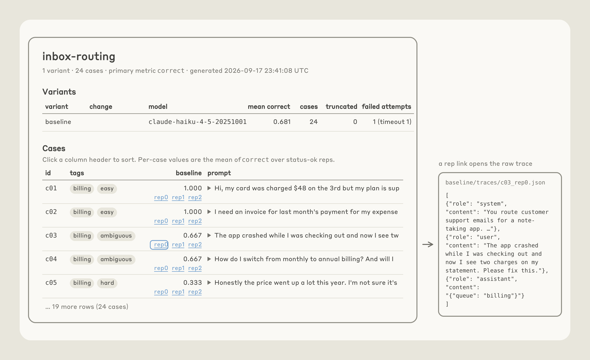

# Automating eval design and hillclimbing with Claude / claude.dev Blog

> Automatisch per `python ai.py ingest` erfasst. Quelle: [https://claude.dev/blog/automating-eval-design-and-hillclimbing/](https://claude.dev/blog/automating-eval-design-and-hillclimbing/)

## Inhalt

## Automating eval design and hillclimbing with Claude

Principles for designing evals and hillclimbing against them without fooling yourself, and how the claude-api skill's build-eval and hillclimb commands put them to work.

Evaluations provide a signal on how your app or skill is performing on specific tasks. But designing evaluations, and improving performance on them without fooling yourself, is hard. We've added guidance for both to the claude-api skill .

With the skill, you can run /claude-api build-eval to build an evaluation inside your codebase, and run /claude-api hillclimb to improve your application against it, one change at a time, with a held-out set of examples to catch overfitting.

In this article, we highlight the principles of good eval design and hillclimbing first, then show how Claude Code with the claude-api skill applies those principles. We’ll close by showing a few examples of these commands.

### EVAL DESIGN

Well designed evaluations have a few common elements (Figure 1):

- Eval tasks mirror production. Sample tasks that you care about in “production,” or the setting in which the capability or application you are testing will be used. Sometimes tasks are picked because they are easy to generate or they are easy to grade. But it’s important to ensure that the task distribution represents what you actually care about.

- Performance improves with stronger models and more thinking . More capable models and higher effort levels typically should perform better on an evaluation. If they don’t, ambiguous tasks or a miscalibrated grader often are hobbling performance.

- There is “passable” headroom at the frontier . The most capable model at the highest effort should be well below 100% on the evaluation, otherwise you can’t reliably judge how changes impact performance. Importantly, the gap should not be explained by impossible or ambiguous tasks: a common tell is that a task fails every evaluation run, regardless of the number of replicates. A good task is one where two domain experts would reach the same verdict and everything the grader checks is stated in the task.

- Low run-to-run variance . High variance is often due to poorly designed, ambiguous tasks or a grader that produces different verdicts on identical output. Variance can also hide in the configuration. For example, effort may not be applied consistently. Also, the environment can affect the results of the evaluation: leftover state from an earlier trial (a file, a git history) can hand the agent the answer.

#### Adversarial sampling

Model capability is jagged. If you pick cases because today's model fails them, you are sampling the valleys of one model's capability surface (Figure 2). The evaluation can end up measuring that model's failure fingerprint rather than what is intrinsically hard or valuable for your application to do.

Pick hard cases because a human judged them hard: a useful test is to be able to say why a task is hard before you include it. Include cases that are specific failures in your application derived from production traffic, bug reports, or tickets. However, don’t blindly trust user traffic: users sometimes try what they expect to work, so a task distribution drawn strictly from user traffic may skew easy.

### /CLAUDE-API BUILD-EVAL

The build-eval command in the claude-api skill turns these principles into a guided workflow. When you run /claude-api build-eval in Claude Code, Claude interviews you, builds the eval inside your codebase, and pauses for approval at specific points.

#### Designing examples

Claude helps you sample inputs to build evaluations in this order:

- Production transcripts, after asking about retention and sensitive data.

- Bug reports and support tickets.

- Five to ten cases you write by hand.

- Cases synthesized from your codebase.

The skill prioritizes production traffic, but it can also generate synthetic data anchored in a few real examples that you provide. The skill instructs Claude to generate a simple page that shows you every input and waits until you confirm them. As an illustration, below we show an example set of inputs for an e-mail router application that the skill may ask the user to review (Figure 3).

#### Validating the grader

After the inputs, Claude proposes the cheapest grader that fits your application’s output:

- Programmatic verification : If the output possibilities are constrained, it uses a code based check (exact match, a label from a fixed set, JSON that matches a schema, tests that pass).

- LLM-as-judge : It will default to this type of check if the output space is open-ended, with many valid answers but clear quality criteria. In this case, a second model reads the input, the output and a rubric written as checkable claims (not a 1-to-5 scale), and returns a score with its reasoning. If you have a baseline to compare against, the judge instead reads both inputs in random order, without being told which is the baseline, and picks the better one. You pick the judge model, and it should not be the model you are testing.

Claude grades a handful of cases and asks whether you would have scored any of them differently (Figure 4). In general, it is important to read a sample of scored transcripts before believing your evaluator; scoring failures are among the most common ways an evaluation is misconfigured.

When you’ve validated the grader, the skill tells you the size of the evaluation set (cases × repeats × model, and roughly how long it will take), runs the baseline, and prints the score with a confidence interval. What you get back: the cases, the grader, the runner, one JSON line and one full transcript per case, and a plain page that lists each case's score with a link to its transcript. If you want more than that page shows (e.g., a chart), just ask and Claude will build it as an extra page next to it. By default, these extra pages are static files that open locally and load nothing from the network.

#### Diagnostic checks

During the baseline runs mentioned above, Claude checks a number of things:

- Grader : Claude runs the grader twice on the same output, and reports whether the verdict changed.

- Plumbing : Claude checks for timeouts, API errors, and cut-off answers to ensure infrastructure noise doesn't pass as model variance.

- Headroom : if the baseline already scores about 95% or higher, the skill warns the user and alerts that the hillclimb should aim to explore cost or latency rather than quality.

### HILLCLIMBING

Now that you have a reliable means of grading your application’s performance on a task, you can try to improve it. Hillclimbing is an effective way to tune parameters like effort or prompts, which trade-off cost and performance. Some general tips for choosing where to apply it:

- Cheap iteration - It should be inexpensive (in terms of time, cost, and effort) to modify whatever surface you are focused on for hillclimbing. Many internal efforts and customers have focused hillclimbing on text, such as prompts and skills. These are easy to change and revert. In contrast, open-ended modifications to an agent harness during hillclimbing may involve extensive code changes.

- Attributable - Changes in the score on your evaluation should be attributable to the surface you are modifying during hillclimbing. For example, several successful applications of hillclimbing have focused on skill triggering. The evaluation metric (the trigger rate for the skill) is directly coupled to the skill description that is being modified.

- Well-scoped objective - One common failure mode is an open-ended request to improve performance without careful consideration of the headroom available in the evaluation; an evaluation that’s near saturation or a poorly scoped surface (e.g., an open-ended request to update the harness) is more likely to stall. One generally strong objective across various efforts is cost: even if an evaluation is saturated, you can ask Claude to find ways to reduce cost while keeping performance at parity.

#### Overfitting

Even a well-designed evaluation rarely matches the exact task distribution you care about in production. As a result, "overfitting" to an evaluation is a common problem and results in a system that performs better on an evaluation than on production traffic.

There are many ways an evaluation can "leak" into your harness (the code around the model, including prompts, tools, and loop that calls Claude). For example, consider an evaluation task that benefits from OCR, but OCR is rarely beneficial in your production tasks. The evaluation harness might add an OCR tool to your application, which improves on the benchmark without any impact on production. More broadly, hillclimbing may add features to that harness that address edge cases in the particular evaluation examples you’ve chosen. These harness additions improve your evaluation score, but don’t translate to improvements in production (Figure 5).

Three things can help address this:

- Split the cases . Use a train set that the hillclimber may read and a test set that is never seen. If the train set scores improve while the test set scores stay flat, then that is a common overfitting warning sign.

- Never paste failures into the prompt . If the hillclimber reads the failing transcripts, it should never paste the failure content into the prompt.

- Keep the answers structurally out of the model's reach . Models can sometimes “reward hack” by directly finding answers to evaluations.

As discussed below, the claude-api skill applies these principles for you.

### /CLAUDE-API HILLCLIMB

The hillclimb command in the claude-api skill turns these principles into a guided workflow. When you run /claude-api hillclimb in Claude Code, Claude iterates to improve against a given evaluation. You choose what changes it can make including:

- Your system prompt

- Skills or instruction files

- Tool descriptions

- Model choice, effort level, and other API parameters

- Your harness code

Before it starts, Claude asks what you want to optimize (e.g., performance, or cost while performance holds) and then splits the evaluation set at random into test and train. With a cost goal, it considers a few common cost drivers , including prompt caching, auditing the prompt for compatibility with the selected model, and picking the model and effort setting.

Before the first round, Claude checks that the eval's noise (how far the score can move by chance alone) is smaller than the smallest improvement you'd act on; if it isn't, it says so and suggests more repetitions or cases.

Each round, Claude reads the previous round’s train transcripts and proposes one change as a patch. It aims each round at a change whose effect can show above the eval's noise: it fixes the failing behavior at its root (e.g., rewrites the section that causes it or adds a missing rule) rather than rewording a line. It then runs evaluation with the patched change. At this point, Claude applies a check: if the train set improves but the test set is flat, Claude suspects overfitting and reverts the patch. If there is a regression, Claude reverts. If train and test sets improve, it keeps the patch (Figure 6).

When the score stalls for two or three rounds, Claude reads each remaining train failure and sorts it by cause. It does the same early if no single fix could gain more than the eval's noise, and suggests more repetitions or cases, rather than spending rounds on changes too small to measure. This step can catch ambiguous evaluation cases, harness errors, or run-to-run variance.

Only legitimate failures are included in more hillclimbing rounds.

When hillclimbing completes, Claude leaves your code at the version that did best on the test set for your goal. It reports the test result against the baseline with confidence intervals (Figure 7). If the gain is within noise, it says so and recommends against merging.

### EXAMPLES

#### Hillclimbing for cost reduction

We ran /claude-api hillclimb on an internal customer support benchmark with the goal of reducing cost and improving performance. The benchmark included 44 tickets, with 30 used for the search and 14 held out. It started on Opus 4.8 at default (high) effort settings with 74.4% decision accuracy on the search tickets and a token cost of 4.6 cents per ticket.

The hillclimb first audited the prompt, removing mandatory tool-call rituals, a scratchpad step, and contradictory rules. Then it tried Opus 5.5 on low effort. This cleared the baseline accuracy bar at 87.8% and cut cost to 1.9 cents per ticket, less than half the starting cost.

Part of that saving comes from Opus 5.5's pricing : input and output tokens cost 20% less than on Opus 4.8, and cache reads cost 60% less. Because Opus 5.5 cleared the bar, the hillclimb then stepped down a tier to check whether a cheaper model could clear it too. Sonnet 5 on low effort scored about the same, 88.9%, at about half the cost, 1 cent per ticket (Figure 8).

Finally, Claude improved the prompt with routing rules and a refund-cap cross-reference, bringing Sonnet 5 to 98.9% at about the same cost. On the 14 held-out tickets that the search never saw, the final configuration scored 90.5% against the original setup's 78.6%, at about one fifth of the cost.

#### Hillclimbing for performance improvement

Another example is our claude-api skill, which provides guidance on using our APIs and general tips for working with Claude (including the sub-commands discussed in this article). We want to ensure our skill can correctly implement code that uses our APIs, and we built an evaluation set derived from our documentation to test the skill.

On our evaluation, the skill started at 66%. We gave the hillclimber access to documentation and our SDKs, allowing Claude to identify errors and self-correct them (Figure 9). Claude found that the skill was missing coverage of eight features.

Adding sections for them in the skill improved performance to 74%. It then found errors in C# and Java type tables, boosting performance to 77%.

After the score stalled for two rounds, Claude analyzed the remaining failures and bucketed them by root-cause. A normal round makes one edit for the most common failure. This step makes no edit; it only sorts every remaining failure by cause. This reflection step was useful in a few ways:

- Reflecting across a collection of failures, the hillclimber found that the skill content was present but Claude was simply writing older API shapes (e.g., from its trained priors). To address, the hillclimber added a table near the top of the skill that guided Claude from the forms it remembered to the current ones: for example, from extended thinking with a fixed token budget, which the API now rejects on recent Opus models, to adaptive thinking, and from older versions of the web search and web fetch tools to the current ones. It also moved the C# and Java warnings against fixed-budget thinking above their adaptive-thinking examples. This improved performance to 80%.

- Tasks that never improved in performance despite addressing obvious content gaps are tells that the example or grader is flawed. One task asked for code that catches one error type, while its grader wanted a chain of at least three. Claude reworded the task. Another grader's instructions contradicted our docs, and testing the real API showed the docs were right. Addressing these, along with more skill edits, brought performance to ~88%.

### GETTING STARTED

Note: Run claude update first. The claude-api skill ships inside Claude Code, so updating gets you the latest version of these commands.

```
claude update
```

Then, in Claude Code:

```
/claude-api build-eval
/claude-api hillclimb
```

These sub-commands can be used directly in Claude Code via the claude-api skill :

Run /claude-api build-eval if you want to generate an evaluation set for a particular problem. You can steer it by providing access to examples (e.g., traces). Claude will employ the guidance shared in this article to design the examples and grader, and ensure you approve the examples and the grader.

Run /claude-api hillclimb if you have an evaluation and want Claude to improve on this, guided by your goal (e.g., better performance, or lower cost while performance holds). Claude will employ the guidance shared in this article to check for overfitting while climbing and check for bugs in the eval itself, such as a grader that marks a correct-looking answer wrong or a harness error, both before the first round and whenever the score stalls.

With special thanks to Misha Khalman for skill development. With thanks to Misha Khalman, Michael Segner, Matt Bell, Matt Thanabalan, and Punit Shah for reviews, contributions, and product support.

## Bilder





<!-- Ergänzt am 2026-10-02: Die Abbildungen 1, 8 und 9 sind auf der Seite eingebettete SVGs und wurden vom Ingest nicht erfasst. Sie wurden per Playwright als Element-Screenshot gesichert. Die Bilder 01–06 oben entsprechen den Abbildungen 2–7. -->


