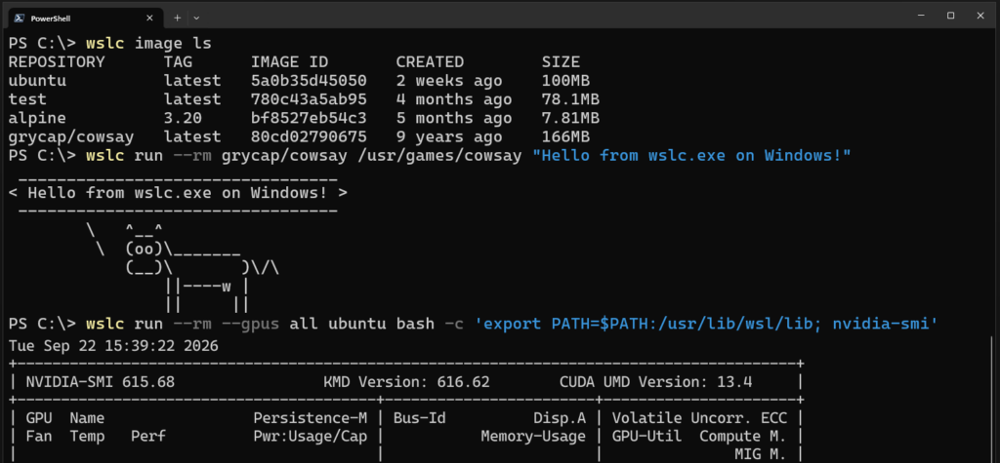

# WSL containers is now generally available

> Automatisch per `python ai.py ingest` erfasst. Quelle: [https://blogs.windows.com/windowsdeveloper/2026/09/29/wsl-containers-now-generally-available/](https://blogs.windows.com/windowsdeveloper/2026/09/29/wsl-containers-now-generally-available/)

## Inhalt

## WSL containers is now generally available

- Logan Iyer, Corporate Vice President, Windows Platform + Developer

WSL is central to our commitment to making Windows the best place to build, run and manage Linux workloads. As AI, cloud-native development, containers, and open-source ecosystems continue to converge on Linux, more developers are choosing to perform these workloads directly on Windows devices. We’re continuing our journey towards this goal with a new feature in WSL: WSL containers , which is generally available today.

To try it out,  simply run wsl --update in your terminal or download the latest release from GitHub and you will gain access to:

- WSL containers CLI : wslc.exe to directly build, run and deploy Linux containers on Windows, or use its built-in alias container.exe to run the same familiar container commands

- WSL containers API : Access functions to run Linux containers programmatically in your native Windows apps – unlocking scenarios like running local AI workloads or using cloud-based containerized applications locally.

For a deeper look at how WSL containers are built, how they work with WSL, and the architecture behind the platform, see our WSL containers architecture blog.

Let’s get into what’s new with GA.

### New commands and capabilities

Since public preview, we’ve continued to evolve WSL containers and our focus has been on making every day container workflows simpler, improving visibility into running environments, and adding the flexibility needed to manage containers at scale. As part of the GA release, we’ve introduced several new commands and capabilities across container lifecycle, networking, and observability.

Here are a few highlights, and you can view the full change logs on our releases page :

- wslc container restart — restart a running container

- wslc container cp — copy files in and out via tar archive

- wslc system info — see the state of your container environment at a glance

- wslc network connect and wslc network disconnect — attach and detach containers from networks

- wslc network create now supports arbitrary network driver options

- wslc events – Streams real time container activity

- Container health checks are now supported

- --stop-timeout on wslc create and wslc run , including -1 for an infinite timeout

- --mount support during wslc create and wslc run

- A configurable storage path for the default wslc session, so you can put your container storage on the drive you want.

Alongside new commands and platform enhancements for developers, we’ve also focused on helping organizations adopt WSL containers with the governance and security controls required for production environments.

### Enterprise manageability for WSL containers

This release extends Microsoft Intune and Microsoft Defender for Endpoint (MDE) integrations in WSL to include container workflows as well.

MDE’s existing plugin for WSL has been augmented to also include support for containers. MDE can surface process, file and network activity from WSL containers and connect that activity back to Windows host, helping security teams investigate suspicious activity without creating a separate security workflow.

Microsoft Intune has also added controls to enable or disable WSL container and restrict image pulls to approved registries. Additionally, on your Intune dashboard you will see new settings specific to the WSL container feature:

- Allow WSL containers access – Control access to the entire WSL containers feature.

- WSL containers registry allow list – For WSL containers enterprise adoption, organizations need stronger controls over the container images that can be introduced into their environment. With container registry allow lists, administrators can define approved registries and help ensure developers only pull container images from that list, that meet organizational security and compliance requirements.

You can view the WSL enterprise doc pages to learn more on how to set up WSL for your company.

### Partner and community integrations

Partners and community contributors are bringing WSL containers into the editors, terminals and desktop tools developers already use, add ing su pport for WSLc into existing pro j ects or creating new ones. We’re grateful for the fantast ic community contributions that continue to expand the ecosystem around WSL containers.

- VS Code dev container support : Use wslc as your default driver for creating and interacting with VS Code dev containers

- Aspire : Aspire can use WSL Containers as first-class container runtime

- VS Code container extension : A popular extension to manage your containers in VS Code, now supports wslc .

- Lazywslc : A TUI dashboard to manage your WSL containers

- WSL Container Desktop : WinUI 3 desktop app for managing WSL containers, Kubernetes (k3s) and container registries.

- WSLc remote : A short wrapper script to run wslc from within WSL distros

### What’s next for WSL

Over time, we see Linux on Windows evolving beyond a development environment into a strategic execution platform for AI and cloud-native workloads, participating in the same enterprise security, management, and governance frameworks as Windows. We will continue to invest in the broader WSL experience, and in context of this release wanted to highlight two WSL specific items on our roadmap.

#### Adding wslc compose

Our top feature request for WSLc is adding compose support, and this will be our focus for our next iterations.

Our aim is for wsl compose up to work with your existing compose.yaml files, unchanged. We’ve started on this and hope to share more soon.

#### WSL fundamental improvements

We are also actively investigating how to better improve some of the core platform capabilities for WSL including networking, cross-OS file performance and more.

You can see some of this work today with wslc, supporting up to 2x faster performance when accessing Windows files from Linux environments, helping reduce one of the most common cross-OS bottlenecks. It also introduces the new consomme network mode, enabled for container workflows which improves networking compatibility across developer and enterprise scenarios.

These foundational improvements benefit WSL distributions, WSL containers, and other container technologies built on WSL, reflecting a broader effort to make Linux on Windows feel increasingly seamless and integrated.

### Building the future of Linux on Windows, together

Thank you to the developers who tested the preview, shared feedback and helped improve WSL containers. Y ou can fil e any te ch nical is sues and feature requests at the W SL Gi tHub rep o microsoft / wsl , and you can learn more about WSL at the WSL docs . We invite you to bring your next project to WSL containers and help shape what comes next. We will continue investing in the performance, compatibility and integration that make Windows a great place to build with Linux .

## Bilder

