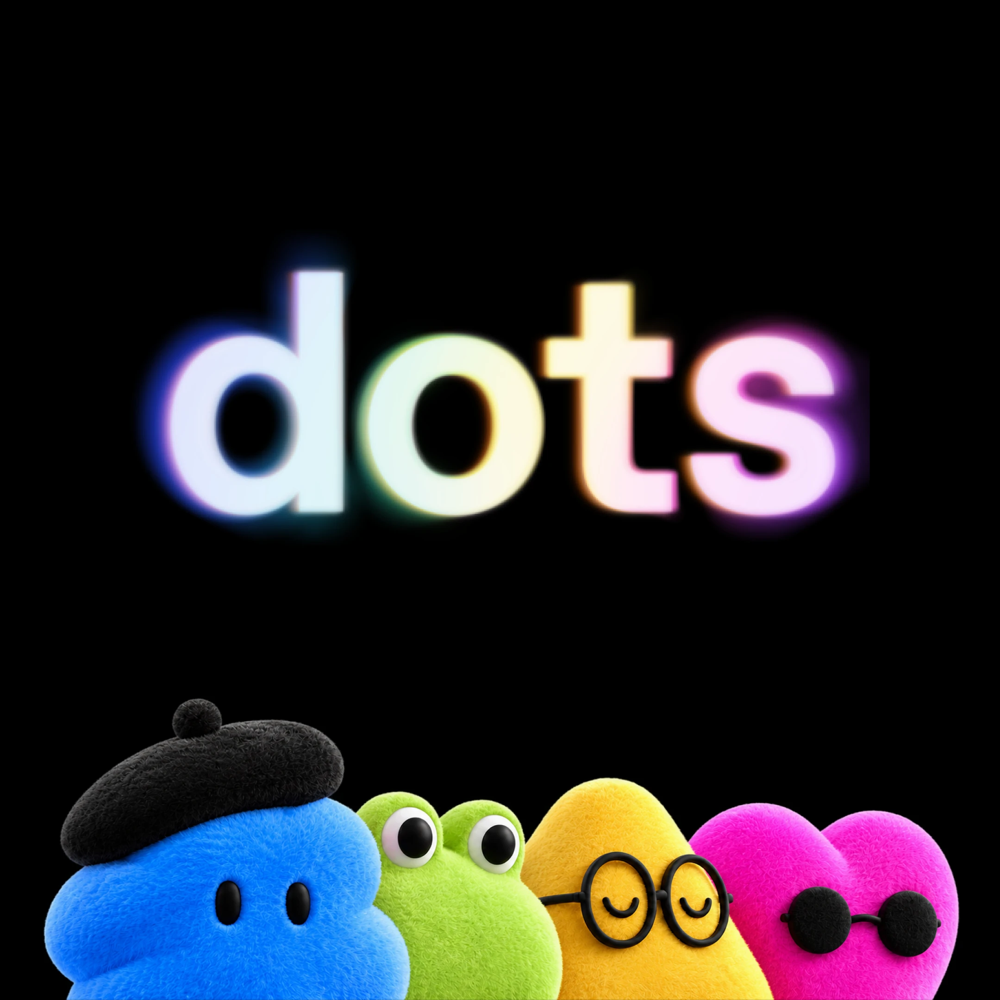

# Rückblick auf den DevDay 2026

> Automatisch per `python ai.py ingest` erfasst. Quelle: [https://openai.com/de-DE/index/devday-2026-recap/](https://openai.com/de-DE/index/devday-2026-recap/)
>
> Vervollständigt am 2026-10-02: Der Ingest-Abruf lieferte nur Einleitung und Zwischenüberschriften, weil die Seite die Abschnitte per JavaScript nachlädt. Der Text unten stammt aus der im Browser (Playwright) gerenderten Seite, unverändert übernommen; entfernt wurden nur Link-Hinweise wie „Mehr erfahren“ und „(wird in einem neuen Fenster geöffnet)“. Datum von 2026-10-01 auf 2026-09-29 korrigiert (Datum laut Seite; das 01.10. gehörte zu einem „Mehr lesen“-Teaser).

## Inhalt

## Rückblick auf den DevDay 2026

Beim DevDay 2026 eröffnen wir Menschen mehr Möglichkeiten für anspruchsvolle Vorhaben und geben ihnen Tools, um die Zukunft zu gestalten

Der DevDay 2026 ist unser bisher größter: mit mehr als 20 wichtigen Ankündigungen zu ChatGPT, Codex, unseren Modellen und völlig neuen Formen der Arbeit mit KI.

Wir glauben, dass KI eine neue Renaissance der Kreativität und Entdeckungen ermöglichen kann. Sie sollte Menschen mehr Zeit für das geben, was ihnen wichtig ist, mehr Freiheit, ihre Ideen zu verfolgen, und die Fähigkeit, Dinge zu tun, die sie nicht für möglich gehalten hätten.

Heute haben wir Agenten vorgestellt, die dauerhaft Verantwortung übernehmen können, sowie neue Möglichkeiten für die Zusammenarbeit von Menschen und KI. Außerdem haben wir unser Engagement für ein offenes Ökosystem ausgeweitet: Wir öffnen ChatGPT als gemeinsame Arbeitsumgebung, in der Menschen und Agenten zusammenarbeiten können. Entwicklungsteams können dort neue, nativ integrierte Anwendungen direkt für die insgesamt 1,2 Milliarden Menschen bereitstellen, die unsere Angebote nutzen.

Hier findest du alle Ankündigungen im Überblick.

### Eine neue Ära aktiver Intelligenz

#### dots

Die bemerkenswert leistungsfähigen, stets aktiven Agenten übernehmen dauerhaft Verantwortung. So hast du mehr Zeit und Aufmerksamkeit für die Dinge, die dir wichtig sind. dots basieren auf GPT‑6 Astra, unserem intelligentesten und am besten auf menschliche Ziele ausgerichteten Modell. Sie verfügen über einen eigenen Cloud-Computer und arbeiten in den Apps, die du verbindest. Gib deinem dot ein Ziel und lege fest, was er selbstständig tun darf. Dann macht er sich in deinem Auftrag proaktiv an die Arbeit. Langfristig stellen wir uns Teams von dots vor, die gemeinsam in deinem Auftrag arbeiten.

In Pro, Business Premium und Enterprise verfügbar.

#### GPT-6.1 Sol

Wir stellen GPT‑6.1 Sol vor: ein umfangreiches Upgrade von GPT‑6 Sol mit außergewöhnlich hoher Leistung beim agentischen Programmieren, bei der Computerbedienung und bei beruflichen Aufgaben. Es bietet allen nahezu die Intelligenz von Astra zu einem Fünftel der regulären Preise für dessen Eingabe- und Ausgabe-Token. So können Entwicklungsteams komplexe Arbeitsabläufe bei gleichem Budget flexibler umsetzen.

Verfügbar für alle, die die API oder die Tarife Plus, Pro, Business, Enterprise oder Edu nutzen.

#### Ultrafast

Ultrafast ist unsere Premium-Geschwindigkeitsstufe für Aufgaben, bei denen Geschwindigkeit besonders zählt. Ultrafast bietet eine bis zu 8-mal schnellere Token-Generierung in Codex (300 Token pro Sekunde) und eine bis zu 6-mal schnellere in der API.

GPT‑6 Astra Ultrafast ist ab heute in der API sowie mit den Tarifen Pro 500 und Enterprise in ChatGPT Work und Codex verfügbar. GPT‑6.1 Sol Ultrafast ist bald verfügbar.

#### Private Intelligence

OpenAI Private Intelligence ermöglicht Unternehmen, Frontier-KI sicher und unter Wahrung der Vertraulichkeit zu nutzen. Private Intelligence verbindet keine Datenaufbewahrung mit Private Safety Processing und einer Vorschau auf Private Inference. Keine Datenaufbewahrung mit Private Safety Processing ermöglicht eine automatisierte Offline-Sicherheitsprüfung, ohne dass OpenAI Kundeninhalte aufbewahrt. Private Inference verbindet Confidential Computing mit strengen, überprüfbaren Kontrollen und bietet Unternehmen so starke Datenschutzzusicherungen bei der Nutzung von Frontier-Modellen.

### Neue Möglichkeiten, mit Codex und der API zu entwickeln

#### Codex in der Cloud

Nutze Codex dort, wo du es brauchst: auf deinem Computer, per Fernzugriff von deinem Smartphone oder von jedem Gerät aus in der Cloud. Wiederverwendbare Entwicklungsumgebungen helfen, Aufgaben schnell zu starten, und bieten deinem Team eine gemeinsame Umgebung mit genehmigten Einstellungen und Berechtigungen. In Plus, Pro, Business, Healthcare, Education und Enterprise verfügbar.

In allen Tarifen verfügbar.

#### Eine überarbeitete Codex CLI

Die Codex CLI unterstützt jetzt Sprachchats. Du kannst Aufgaben starten und steuern, indem du direkt mit Codex sprichst. Mit der neuen Ansicht /agents kannst du Arbeit auf Agenten verteilen und den Fortschritt mehrerer Aufgaben gleichzeitig im Blick behalten. Wir haben auch alltägliche Abläufe verbessert: vom Bearbeiten von Prompts über das Fortsetzen von Sitzungen bis hin zur integrierten Worktree-Unterstützung. Die überarbeitete Terminaloberfläche ist übersichtlicher und macht längere Sitzungen leichter lesbar.

In allen Tarifen verfügbar.

#### Code Review

Eine neue Oberfläche für Code-Reviews in der ChatGPT‑Desktop‑App hilft dir, projektübergreifend schnell das Wesentliche zu erkennen. Verschaffe dir mit einer Zusammenfassung einen Überblick, prüfe Diffs im Detail und frage Codex nach möglichen Problemen, bevor du Feedback gibst. Mit automatischen Reviews kann Codex eine erste Prüfung in der Cloud übernehmen, während du nicht da bist. Code Review unterstützt GitHub-Pull-Requests und GitLab-Merge-Requests.

In allen Tarifen verfügbar.

#### Codex Security Cloud

Wir integrieren unseren Defense Factory-Ansatz zur kontinuierlichen Abwehr in Codex Security Cloud. Dazu gehört der Zugriff auf Modelle, die über Daybreak Blue verfügbar sind, ohne dass ein separater Antrag für Daybreak erforderlich ist. Teams können jetzt zusätzlich zu laufenden Prüfungen neuer Commits ganze GitHub-Repositories bei Bedarf oder nach Zeitplan scannen. Untersuchungen, automatische Deduplizierung und Fehlerbehebungen laufen in der Cloud. So geht die Arbeit auch bei zugeklapptem Laptop weiter. Als Plugin in Codex auf dem Desktop und im Web verfügbar.

Für alle verfügbar, die Codex nutzen.

#### Decisions API

Die Decisions API ermöglicht Entscheidungen in Echtzeit, indem sie die Intelligenz von Luna auf einen selbst definierten Fragenkatalog mit einer begrenzten Anzahl vorgegebener Antworten ausrichtet. Entwicklungsteams liefern Kontext in Form von Text oder Bildern und erhalten Antworten, mit denen sie Inhalte klassifizieren, Anfragen weiterleiten oder die nächste Aktion eines Agenten auswählen können.

Ab heute als begrenzte Vorschau verfügbar. Eine breite Veröffentlichung ist für die kommenden Tage geplant.

#### Computerbedienung in der Agents API

Die Agents API bietet Entwicklungsteams jetzt verwalteten Zugriff auf den Harness von Codex. Deine Anwendung definiert den Auftrag, verbindet Tools und Daten und zeigt den Fortschritt an. OpenAI betreibt das zugrunde liegende System. Das beschleunigt die Entwicklung von Agenten und reduziert die Agenteninfrastruktur, die dein Team aufbauen und warten muss. Die Agents API unterstützt die leistungsfähigen Funktionen von Codex, etwa die Zusammenarbeit mehrerer Agenten, Toolsuche, Toolaufrufe, Kontextverdichtung und jetzt auch Computerbedienung.

Über die API verfügbar sowie in Codex und ChatGPT Work für Abonnements des Pro-Tarifs für 500 USD und berechtigte Enterprise-Unternehmen.

#### Amazon Bedrock Managed Agents for OpenAI

Bedrock Managed Agents baut auf der zentralen Agents API auf und ergänzt AWS-Anpassungen und -Integrationen. Dabei nutzt es Rechenleistung und AWS-Ressourcen unter der Kontrolle des jeweiligen Unternehmens. Teams, die auf AWS entwickeln, können das verwaltete Agentensystem zusammen mit ihrer bestehenden Infrastruktur nutzen.

### Neue Möglichkeiten, ChatGPT mit Plugins anzupassen

#### Plugin-Erweiterungen

Wir öffnen die Plattform, mit der wir Funktionen für ChatGPT entwickeln. Mit Plugin-Erweiterungen können Entwicklungsteams funktionsreiche Anwendungen direkt in ChatGPT erstellen. Du kannst deinem Plugin jetzt einen Platz in der Seitenleiste geben, einen interaktiven Bereich zum Arbeiten neben der Unterhaltung entwickeln oder eine Dateiansicht für die von deinem Produkt unterstützten Dateitypen erstellen.

In allen Tarifen verfügbar.

#### Plugins einfacher erstellen, einreichen und finden

Plugin Creator hilft dir, ein Plugin zu erstellen. Der überarbeitete Einreichungsprozess gibt dir klareres Feedback. Wir verbessern außerdem, wie wir Plugins im Verzeichnis und in Unterhaltungen sortieren und empfehlen, damit alle leichter passende Plugins finden. Du entscheidest weiterhin selbst, welche Plugins du nutzt, und genehmigst den Zugriff für jedes einzeln.

In allen Tarifen verfügbar.

#### Sites mit verbundenen Plugins

Du kannst jetzt unterstützte ChatGPT‑Plugins in die mit Sites erstellten Anwendungen einbinden. So können Teammitglieder in deinem Workspace dieselbe App mit ihren eigenen verbundenen Daten und Anmeldeberechtigungen nutzen. Außerdem erleichtern wir das Hinzufügen und Verwalten von Automatisierungen, damit Sites geteilte Informationen aktuell halten kann.

In den Tarifen Business, Enterprise, Healthcare und Education verfügbar.

#### MCP-Ereignisse für Plugin-Automatisierungen

Wir ergänzen die Unterstützung für den Entwurf der MCP-Events-Spezifikation. So können Plugins Automatisierungen starten, wenn in einer verbundenen App etwas passiert. Du kannst ChatGPT zum Beispiel bitten, auf neue Aufgaben in einem Projektboard zu achten. Sobald eine Aufgabe eingeht, kann ChatGPT die verlinkten Dokumente lesen und einen Plan entwerfen, auch wenn du gerade nicht da bist.

In allen Tarifen verfügbar.

### Eine bessere Zusammenarbeit zwischen Menschen und KI

#### ChatGPT Space

Ein neuer Ort, um mit KI und deinem Team Aufgaben zu erledigen. Füge dein Team zu einem eigenen Bereich hinzu. Dort können alle, einschließlich ChatGPT, gemeinsame Ziele und bisherige Arbeiten nutzen, um auf euren Ergebnissen aufzubauen. Bitte ChatGPT, aus einer Unterhaltung eine Seite oder Folien zu erstellen. ChatGPT stellt zunächst klärende Fragen und erstellt dann vor deinen Augen einen Entwurf. Bearbeite ihn selbst, bitte ChatGPT um eine Überarbeitung oder lass dein Team mitmachen. Dafür musst du deine Arbeit nicht in ein anderes Tool übertragen.

In den Tarifen Pro, Business und Enterprise in der ChatGPT‑Desktop‑App und im Web verfügbar, bald auch auf Mobilgeräten.

#### Living Pages

Eine neue Art von Dokument für deine Zusammenarbeit mit Agenten und deinem Team: von Projektplänen und Berichten bis hin zu visuellen Konzepten und mehr. Alles, was du mit ChatGPT machen kannst, kannst du auch auf einer Seite erledigen. Erstelle gemeinsam mit ChatGPT oder deinem dot Diagramme, interaktive Dashboards und Bilder und strukturiere deine Arbeit mit Überschriften, Aufzählungen und Tabellen. Lade dein Team ein, Ideen und Feedback durch Kommentare oder direkte Bearbeitungen beizutragen. Markiere dann deinen dot oder ChatGPT, um die Arbeit zu überarbeiten oder die nächsten Schritte zu übernehmen. Lass Seiten automatisch aus verbundenen Tools aktualisieren: zum Beispiel eine To-do-Liste, die deinen aktuellen Arbeitsstand widerspiegelt, oder eine Fortschrittsübersicht für ein Produktteam, die durch Updates aus verbundenen Datenquellen aktuell bleibt.

In den Tarifen Pro, Business und Enterprise verfügbar.

#### Gemeinsam an Folien arbeiten

Ein neuer, leistungsfähiger Präsentationseditor, mit dem dein Team und ChatGPT gemeinsam professionelle Präsentationen erstellen können. Ob Finanzübersicht oder Präsentation für ein Kundenunternehmen: Der Editor bietet dir die nötigen Tools, um Inhalte visuell überzeugend zu vermitteln, darunter nativ integrierte, bearbeitbare Diagramme sowie Text, Formen und Bilder. Verwandle eine Unterhaltung in Folien oder starte mit deiner eigenen Vorlage. Gib ChatGPT dann während der Erstellung Feedback. Lade mehrere Teammitglieder ein, die Präsentation gleichzeitig direkt zu bearbeiten, Kommentare zu hinterlassen oder zu markieren, was ChatGPT ändern soll. Wenn du fertig bist, präsentiere direkt aus ChatGPT oder exportiere nach PowerPoint oder Google Slides. Dort kannst du die Präsentation weiterbearbeiten, ohne die Formatierung zu verlieren.

In den Tarifen Pro, Business und Enterprise verfügbar.

#### Teams erstellen und Aufgaben teilen

Füge andere einem Team in ChatGPT hinzu und teile dann Seiten, Präsentationen, Tabellen und mehr mit allen. Du kannst auch Teamaufgaben erstellen, um wiederkehrende Arbeiten wie ein wöchentliches Projektupdate zu delegieren. Beschreibe, was du brauchst. ChatGPT kann dann mit verbundenen Tools Informationen sammeln und Aktionen ausführen: nach Zeitplan oder wenn sich etwas ändert, etwa wenn eine neue Nachricht per E-Mail oder in Slack eingeht. Teammitglieder können die Anweisungen gemeinsam aktualisieren, damit Aufgaben auch bei veränderten Prioritäten nützlich bleiben.

In den Tarifen Business und Enterprise verfügbar.

#### @ChatGPT in Slack und Microsoft Teams

Erwähne @ChatGPT in Kanälen, Threads oder Direktnachrichten, um aus einer Diskussion ein Projektbriefing zu erstellen, einen Fehler zu untersuchen und eine Korrektur zur Prüfung vorzubereiten oder jeden Morgen ein Update für Kundenunternehmen zu veröffentlichen. ChatGPT kann Tools nutzen, die deine Administration verbunden hat, oder deine Tools mit deinen Berechtigungen. Teammitglieder können in derselben Unterhaltung Kontext ergänzen und die Arbeit verfeinern, auch ohne eigene ChatGPT‑Lizenz.

In den Tarifen Business und Enterprise verfügbar.

#### Meetings-Plugin

Nimm Meetings mit dem Meetings-Plugin als Audio auf und speichere Meeting-Notizen in ChatGPT Space. Behalte Notizen für dich oder teile sie mit deinem Team. ChatGPT kann den Kontext eurer bisherigen Zusammenarbeit nutzen, um die für dich wichtigsten Erkenntnisse, Entscheidungen und nächsten Schritte zusammenzufassen. Bitte ChatGPT, dir bei den anstehenden Aufgaben zu helfen. Bitte ChatGPT zum Beispiel nach einem Team-Stand-up, deinen Projektplan um Entscheidungen, Hindernisse und Änderungen zu ergänzen.

Als Beta mit Pro und Business verfügbar, bald auch mit Enterprise.

#### Teilbare Profile

Mit teilbaren Profilen kannst du Sites und Plugins präsentieren, die andere entdecken und wiederverwenden können. Ein Profil bündelt deine Werke, damit du sie an einem Ort teilen kannst. Teammitglieder können auch geteilte Skills entdecken. Das Teilen von Skills ist auf den Workspace beschränkt.

Bald in ChatGPT Enterprise, Edu und Healthcare verfügbar, in allen anderen ChatGPT‑Tarifen bereits verfügbar.

### Mehr mit deinem ChatGPT-Abo erreichen

#### Mit ChatGPT anmelden

Melde dich mit deinem ChatGPT‑Konto bei teilnehmenden Produkten an, ohne ein weiteres Passwort zu erstellen. Partnerunternehmen erhalten nur deinen Namen, deine E-Mail-Adresse und, falls vorhanden, dein Profilbild. Bei der Anmeldung werden weder deine Chats noch deine Erinnerungen geteilt. Weitere Zugriffe genehmigst du separat.

Weltweit für alle verfügbar, die bei ChatGPT angemeldet sind, abhängig von den Einstellungen der Organisation.

#### Eine neue Pro-Tarifstufe

Für alle, die mehr entwickeln möchten, führen wir einen Pro-Tarif für 500 USD pro Monat ein: mit unseren höchsten Nutzungslimits und exklusivem Zugang zu Astra Ultrafast, unserem schnellsten Frontier-Modell. In ChatGPT Work und Codex ist es bis zu 8-mal schneller als die Standardversion von Astra.

#### OpenAI Marketplace

Berechtigte Unternehmenskunden können einen Teil ihres bestehenden Abnahmevolumens bei OpenAI für genehmigte Partnersoftware einsetzen. So haben sie mehr Flexibilität beim Kauf von Tools für ihre Teams. Zu unseren ersten 32 Partnerunternehmen gehören Adobe und Figma für kreative Arbeit; Sierra, Decagon, Hubspot, Salesforce und ServiceNow für das Kundenerlebnis; Harvey und Legora für den Rechtsbereich sowie Palo Alto Networks und CrowdStrike für Cybersicherheit.

Als Beta für berechtigte Unternehmenskunden und genehmigte Partnerprodukte verfügbar.

## Bilder

<!-- Die drei Bilder gehören nicht zum Artikel, sondern sind Vorschaubilder der „Mehr lesen“-Teaser am Seitenende (Albertsons, GPT-6.1 Sol, dots). Das Video zu „dots“ im Artikel wurde nicht archiviert. -->

