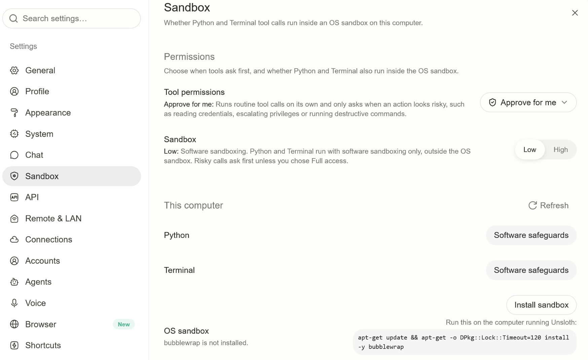
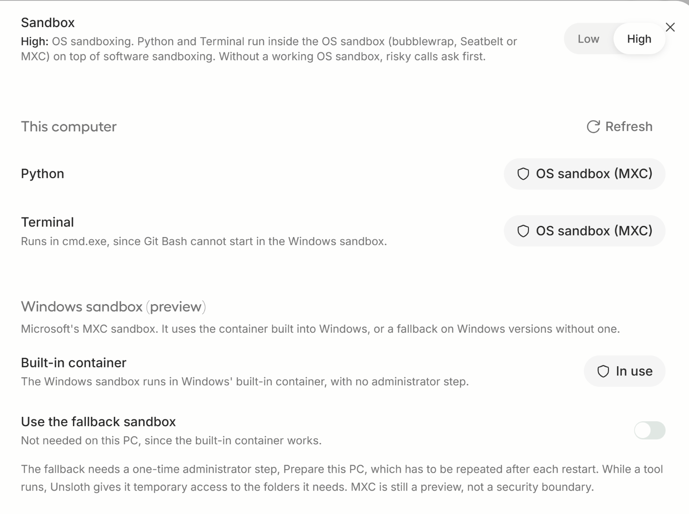
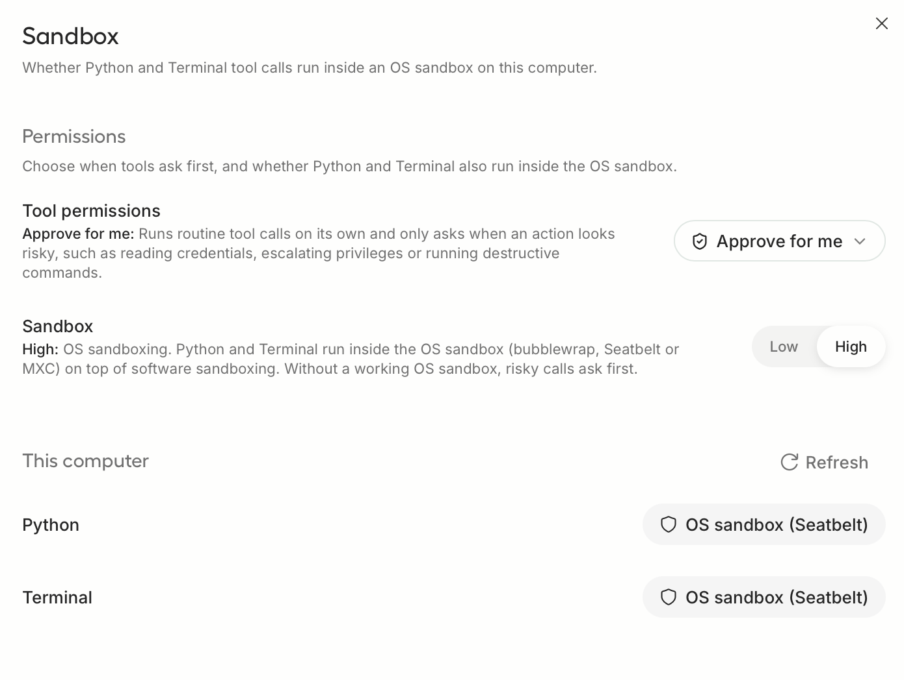
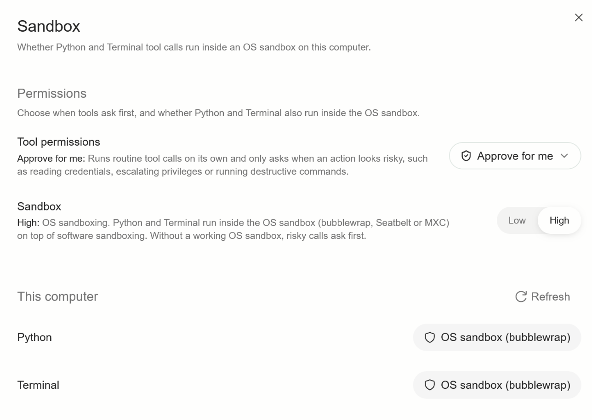
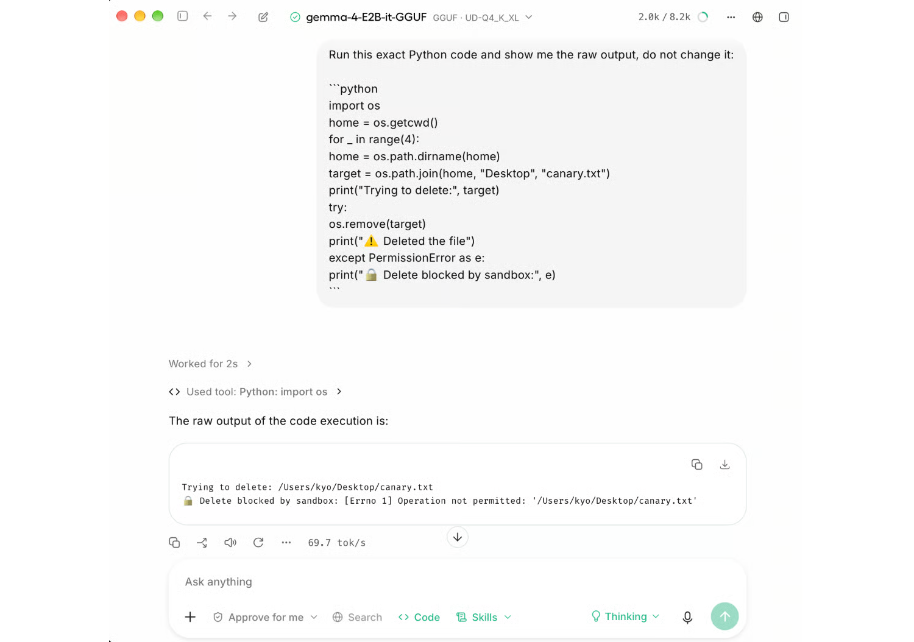
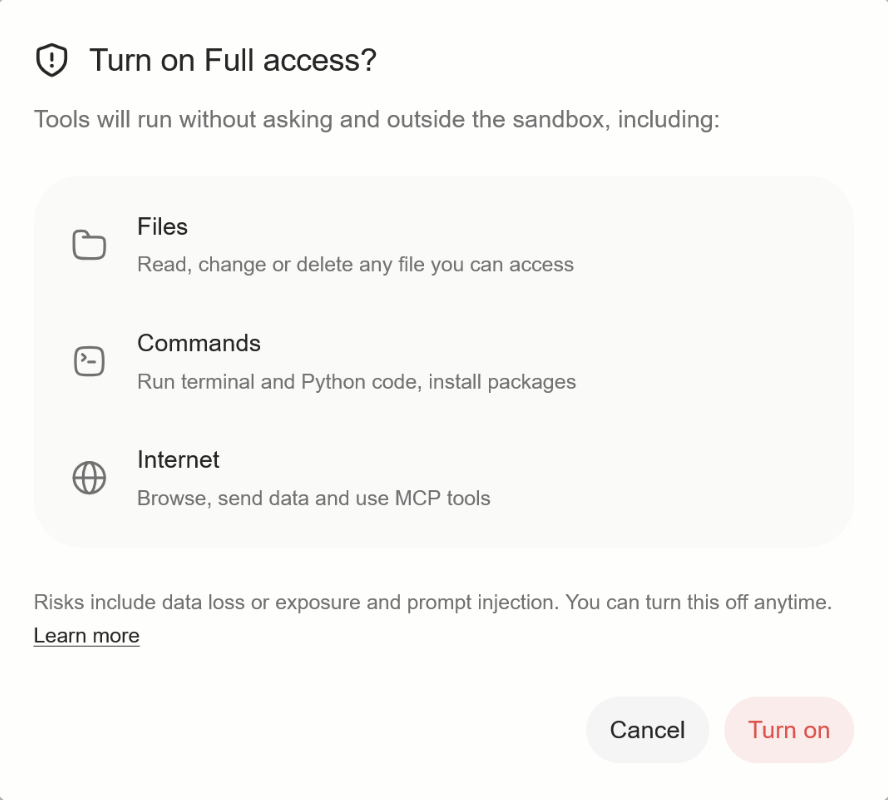

# Sandboxing in Unsloth | Unsloth Documentation

> Automatisch per `python ai.py ingest` erfasst. Quelle: [https://unsloth.ai/docs/new/studio/sandboxing-in-unsloth](https://unsloth.ai/docs/new/studio/sandboxing-in-unsloth)

## Inhalt

## Sandboxing in Unsloth

Unsloth uses bubblewrap on Linux, Seatbelt on macOS, and MXC on Windows.

Unsloth now has OS level sandboxing which makes all tool calls get isolated in some folders without doing OS level harm. Unsloth has 2 modes - "low" and "high" sandbox security - low employs Unsloth's software sandbox methods which are sophisticated string, AST and regex checks for all tool calls (disabling dangerous rm -rf, exfiltrate tokens etc). High is true OS level sandboxing, which we have for all platforms.

Windows

MXC (Windows official)

164ms

Linux

Bubblewrap / Bwrap

50ms

Mac

Seatbelt (Mac internal)

110ms

To enable OS level sandboxing:

- Windows - MXC is pre-installed for Windows 11 24H2 and higher.

Windows - MXC is pre-installed for Windows 11 24H2 and higher.

- Linux - Bwrap will need to be installed - select "High" and we will install it for you

Linux - Bwrap will need to be installed - select "High" and we will install it for you

- Mac - Seatbelt is pre-installed , so Unsloth auto enables Seatbelt

Mac - Seatbelt is pre-installed , so Unsloth auto enables Seatbelt

To check if OS Sandboxing is Low or High, click on the permissions button:

If you click "Learn More", you will head to the Sandbox Settings page, and you can see if you have software sandboxing enabled, and also how to install bwrap, MXC as well:

For all 3 operating systems, you can see how OS level sandboxing is enabled:

Windows:

Mac:

Linux:

You can see the sandbox in action where it blocks accesses outside of the workspace:

#### Latency of sandboxing

We optimized software and hardware OS level sandboxing a lot, but OS level sandboxing definitely has a latency addon. See below for a table:

Windows

MXC (Windows official)

8ms

164ms

Linux

Bubblewrap / Bwrap

3ms

50ms

Mac

Seatbelt (Mac internal)

10ms

110ms

#### Disable Sandboxing / Bypass Permissions / Full Access

To disable sandboxing (both software low and OS level high), simply press "Full Access", and now Unsloth can now access your entire computer with 0 constraints.

#### Software Sandboxing Approach

Software Sandboxing in Unsloth is a bunch of regular expressions, string checks and more - we add about 1-2ms of extra latency per tool call, and we block the following:

- Deleting and disk tools: rm, dd, mkfs, fdisk, mount, umount

Deleting and disk tools: rm, dd, mkfs, fdisk, mount, umount

- Permissions and privilege: chmod, chown, sudo, su, doas, pkexec, passwd

Permissions and privilege: chmod, chown, sudo, su, doas, pkexec, passwd

- Network: curl, wget, nc, ncat, netcat, socat, ssh, scp, sftp, rsync

Network: curl, wget, nc, ncat, netcat, socat, ssh, scp, sftp, rsync

- Processes and power: kill, killall, pkill, shutdown, reboot, halt, poweroff

Processes and power: kill, killall, pkill, shutdown, reboot, halt, poweroff

- Running another script's contents unseen: eval, source

Running another script's contents unseen: eval, source

- Windows only: rmdir, takeown, icacls, runas, powershell, pwsh

Windows only: rmdir, takeown, icacls, runas, powershell, pwsh

Python code, by reading the code before it runs:

- Shell escapes: os.system , and subprked command, or a non-literal command (for example pip install through su)

Shell escapes: os.system , and subprked command, or a non-literal command (for example pip install through su)

- Network calls: requests, urllib , raw socket connections

Network calls: requests, urllib , raw socket connections

- Some sensitive system reads, such as /etc/passwd

Some sensitive system reads, such as /etc/passwd

- Tampering with signals or timeouts,used to dodge them.

Tampering with signals or timeouts,used to dodge them.

Applied to every call in both modes:

- Secret environment variables are stripped.

Secret environment variables are stripped.

- Studio's own credential files are refused

Studio's own credential files are refused

- Limits on processes, file size (100 MB), memory (8 GB) and CPU time (600 s), so a fork bomb hits the process limit, plus the call timeout

Limits on processes, file size (100 MB), memory (8 GB) and CPU time (600 s), so a fork bomb hits the process limit, plus the call timeout

##### Windows MXC Partnership

Thank you to the Windows team for partnering with Unsloth on making MXC work well in Unsloth! See here for the launch blog post

##### Getting sandboxing in Unsloth

Simply update Unsloth to the latest and you will get sandboxing!

Last updated 3 hours ago

Was this helpful?

## Bilder

