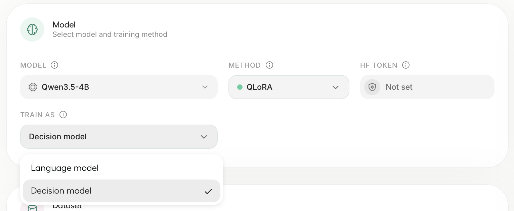
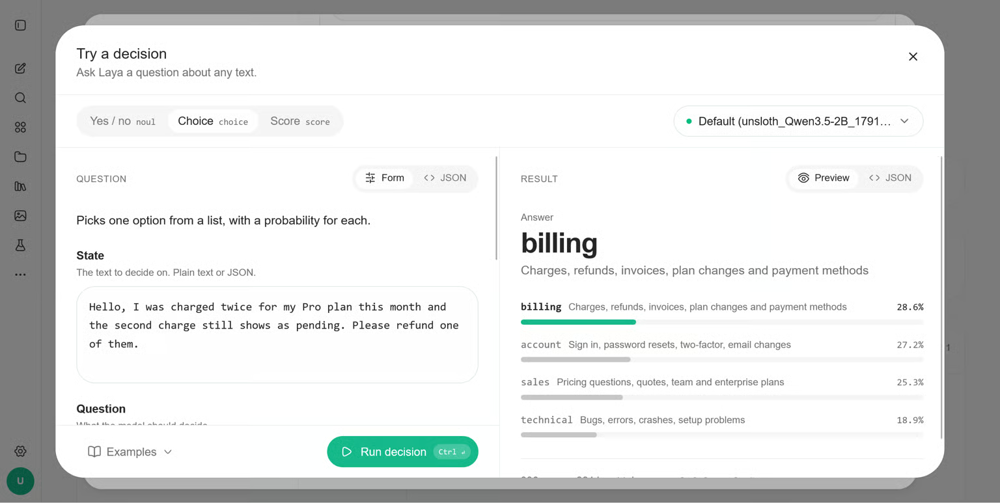
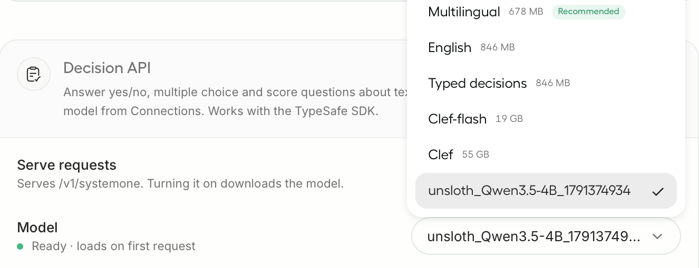
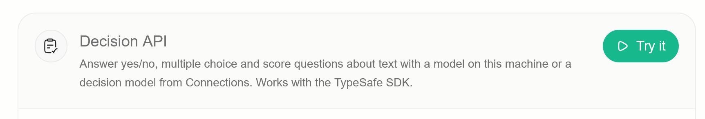
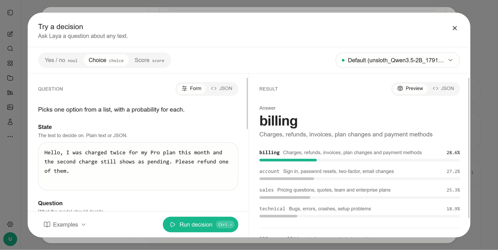

# Train your own Decision Model with Unsloth | Unsloth Documentation

> Automatisch per `python ai.py ingest` erfasst. Quelle: [https://unsloth.ai/docs/basics/train-your-own-decision-model-with-unsloth](https://unsloth.ai/docs/basics/train-your-own-decision-model-with-unsloth)

## Inhalt

## Train your own Decision Model with Unsloth

Fine-tune LLMs like Qwen and Gemma to make decisions with calibrated probabilities.

You can now train your own decision model like Jev , Laya and Clef with Unsloth. Fine-tune Qwen3.8 and Gemma 4 LLMs to convert them into decision models so they make decisions instead of generating text. The fine-tuned model reads your input, scores the options you provide and returns a choice with a probability. See table for benchmarks after training:

Qwen3.5-0.8B

36% -> 73%

7% -> 74%

19% -> 76%

78%

Qwen3.5-2B

33% -> 78%

1% -> 58%

1% -> 62%

81%

We fine-tuned LLMs with a Clef head using LoRA (r=64) for just one epoch, boosting downstream accuracy from 30–37% (which is roughly chance level) to as high as 78% .

Training uses the same dataset format as Laya and Clef. Test sets were decontaminated against the training data.

All models work as well - and you can also further fine-tune Decision models like Laya / Clef.

Qwen3.5-0.8B

78%

4GB

42 min

Qwen3.5-2B

81%

8GB

40 min

Llama 3.2 3B

79%

4.1GB

30 min

Gemma 4 E4B

77%

14.4GB

49 min

Laya (fine-tuned)

77%

2.5GB

10 min

We used a mix of 12 sources , plus typed-decisions : ag_news , arc , banking77 , boolq , clinc150 , commonsense_qa , mmlu , mnli , prompt_injections , snli , sst5 and wanli . The test set contained 3,000 rows : 2000 from typed-decisions, 500 from BANKING77 and 500 from CLINC150.

#### 🦥 Train in Unsloth

##### Setup Unsloth

The easiest way to get started is by downloading the Unsloth Desktop app . Works on macOS , Windows , and Linux .

Download Unsloth

Or, if you prefer to install manually:

MacOS, Linux, WSL:

```
curl -fsSL https://unsloth.ai/install.sh | sh
```

Windows PowerShell:

```
irm https://unsloth.ai/install.ps1 | iex
```

##### Select your model and dataset

Open the Train tab and pick an LLM, like unsloth/Qwen3.5-4B . Then set Train as to Decision model . Unsloth fills in settings that work well. To match our results, set epochs to 2, LoRA rank to 16 and learning rate to 2e-4.

Upload a file or pick a dataset from Hugging Face, in the dataset format. For typed-decisions, set Subset to all .

##### Start training

Click Start Training . Unsloth reports accuracy on held-out decisions before and after training, and calibrates the model's confidence.

##### Run it in the Decision API

Click Use in Decision API . Requests that use laya , default or jev-latest now go to your model.

Your model also shows up by its run name in Settings → API, under Decision API → Model.

You can also play with the trained decision model via the "Try It" option in the Decision API:

#### 🐍 Train with code

Install or update Unsloth with pip install --upgrade unsloth, and use the following code to train your own decision model.

```
from unsloth import FastDecisionModel, DecisionTrainer, is_bfloat16_supported
from datasets import load_dataset
from transformers import TrainingArguments

model, tokenizer = FastDecisionModel.from_pretrained(
    model_name = "unsloth/Qwen3.5-4B",
    max_seq_length = 2048,
    load_in_4bit = True,
)

model = FastDecisionModel.get_peft_model(
    model,
    r = 16,
    lora_alpha = 16,
    lora_dropout = 0,
    use_gradient_checkpointing = "unsloth",
    random_state = 3407,
)

dataset = load_dataset("LocalLLaMA/typed-decisions", "all", split = "train")
items, report = FastDecisionModel.build_dataset(dataset, tokenizer, model)
print(f"Skipped {report['skipped']} of {report['total']} decisions")

train_items, eval_items = FastDecisionModel.split_holdout(items, seed = 3407)

trainer = DecisionTrainer(
    model = model,
    processing_class = tokenizer,
    train_dataset = train_items,
    eval_dataset = eval_items,
    args = TrainingArguments(
        per_device_train_batch_size = 8,
        gradient_accumulation_steps = 4,
        num_train_epochs = 2,
        learning_rate = 2e-4,
        lr_scheduler_type = "cosine",
        warmup_steps = 10,
        weight_decay = 0.01,
        bf16 = is_bfloat16_supported(),
        fp16 = not is_bfloat16_supported(),
        eval_strategy = "epoch",
        logging_steps = 10,
        output_dir = "outputs",
        report_to = "none",
        seed = 3407,
    ),
)
trainer.train()
```

To use Llama or Gemma 4, change model_name to unsloth/Llama-3.2-3B-Instruct or unsloth/gemma-4-E4B-it . Other LLMs that Unsloth can fine-tune should work the same way.

For your own data, see the dataset format. Each row has a state, the questions to decide and the gold answers.

##### Calibrate and save

Calibrate on the rows split_holdout kept out, so the model's probabilities match how often it's right:

Then save. save_pretrained saves the LoRA adapters and the head. save_pretrained_merged saves a full 16-bit model:

Load it again the same way you loaded the base model:

#### 🎯 Make decisions

Give predict an input and the questions to decide, in the same format as your dataset:

answer is the option key for choice, True or False for noul, and the level number for score. Each answer also has the same fields as a Decision API answer.

To check accuracy on a labeled test set, use evaluate :

#### Use it in the Decision API

You can read our detailed guide for serving/running decision models otherwise read below for a quick summary. Models you train in Unsloth show up in Settings → API. For a model you trained with code, start Unsloth with the merged folder you saved:

Turn on the Decision API in Settings → API. Requests that use laya , default or jev-latest now go to your model, and the answers have the same format as Laya's. The model needs a GPU and loads on the first request, which can take a few minutes. While a training run is using the GPU, the Decision API waits and starts answering again when the run ends.

#### How it works

Unsloth puts your input in one prompt, followed by every question and its options. The LLM reads it once. A small head, the same design as Cloudflare's Clef, looks at the LLM's output over each question and option and scores every option, deciding all the questions together. It never writes text, so it doesn't spend memory on the LLM's word predictions.

#### ⚙️ Recommended settings

- Start with 4-bit LoRA at rank 16 and a learning rate of 2e-4. The new head trains at 1e-4 by default. You can change that with head_learning_rate in DecisionTrainer .

Start with 4-bit LoRA at rank 16 and a learning rate of 2e-4. The new head trains at 1e-4 by default. You can change that with head_learning_rate in DecisionTrainer .

- We used 2 epochs on typed-decisions. With less data, try 3 or 4.

We used 2 epochs on typed-decisions. With less data, try 3 or 4.

- For a quick try, set max_steps = 60 . Qwen3.5-4B reached 76% in 10 minutes on an L4.

For a quick try, set max_steps = 60 . Qwen3.5-4B reached 76% in 10 minutes on an L4.

- If you run out of memory, halve the batch size and double gradient accumulation.

If you run out of memory, halve the batch size and double gradient accumulation.

- max_seq_length sets the longest input during training. Long inputs keep the question and options, and cut the end of the input to fit. Predictions read up to 16,384 tokens.

max_seq_length sets the longest input during training. Long inputs keep the question and options, and cut the end of the input to fit. Predictions read up to 16,384 tokens.

Last updated 6 hours ago

Was this helpful?

## Bilder











