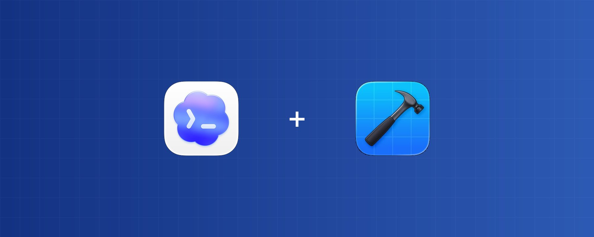
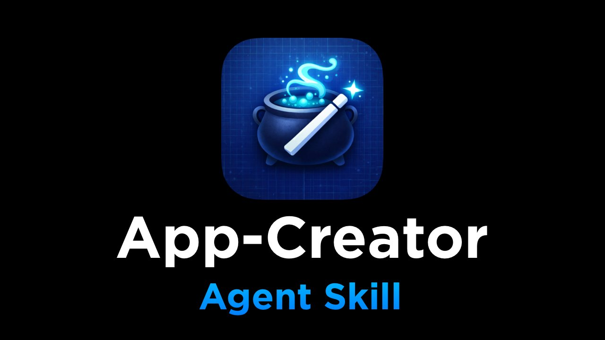

# Install These Skills Before Codex Touches Your Xcode Project

> Automatisch per `npm run ingest:x` erfasst. Quelle: [x.com/PaulSolt/status/2042716870512353294](https://x.com/PaulSolt/status/2042716870512353294)

## Artikel-Volltext

I've been building iOS and macOS apps with Codex and Claude Code since last year. One thing I've learned: agents need simple systems that produce reliable results.
Without the right skills, agents write deprecated code, create compiler errors, and waste your time debugging their mistakes. These 5 skill packs fix that. Each one comes from a developer who's been shipping real apps with agents.
1. Paul Hudson: The Swift Foundation
 
If you've learned Swift online, you've probably read Paul Hudson's work (@twostraws). His agent skills come from a decade of teaching Swift through Hacking with Swift — and his SwiftUI rules help correct common mistakes with agents.
I met Paul at try! Swift in NYC and we spent some time together in the SwiftUI labs at WWDC 2019. He's a prolific writer and digs in deep so you can understand what works.

These skills will jumpstart your agents:
SwiftUI Pro: modern SwiftUI APIs, view composition, state management 
Swift Concurrency Pro: async/await, actors, Sendable, Swift 6 migration
Swift Testing Pro: Test macros, parameterized tests, XCTest migration
SwiftData Pro: models, queries, migrations, CloudKit sync
He also maintains the canonical directory of every community Swift skill.
2. Antoine van der Lee: SwiftLee
 
Antoine van der Lee (@twannl) runs SwiftLee — one of the most widely read Swift blogs. He has 5 skill repos, each with detailed reference docs. His Xcode Build Optimization skill stands out — 6 sub-skills for build settings and compilation times to make your code build faster.
SwiftUI Expert: state management, view composition, performance, Liquid Glass
Swift Concurrency: actors, Sendable, data race safety, Swift 6 migration
Swift Testing Expert: modern testing patterns, XCTest migration, parameterized tests
Core Data Expert: stack setup, fetch requests, background contexts, migrations
Xcode Build Optimization: 6 sub-skills for build settings, compilation times, project config
The Xcode Build Optimization skill is a powerful tool that can make both you and your agents more productive. And if you want a better workflow with the iOS Simulator, check out his developer app: @rocketsim_app 
3. Thomas Ricouard: Codex Expert
 
Thomas Ricouard (@Dimillian) built Codex Monitor — the open source macOS app for managing multiple Codex agents — and then joined OpenAI's Developer Experience team. 
His skills now ship as the official Codex Build iOS App and Build Mac App plugins. These automatically update with each new release of the Codex app or Codex CLI.
Build iOS Apps plugin
SwiftUI Liquid Glass:  iOS 26+ Liquid Glass APIs, modifier ordering, fallbacks
SwiftUI UI Patterns: navigation, sheets, app wiring, reusable components
SwiftUI Performance Audit:  invalidation storms, identity churn, layout thrash
SwiftUI View Refactor: smaller subviews, MV-style data flow, Observation
iOS Debugger Agent: simulator build/run/debug with XcodeBuildMCP
iOS App Intents: Siri, Shortcuts, widget integration
Build macOS Apps plugin adds AppKit interop, packaging/notarization, signing/entitlements, window management, and SwiftPM workflows.
You can dig into the source for both of these plugins at the Official OpenAI Plugins repo,
4. Krzysztof Zabłocki: Advanced Swift + Tooling
 
Krzysztof Zabłocki (@merowing_) created Sourcery — the Swift metaprogramming tool used by 40,000+ apps including Airbnb and The New York Times. His open source tools power over 80,000 apps total.
His approach to agent skills is completely different. Instead of individual skill files, he built a rules-based system over 3 years of daily LLM use — 12 domain-specific rule files with a smart loader that uses LLM self-reflection to decide which rules to apply based on context. The system is tool-agnostic: same rules work in Cursor, Claude Code, and Codex.
What I like about his approach: he has a progressive documentation reading CLI tool to offload search and make it agent-friendly. He also created Inject for hot Swift reloading — useful for fast prototyping when you want to see UI changes without rebuilding.
Read his guide: Stop Getting Average Code from Your LLM
You can grab two agent friendly files that follow his coding philosophy:
general.md: primary directive and coding standards
rule-loading.md: smart loader that selects rules by context
The full 12-file set covering dependency injection, SwiftUI architecture, ViewModel coordination, and Swift Testing is part of his Swifty Stack course.
5. AppCreator: Agent-Friendly Build Tools
None of the skills above matter if your agent can't build and test your code.
Xcode build output is verbose. Test output is worse. We're juggling XCTest and Swift Testing with two different build systems. Agents choke on this.
I built AppCreator to solve that problem. It scaffolds Xcode projects with agent-friendly defaults. I created it to quickly prototype new app ideas that used the same workflow as my existing projects. 
Adopt the skill for your existing apps and it will help your agent make a build script using Make that is agent friendly.
 
Buildable folders: agents add files without regenerating project files
Prefers warnings as errors: agents don't write deprecated code
Makefiles: every command (build, run, test) in one place
xcbeautify: clean, parseable output instead of Xcode's wall of text
Version tracking: know exactly what changed between updates
Download and install AppCreator. It's totally free, just in early-access and not available on GitHub (yet).
Learn something? Follow these great Swift and iOS Developers:
Paul Hudson: (@twostraws) for SwiftUI, Concurrency, Testing, and SwiftData
Antoine van der Lee: (@twannl) for SwiftUI, Build Optimization, Concurrency, Testing, and Core Data
Thomas Ricouard: (@Dimillian) for the official iOS/macOS Codex plugins
Krzysztof Zabłocki: (@merowing_) for a rules-based architecture and advanced iOS development topics
Install one of these skill packs or plugins today. See how your agent's code changes. Then stack more.
What skills are you using with your iOS projects? Reply below — I want to see what's working for you.
Follow @PaulSolt for the workflows I'm actually using to build and ship iOS apps with AI. You can watch my Codex Workflow video on YouTube.
P.S. If your agent still can't build your Xcode project reliably, start with AppCreator. It's free — grab it here.

## Bilder

<!-- Reihenfolge wie von der API geliefert (Cover zuerst). Die Position im Artikeltext gibt die API nicht mit. -->

**Cover**

**photo**

**photo**

**photo**

**photo**

**photo**

## Post-Text

https://t.co/XJQvXEC4oq

## Links

- [x.com/i/article/2042…](http://x.com/i/article/2042696610484781056)
