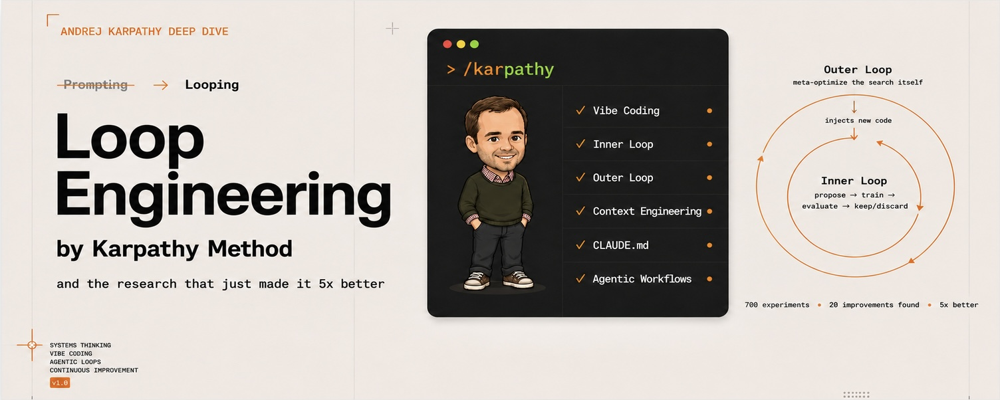
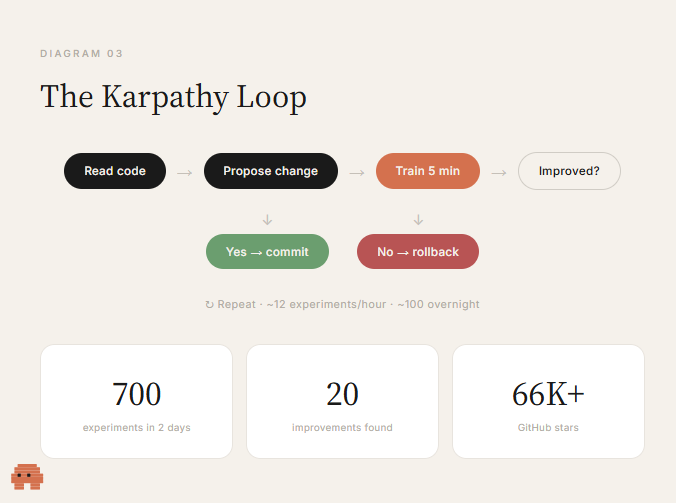
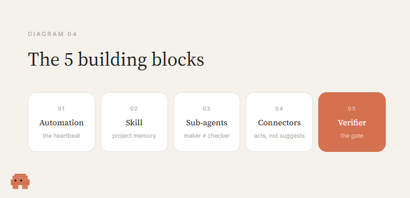
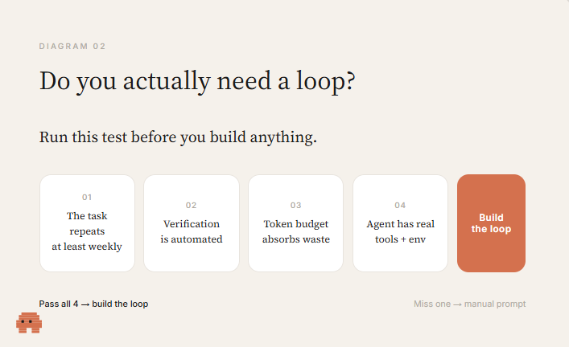
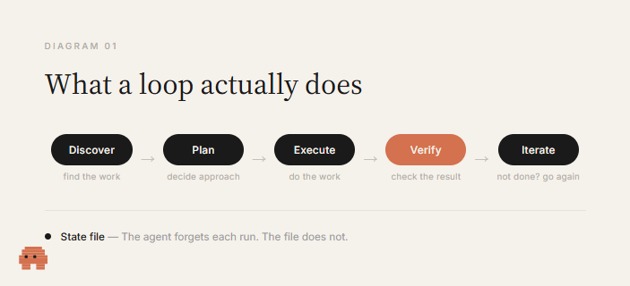
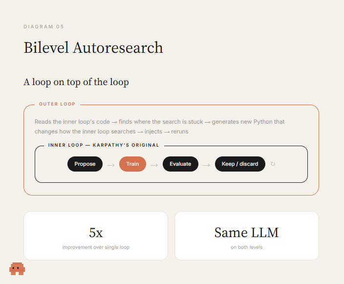

# Loop Engineering: The Karpathy Method - and the workflow that just made it 5x better 

> Automatisch per `npm run ingest:x` erfasst. Quelle: [x.com/0xCodila/status/2072329149520232639](https://x.com/0xCodila/status/2072329149520232639)

## Artikel-Volltext

Most people use AI the same way they used Google in 2005

- Type something, read what comes back, type again

The AI sits there doing nothing until you push it - you are the engine - The AI is a wrench you pick up and put down between every turn.
That worked fine for two years. It does not work anymore.
The people getting 10x more out of AI right now are not writing better prompts and not using secret models.

They are building loops. And the person who made this idea impossible to ignore is Andrej Karpathy

This article will explain: 

1 - from scratch what a loop is

2 - show you how to use them the way Andrej Karpathy does

3 -  then describe a method to improve this approach by a factor of 5

4 - and provide tips for getting started.
 
Part 1 · The Basics
1.1 - What a loop actually is ? 
 
A prompt is one instruction. You ask, you get an answer, you decide what to do next.
A loop is a goal the AI keeps working toward until it gets there - without you sitting in the chair prompting every step
The AI discovers what needs doing, plans how to do it, does the work, checks the result, and if it is not there yet - feeds the result back in and goes again. You define the purpose once. 

The loop handles the rest.

Three parts make or break it:
A verifier is what turns repetition into progress. Without a real check on the result, you do not have a loop - you have the agent agreeing with itself on repeat. The check can be a test that passes or fails, a metric that goes up or down, a build that compiles or crashes. No gate means the agent grades its own homework.
State is what makes the loop learn. Each pass, the AI has to know what it already tried. Without that, it repeats the same mistake every cycle. A small file on the side records what is done, what failed, what is next. Tomorrow's run resumes instead of starting from zero.

A stop condition keeps it sane. A loop with no exit runs until it succeeds, breaks, or drains your account. Every working loop has two ways to stop: the goal is met, or a hard limit says "after N tries, stop and report"
2.2. Do you actually need one? Run this test first.
Most articles sell you the loop before they tell you when it is a mistake.
A loop earns its cost only when all four of these are true. Miss one and it costs more than it returns.
 
The task repeats - at least weekly. Less than that and the setup cost never pays itself back. A one-time job is still better served by one good prompt.
Verification is automated - a test suite, a type checker, a linter, a build. Something that can fail the work without you in the room. No automated check means you are back reading every diff - the exact job the loop was supposed to remove.
Your token budget can absorb the waste - loops re-read context, retry, explore. That burns tokens whether the run ships anything or not. This scales with budget, which is why it reads as obvious to people with free tokens and reckless to people on a $20 plan.
The agent has real tools - logs, a reproduction environment, the ability to run the code it writes and see what breaks. Without that, the loop iterates blind.

The honest take: loop engineering is real, and most people do not need the heavy version yet. If you are on a consumer plan with limited tokens, a heavy loop will hit your rate limit or your wallet before the productivity gain arrives.
 
Part 2 · The Karpathy Loop
How Karpathy stopped prompting and started looping

In March 2026, Andrej Karpathy released a GitHub repo called AutoResearch.
Three files. About 630 lines of code.
 
Within a month it had 66,000+ stars and Fortune magazine gave it a name: The Karpathy Loop.
 - karpathy autoresearch - 
The setup is almost absurdly simple:
train.py - the training script. The only file the agent is allowed to touch.
prepare.py - the evaluator that scores the model. The agent cannot touch it. If it could, it would just make the test easier instead of making the model better.
program.md - the instructions that tell the agent what to explore and what constraints to respect.

The agent runs in a loop:
Read the code → propose a change → train for five minutes → check if the result improved → commit if it did, roll back if it did not → repeat.
You go to sleep. You wake up to a log of experiments and hopefully a better model.
The human never touches train.py. You write program.md. - the agent handles execution.

 - The results:
Karpathy pointed it at a model he had already carefully tuned by hand over two decades of experience. He let it run for two days.
The agent ran 700 experiments
Found 20 improvements he missed
Things like a missing scalar multiplier in the attention mechanism that made attention too diffuse across heads
Not a bug a fuzzer would catch - a subtle optimization that a careful human could have found but did not
Because humans get tired after experiment number twelve. The agent does not get tired at all.
Shopify CEO Tobi Lutke tried it overnight on an internal model:
He woke up to a 19% quality improvement
The optimized model was half the size of his previous one
A smaller model beating a bigger one - because the agent optimized for the hardware instead of defaulting to "bigger is better"
The Karpathy Loop Fortune

Karpathy's core insight: if you have an objective metric, you should not be the one running the experiments. You are the bottleneck. Remove yourself from the loop and let it run.
 
Part 3 · The Building Blocks
Five pieces that make a loop work
Every working loop - whether you build it in Claude Code, Codex, or bash scripts - is assembled from five pieces. 
Both Claude Code and Codex ship all five now.
 
Automation - the heartbeat. Something that fires the loop on a schedule, on an event, or on a trigger. 

In Claude Code: /loop for cadence, /goal for running until a condition holds. In Codex: the Automations tab. Without the heartbeat, you ran a script once and forgot about it. That is not a loop.
A skill - stores project knowledge so the agent stops guessing every session. Your conventions, your build steps, the thing you do not do because of that one incident three months ago. 

Written once in a markdown file, read by every run. 

Without skills, the loop re-derives your entire project context from zero every cycle. With skills, intent compounds.
Sub-agents - split the maker from the checker. 

The model that wrote the code is too generous grading its own homework. 

A second agent with different instructions catches the things the first one talked itself into. Your writer can be fast and cheap, your reviewer slow and strict. That separation is most of the quality.
Connectors - let the loop act inside your real environment. Read your issue tracker, open a PR, ping Slack, update a Linear ticket. 

The difference between an agent that says "here is the fix" and a loop that ships the fix and tells you about it in the morning.
A verifier - the gate. The test, type check, or build that automatically rejects bad work. 

Everything else is plumbing. 

This is the part that makes the loop real. Without it you are paying for an agent to agree with itself all night
 
Part 4 · What Comes After Karpathy
The Bilevel - a Loop on top of the Loop

- this is where it gets interesting, hehe xD
In March 2026, two researchers published a paper on arxiv called "Bilevel Autoresearch: Meta-Autoresearching Itself."
They took Karpathy's loop and asked a simple question:
If autoresearch is itself a form of research - can you autoresearch autoresearch?
Bilevel Autoresearch
They built a second loop on top of the first one:
Inner loop - does what Karpathy's original does: propose a change, train, evaluate, keep or discard
Outer loop - watches the inner loop work, reads its code and traces, identifies where the search process itself is getting stuck, and generates new Python code that changes how the inner loop searches. 
Then it injects that code and lets the inner loop run again.
 
 - The result:
On Karpathy's GPT pretraining benchmark:
5x improvement over the standard single loop (-0.045 vs -0.009 val_bpb)
Not 5% better. Five times better.
Both loops used the same LLM - you do not need a smarter model for the meta level
The improvement comes from the architecture, not from raw intelligence
What the outer loop actually found: the inner loop kept falling into the same search patterns. The LLM has priors about what optimizations to try, and it keeps going back to those priors even when they stopped working. The outer loop broke those patterns by forcing exploration in directions the model's instincts avoided.
The paper ends with a line worth sitting with: "If autoresearch can meta-autoresearch itself, it can in principle meta-autoresearch anything with a measurable objective."
 
Part 5 · Try It Yourself
Run a loop right now - no tools needed

You do not need Claude Code or Codex to feel how this works. Paste this into any LLM and watch what happens:
 
The model drafts, grades its own work against your criteria, finds the weak spot, rewrites, and repeats until it clears the bar.
That is a loop. You just built one with a paragraph.

It is limited - you are still the trigger, there is no schedule, no persistent state, close the tab and it is gone. But it shows the core mechanic. The jump from this to a full autonomous loop is adding the automation, the state file, and the gate.
 
Part 6 · The Honest Part
What the loop does not fix
Loops change the work. They do not delete you from it.
And two problems get sharper as the loop gets better - not easier:
Comprehension debt. The faster the loop ships code you did not write, the larger the gap between what exists in your repo and what you actually understand. A smooth running loop charges compound interest on that gap. The day you have to debug a system nobody on the team has read will cost more than the tokens ever did.
Cognitive surrender. When the loop runs itself, it is tempting to stop forming an opinion and just accept whatever comes back. Designing the loop is the cure when you do it with judgment - and the accelerant when you do it to avoid thinking. Same action, opposite result.
Two people can build the exact same loop and get completely opposite outcomes. One uses it to move faster on work they understand deeply. The other uses it to avoid understanding the work at all.

The loop does not know the difference. You do!
 
Karpathy stopped writing code. Cherny stopped prompting. Neither of them stopped thinking. If you take one thing from this, take that.

start use loop like engineer . @0xCodila 

## Bilder

<!-- Reihenfolge wie von der API geliefert (Cover zuerst). Die Position im Artikeltext gibt die API nicht mit. -->

**Cover**

**photo**

**photo**

**photo**

**photo**

**photo**

## Post-Text

https://t.co/UJL7o2l9oR

## Links

- [x.com/i/article/2069…](http://x.com/i/article/2069772252787204096)
