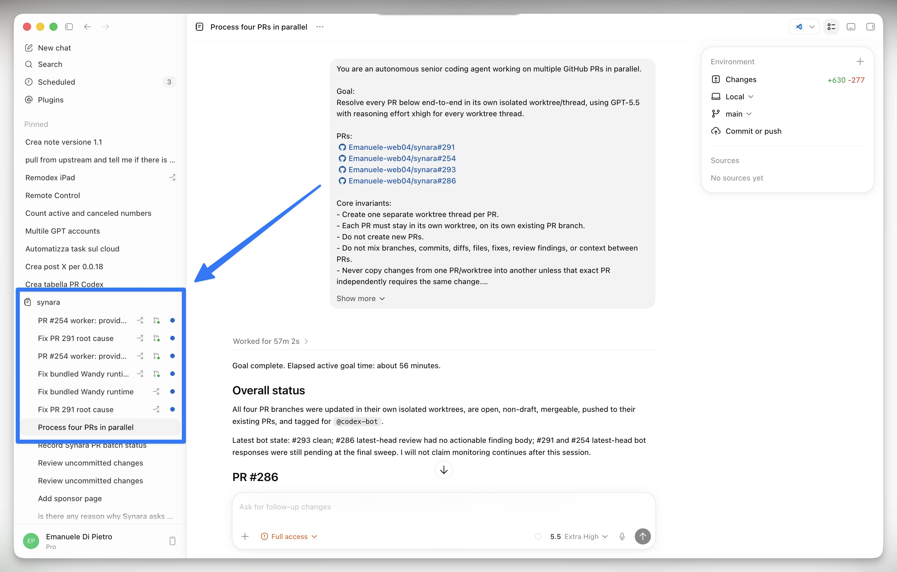

# Emanuele Di Pietro (@emanueledpt)

> Automatisch per `npm run ingest:x` erfasst. Quelle: [x.com/emanueledpt/status/2073013891752251574](https://x.com/emanueledpt/status/2073013891752251574)

## Bilder

<!-- Reihenfolge wie von der API geliefert (Cover zuerst). Die Position im Artikeltext gibt die API nicht mit. -->

**photo**

## Post-Text

My new workflow for working while I sleep:

1. Codex can create threads in worktrees, set up heartbeats to check in, and run loops.

2. Ask GPT-5.5 Pro to help you redefine and improve the prompt (huge game changer).

3. Ask Codex to review PRs and issues, or build new features in parallel, each in its own dedicated worktree.

4. Codex-bot: use Codex-bot on GitHub to flag issues and run a loop that fixes them all until you're clear.

The prompt isn't just the request anymore
It's the whole workflow.

Ran it overnight, woke up to merged-ready PRs.
Game changer.

## Links

- [pic.x.com/BGln77Ae9q](https://x.com/emanueledpt/status/2073013891752251574/photo/1)
- [x.com/emanueledpt/st…](https://twitter.com/emanueledpt/status/2071251361824477312)
