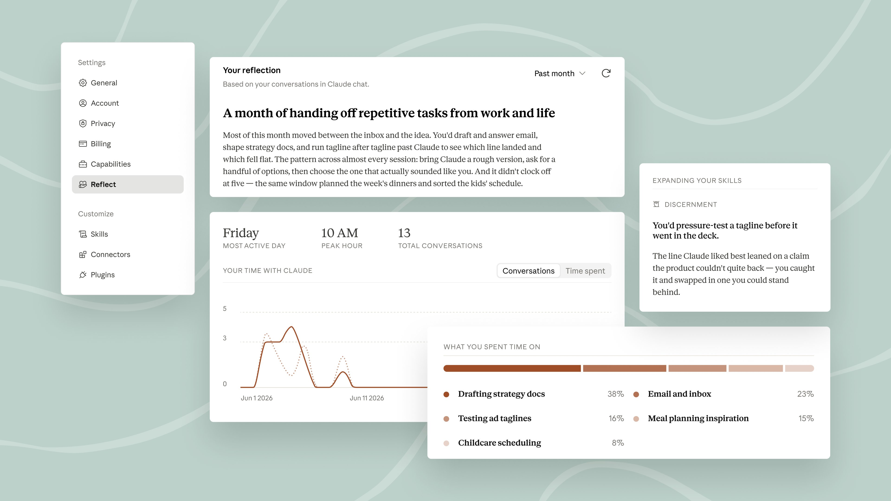

# Claude (@claudeai)

> Automatisch per `npm run ingest:x` erfasst. Quelle: [x.com/claudeai/status/2075225957711929667](https://x.com/claudeai/status/2075225957711929667)

## Bilder

<!-- Reihenfolge wie von der API geliefert (Cover zuerst). Die Position im Artikeltext gibt die API nicht mit. -->

**photo** — The Claude monthly recap in Settings: a summary of your month, stats for most active day and hour, a daily activity chart, and a topic breakdown of what you spent time on.

## Post-Text

Introducing a new way to reflect on how you use Claude.

Your monthly recap shows when you use Claude most and what you spent that time working on, with options to set quiet hours and nudges to take breaks. Find your dashboard in Settings under Reflect: https://t.co/8QAn47W5rI https://t.co/WzA3JfONlL

## Links

- [claude.ai/settings/refle…](http://claude.ai/settings/reflect)
- [pic.x.com/WzA3JfONlL](https://x.com/claudeai/status/2075225957711929667/photo/1)
