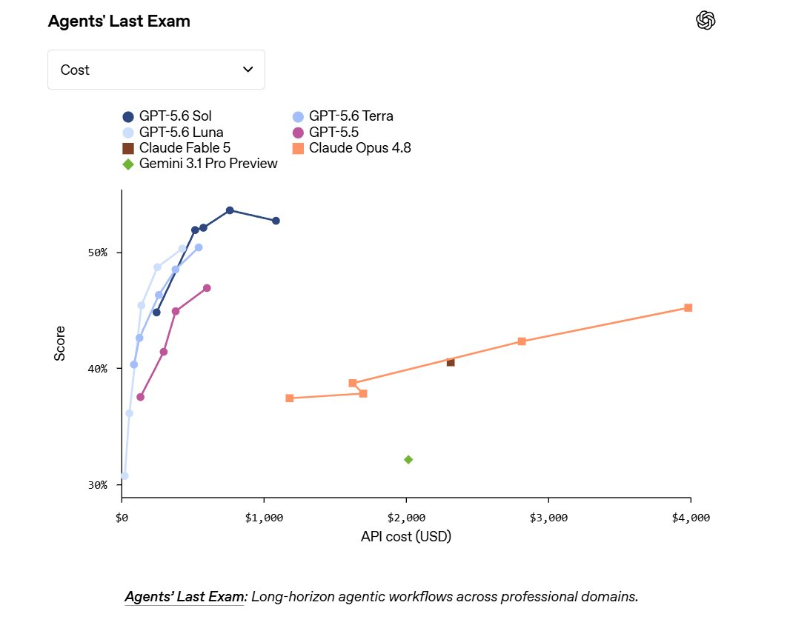
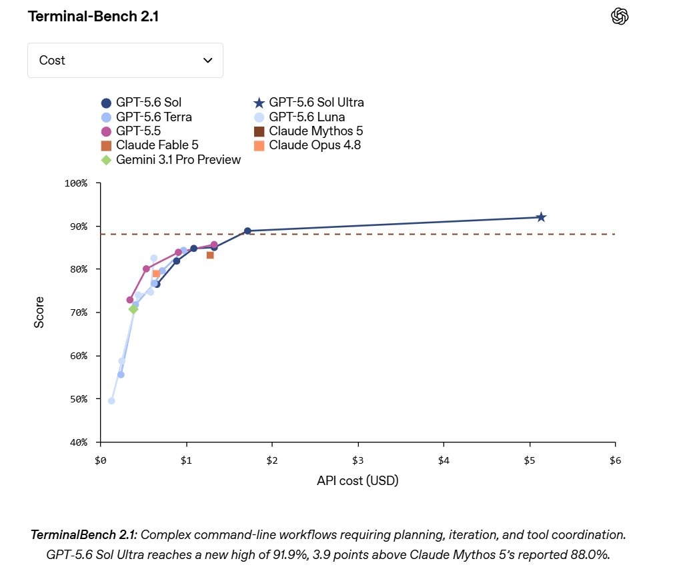
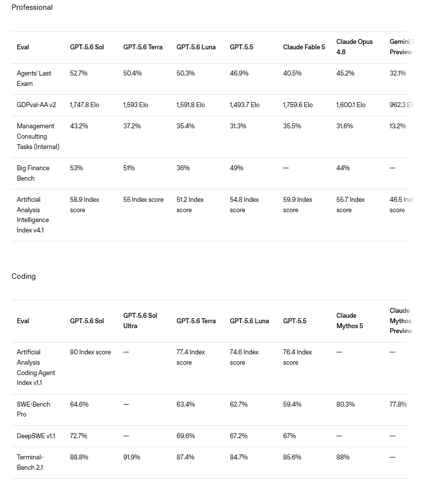

# Chubby♨️ (@kimmonismus)

> Automatisch per `npm run ingest:x` erfasst. Quelle: [x.com/kimmonismus/status/2075271465964798147](https://x.com/kimmonismus/status/2075271465964798147)

## Bilder

<!-- Reihenfolge wie von der API geliefert (Cover zuerst). Die Position im Artikeltext gibt die API nicht mit. -->

**photo**

**photo**

**photo**

## Post-Text

GPT-5.6 is here but also the long awayited Superapp

the tl;dr

The model side is impressive, but expected: GPT-5.6 Sol is strong across coding, browsing, cyber, science, long-context and agentic work. On several evals, OpenAI claims it either sets new SOTA or comes very close while using fewer tokens, less time, or lower estimated cost. However, even outperforms Fable 5 on several Benchmarks, obviously not on all tho (see below).

Some notable numbers:

• Agents’ Last Exam: GPT-5.6 Sol reaches 52.7%, ahead of GPT-5.5, Claude Fable 5 and Opus 4.8
• Terminal-Bench 2.1: Sol Ultra reaches 91.9%, above Claude Mythos 5’s reported 88.0%
• BrowseComp: Sol Ultra reaches 92.2%
• OSWorld 2.0: Sol reaches 62.6%, ahead of Opus 4.8
• Artificial Analysis Coding Agent Index: Sol scores 80, ahead of Fable 5
• SEC-Bench Pro: Sol Ultra reaches 74.3%

But the app layer is what makes it interesting:
ChatGPT Work can pull context from docs, Slack, Notion, Microsoft 365 and Google Drive, then turn that messy context into actual outputs: decks, documents, spreadsheets, dashboards, visualizations and interactive explanations.

## Links

- [pic.x.com/2iRY03qb4o](https://x.com/kimmonismus/status/2075271465964798147/photo/1)
