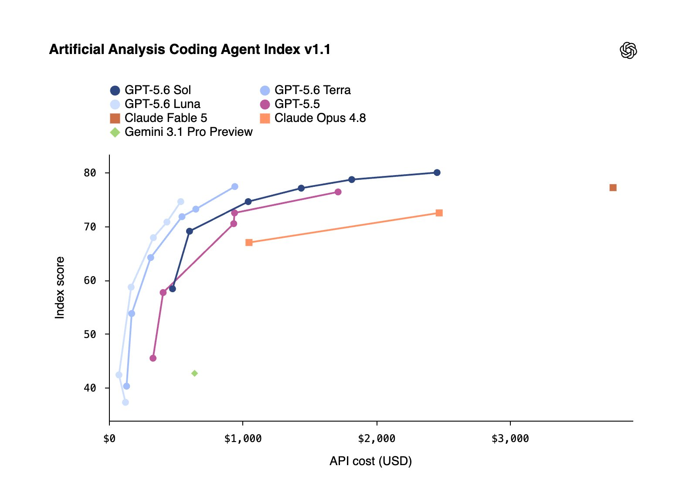

# Vox (@Voxyz_ai)

> Automatisch per `npm run ingest:x` erfasst. Quelle: [x.com/Voxyz_ai/status/2075278546570801574](https://x.com/Voxyz_ai/status/2075278546570801574)

## Bilder

<!-- Reihenfolge wie von der API geliefert (Cover zuerst). Die Position im Artikeltext gibt die API nicht mit. -->

**photo**

## Post-Text

gpt-5.6 is out, and you can feel where ai is headed.

you don't have to think about whether a task is worth the good model anymore, you just use it every time.

its cheapest opus-level tier, luna, is $𝟏/$𝟔 per million tokens. grok 4.5 was $𝟐/$𝟔 yesterday. and today, for the first time, even meta jumped in with a genuinely strong model, muse spark 1.1, at $𝟏.𝟮𝟱/$𝟰.𝟮𝟱. opus 4.8 is $𝟱/$𝟮𝟱 for comparison, never mind fable.

𝗳𝗼𝗿 𝗺𝗼𝘀𝘁 𝗽𝗲𝗼𝗽𝗹𝗲, 𝘁𝗵𝗮𝘁 𝗺𝗮𝘁𝘁𝗲𝗿𝘀 𝘄𝗮𝘆 𝗺𝗼𝗿𝗲 𝘁𝗵𝗮𝗻 𝗮𝗻𝘆 𝗼𝗳 𝘁𝗵𝗼𝘀𝗲 𝗹𝗲𝗮𝗱𝗲𝗿𝗯𝗼𝗮𝗿𝗱 𝘀𝗰𝗼𝗿𝗲𝘀.

## Links

- [pic.x.com/63dBpIKwuY](https://x.com/Voxyz_ai/status/2075278546570801574/photo/1)
- [x.com/Voxyz_ai/statu…](https://twitter.com/Voxyz_ai/status/2074894179000311845)
