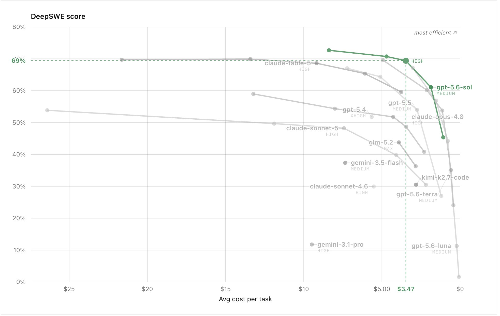

# Matthew Berman (@MatthewBerman)

> Automatisch per `npm run ingest:x` erfasst. Quelle: [x.com/MatthewBerman/status/2075597710435266674](https://x.com/MatthewBerman/status/2075597710435266674)

## Bilder

<!-- Reihenfolge wie von der API geliefert (Cover zuerst). Die Position im Artikeltext gibt die API nicht mit. -->

**photo**

## Post-Text

DeepSWE says GPT-5.6 Sol High is the best overall (price/performance) model on the planet.

I agree. https://t.co/Ujr5apVfz0

## Links

- [pic.x.com/Ujr5apVfz0](https://x.com/MatthewBerman/status/2075597710435266674/photo/1)
